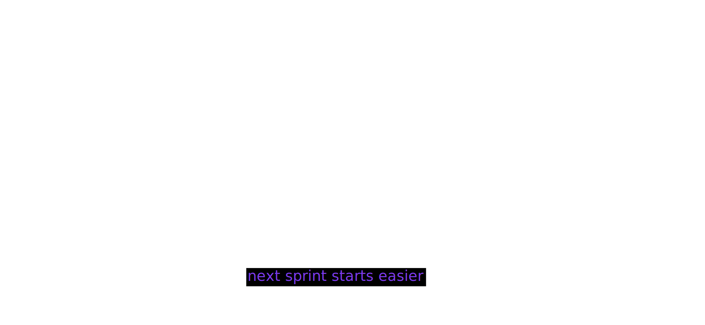
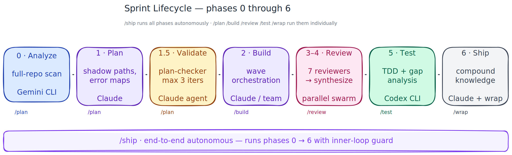
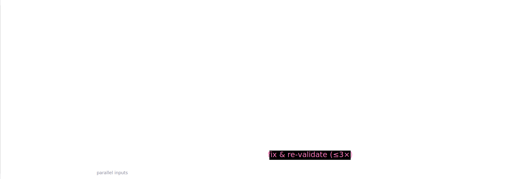
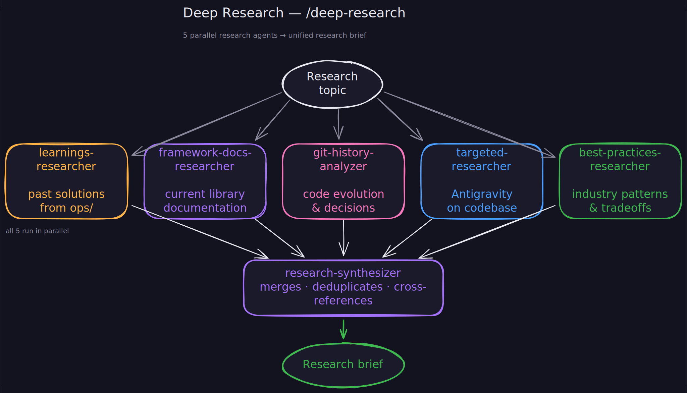
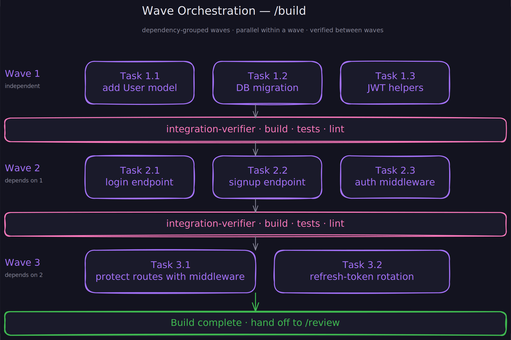
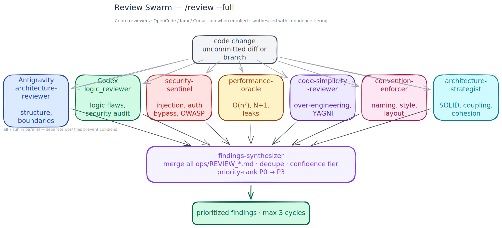
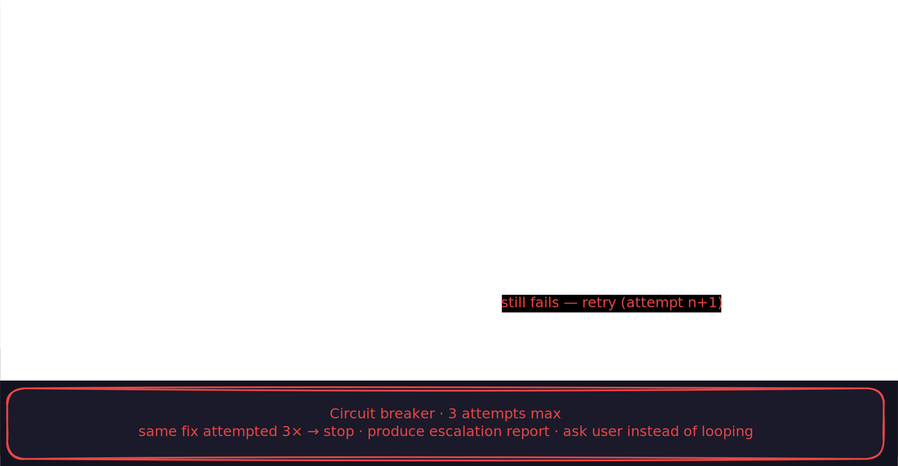
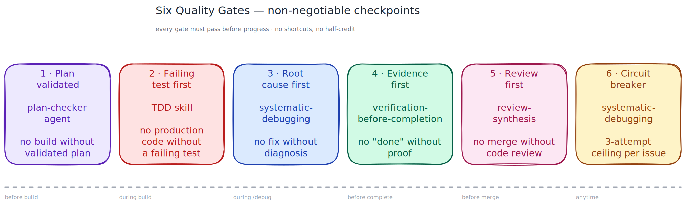
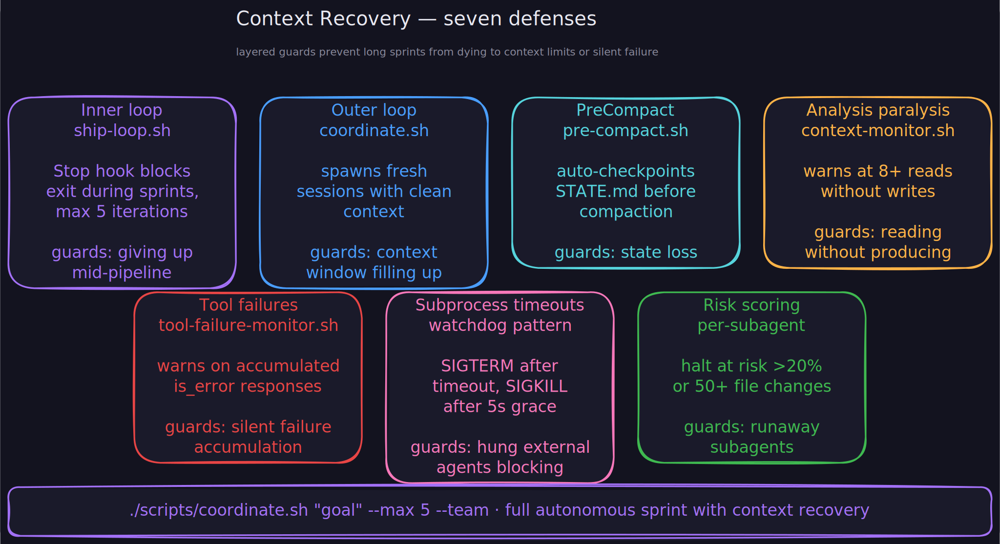

<p align="center">
  
</p>

<p align="center">
  <strong>Agent Triforge — Three AI models forging production-grade code together. Claude Code orchestrates Gemini CLI, Codex CLI, and specialized subagents through file-based protocols, portable skills, and parallel review swarms.</strong>
</p>

<p align="center">
  <a href="#what-is-this">Overview</a> ·
  <a href="#project-structure">Structure</a> ·
  <a href="#sprint-pipeline-ship">Pipeline</a> ·
  <a href="#planning-pipeline-plan">Plan</a> ·
  <a href="#deep-research-deep-research">Research</a> ·
  <a href="#wave-orchestration-build">Build</a> ·
  <a href="#review-swarm-review">Review</a> ·
  <a href="#test-pipeline-test">Test</a> ·
  <a href="#debugging-debug">Debug</a> ·
  <a href="#quality-gates">Gates</a> ·
  <a href="#context-recovery">Context</a> ·
  <a href="#getting-started">Quick Start</a> ·
  <a href="#commands-reference">Commands</a> ·
  <a href="#faq">FAQ</a>
</p>

---

## What is this?

A production-grade framework that turns Claude Code into a **lead agent** coordinating multiple AI systems. Instead of using one model for everything, this framework assigns each model to what it does best:

- **[Claude Code](https://docs.anthropic.com/en/docs/claude-code) (Opus)** builds features and orchestrates the entire workflow
- **[Gemini CLI](https://github.com/google-gemini/gemini-cli)** performs full-codebase analysis using its 1M token context window
- **[Codex CLI](https://github.com/openai/codex)** runs tests, security audits, and infrastructure tasks in sandboxed environments
- **Claude specialized agents** provide deep expertise in [security](agents/security-sentinel.md), [performance](agents/performance-oracle.md), [architecture](agents/architecture-strategist.md), and more

Every interaction between agents follows a structured protocol. Work is tracked in shared markdown files. Reviews run in parallel. Knowledge compounds across sessions.

> *Each sprint should make the next sprint easier — not harder.*

The framework achieves this through **institutional knowledge compounding**: every non-trivial problem solved gets documented in [`ops/solutions/`](ops/solutions/), every architectural decision in [`ops/decisions/`](ops/decisions/), and a [`learnings-researcher`](agents/learnings-researcher.md) agent automatically searches these before planning new work.

<p align="center">
  
</p>

---

## What's new (v2.0.0)

### Claude Code plugin

The framework is now a **Claude Code plugin** — install with one command, update with one command. No more git clone, no manual file copying, no `.claude/settings.json` editing.

```bash
claude plugin add https://github.com/Ninety2UA/agent-triforge
```

All agents, skills, commands, and hooks register automatically. Your project's `ops/` directory is bootstrapped on first session.

### Ship-loop rewrite (Blueprint alignment)

The Stop hook was rewritten to match the [Claude Code Blueprint](https://github.com/Ninety2UA/claude-code-blueprint)'s architecture:

- **JSON output** `{decision, reason, systemMessage}` — re-injects the original goal on each iteration
- **Session isolation** — only blocks the session that started the sprint via `session_id` matching
- **Transcript-based promise detection** — reads the actual JSONL transcript to find `<promise>DONE</promise>`
- **JSON-safe encoding** — uses `python3 json.dumps()` so goals with quotes/newlines don't break the output
- **Atomic state updates** — temp file + `mv` instead of `sed -i`

### Four-pass audit (20 auditor agents reviewing the framework)

Every component in the framework was reviewed by parallel audit agents across 4 passes, converging from **5 critical issues to zero**:

| Pass | Issues found | Key fixes |
|---|---|---|
| 1st | 4 critical, 10 high | Hooks were reading non-existent env vars (stdin JSON fix), README shipped broken config |
| 2nd | 1 critical, 8 high | JSON injection in ship-loop, missing PID captures, path consistency |
| 3rd | 3 critical, 7 high | Post-migration stale docs, `mkdir .claude` guards, deep-research PID |
| 4th | 1 high | Last hook missing `mkdir` guard |

Plus a manual 11-point verification: bash syntax, JSON validity, stale path scans, file counts, executable permissions, `mkdir` guards, stdin parsing, agent cross-references, plugin hook paths, and state file template compatibility.

### Automatic project bootstrapping

On first session in a new project, the `session-start.sh` hook:
- Creates `ops/solutions/`, `ops/decisions/`, `ops/archive/`
- Copies skeleton `MEMORY.md`, `CHANGELOG.md`, `AGENTS.md`, and `GOALS.md` from plugin templates
- Suggests copying the `CLAUDE.md` template if not present
- Creates `.claude/` directory for session state files

---

## Project structure

The plugin provides agents, skills, commands, and hooks. Your project gets an `ops/` directory for state:

```
agent-triforge/                     (plugin — installed automatically)
├── .claude-plugin/plugin.json        Plugin manifest
├── agents/                           19 specialized agent definitions
├── skills/                           12 portable workflow modules
├── commands/                         16 slash commands
├── hooks/
│   ├── hooks.json                    Hook registration
│   └── handlers/                     5 lifecycle hook scripts
├── settings.json                     Default env vars
├── templates/                        Project bootstrapping templates
└── scripts/coordinate.sh            Outer loop for context recovery

your-project/                       (your repo — bootstrapped on first session)
├── CLAUDE.md                         Orchestration protocol (copy from template)
├── ops/                              Shared coordination files
│   ├── AGENTS.md                       Master operating protocol for all agents
│   ├── GOALS.md                        High-level product goals
│   ├── MEMORY.md                       Decisions, patterns, gotchas
│   ├── CHANGELOG.md                    Audit trail with agent attribution
│   ├── STATE.md                        Session continuity checkpoint
│   ├── solutions/                      Documented solved problems
│   ├── decisions/                      Architecture decision records
│   └── archive/                        Archived review + test files
└── src/                              Your source code
```

### Shared file protocol

All agents coordinate through markdown files in [`ops/`](ops/). This is the source of truth:

| File | Purpose | Owner |
|---|---|---|
| `TASKS.md` (runtime) | Work queue with `[ ]`/`[x]` status tracking | Claude generates, all agents read |
| [`AGENTS.md`](templates/ops/AGENTS.md) | Master operating protocol read by all agents | Manual |
| [`GOALS.md`](templates/ops/GOALS.md) | High-level product goals for sprint planning | Manual |
| [`MEMORY.md`](ops/MEMORY.md) | Architectural decisions, patterns, interface proposals | All agents append |
| [`CHANGELOG.md`](ops/CHANGELOG.md) | Audit trail with `[agent-name]` attribution | All agents append |
| [`STATE.md`](ops/STATE.md) | Session continuity — current phase, progress, next actions | Claude writes on pause/wrap |
| [`solutions/`](ops/solutions/) | Documented solved problems for institutional knowledge | Claude writes via [`/compound`](commands/compound.md) |
| [`decisions/`](ops/decisions/) | Architecture decision records (ADRs) | Claude writes via [`/compound`](commands/compound.md) |

---

## Sprint Pipeline (`/ship`)

Every goal flows through a structured pipeline. Run [`/ship`](commands/ship.md) for fully autonomous execution, or invoke each phase individually.

<p align="center">
  
</p>

| Phase | What happens | Agent(s) | Command |
|:---|:---|:---|:---|
| **0 — Analyze** | Full-repo scan: architecture, patterns, contracts, debt | Gemini CLI + [`codebase-mapping`](skills/codebase-mapping/SKILL.md) | [`/plan`](commands/plan.md) |
| **Pre-Plan** | Search institutional knowledge for relevant past solutions | [`learnings-researcher`](agents/learnings-researcher.md) | [`/plan`](commands/plan.md) |
| **1 — Plan** | Decompose goal into tasks with shadow paths and error maps | Claude + [`writing-plans`](skills/writing-plans/SKILL.md) | [`/plan`](commands/plan.md) |
| **1.5 — Validate** | Validate assignments, dependencies, scope, shadow paths | [`plan-checker`](agents/plan-checker.md) | [`/plan`](commands/plan.md) |
| **1.1 — Ambiguity** | Surface top 3 unverified assumptions, ask user to confirm/correct | Claude | [`/plan`](commands/plan.md), [`/ship`](commands/ship.md) |
| **2 — Build** | Wave orchestration with integration verification between waves | Claude subagents or [`team-lead`](agents/team-lead.md) | [`/build`](commands/build.md) |
| **3–4 — Review** | Up to 7 parallel reviewers, synthesized with confidence tiering | Gemini + Codex + [review agents](#review-specialists-6) | [`/review`](commands/review.md) |
| **5 — Test** | TDD test writing, gap analysis, fix cycle until green | Codex CLI + [`test-driven-development`](skills/test-driven-development/SKILL.md) | [`/test`](commands/test.md) |
| **6 — Ship** | Document solutions, archive reviews, write STATE.md | Claude + [`knowledge-compounding`](skills/knowledge-compounding/SKILL.md) | [`/wrap`](commands/wrap.md) |

---

## Planning Pipeline (`/plan`)

Analyzes the full codebase with Gemini's 1M context, searches institutional knowledge, decomposes the goal with shadow paths and error maps, then validates via [`plan-checker`](agents/plan-checker.md).

<p align="center">
  
</p>

---

## Deep Research (`/deep-research`)

Spawns 5 research agents in parallel before planning, then synthesizes findings into a unified research brief.

<p align="center">
  
</p>

---

## Wave Orchestration (`/build`)

Groups plan tasks by dependency into waves. Independent tasks within each wave run in parallel; an [`integration-verifier`](agents/integration-verifier.md) validates between waves.

<p align="center">
  
</p>

---

## Four coordination modes

| Mode | Mechanism | When to use |
|---|---|---|
| **File-based** | Shared markdown in [`ops/`](ops/) | Persistent state across sessions, audit trails |
| **Direct invocation** | `gemini -p` / `codex exec` via bash | Real-time external agent delegation |
| **Native subagents** | Claude's Agent tool with [`agents/`](agents/) definitions | Parallel focused tasks, review swarms |
| **Agent teams** | Multi-Claude with shared task lists ([`team-lead`](agents/team-lead.md)) | Complex builds with 5+ interdependent tasks |

### Portable skill injection

Skills are model-agnostic markdown files that ANY agent can consume. This decouples *what methodology to use* from *which model executes it*:

```bash
# All external-agent invocations go through the unified helper
source ${CLAUDE_PLUGIN_ROOT}/scripts/invoke-external.sh

# Gemini via native agent definition (skill embedded in the agent body)
invoke_gemini "codebase-analyst" \
  "Analyze the full codebase. Write findings to ops/ARCHITECTURE.md." \
  "$GEMINI_OUT" 600

# Codex via native agent definition (skill embedded in the agent body)
invoke_codex "test_writer" \
  "Write tests for changed files." \
  "$CODEX_OUT" 900
```

The helper detects native subagent support at runtime and falls back to legacy `gemini -p "$(cat .../SKILL.md) ..."` / `codex exec "$(cat .../SKILL.md) ..."` prompt-prefix injection if the CLI doesn't support agent definitions yet.

### Assignment heuristic

| Question | Agent |
|---|---|
| Produces code? | Claude (subagents or [agent team](agents/team-lead.md) for parallel work) |
| Evaluates existing code? | [Gemini](https://github.com/google-gemini/gemini-cli) + [Codex](https://github.com/openai/codex) + [Claude review agents](#review-specialists-6) in parallel |
| Runs/executes something? | [Codex CLI](https://github.com/openai/codex) |
| Produces documentation? | [Gemini CLI](https://github.com/google-gemini/gemini-cli) |
| Touches shared interfaces? | Claude implements → Gemini reviews → Codex tests |
| Ambiguous? | Claude takes it, flags for parallel review |

---

## Review Swarm (`/review`)

Up to 7 reviewers analyze the same code simultaneously through different lenses (2 external CLIs + 5 Claude specialized agents with `--full`), then a [`findings-synthesizer`](agents/findings-synthesizer.md) merges, deduplicates, and priority-ranks all findings.

<p align="center">
  
</p>

### Confidence tiering

Every finding gets a confidence score to prevent wasting time on phantom issues:

| Tier | Criteria | Rule |
|---|---|---|
| **HIGH** | Verified in codebase via grep/read. Deterministic. | Can be any priority |
| **MEDIUM** | Pattern-aggregated detection. Some false positive risk. | Can be any priority |
| **LOW** | Requires intent verification. Heuristic-only. | **Can NEVER be P1** |

### Suppressions

Each reviewer has a "Do Not Flag" list to reduce noise — readability-aiding redundancy, documented thresholds, sufficient test assertions, consistency-only style changes, and issues already addressed in the current diff. See individual [agent definitions](agents/) for each reviewer's suppressions list.

---

## Test Pipeline (`/test`)

Identifies untested code paths with [`test-gap-analyzer`](agents/test-gap-analyzer.md), then writes and runs tests via [Codex CLI](https://github.com/openai/codex) using the TDD skill in a sandboxed environment.

<p align="center">
  
</p>

---

## Debugging (`/debug`)

Structured debugging with [`systematic-debugging`](skills/systematic-debugging/SKILL.md): reproduce the bug first, perform root cause analysis, then fix with evidence. A **circuit breaker** enforces a 3-attempt ceiling per issue — if the same error recurs after 3 consecutive fix attempts, the agent stops and produces an escalation report instead of looping.

<p align="center">
  
</p>

---

## Quality Gates

Five non-negotiable checkpoints enforced at every stage:

<p align="center">
  
</p>

| Gate | Enforced by | Rule |
|---|---|---|
| **1 — Plan validated** | [`plan-checker`](agents/plan-checker.md) agent | No build without validated plan (max 3 iterations) |
| **2 — Failing test first** | [`test-driven-development`](skills/test-driven-development/SKILL.md) skill | No production code without a failing test |
| **3 — Root cause first** | [`systematic-debugging`](skills/systematic-debugging/SKILL.md) skill | No fix without diagnosis |
| **4 — Evidence first** | [`verification-before-completion`](skills/verification-before-completion/SKILL.md) skill | No "done" without proof |
| **5 — Review first** | [`review-synthesis`](skills/review-synthesis/SKILL.md) skill | No merge without code review (max 3 cycles) |
| **6 — Circuit breaker** | [`systematic-debugging`](skills/systematic-debugging/SKILL.md) skill | 3-attempt ceiling per issue, then escalation report |

---

## Getting started

### Prerequisites

All three CLIs must be installed and authenticated:

```bash
# Claude Code (you're probably already here)
claude --version

# Gemini CLI — https://github.com/google-gemini/gemini-cli
gemini -p "Respond with only: READY"

# Codex CLI — https://github.com/openai/codex
codex exec "Respond with only: READY"

# Python 3 (used by hook handlers for JSON parsing)
python3 --version
```

### Installation

**Install as a Claude Code plugin:**

```bash
# User scope (available in all your projects)
claude plugin add https://github.com/Ninety2UA/agent-triforge

# Or project scope (shared with team via .claude/settings.json)
claude plugin add https://github.com/Ninety2UA/agent-triforge --scope project
```

That's it. No manual configuration needed — hooks, env vars, agents, skills, and commands are all registered automatically by the plugin system.

On first session, the plugin bootstraps your project's `ops/` directory and suggests copying the CLAUDE.md template.

### Update

```bash
claude plugin update agent-triforge
```

### Development (for contributors)

```bash
git clone https://github.com/Ninety2UA/agent-triforge.git
claude --plugin-dir ./agent-triforge
```

### Verify installation

```bash
claude

# You should see:
# "Multi-agent framework ready."
# "Commands: /ship /plan /build /review /test /debug /quick ..."

/status
```

### Typical session flow

**Supervised (human in the loop):**

```bash
claude
> /plan add user authentication         # Phase 0-1.5: analyze, research, plan, validate
> /build                                 # Phase 2: wave orchestration
> /review                                # Phase 3-4: parallel review + synthesis
> /test                                  # Phase 5: Codex TDD
> /compound JWT session handling         # Document solution for future sprints
> /wrap                                  # Phase 6: compound knowledge, write STATE.md
```

**Autonomous (fire and forget):**

```bash
# Inside Claude — single session, won't stop until done
claude
> /ship add user authentication with JWT refresh tokens

# From terminal — with context-exhaustion recovery
./scripts/coordinate.sh "add user authentication" --max 5 --team
```

---

## Commands reference

### Full pipeline

| Command | What it does |
|---|---|
| [**`/ship <goal>`**](commands/ship.md) | Fully autonomous end-to-end sprint with inner loop guard. Won't stop until done. |
| [**`/coordinate <goal>`**](commands/coordinate.md) | Same phases with exit guard — alternative entry point for the full lifecycle. |

### Phase-specific

| Command | Phase | What it does |
|---|---|---|
| [**`/plan <goal>`**](commands/plan.md) | 0 → 1.5 | Analyze codebase, plan with shadow paths, validate via [`plan-checker`](agents/plan-checker.md) |
| [**`/build`**](commands/build.md) | 2 | [Wave orchestration](skills/wave-orchestration/SKILL.md) build. `--team` for [agent team](agents/team-lead.md) mode. |
| [**`/review`**](commands/review.md) | 3 → 4 | Parallel review + [synthesis](agents/findings-synthesizer.md). `--full` for all 7 reviewers. |
| [**`/test`**](commands/test.md) | 5 | [Gap analysis](agents/test-gap-analyzer.md) + [Codex](https://github.com/openai/codex) TDD. `--gaps-only` to just identify gaps. |
| [**`/wrap`**](commands/wrap.md) | 6 | [Compound knowledge](skills/knowledge-compounding/SKILL.md), archive reviews, write [`STATE.md`](ops/STATE.md). |

### Lightweight workflows

| Command | What it does |
|---|---|
| [**`/quick <change>`**](commands/quick.md) | For changes touching < 3 files. Skips heavy machinery. |
| [**`/debug <bug>`**](commands/debug.md) | Structured [debugging](skills/systematic-debugging/SKILL.md): reproduce, diagnose, fix with root cause analysis. |

### Research and operations

| Command | What it does |
|---|---|
| [**`/deep-research <topic>`**](commands/deep-research.md) | Launch 5 parallel research agents + [`research-synthesizer`](agents/research-synthesizer.md). |
| [**`/analyze <url>`**](commands/analyze.md) | Deep compatibility analysis of an external repo. |
| [**`/status`**](commands/status.md) | Sprint overview: phase, tasks, blockers, available commands. |
| [**`/pause`**](commands/pause.md) | Quick checkpoint to [`STATE.md`](ops/STATE.md). |
| [**`/resume`**](commands/resume.md) | Continue from [`STATE.md`](ops/STATE.md) checkpoint. |
| [**`/compound`**](commands/compound.md) | Document a solved problem to [`ops/solutions/`](ops/solutions/) or decision to [`ops/decisions/`](ops/decisions/). |
| [**`/resolve-pr <PR#>`**](commands/resolve-pr.md) | Read GitHub PR comments and implement requested changes via [`pr-comment-resolver`](agents/pr-comment-resolver.md). |

---

## Skills reference

12 portable, model-agnostic workflow modules that any agent can consume. Skills embedded in native Gemini/Codex agent definitions (`gemini-agents/`, `codex-agents/`) at install time; legacy prompt-prefix injection (`$(cat ${CLAUDE_PLUGIN_ROOT}/skills/SKILL/SKILL.md)`) kicks in automatically when a CLI lacks native-agent support.

| Skill | Primary consumer | What it teaches the agent |
|---|---|---|
| [**`codebase-mapping`**](skills/codebase-mapping/SKILL.md) | [Gemini](https://github.com/google-gemini/gemini-cli) (Phase 0) | Full-repo analysis: structure, data flow, patterns, debt |
| [**`writing-plans`**](skills/writing-plans/SKILL.md) | Claude (Phase 1) | Task decomposition with shadow paths, error maps, interface context |
| [**`shadow-path-tracing`**](skills/shadow-path-tracing/SKILL.md) | Claude (Phase 1) | Enumerate every failure path alongside the happy path |
| [**`wave-orchestration`**](skills/wave-orchestration/SKILL.md) | Claude (Phase 2) | Dependency-grouped parallel execution with integration checks |
| [**`test-driven-development`**](skills/test-driven-development/SKILL.md) | [Codex](https://github.com/openai/codex) (Phase 5) | RED-GREEN-REFACTOR: no production code without failing test |
| [**`systematic-debugging`**](skills/systematic-debugging/SKILL.md) | Codex, Claude | Error taxonomy, assumption tracking, bisection, root cause, circuit breaker |
| [**`iterative-refinement`**](skills/iterative-refinement/SKILL.md) | Claude (Phase 4) | Review-fix-review loops with convergence modes |
| [**`review-synthesis`**](skills/review-synthesis/SKILL.md) | Claude (Phase 4) | Merge multi-reviewer findings with confidence tiering |
| [**`verification-before-completion`**](skills/verification-before-completion/SKILL.md) | All agents | Evidence-based completion checklist |
| [**`knowledge-compounding`**](skills/knowledge-compounding/SKILL.md) | Claude (Phase 6) | Document solutions to [`ops/solutions/`](ops/solutions/) for future sprints |
| [**`session-continuity`**](skills/session-continuity/SKILL.md) | Claude | Save and resume via [`STATE.md`](ops/STATE.md) across sessions |
| [**`scope-cutting`**](skills/scope-cutting/SKILL.md) | Claude | Systematically cut scope by unblocking value and risk |

---

## Agents reference

19 agents in [`agents/`](agents/) with restricted tools and focused expertise. Each runs in its own context window.

### Core workflow (7)

| Agent | Phase | What it does |
|---|---|---|
| [**`plan-checker`**](agents/plan-checker.md) | 1.5 | Validates task plans for completeness, assignments, dependencies |
| [**`findings-synthesizer`**](agents/findings-synthesizer.md) | 4 | Merges review outputs with deduplication and confidence tiering |
| [**`integration-verifier`**](agents/integration-verifier.md) | 2 | Runs build, tests, lint between waves |
| [**`learnings-researcher`**](agents/learnings-researcher.md) | Pre-1 | Searches [`ops/solutions/`](ops/solutions/) and [`ops/decisions/`](ops/decisions/) for relevant patterns |
| [**`team-lead`**](agents/team-lead.md) | 2 | Orchestrates agent team workers with file ownership and quality gates |
| [**`research-synthesizer`**](agents/research-synthesizer.md) | 0 | Merges parallel research outputs into unified analysis |
| [**`continuous-reviewer`**](agents/continuous-reviewer.md) | 2 | Per-task quality gate during team builds — auto-reviews every completed task |

### Review specialists (6)

| Agent | Lens | What it catches |
|---|---|---|
| [**`security-sentinel`**](agents/security-sentinel.md) | Security | SQL injection, XSS, auth bypass, data exposure, OWASP |
| [**`performance-oracle`**](agents/performance-oracle.md) | Performance | O(n²) loops, N+1 queries, memory leaks, scalability |
| [**`code-simplicity-reviewer`**](agents/code-simplicity-reviewer.md) | Complexity | Over-engineering, YAGNI violations, unnecessary abstraction |
| [**`convention-enforcer`**](agents/convention-enforcer.md) | Conventions | Naming, file organization, code style consistency |
| [**`architecture-strategist`**](agents/architecture-strategist.md) | Structure | SOLID principles, coupling/cohesion, module boundaries |
| [**`test-gap-analyzer`**](agents/test-gap-analyzer.md) | Coverage | Untested code paths, missing edge cases, weak assertions |

### Research and verification (6)

| Agent | What it does |
|---|---|
| [**`best-practices-researcher`**](agents/best-practices-researcher.md) | Industry-wide patterns, anti-patterns, tradeoff analysis |
| [**`framework-docs-researcher`**](agents/framework-docs-researcher.md) | Current documentation for specific frameworks and libraries |
| [**`git-history-analyzer`**](agents/git-history-analyzer.md) | Code evolution and architectural decisions via git history |
| [**`bug-reproduction-validator`**](agents/bug-reproduction-validator.md) | Validates bugs are reproducible before fixes begin |
| [**`deployment-verifier`**](agents/deployment-verifier.md) | Post-deployment health checks, smoke tests, error monitoring |
| [**`pr-comment-resolver`**](agents/pr-comment-resolver.md) | Reads GitHub PR review comments and implements changes |

---

## Context Recovery

Three defense mechanisms prevent long sprints from dying to context limits:

<p align="center">
  
</p>

| Layer | Mechanism | Guards against |
|---|---|---|
| **Inner loop** | [`ship-loop.sh`](hooks/handlers/ship-loop.sh) Stop hook — blocks exit with JSON re-feed, session-isolated, transcript-based promise detection (max 5x) | Claude giving up mid-pipeline |
| **Outer loop** | [`scripts/coordinate.sh`](scripts/coordinate.sh) — spawns fresh sessions with clean context, notifies on completion | Context window filling up |
| **PreCompact** | [`pre-compact.sh`](hooks/handlers/pre-compact.sh) — auto-checkpoints `STATE.md` before context compaction | State loss during mid-sprint compaction |
| **Analysis paralysis** | [`context-monitor.sh`](hooks/handlers/context-monitor.sh) — warns at 8+ consecutive reads without writes | Reading without producing |
| **Tool failure monitor** | [`tool-failure-monitor.sh`](hooks/handlers/tool-failure-monitor.sh) — tracks and warns on accumulated tool failures | Silent failure accumulation |
| **Subprocess timeouts** | Watchdog pattern on all Gemini/Codex calls — SIGTERM after timeout, SIGKILL after 5s grace | Hung external agents blocking pipeline |
| **Risk scoring** | Per-subagent risk accumulation — halt at >20% or 50+ file changes | Runaway subagents |

```bash
# Full autonomous sprint with context recovery
./scripts/coordinate.sh "Build the authentication module" --max 5 --convergence deep --team

# With completion notification via webhook
NOTIFY_WEBHOOK_URL="https://hooks.slack.com/..." ./scripts/coordinate.sh "Build auth" --max 5
```

### Key constraints

- `TASKS.md` is never modified directly during review — changes must be proposed in [`MEMORY.md`](ops/MEMORY.md) first
- Neither [Gemini](https://github.com/google-gemini/gemini-cli) nor [Codex](https://github.com/openai/codex) may modify source code; they only write to their designated `ops/` files
- Parallel reviews are safe because agents write to separate files
- Maximum 3 review cycles per sprint before escalating to user
- Phase 0 can be skipped for small bug fixes, same-session continuations, or unchanged codebases (use [`/quick`](commands/quick.md))
- Completion requires `<promise>DONE</promise>` after [verification checklist](skills/verification-before-completion/SKILL.md) passes

---

## How it compares

This framework was informed by analyzing the [Claude Code Blueprint](https://github.com/Ninety2UA/claude-code-blueprint) and selectively adopting patterns that complement our heterogeneous multi-model architecture.

| Dimension | [Claude Code Blueprint](https://github.com/Ninety2UA/claude-code-blueprint) | This framework |
|---|---|---|
| **Agent model** | Homogeneous (Claude-only) | Heterogeneous (Claude + Gemini + Codex) |
| **Review agents** | 6 Claude subagents | 7 reviewers (2 external + 5 Claude subagents) |
| **Codebase analysis** | Claude subagent | [Gemini CLI](https://github.com/google-gemini/gemini-cli) (1M token context) |
| **Test execution** | Claude subagent | [Codex CLI](https://github.com/openai/codex) (sandboxed execution) |
| **Coordination** | Native subagents + git | File protocol + bash + subagents + teams |
| **Skills** | Claude-only | Portable across all 3 CLIs via [injection](#portable-skill-injection) |
| **Dependencies** | Zero (markdown only) | Three CLIs (Claude + Gemini + Codex) |

<details>
<summary><strong>What we adopted from Blueprint</strong></summary>

Confidence tiering, suppressions lists, review synthesis, wave orchestration, quality gates, institutional knowledge compounding, dual-loop context management, risk scoring, completion promise pattern, shadow path tracing, session continuity. Ship-loop hook architecture: JSON `{decision, reason, systemMessage}` output, session isolation, transcript-based promise detection, atomic state updates, rich YAML frontmatter state file.
</details>

<details>
<summary><strong>What we added beyond Blueprint</strong></summary>

Multi-model coordination, portable skill injection into external agents, agent teams as a build mode, Gemini Phase 0 analysis with 1M token context, Codex sandboxed testing, file-based coordination protocol for cross-model state sharing.
</details>

---

## When NOT to use this framework

| Situation | What to do instead |
|---|---|
| Trivial task (< 30 minutes) | Just use Claude Code directly, or [`/quick`](commands/quick.md) |
| Pure exploration / brainstorming | Single agent conversation |
| Tight deadline, no tests needed | Claude Code solo, skip review + test |
| Non-code deliverables | [Gemini CLI](https://github.com/google-gemini/gemini-cli) solo with its large context |

---

## FAQ

<details>
<summary><strong>Can I use this with an existing project?</strong></summary>

Yes. Use Option 2 or Option 3 from <a href="#installation">Installation</a> to copy just the components you need. The framework is additive — it doesn't modify your existing code.
</details>

<details>
<summary><strong>Do I need all three CLIs?</strong></summary>

No. The framework degrades gracefully. Without Gemini, Phase 0 is skipped. Without Codex, testing is handled by Claude. You lose the multi-model benefits but everything still works.
</details>

<details>
<summary><strong>Do I need all the skills?</strong></summary>

No. Skills activate contextually. If you never use TDD, the <a href="skills/test-driven-development/SKILL.md">test-driven-development</a> skill won't activate. You can delete any skill directory you don't want.
</details>

<details>
<summary><strong>How do agents differ from skills?</strong></summary>

<strong>Skills</strong> are instructions that guide an agent's behavior — methodology documents. <strong>Agents</strong> are separate subprocesses dispatched via the Agent tool, each with their own context window. Skills can be injected into any agent (including external ones like Gemini and Codex).
</details>

<details>
<summary><strong>What are Agent Teams?</strong></summary>

<a href="agents/team-lead.md">Agent Teams</a> spawn multiple Claude Code instances that collaborate through a shared task list and messaging. Unlike review swarms (read-only analysis), Agent Teams are peers that divide file ownership and coordinate builds. Enable with <code>CLAUDE_CODE_EXPERIMENTAL_AGENT_TEAMS: "1"</code> in settings.json.
</details>

<details>
<summary><strong>Do small bug fixes need the full pipeline?</strong></summary>

No. Use <a href="commands/quick.md"><code>/quick</code></a> for changes touching fewer than 3 files. It skips Phase 0, plan validation, and the full review swarm.
</details>

<details>
<summary><strong>How does context exhaustion recovery work?</strong></summary>

Two layers. <strong>Inside</strong> a session, <a href="hooks/handlers/ship-loop.sh"><code>ship-loop.sh</code></a> blocks premature exit — it reads the session transcript, checks for <code>&lt;promise&gt;DONE&lt;/promise&gt;</code>, and if not found, re-injects the original goal as a JSON response <code>{decision, reason, systemMessage}</code> (max 5 iterations, session-isolated). <strong>Outside</strong> a session, <a href="scripts/coordinate.sh"><code>coordinate.sh</code></a> spawns fresh Claude processes with clean context windows, with state persisting via git.
</details>

<details>
<summary><strong>What is knowledge compounding?</strong></summary>

After solving a non-trivial problem, <a href="commands/compound.md"><code>/compound</code></a> saves it as a structured document in <a href="ops/solutions/"><code>ops/solutions/</code></a>. Future <a href="commands/plan.md"><code>/plan</code></a> and <a href="commands/deep-research.md"><code>/deep-research</code></a> commands automatically search this directory before starting new work — so every sprint gets smarter.
</details>

---

## Recent changes

### 2026-04-20 — v2.4.0: Framework self-audit — two blockers + four HIGH fixes

A team-lead-orchestrated audit of the entire framework (hooks, commands, skills, agents, scripts, manifests, docs) surfaced **18 findings** — including 2 blockers that silently defeated core reliability invariants. Every finding was either fixed or verified as a false alarm against upstream Gemini/Codex/Claude Code specs. No functionality was added; existing behavior was corrected to match what the docs already promised.

**[BLOCKER] Ship-loop guard never fired** — [`commands/ship.md`](commands/ship.md) and [`commands/coordinate.md`](commands/coordinate.md) wrote `session_id: "<current-branch-name>"` into the loop state file, but [`ship-loop.sh`](hooks/handlers/ship-loop.sh) compared that against Claude Code's runtime session UUID from hook-input JSON. Branch name ≠ UUID → the handler took the "different session — don't interfere" exit on every call. The inner loop guard (max iterations, `<promise>DONE</promise>` check, prompt re-feed) never actually blocked anything during autonomous `/ship` or `/coordinate` runs. **Fix:** removed session_id logic entirely — presence of the state file with `active: true` now indicates the loop. Cleaned the state template in both commands.

**[BLOCKER] `PostToolUseFailure` hook event doesn't exist** — [`hooks/hooks.json`](hooks/hooks.json) registered [`tool-failure-monitor.sh`](hooks/handlers/tool-failure-monitor.sh) under an invented event name (`PostToolUseFailure`) that Claude Code's hook loader silently ignores. The advertised "warn at 5 consecutive or 10 total failures" feature was dead code; `.claude/tool-failures.local.md` was never written. **Fix:** merged the handler into the existing `PostToolUse` hook, with in-handler filtering on `tool_response.is_error` / `tool_response.error` so only actual failures increment the counters. Smoke-tested with both success and failure payloads.

**[HIGH] Gemini `-y` (YOLO) flag silently nullified `policies.toml`** — [`scripts/invoke-external.sh`](scripts/invoke-external.sh) passed `-y` on every `gemini -p` invocation. The plugin's own [`gemini-agents/policies.toml`](gemini-agents/policies.toml) explicitly warns at the top of the file that YOLO installs a max-priority allow rule that overrides every `deny` — including the `rm -rf` / `git push` / `sudo` denylists documented in the "Security model" section of CLAUDE.md. **Fix:** `-y` is now gated on an explicit `GEMINI_YOLO=1` env var (off by default). Subagent isolation comes from the per-agent `tools` allowlist (always respected by Gemini) plus the restored policy rules.

**[HIGH] `team-lead` bypassed `invoke-external.sh`** — [`agents/team-lead.md`](agents/team-lead.md) shelled out to `gemini -p "$(cat SKILL.md) ..."` / `codex exec "$(cat SKILL.md) ..."` directly, skipping policy loading, timeout enforcement, retry, and native-agent routing. Team-mode builds silently lost every piece of reliability infrastructure the rest of the framework relies on. **Fix:** migrated to `invoke_gemini` / `invoke_codex` with per-PID exit-code capture and fail-fast, matching the pattern in `/review` and `/build`.

**[HIGH] Template and README docs drifted to legacy invocation** — [`templates/CLAUDE.md`](templates/CLAUDE.md) (the file `session-start.sh` offers new users as a starting template) and [`README.md`](README.md) both presented `gemini -p "$(cat ...)"` as the current invocation pattern, not the `invoke_gemini` helper. New adopters were being handed outdated guidance at first touch. **Fix:** both now document the helper as the primary path; legacy injection is labeled as the automatic fallback the helper applies when a CLI lacks native-agent support.

**[MEDIUM] `grep -c … || echo "0"` produced `"0\n0"` on zero matches** — `grep -c` already prints `0` to stdout on zero matches and then exits with status `1`; pairing it with `|| echo "0"` ran the fallback and appended a second `0`, yielding a multiline `"0\n0"` value that garbled session-start's task banner and pre-compact's STATE.md checkpoint. The CLAUDE.md "Hook safety" section even documented this broken pattern as the correct one. **Fix:** switched to `|| true` in [`session-start.sh`](hooks/handlers/session-start.sh) and [`pre-compact.sh`](hooks/handlers/pre-compact.sh); rewrote the CLAUDE.md guidance to explain why.

**[MEDIUM] `pre-compact.sh` `CURRENT_PHASE` default clobbered by empty sed output** — `sed -n` with no match exits `0`, so `|| echo "unknown"` never fired when `ops/STATE.md` existed but lacked a `## Current phase:` line. The heredoc then wrote a blank phase into STATE.md, breaking `/resume` heuristics. **Fix:** captures sed output into a temporary variable and falls back explicitly when empty.

**[MEDIUM] Session-start commands banner stale + sed injection risk in state writes + silent timeout fallback** — the banner listed 13 of 16 commands (`/analyze`, `/coordinate`, `/resolve-pr` missing); `ship-loop.sh` and `tool-failure-monitor.sh` injected user-influenced values into `sed` patterns without escaping; [`_run_with_timeout`](scripts/invoke-external.sh) silently ran Gemini/Codex with no timeout when neither `timeout` nor `gtimeout` was on PATH. **Fix:** banner now lists all 16 commands; state-file writes switched from `sed` to `python3`; `_run_with_timeout` emits a one-shot stderr warning the first time it falls through.

**[LOW] Shared-file table + coordinate.sh preflight + plugin.json cleanup** — [`targeted-researcher`](gemini-agents/targeted-researcher.md) writes to `ops/RESEARCH_GEMINI.md` but the shared-file table never mentioned it (added to both CLAUDE.md and templates/CLAUDE.md). [`scripts/coordinate.sh`](scripts/coordinate.sh) invoked `claude --print` via `|| true`, silently producing empty output if the CLI wasn't on PATH (now fails fast with an install hint). [`.claude-plugin/plugin.json`](.claude-plugin/plugin.json) declared `agents`/`skills`/`commands` path fields that are redundant under the current Claude Code plugin spec (auto-discovery handles them) — removed for clarity.

**False alarms verified upstream, no change needed** — the Gemini CLI subagents spec explicitly uses snake_case `max_turns` / `timeout_mins` in its frontmatter schema, so `gemini-agents/*.md` is already correct. The Codex agent-roles source (`codex-rs/core/src/config/agent_roles.rs`) shows `nickname_candidates` is a real, documented field — not dead config. Audit flagged both for verification; both were clean.

<details>
<summary><strong>Files changed (16 files)</strong></summary>

| File | Change |
|---|---|
| `hooks/hooks.json` | Removed non-existent `PostToolUseFailure` event; tool-failure-monitor merged into `PostToolUse` |
| `hooks/handlers/tool-failure-monitor.sh` | Filters on `tool_response.is_error` / `tool_response.error`; resets consecutive counter on success; python3 state writes |
| `hooks/handlers/ship-loop.sh` | Removed broken session_id comparison; switched state update from sed to python3 |
| `hooks/handlers/session-start.sh` | `grep -c … \|\| true` fix; commands banner now lists all 16 |
| `hooks/handlers/pre-compact.sh` | `grep -c … \|\| true` fix; `CURRENT_PHASE` fallback no longer clobbered by empty sed output |
| `commands/ship.md` | Removed `session_id` from state template |
| `commands/coordinate.md` | Removed `session_id` from state template |
| `scripts/invoke-external.sh` | `-y` gated on `GEMINI_YOLO=1` env var; one-shot stderr warning when timeout fallback engages |
| `scripts/coordinate.sh` | Preflight check for `claude` CLI availability |
| `agents/team-lead.md` | Migrated from legacy `gemini -p`/`codex exec` to `invoke_gemini`/`invoke_codex` |
| `templates/CLAUDE.md` | Invocation section rewritten around the helper; `RESEARCH_GEMINI.md` added to shared-file table |
| `templates/ops/AGENTS.md` | Documents `invoke_gemini` / `invoke_codex` for new projects |
| `CLAUDE.md` | Fixed `grep -c` guidance; `RESEARCH_GEMINI.md` added to shared-file table |
| `README.md` | Invocation docs updated to helper-primary; this changelog |
| `.claude-plugin/plugin.json` | Removed redundant `agents`/`skills`/`commands` path fields; bumped to 2.4.0 |
| `docs/index.html` | Hero badge + terminal version bumped to v2.4.0 |
</details>

---

### 2026-04-20 — v2.3.0: Subagent hardening pass (Gemini + Codex docs alignment)

Re-analyzed the [Gemini CLI subagents spec](https://geminicli.com/docs/core/subagents/) and [Codex CLI subagents spec](https://developers.openai.com/codex/subagents) against our current implementation and closed the concrete gaps. Focus: security hardening, invocation-layer parity, and observability — no new features, just making the existing integrations robust against real failure modes.

**Codex per-agent `tools` allowlist** — [`logic_reviewer`](codex-agents/agents.toml) now has `tools = ["read", "grep", "glob"]` (no shell, no write); [`test_writer`](codex-agents/agents.toml) and [`debugger`](codex-agents/agents.toml) get `["read", "grep", "glob", "write", "bash"]`. Defense-in-depth pairs with the existing per-agent `sandbox_mode` — sandbox isolates the filesystem, the allowlist narrows the tool surface.

**Codex nesting caps** — New top-level `[agents]` block in `codex-agents/agents.toml`: `max_depth = 2`, `max_threads = 4`, `job_max_runtime_seconds = 1800`. `logic_reviewer` and `test_writer` explicitly spawn sub-agents for 5+ file scopes — without explicit caps, nesting depth would default to 1 and silently block those spawn paths.

**Codex retry parity** — [`invoke_codex`](scripts/invoke-external.sh) now retries once with a raw prompt on failure, mirroring `invoke_gemini`. Prior asymmetry meant a transient Codex failure killed the pipeline while Gemini kept going.

**Parallel-wait exit-code capture** — [`/review`](commands/review.md) and [`/build`](commands/build.md) now capture per-PID exit codes (`GEMINI_RC`, `CODEX_RC`) and fail-fast when either reviewer died. Previously a silent failure would leave `ops/REVIEW_GEMINI.md` or `ops/REVIEW_CODEX.md` empty — which the [`findings-synthesizer`](agents/findings-synthesizer.md) treated as "no findings."

**Loud failure paths** — `_extract_codex_agent_config` now exits 1 and emits a clear stderr warning instead of silently returning an empty config when Python's TOML parser isn't available. Both `invoke_gemini` and `invoke_codex` now log a warning listing available agents when the requested agent name doesn't resolve (instead of silently falling through to raw mode / session defaults).

**Collision-safe tmp paths** — All output paths switched from `/tmp/gemini_review.txt` to `${TMPDIR:-/tmp}/gemini_review_$$_$(date +%s).txt`. Running `/review` in two tabs no longer clobbers cross-session output. Applied across all seven commands, `scripts/invoke-external.sh` defaults, `CLAUDE.md`, `templates/CLAUDE.md`, and `docs/agent-triforge.md` examples.

**`include_plan_tool = false`** — All three Codex agents disable the Agents SDK plan tool. `logic_reviewer` / `test_writer` / `debugger` are focused executors; the plan tool adds cognitive overhead without value for single-purpose roles.

**macOS coreutils hint** — [`session-start.sh`](hooks/handlers/session-start.sh) emits a one-time warning when neither `timeout` nor `gtimeout` is on PATH; [`CLAUDE.md`](CLAUDE.md) prerequisites now recommend `brew install coreutils` for macOS. Without one of those, `invoke-external.sh` silently ran without timeout enforcement.

**Security model documentation** — New "Security model" section in [`CLAUDE.md`](CLAUDE.md) explains the `approval_policy = "never"` trust model, the defense-in-depth between `sandbox_mode` and the `tools` allowlist, and how `gemini-agents/policies.toml` layers shell-command denylists on top.

<details>
<summary><strong>Files changed (13 files)</strong></summary>

| File | Change |
|---|---|
| `codex-agents/agents.toml` | `[agents]` top-level block (`max_depth`, `max_threads`, `job_max_runtime_seconds`) + per-agent `tools` allowlist + `include_plan_tool = false` |
| `scripts/invoke-external.sh` | Codex retry, loud TOML parser failure, TMPDIR-scoped default output paths, `_list_gemini_agents` + `_list_codex_agents` helpers, unknown-agent warnings |
| `commands/review.md` | Per-PID wait with fail-fast + TMPDIR paths |
| `commands/build.md` | Per-PID wait with fail-fast + TMPDIR paths |
| `commands/plan.md` | TMPDIR paths |
| `commands/test.md` | TMPDIR paths |
| `commands/deep-research.md` | TMPDIR paths |
| `commands/ship.md` | TMPDIR paths |
| `commands/coordinate.md` | TMPDIR paths |
| `hooks/handlers/session-start.sh` | One-time `gtimeout` / `timeout` missing warning |
| `CLAUDE.md` | Security model section + `brew install coreutils` hint + updated parallel-invocation example |
| `templates/CLAUDE.md` | TMPDIR paths in the legacy `gemini -p` / `codex exec` example |
| `docs/agent-triforge.md` | TMPDIR paths across all illustrative examples |
| `.claude-plugin/plugin.json` | Version bump 2.2.0 → 2.3.0 |
</details>

---

### 2026-04-06 — v2.2.0: Opus max effort, reliability patterns, and framework audit

**All agents upgraded to Opus max effort** — All 19 agents now run at `model: opus` + `effort: max` for maximum reasoning quality. The team-lead and lead agent have runtime discretion to downgrade narrow, rubric-following tasks to Sonnet high effort via model override when spawning.

**Forced reflection on retry** — Before any retry, agents must answer: *"What specifically failed? What concrete change will fix it? Am I repeating the same broken approach?"* Applied to the ship-loop Stop hook (`systemMessage`) and wave-orchestration skill. Prevents agents from looping on the same broken approach.

**Same-error kill criteria** — Error fingerprinting tracks recurring failures per executor. If the same error appears 3+ times across retries, the executor is killed and the task reassigned to a fresh agent with anti-pattern context ("Previous executor failed on X — do NOT repeat the same approach"). Added to wave-orchestration skill and team-lead agent.

**Dedicated continuous-reviewer teammate** — New [`continuous-reviewer`](agents/continuous-reviewer.md) agent (19th agent, Opus max, read-only) auto-reviews every completed task during team builds for test/lint/security compliance. Spawned by team-lead at 1:3-4 ratio with builders. The lead only sees green-reviewed code — like a permanent CI gate built into the team.

**Per-task reflection (conditional)** — After task completion, if the task took >3 retries, produced test failures, or modified >5 files, a structured reflection is appended to `ops/MEMORY.md` (surprise, pattern proposal, improvement suggestion). Captures non-obvious learnings while they're fresh.

**Provenance-enhanced institutional memory** — Solution and decision documents now include `sprint_id`, `task_id`, `agent`, `evidence_files`, and `related_decisions` fields. The learnings-researcher agent now filters by tags, status, and follows cross-references between related documents.

**Full framework audit (5th pass)** — 5 parallel reviewer agents + team lead consolidation reviewed all 52 framework components (5 hooks, 16 commands, 12 skills, 19 agents). Found and fixed:

| Category | Issues found | Key fixes |
|---|---|---|
| Hooks | 1 critical, 3 warnings | Promise tag false-positive in ship-loop.sh, `set -euo pipefail` added to all handlers, atomic state writes |
| Commands | 1 error, 2 warnings | Phase 1.1 missing from /coordinate, reviewer list cross-references, /quick cross-ref in /review |
| Skills | Clean (0 issues) | — |
| Agents | Clean (0 issues) | — |
| Infrastructure | 7 errors | Agent count 18→19 in 6 files + SVG, GEMINI.md/CODEX.md phantom file references clarified, plugin.json arrays added |

<details>
<summary><strong>Files changed</strong></summary>

| File | Change |
|---|---|
| `agents/*.md` (all 19) | `model: opus` + `effort: max` |
| `agents/team-lead.md` | Model routing discretion, continuous-reviewer spawning, reflection+kill criteria in failure protocol |
| `agents/continuous-reviewer.md` | **New** — dedicated per-task reviewer for team builds |
| `agents/learnings-researcher.md` | Enhanced search: tags, status, cross-references |
| `skills/wave-orchestration/SKILL.md` | Reflection on retry, same-error kill criteria, per-task reflection, model routing discretion |
| `skills/knowledge-compounding/SKILL.md` | Provenance fields in solution + decision templates |
| `hooks/handlers/ship-loop.sh` | Promise tag false-positive fix, reflection in systemMessage |
| `hooks/handlers/context-monitor.sh` | `set -euo pipefail`, `#!/usr/bin/env bash`, atomic state writes |
| `hooks/handlers/session-start.sh` | `set -euo pipefail`, `#!/usr/bin/env bash`, quoted variable, pipeline fallback |
| `hooks/handlers/tool-failure-monitor.sh` | `set -euo pipefail`, `#!/usr/bin/env bash` |
| `hooks/handlers/pre-compact.sh` | `set -euo pipefail`, `#!/usr/bin/env bash` |
| `.claude-plugin/plugin.json` | Agent count 19, version 2.2.0, agents/skills/commands path declarations |
| `commands/coordinate.md` | Phase 1.1 added |
| `commands/ship.md` | Phase ordering fixed (1.1 before 1.5) |
| `commands/review.md` | /quick cross-reference note |
| `docs/agent-triforge.md` | Agent count 19, GEMINI.md/CODEX.md reference fix, hook count fix |
| `docs/index.html` | Agent count 19 (3 locations) |
| `docs/images/hero-banner.svg` | Agent count 19 |
| `CLAUDE.md` | Agent count 19, Opus max effort, phase numbering (1a/1b/1.1) |
| `templates/CLAUDE.md` | Agent count 19, Opus max effort, phase numbering, scope-cutting reference |
| `README.md` | Agent count 19 (3 locations), audit heading clarified, this changelog |
</details>

### 2026-04-02 — Reliability hardening and tactical enhancements

Informed by a deep comparative analysis against the [official Codex plugin](https://github.com/openai/codex-plugin-cc) and [oh-my-claudecode](https://github.com/Yeachan-Heo/oh-my-claudecode), this update addresses operational reliability gaps and adds targeted capabilities identified through triaged review (P1/P2 findings only, no architectural changes).

**Subprocess timeouts** — All 7 `wait $PID` calls for Gemini/Codex now use a watchdog pattern: a background timer sends SIGTERM after timeout (600s for review/build/plan, 900s for TDD test writing), with SIGKILL fallback after 5s grace. Normal runs are completely undisturbed — the watchdog is silently killed when the process finishes. Previously, a hung `codex exec` or `gemini -p` call would block the entire pipeline indefinitely.

**Circuit breaker for debugging** — The [`systematic-debugging`](skills/systematic-debugging/SKILL.md) skill now enforces a 3-attempt ceiling per issue. If the same failing test or error recurs after 3 consecutive fix attempts, the agent stops and produces a structured escalation report (error signature, attempts summary, assumption ledger, hypothesis, suggested next step) instead of looping. The ship-loop has a session-level ceiling, but this catches per-issue repetition within a session.

**Git trailer conventions** — [`/wrap`](commands/wrap.md) and the [`CLAUDE.md` template](templates/CLAUDE.md) now define structured commit trailers (`Constraint`, `Rejected`, `Confidence`, `Scope-risk`, `Not-tested`) to embed decision context directly in git history. Previously, decision rationale lived only in `ops/decisions/` files, separated from the code.

**Pre-plan ambiguity resolution (Phase 1.1)** — [`/plan`](commands/plan.md) and [`/ship`](commands/ship.md) now surface the 3 most critical unverified assumptions about the goal before building, asking the user to confirm or correct. Skipped for unambiguous goals. Previously, ambiguous specs were caught by the plan-checker after a full planning pass — this catches them earlier.

**PreCompact hook** — New [`pre-compact.sh`](hooks/handlers/pre-compact.sh) handler auto-checkpoints `ops/STATE.md` with task status counts and current phase before Claude Code compacts the context window. Previously, if compaction hit mid-sprint without a `/wrap`, the outer loop could restart from stale state.

**PostToolUse failure tracker** — New [`tool-failure-monitor.sh`](hooks/handlers/tool-failure-monitor.sh) handler tracks tool failures in `.claude/tool-failures.local.md` and warns at 5 consecutive or 10 total failures per session. Registered under `PostToolUse` and filters on `tool_response.is_error`. Previously, tool failures during autonomous runs were silent.

**Completion notifications** — [`scripts/coordinate.sh`](scripts/coordinate.sh) now sends macOS (`osascript`), Linux (`notify-send`), or webhook notifications on sprint completion and max-iteration exit. Gated on `NOTIFY_WEBHOOK_URL` env var for webhook delivery. Previously, long autonomous runs required manual polling.

<details>
<summary><strong>Files changed (14 files, 250 insertions)</strong></summary>

| File | Change |
|---|---|
| `commands/review.md` | Watchdog timeout (600s) on Gemini + Codex wait |
| `commands/test.md` | Watchdog timeout (900s) on Codex wait |
| `commands/build.md` | Watchdog timeout (600s) on Gemini + Codex wait |
| `commands/coordinate.md` | Watchdog timeout (600s) on Gemini wait |
| `commands/ship.md` | Watchdog timeout (600s) on Gemini wait + Phase 1.1 ambiguity check |
| `commands/plan.md` | Watchdog timeout (600s) on Gemini wait + Phase 1.1 ambiguity check |
| `commands/deep-research.md` | Watchdog timeout (600s) on Gemini wait |
| `commands/wrap.md` | Step 7: git trailer conventions |
| `skills/systematic-debugging/SKILL.md` | Circuit breaker (3-attempt ceiling) |
| `templates/CLAUDE.md` | Git trailer conventions section |
| `hooks/hooks.json` | PostToolUse failure-tracker + PreCompact hook entries |
| `hooks/handlers/tool-failure-monitor.sh` | **New** — failure tracking handler |
| `hooks/handlers/pre-compact.sh` | **New** — STATE.md auto-checkpoint handler |
| `scripts/coordinate.sh` | notify() function + completion/failure notification calls |
</details>

---

### 2026-03-31 — v2.0.0: Claude Code plugin conversion

The framework was converted from a `git clone` + manual copy installation to a **Claude Code plugin**. This is a breaking change in how you install and update the framework.

- **Install:** `claude plugin add https://github.com/Ninety2UA/agent-triforge`
- **Update:** `claude plugin update agent-triforge`
- All components moved to root level (`agents/`, `skills/`, `commands/`, `hooks/`)
- Plugin manifest at `.claude-plugin/plugin.json` (v2.0.0)
- Hook registration via `hooks/hooks.json` with `${CLAUDE_PLUGIN_ROOT}` paths
- Root `settings.json` for env vars (`CLAUDE_CODE_EXPERIMENTAL_AGENT_TEAMS`)
- Session-start hook bootstraps `ops/` directory + copies skeleton templates on first run
- CLAUDE.md template provided at `templates/CLAUDE.md` for user projects
- All skill injection paths use `${CLAUDE_PLUGIN_ROOT}/skills/` (8 files updated)
- `docs/agent-triforge.md` updated: plugin layout, hooks.json config, removed stale settings block
- Solution docs updated for plugin hook system

### 2026-03-31 — Four-pass audit and Blueprint alignment

Four full audit passes (**20 parallel agents** + manual 11-point verification) reviewed all 49 framework components (5 hooks, 16 commands, 12 skills, 19 agents). Each pass caught issues the previous missed — converging to zero remaining defects.

| Pass | Found | Fixed |
|---|---|---|
| 1st (5 agents) | 4 critical, 10 high, ~20 medium | Hooks stdin parsing, README config, coordinate.md guard, all high+medium |
| 2nd (5 agents) | 1 critical, 8 high, 4 medium | JSON injection, PID captures, path consistency, reviewer coverage |
| 3rd (5 agents) | 3 critical, 7 high, 6 medium | mkdir .claude in hooks, stale docs, deep-research PID, ops refs |
| 4th (5 agents + manual) | 1 high | ship-loop.sh mkdir guard (last hook missing it) |

<details>
<summary><strong>Critical fixes</strong></summary>

- **Hooks were completely non-functional** — both `ship-loop.sh` and `context-monitor.sh` read environment variables (`$CLAUDE_STOP_ASSISTANT_MESSAGE`, `$CLAUDE_TOOL_NAME`) that Claude Code does not set. Hook data arrives via stdin JSON. Both hooks now parse stdin correctly. This means completion detection and analysis paralysis detection were silently broken since the framework's creation.
- **README shipped broken hook config** — the Getting Started section used the flat `{ "command", "timeout" }` format that Claude Code rejects. Migrated to the correct `{ "matcher", "hooks": [{ "type": "command", "command" }] }` format.
- **`/coordinate` ran full sprints unguarded** — the command executed Phase 0–6 without activating the ship-loop Stop hook, so context exhaustion could silently kill mid-sprint. Now creates the state file and emits `<promise>DONE</promise>` on completion.
- **Ship-loop JSON injection** (found in second pass) — the heredoc embedded raw `$PROMPT_TEXT` into JSON output. Any goal containing double quotes or newlines produced malformed JSON, silently breaking the Stop hook. Now uses `python3 json.dumps()` for safe encoding.
</details>

<details>
<summary><strong>Ship-loop rewrite (Blueprint alignment)</strong></summary>

The Stop hook was rewritten to match the [Claude Code Blueprint](https://github.com/Ninety2UA/claude-code-blueprint)'s architecture:

| Before | After |
|---|---|
| Plain text output | JSON `{decision, reason, systemMessage}` |
| No session isolation | Session-isolated via `session_id` matching |
| Basic stdin grep for promise | Transcript-based JSONL promise detection |
| `sed -i.bak` state updates | Atomic temp file + `mv` |
| No input validation | Integer validation + `set -euo pipefail` |
| Simple 2-field state file | Rich frontmatter: `active`, `session_id`, `iteration`, `max_iterations`, `completion_promise` + prompt body |
| Raw shell variable in JSON | `python3 json.dumps()` for safe JSON encoding |
</details>

<details>
<summary><strong>High-severity fixes</strong></summary>

- **`session-start.sh`** now cleans stale `context-monitor.local.md` on startup (was documented but never implemented)
- **`build.md`** replaced hardcoded `src/auth/` paths with `<scope>` placeholders in agent team examples
- **`deep-research.md`** Gemini invocation now injects `codebase-mapping` skill (was the only Gemini call without it)
- **`review.md`** added `wait $GEMINI_PID $CODEX_PID` before synthesis (was racing on incomplete review files)
- **`test.md`** Codex invocation now uses proper `> /tmp/... 2>&1 &` redirect + PID capture pattern
- **`security-sentinel.md`** removed unnecessary Bash tool (least-privilege for static analysis)
- **`team-lead.md`** added structured output format (was the only agent without one)
- **`wave-orchestration`** skill flagged team mode as Claude-specific + experimental
- **`review.md --full`** now includes `architecture-strategist` (was designed for Phase 3 but never wired in)
- **`build.md`** agent team bash block now captures PIDs and waits (was fire-and-forget)
- **`ship.md`**, **`plan.md`**, **`coordinate.md`** Phase 0 Gemini invocations now capture `GEMINI_PID` and `wait` (were backgrounded with no wait)
- **`coordinate.md`** Phase 3 now includes all 5 review agents (was missing `convention-enforcer` and `architecture-strategist`)
- **`pr-comment-resolver.md`** now checks `gh auth status` before fetching PR comments (was a hard failure if `gh` CLI unavailable)
- **All 3 hook scripts** now have `mkdir -p .claude` guards for project-local state files (`.claude/` dir no longer exists after plugin migration)
- **`deep-research.md`** added `GEMINI_PID` capture + `wait` for background Gemini process
- **`docs/agent-triforge.md`** rewrote repo tree + settings section for plugin layout (was still showing old structure)
- **`ops/solutions/settings-json`** updated for plugin `hooks/hooks.json` approach
- **Stale comment cleanup** in hook script headers (referenced old `.claude/settings.json`)
</details>

<details>
<summary><strong>Medium-severity fixes</strong></summary>

- Fixed missing `ops/` path prefixes across `ship.md`, `plan.md`, `quick.md`, `coordinate.md`
- `plan-checker.md` now accepts "Claude subagent" as a valid assignment category
- `git-history-analyzer.md` replaced interactive `git bisect` with non-interactive `git log -S` alternative
- `deployment-verifier.md` added explicit "never execute rollbacks" safety rule
- `session-start.sh` replaced `echo -e` with POSIX-portable `printf '%b\n'`
- Fixed bare `ops/` path prefixes in `debug.md`, `review.md`, `coordinate.md`
- `status.md` now lists all 16 commands (was missing `/coordinate`, `/analyze`, `/resolve-pr`)
- `coordinate.md` Phase 5 now specifies max 3 fix cycles (was open-ended)
- Standardized archive path wording to `[today's date]` across `ship.md` and `coordinate.md`
</details>

Documented solutions: [`ops/solutions/2026-03-31-hooks-stdin-json-parsing.md`](ops/solutions/2026-03-31-hooks-stdin-json-parsing.md)

### Verification

The framework has been validated through:
- **20 parallel audit agents** across 4 passes (hooks, commands, skills, agents, infrastructure)
- **Manual 11-point verification**: bash syntax, JSON validity, stale path scans, file counts, skill injection paths, executable permissions, mkdir guards, stdin parsing, agent cross-references, plugin hook paths, state file template compatibility
- All checks pass. Runtime behavior (plugin installation, hook firing, `${CLAUDE_PLUGIN_ROOT}` expansion) requires live testing via `claude --plugin-dir .`

---

## License

MIT

---

<p align="center">
  <sub>Built for teams that believe AI-assisted development should get better with every sprint.</sub>
</p>

<p align="center">
  <a href="docs/agent-triforge.md">Full Documentation</a> ·
  <a href="CLAUDE.md">CLAUDE.md</a> ·
  <a href="https://github.com/google-gemini/gemini-cli">Gemini CLI</a> ·
  <a href="https://github.com/openai/codex">Codex CLI</a>
</p>
