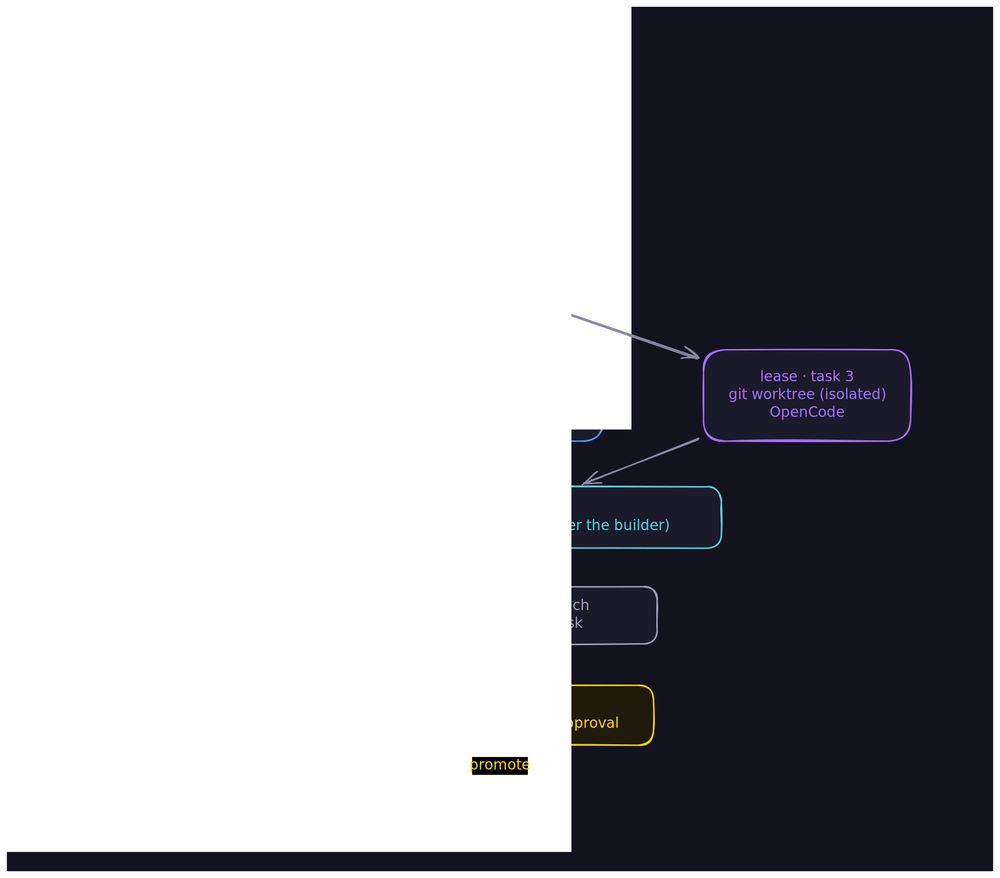
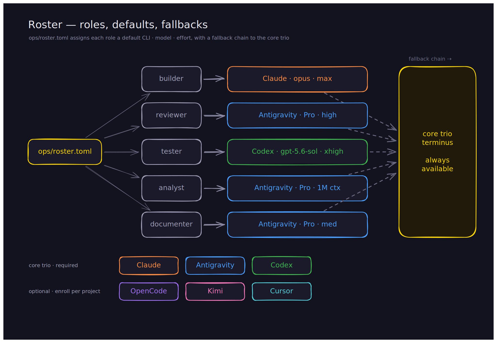
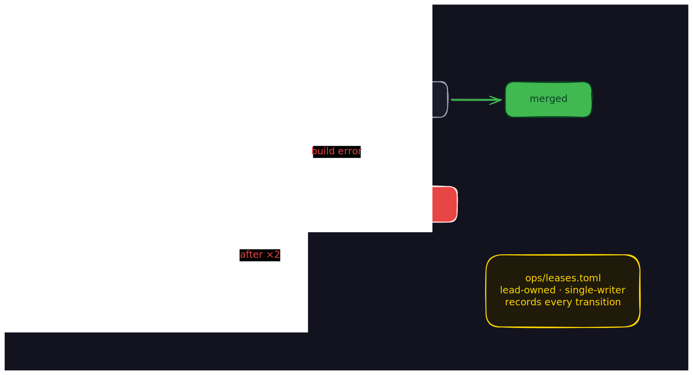

<p align="center">
  
</p>

<p align="center">
  <strong>Agent Triforge — A core trio of AI coding CLIs forging production-grade code together. Claude Code orchestrates Antigravity CLI, Codex CLI, and specialized subagents through file-based protocols, portable skills, and parallel review swarms.</strong>
</p>

<p align="center">
  <a href="#what-is-this">Overview</a> ·
  <a href="#recent-changes">Recent changes</a> ·
  <a href="#project-structure">Structure</a> ·
  <a href="#sprint-pipeline-ship">Pipeline</a> ·
  <a href="#planning-pipeline-plan">Plan</a> ·
  <a href="#deep-research-deep-research">Research</a> ·
  <a href="#wave-orchestration-build">Build</a> ·
  <a href="#review-swarm-review">Review</a> ·
  <a href="#test-pipeline-test">Test</a> ·
  <a href="#debugging-debug">Debug</a> ·
  <a href="#quality-gates">Gates</a> ·
  <a href="#context-recovery">Context</a> ·
  <a href="#getting-started">Quick Start</a> ·
  <a href="#commands-reference">Commands</a> ·
  <a href="#faq">FAQ</a>
</p>

---

## What is this?

A production-grade framework that turns Claude Code into a **lead agent** orchestrating a **six-CLI builder pool**. Instead of one model doing everything — or a fixed role for each CLI — a user-editable roster ([`ops/roster.toml`](templates/ops/roster.toml)) decides which CLI, model, and effort handles each role, and any member can implement code:

- **[Claude Code](https://docs.anthropic.com/en/docs/claude-code)** is the lead — it plans, resolves the roster, dispatches builders, and merges reviewed work (ladder: Fable 5 → Opus 4.8 → Sonnet 5)
- **Core trio (required):** Claude · **[Antigravity](https://antigravity.google/cli)** (`agy`, Gemini 3.1 Pro, 1M context) · **[Codex](https://github.com/openai/codex)** (`gpt-5.6-sol`, sandboxed)
- **Optional tier (auto-detected):** **OpenCode** (OpenRouter) · **Kimi Code** (K3) · **Cursor** (Grok 4.5) — enrolled through [`/setup`](commands/setup.md), gracefully absent when not
- **19 Claude specialized agents** provide deep expertise in [security](agents/security-sentinel.md), [performance](agents/performance-oracle.md), [architecture](agents/architecture-strategist.md), and more

Every non-lead build runs under a **per-task lease in an isolated git worktree** and merges only after **cross-review by a pinned non-author reviewer** — safety is isolation + cross-review, not write-restriction. Work is tracked in shared markdown files. Reviews run in parallel. Knowledge compounds across sessions.

> *Each sprint should make the next sprint easier — not harder.*

The framework achieves this through **institutional knowledge compounding**: every non-trivial problem solved gets documented in [`ops/solutions/`](ops/solutions/), every architectural decision in [`ops/decisions/`](ops/decisions/), and a [`learnings-researcher`](agents/learnings-researcher.md) agent automatically searches these before planning new work.

<p align="center">
  
</p>

---

## What's new (v3.0.0)

**The biggest release since the plugin conversion.** Triforge moves from a fixed Claude + Gemini + Codex trio to a **six-CLI builder pool** coordinated by a roster, per-task leases, and mandatory cross-review — and swaps the retired Gemini CLI lane for Antigravity. The coordination model and the CLI surface both changed, so this is a major version.

### Headline changes

- **Builder pool (default).** All six supported CLIs — the core trio (Claude, Antigravity, Codex) plus enrolled optional members (OpenCode, Kimi, Cursor) — are eligible builders. [`ops/roster.toml`](templates/ops/roster.toml) assigns each role; every build runs under a per-task lease in an isolated worktree and merges only after cross-review by a pinned non-author reviewer. The single-writer rule is retired.
- **Gemini → Antigravity.** Google shut down the hosted Gemini CLI service for consumer tiers on 2026-06-18; the analyst / reviewer / documenter lane is now **Antigravity (`agy`)** running Gemini 3.1 Pro (High), invoked via `invoke_antigravity`.
- **Guided onboarding ([`/setup`](commands/setup.md)).** One idempotent command takes a fresh install to a working roster: gate the core trio, enroll or decline each optional CLI, then accept the shipped role defaults or customize who does what (CLI · model · effort per role).
- **Self-maintenance ([`/cli-watch`](commands/cli-watch.md), [`/repo-watch`](commands/repo-watch.md)).** Scheduled or manual watch cycles keep the framework current against primary sources.
- **Native-first runtime.** Completion gating moved from the retired `ship-loop.sh` promise gate to Claude Code's native `/goal` + an `ops/.sprint-complete` sentinel; Codex runs `gpt-5.6-sol` with structured `--output-schema` verdicts and hooks under `codex exec`.

### Migrating from v2.4.x

- **(a) Builder-pool default.** External CLIs are now eligible builders, not review-only. To restore the old reviewer-only posture, edit `ops/roster.toml` and take the external CLIs off the `builder` role (leave them on `reviewer` / `tester` / `analyst` / `documenter`, or set `[members.<cli>] enabled = false`). The core trio can't be disabled, and every fallback chain must still terminate at a core member.
- **(b) Gemini → Antigravity.** The Gemini lane is gone. **Former Gemini-API-key users:** install Antigravity and run `/setup` to authenticate the `agy` lane (the old `GEMINI_API_KEY` is no longer used). **Users who must stay on legacy Gemini:** pin plugin **`v2.4.3`** — the last release with the Gemini lane.
- **(c) Raised floors (KTD-13).** New enforcement floors: Claude Code ≥ 2.1.212, Codex ≥ 0.144.0, Antigravity `agy` ≥ 1.1.3; optional tier OpenCode ≥ 1.18, Kimi Code ≥ 0.15 (re-baselined to the tested version — the plan's aspirational ≥ 0.27 predated the probe host, and Kimi's near-daily cadence makes the tested floor the honest one), Cursor (date-versioned). Full matrix with tested-against versions + READY probes in [Compatibility](#compatibility).
- **(d) Retired mechanisms.** `ship-loop.sh` promise gate (`<promise>DONE</promise>`) → `/goal` + `ops/.sprint-complete` sentinel; single-writer rule → lease + cross-review. The historical changelog entries below keep the retired names on purpose — they record what past releases shipped, and are not rewritten.

### Also recent (history)

v2.4.3 sequential downgrade ladder; v2.4.0–v2.4.2 framework self-audits; v2.2.0 Opus-max-effort + reliability patterns; v2.0.0 plugin conversion — full detail in [Recent changes](#recent-changes).

### Claude Code plugin

The framework is installed as a **Claude Code plugin** — install with one command, update with one command. No git clone, no manual file copying, no `.claude/settings.json` editing.

```bash
claude plugin add https://github.com/Ninety2UA/agent-triforge
```

All agents, skills, commands, and hooks register automatically. Your project's `ops/` directory is bootstrapped on first session.

### Automatic project bootstrapping

On first session in a new project, the `session-start.sh` hook:
- Creates `ops/solutions/`, `ops/decisions/`, `ops/archive/`
- Copies skeleton `MEMORY.md`, `CHANGELOG.md`, `AGENTS.md`, and `GOALS.md` from plugin templates
- Suggests copying the `CLAUDE.md` template if not present
- Creates `.claude/` directory for session state files

---

## The builder pool

The heart of v3.0.0. A wave reads [`ops/roster.toml`](templates/ops/roster.toml), leases each task to a builder CLI in its own isolated git worktree, and merges only after a pinned non-author reviewer approves — then promotes the sprint integration branch to `main` through a protected-path gate.

<p align="center">
  
</p>

**The roster decides who does what.** Five roles — builder, reviewer, tester, analyst, documenter — each map to a CLI + model + effort with an ordered fallback chain that must terminate at a core-trio member. Optional members carry an `enabled` flag and are absent everywhere when off. Model choice is yours per role: the shipped defaults pin the latest Gemini Pro for `agy` (never silently Flash) and grok-4.5 for Cursor, and a role's `model` entry selects any other variant — Flash included — when you explicitly want it.

<p align="center">
  
</p>

**Every builder runs under a lease.** The lead-owned ledger `ops/leases.toml` (runtime state) tracks each task through its lifecycle — with heartbeat-based orphan detection, a single requeue to a *different* builder, and escalation when a task can't converge.

<p align="center">
  
</p>

Safety comes from three mechanisms working together, not from restricting who may write code: **per-task worktree isolation** (builders never see the canonical `ops/` tree), a **per-adapter environment allowlist** (no cross-provider credential leaks), and **mandatory cross-review** before any merge (no agent merges its own build).

---

## Project structure

The plugin provides agents, skills, commands, and hooks. Your project gets an `ops/` directory for state:

```
agent-triforge/                     (plugin — installed automatically)
├── .claude-plugin/plugin.json        Plugin manifest
├── agents/                           19 specialized agent definitions
├── skills/                           13 portable workflow modules
├── commands/                         19 slash commands
├── hooks/
│   ├── hooks.json                    Hook registration
│   └── handlers/                     4 lifecycle hook scripts
├── settings.json                     Default env vars
├── templates/                        Project bootstrapping templates
└── scripts/coordinate.sh            Outer loop for context recovery

your-project/                       (your repo — bootstrapped on first session)
├── CLAUDE.md                         Orchestration protocol (copy from template)
├── ops/                              Shared coordination files
│   ├── AGENTS.md                       Master operating protocol for all agents
│   ├── GOALS.md                        High-level product goals
│   ├── MEMORY.md                       Decisions, patterns, gotchas
│   ├── CHANGELOG.md                    Audit trail with agent attribution
│   ├── STATE.md                        Session continuity checkpoint
│   ├── solutions/                      Documented solved problems
│   ├── decisions/                      Architecture decision records
│   └── archive/                        Archived review + test files
└── src/                              Your source code
```

### Shared file protocol

All agents coordinate through markdown files in [`ops/`](ops/). This is the source of truth:

| File | Purpose | Owner |
|---|---|---|
| `TASKS.md` (runtime) | Work queue with `[ ]`/`[x]` status tracking | Claude generates, all agents read |
| [`AGENTS.md`](templates/ops/AGENTS.md) | Master operating protocol read by all agents | Manual |
| [`GOALS.md`](templates/ops/GOALS.md) | High-level product goals for sprint planning | Manual |
| [`MEMORY.md`](ops/MEMORY.md) | Architectural decisions, patterns, interface proposals | All agents append |
| [`CHANGELOG.md`](ops/CHANGELOG.md) | Audit trail with `[agent-name]` attribution | All agents append |
| [`STATE.md`](ops/STATE.md) | Session continuity — current phase, progress, next actions | Claude writes on pause/wrap |
| [`solutions/`](ops/solutions/) | Documented solved problems for institutional knowledge | Claude writes via [`/compound`](commands/compound.md) |
| [`decisions/`](ops/decisions/) | Architecture decision records (ADRs) | Claude writes via [`/compound`](commands/compound.md) |

---

## Sprint Pipeline (`/ship`)

Every goal flows through a structured pipeline. Run [`/ship`](commands/ship.md) for fully autonomous execution, or invoke each phase individually.

<p align="center">
  
</p>

| Phase | What happens | Agent(s) | Command |
|:---|:---|:---|:---|
| **0 — Analyze** | Full-repo scan: architecture, patterns, contracts, debt | Antigravity CLI + [`codebase-mapping`](skills/codebase-mapping/SKILL.md) | [`/plan`](commands/plan.md) |
| **Pre-Plan** | Search institutional knowledge for relevant past solutions | [`learnings-researcher`](agents/learnings-researcher.md) | [`/plan`](commands/plan.md) |
| **1 — Plan** | Decompose goal into tasks with shadow paths and error maps | Claude + [`writing-plans`](skills/writing-plans/SKILL.md) | [`/plan`](commands/plan.md) |
| **1.5 — Validate** | Validate assignments, dependencies, scope, shadow paths | [`plan-checker`](agents/plan-checker.md) | [`/plan`](commands/plan.md) |
| **1.1 — Ambiguity** | Surface top 3 unverified assumptions, ask user to confirm/correct | Claude | [`/plan`](commands/plan.md), [`/ship`](commands/ship.md) |
| **2 — Build** | Wave orchestration with integration verification between waves | Claude subagents or [`team-lead`](agents/team-lead.md) | [`/build`](commands/build.md) |
| **3–4 — Review** | Up to 7 parallel reviewers, synthesized with confidence tiering | Antigravity + Codex + [review agents](#review-specialists-6) | [`/review`](commands/review.md) |
| **5 — Test** | TDD test writing, gap analysis, fix cycle until green | Codex CLI + [`test-driven-development`](skills/test-driven-development/SKILL.md) | [`/test`](commands/test.md) |
| **6 — Ship** | Document solutions, archive reviews, write STATE.md | Claude + [`knowledge-compounding`](skills/knowledge-compounding/SKILL.md) | [`/wrap`](commands/wrap.md) |

---

## Planning Pipeline (`/plan`)

Analyzes the full codebase with Antigravity's 1M-token context, searches institutional knowledge, decomposes the goal with shadow paths and error maps, then validates via [`plan-checker`](agents/plan-checker.md).

<p align="center">
  
</p>

---

## Deep Research (`/deep-research`)

Spawns 5 research agents in parallel before planning, then synthesizes findings into a unified research brief.

<p align="center">
  
</p>

---

## Wave Orchestration (`/build`)

Groups plan tasks by dependency into waves. Independent tasks within each wave run in parallel; an [`integration-verifier`](agents/integration-verifier.md) validates between waves.

<p align="center">
  
</p>

---

## Four coordination modes

| Mode | Mechanism | When to use |
|---|---|---|
| **File-based** | Shared markdown in [`ops/`](ops/) | Persistent state across sessions, audit trails |
| **Direct invocation** | `agy -p` / `codex exec` via bash | Real-time external agent delegation |
| **Native subagents** | Claude's Agent tool with [`agents/`](agents/) definitions | Parallel focused tasks, review swarms |
| **Agent teams** | Multi-Claude with shared task lists ([`team-lead`](agents/team-lead.md)) | Complex builds with 5+ interdependent tasks |

### Portable skill injection

Skills are model-agnostic markdown files that ANY agent can consume. This decouples *what methodology to use* from *which model executes it*:

```bash
# All external-agent invocations go through the unified helper
source ${CLAUDE_PLUGIN_ROOT}/scripts/invoke-external.sh

# Antigravity via native agent definition (skill embedded in the agent body)
invoke_antigravity "codebase-analyst" \
  "Analyze the full codebase. Write findings to ops/ARCHITECTURE.md." \
  "$AGY_OUT" 600

# Codex via native agent definition (skill embedded in the agent body)
invoke_codex "test_writer" \
  "Write tests for changed files." \
  "$CODEX_OUT" 900
```

The helper detects native agent support at runtime and falls back to prompt-prefix injection of the agent body (with its embedded skill) when the CLI doesn't surface the agent definition — the operative mode through agy 1.1.4, which doesn't list plugin agents headless yet (re-probed on the 2026-07-18 1.1.4 release; the lane auto-upgrades to native routing the day `agy` surfaces plugin agents).

### Assignment heuristic

Roles come from `ops/roster.toml` (`resolve_role <role>`); the defaults below are the shipped posture, not a write-restriction — any member can be the builder, and every build merges only after cross-review.

| Question | Role (default; roster-assignable) |
|---|---|
| Produces code? | builder role — default Claude, assignable to any member; built under a lease and cross-reviewed before merge |
| Evaluates existing code? | reviewer role ([Codex](https://github.com/openai/codex) + [Antigravity](https://antigravity.google/cli)) + [Claude review agents](#review-specialists-6) in parallel |
| Runs/executes something? | tester role (default [Codex CLI](https://github.com/openai/codex)) |
| Produces documentation? | documenter role (default [Antigravity CLI](https://antigravity.google/cli)) |
| Touches shared interfaces? | builder implements under a lease → pinned non-author reviewer cross-reviews → tester validates |
| Ambiguous? | the lead takes it as builder, flags for parallel review |

---

## Review Swarm (`/review`)

Up to 7 reviewers analyze the same code simultaneously through different lenses (2 external CLIs + 5 Claude specialized agents with `--full`), then a [`findings-synthesizer`](agents/findings-synthesizer.md) merges, deduplicates, and priority-ranks all findings.

<p align="center">
  
</p>

### Confidence tiering

Every finding gets a confidence score to prevent wasting time on phantom issues:

| Tier | Criteria | Rule |
|---|---|---|
| **HIGH** | Verified in codebase via grep/read. Deterministic. | Can be any priority |
| **MEDIUM** | Pattern-aggregated detection. Some false positive risk. | Can be any priority |
| **LOW** | Requires intent verification. Heuristic-only. | **Can NEVER be P1** |

### Suppressions

Each reviewer has a "Do Not Flag" list to reduce noise — readability-aiding redundancy, documented thresholds, sufficient test assertions, consistency-only style changes, and issues already addressed in the current diff. See individual [agent definitions](agents/) for each reviewer's suppressions list.

---

## Test Pipeline (`/test`)

Identifies untested code paths with [`test-gap-analyzer`](agents/test-gap-analyzer.md), then writes and runs tests via [Codex CLI](https://github.com/openai/codex) using the TDD skill in a sandboxed environment.

<p align="center">
  
</p>

---

## Debugging (`/debug`)

Structured debugging with [`systematic-debugging`](skills/systematic-debugging/SKILL.md): reproduce the bug first, perform root cause analysis, then fix with evidence. A **circuit breaker** enforces a 3-attempt ceiling per issue — if the same error recurs after 3 consecutive fix attempts, the agent stops and produces an escalation report instead of looping.

<p align="center">
  
</p>

---

## Quality Gates

Five non-negotiable checkpoints enforced at every stage:

<p align="center">
  
</p>

| Gate | Enforced by | Rule |
|---|---|---|
| **1 — Plan validated** | [`plan-checker`](agents/plan-checker.md) agent | No build without validated plan (max 3 iterations) |
| **2 — Failing test first** | [`test-driven-development`](skills/test-driven-development/SKILL.md) skill | No production code without a failing test |
| **3 — Root cause first** | [`systematic-debugging`](skills/systematic-debugging/SKILL.md) skill | No fix without diagnosis |
| **4 — Evidence first** | [`verification-before-completion`](skills/verification-before-completion/SKILL.md) skill | No "done" without proof |
| **5 — Review first** | [`review-synthesis`](skills/review-synthesis/SKILL.md) skill | No merge without code review (max 3 cycles) |
| **6 — Circuit breaker** | [`systematic-debugging`](skills/systematic-debugging/SKILL.md) skill | 3-attempt ceiling per issue, then escalation report |

---

## Getting started

### Prerequisites

**Run [`/setup`](commands/setup.md) first** — the guided path from a fresh install to a working roster. It gates the core trio live, walks each optional CLI (enroll with a chosen model, or decline cleanly), then offers role assignment: accept the shipped defaults (recommended) or customize any role's CLI · model · effort. Idempotent and re-runnable; the probes below are exactly what `/setup` automates.

**Core trio (required):**

```bash
# Claude Code ≥ 2.1.212 — floor set by the session-caps/monitors line;
# /goal gating, dynamic workflows, and worktree isolation all landed earlier
claude --version

# Antigravity CLI ≥ 1.1.3 — https://antigravity.google/cli (run `agy` once interactively to log in)
agy --model "Gemini 3.1 Pro (High)" -p "Respond with only: READY"   # always pin the model — agy defaults to a Flash variant

# Codex CLI ≥ 0.144.0 — https://github.com/openai/codex
codex exec "Respond with only: READY"

# Python 3 (used by hook handlers for JSON parsing)
python3 --version
```

**Optional tier** — enroll via `/setup` to use them as builders/reviewers; each is skipped cleanly in every roster fallback chain when absent:

```bash
# OpenCode ≥ 1.18 — needs the OpenRouter provider connected (OPENROUTER_API_KEY or `opencode auth login`)
opencode run --format json -m openrouter/z-ai/glm-5.2 "Respond with only: READY"

# Kimi Code ≥ 0.15 — OAuth device-code or API key (`kimi login`)
kimi -p "Respond with only: READY"

# Cursor (date-versioned) — pin grok-4.5, never the Auto router (`cursor-agent login`)
cursor-agent -p --trust --model grok-4.5 "Respond with only: READY"
```

### Compatibility

Re-baselined from the capability probe record ([`ops/research/2026-07-probe-record.md`](ops/research/2026-07-probe-record.md), 2026-07-17). Core trio required; optional tier enrolled via `/setup`. This supersedes the old "Tested against Codex 0.130.0 and Gemini 0.41.2" baseline.

| CLI | Tier | Floor (KTD-13) | Tested | READY probe |
|---|---|---|---|---|
| Claude Code (`claude`) | core | ≥ 2.1.212 | 2.1.214 | `claude --version` |
| Antigravity (`agy`) | core | ≥ 1.1.3 | 1.1.4 | `agy --model "Gemini 3.1 Pro (High)" -p "Respond with only: READY"` |
| Codex (`codex`) | core | ≥ 0.144.0 | 0.144.4 | `codex exec "Respond with only: READY"` |
| OpenCode (`opencode`) | optional | ≥ 1.18 | 1.18.3 | `opencode run --format json -m openrouter/z-ai/glm-5.2 "…"` |
| Kimi Code (`kimi`) | optional | ≥ 0.15 | 0.15 (near-daily; latest 0.27) | `kimi -p "…"` |
| Cursor (`cursor-agent`) | optional | date-versioned | 2026.07.16 | `cursor-agent -p --trust --model grok-4.5 "…"` |

The Gemini CLI floor was removed with the Antigravity migration (Google's hosted service stopped serving consumer tiers 2026-06-18); legacy Gemini users pin plugin `v2.4.3`. An absent or declined optional CLI is silently skipped — fallback chains always terminate at a core-trio member, which can't be disabled.

### Data egress and credentials

Each dispatched CLI sends its task prompt and the code context it is handed to that CLI's model provider. Under the shipped defaults, your code + task context reaches **Anthropic** (Claude), **Google** (Antigravity → Gemini 3.1 Pro), and **OpenAI** (Codex) for the core trio; and, for any optional member you enroll, **Zhipu / Z.ai** (GLM, routed through the **OpenRouter** intermediary — which also sees the traffic), **Moonshot** (Kimi), and **xAI** (Grok, via Cursor). `ops/roster.toml` is the control surface: disable a member (`enabled = false`) or drop a provider's model from every role to remove that provider from the egress set (the core trio always stays). Credentials never live in the repo — each adapter reads its own from the OS / vendor store (CLI logins, `OPENROUTER_API_KEY`, `CURSOR_API_KEY`, `kimi login` OAuth-or-API-key), scoped per-adapter by the lease env allowlist; captured output is scrubbed before it lands in `ops/`, and rotation follows each vendor's own token flow (revoke + re-login/re-key, then re-run `/setup`).

### Installation

**Install as a Claude Code plugin:**

```bash
# User scope (available in all your projects)
claude plugin add https://github.com/Ninety2UA/agent-triforge

# Or project scope (shared with team via .claude/settings.json)
claude plugin add https://github.com/Ninety2UA/agent-triforge --scope project
```

That's it. No manual configuration needed — hooks, env vars, agents, skills, and commands are all registered automatically by the plugin system.

On first session, the plugin bootstraps your project's `ops/` directory and suggests copying the CLAUDE.md template.

### Update

```bash
claude plugin update agent-triforge
```

### Development (for contributors)

```bash
git clone https://github.com/Ninety2UA/agent-triforge.git
claude --plugin-dir ./agent-triforge
```

### Verify installation

```bash
claude

# You should see:
# "Multi-agent framework ready."
# "Commands: /ship /plan /build /review /test /debug /quick ..."

/status
```

### Typical session flow

**Supervised (human in the loop):**

```bash
claude
> /plan add user authentication         # Phase 0-1.5: analyze, research, plan, validate
> /build                                 # Phase 2: wave orchestration
> /review                                # Phase 3-4: parallel review + synthesis
> /test                                  # Phase 5: Codex TDD
> /compound JWT session handling         # Document solution for future sprints
> /wrap                                  # Phase 6: compound knowledge, write STATE.md
```

**Autonomous (fire and forget):**

```bash
# Inside Claude — single session, won't stop until done
claude
> /ship add user authentication with JWT refresh tokens

# From terminal — with context-exhaustion recovery
./scripts/coordinate.sh "add user authentication" --max 5 --team
```

---

## Commands reference

### Full pipeline

| Command | What it does |
|---|---|
| [**`/ship <goal>`**](commands/ship.md) | Fully autonomous end-to-end sprint with inner loop guard. Won't stop until done. |
| [**`/coordinate <goal>`**](commands/coordinate.md) | Same phases with exit guard — alternative entry point for the full lifecycle. |

### Phase-specific

| Command | Phase | What it does |
|---|---|---|
| [**`/plan <goal>`**](commands/plan.md) | 0 → 1.5 | Analyze codebase, plan with shadow paths, validate via [`plan-checker`](agents/plan-checker.md) |
| [**`/build`**](commands/build.md) | 2 | [Wave orchestration](skills/wave-orchestration/SKILL.md) build. `--team` for [agent team](agents/team-lead.md) mode. |
| [**`/review`**](commands/review.md) | 3 → 4 | Parallel review + [synthesis](agents/findings-synthesizer.md). `--full` for all 7 reviewers. |
| [**`/test`**](commands/test.md) | 5 | [Gap analysis](agents/test-gap-analyzer.md) + [Codex](https://github.com/openai/codex) TDD. `--gaps-only` to just identify gaps. |
| [**`/wrap`**](commands/wrap.md) | 6 | [Compound knowledge](skills/knowledge-compounding/SKILL.md), archive reviews, write [`STATE.md`](ops/STATE.md). |

### Lightweight workflows

| Command | What it does |
|---|---|
| [**`/quick <change>`**](commands/quick.md) | For changes touching < 3 files. Skips heavy machinery. |
| [**`/debug <bug>`**](commands/debug.md) | Structured [debugging](skills/systematic-debugging/SKILL.md): reproduce, diagnose, fix with root cause analysis. |

### Research and operations

| Command | What it does |
|---|---|
| [**`/setup`**](commands/setup.md) | Guided roster onboarding — gate the core trio live, enroll/decline each optional CLI with a chosen model, then accept the shipped role defaults or customize each role's CLI · model · effort (`/setup roles` jumps to that step). Idempotent; re-run any time. |
| [**`/deep-research <topic>`**](commands/deep-research.md) | Launch 5 parallel research agents + [`research-synthesizer`](agents/research-synthesizer.md). |
| [**`/analyze <url>`**](commands/analyze.md) | Deep compatibility analysis of an external repo. |
| [**`/status`**](commands/status.md) | Sprint overview: phase, tasks, blockers, available commands. |
| [**`/pause`**](commands/pause.md) | Quick checkpoint to [`STATE.md`](ops/STATE.md). |
| [**`/resume`**](commands/resume.md) | Continue from [`STATE.md`](ops/STATE.md) checkpoint. |
| [**`/compound`**](commands/compound.md) | Document a solved problem to [`ops/solutions/`](ops/solutions/) or decision to [`ops/decisions/`](ops/decisions/). |
| [**`/resolve-pr <PR#>`**](commands/resolve-pr.md) | Read GitHub PR comments and implement requested changes via [`pr-comment-resolver`](agents/pr-comment-resolver.md). |

### Scheduling watches (`/cli-watch`, `/repo-watch`)

Two commands keep the framework current instead of hand-running audits. Both read [`templates/ops/watch-registry.toml`](templates/ops/watch-registry.toml) — a seeded, user-editable registry of watch targets — and share the [`watch-cycle`](skills/watch-cycle/SKILL.md) methodology: primary-source research window → per-target changelog → gap table vs current Triforge → adopt/defer ADR with revisit triggers → verification probes.

| Command | Targets | Produces |
|---|---|---|
| [**`/cli-watch`**](commands/cli-watch.md) | the six CLIs (`[cli.*]`) | Gap report + adopt/defer ADR + a re-run of [`probe-capabilities.sh`](scripts/probe-capabilities.sh) |
| [**`/repo-watch`**](commands/repo-watch.md) | four external repos (`[repo.*]`) | Prioritized adopt/defer recommendations (Why / Concrete change / Verification). **Recommends only** — never implements. |

**The registry is the only thing you edit to add a target** — a new `[cli.<name>]` or `[repo.<name>]` block is picked up with no command changes. Targets must be public HTTPS URLs (loopback, private, and link-local addresses are rejected before *and* after redirects); fetched pages are treated as untrusted evidence, never as instructions; a dead or renamed entry is flagged in the report, never silently dropped.

**Manual:** run `/cli-watch` or `/repo-watch` any time — the report and ADR land in [`ops/research/`](ops/research/) and [`ops/decisions/`](ops/decisions/).

**Monthly (headless):** schedule either as a Claude Code cloud Routine — `/schedule` → prompt `/cli-watch` (or `/repo-watch`) → monthly cron (Routines run at a **minimum 1-hour** interval). A scheduled run preflights its environment and self-selects delivery: it commits the report to a branch and opens a **PR** when a pushable checkout exists; falls back to the Routine's **output artifact** with landing instructions when there is no pushable checkout; and opens a **draft PR** with auth-dependent probes marked pending when vendor auth is absent. A Routine missing a required binary, auth, or research tool emits a diagnostic artifact naming the gap — never a silent success.

---

## Skills reference

13 portable, model-agnostic workflow modules that any agent can consume. Skills embedded in native Antigravity/Codex agent definitions (`antigravity-agents/agents/`, `codex-agents/`) at install time; prompt-prefix injection of the agent body kicks in automatically when a CLI doesn't surface native agent definitions.

| Skill | Primary consumer | What it teaches the agent |
|---|---|---|
| [**`codebase-mapping`**](skills/codebase-mapping/SKILL.md) | [Antigravity](https://antigravity.google/cli) (Phase 0) | Full-repo analysis: structure, data flow, patterns, debt |
| [**`writing-plans`**](skills/writing-plans/SKILL.md) | Claude (Phase 1) | Task decomposition with shadow paths, error maps, interface context |
| [**`shadow-path-tracing`**](skills/shadow-path-tracing/SKILL.md) | Claude (Phase 1) | Enumerate every failure path alongside the happy path |
| [**`wave-orchestration`**](skills/wave-orchestration/SKILL.md) | Claude (Phase 2) | Dependency-grouped parallel execution with integration checks |
| [**`test-driven-development`**](skills/test-driven-development/SKILL.md) | [Codex](https://github.com/openai/codex) (Phase 5) | RED-GREEN-REFACTOR: no production code without failing test |
| [**`systematic-debugging`**](skills/systematic-debugging/SKILL.md) | Codex, Claude | Error taxonomy, assumption tracking, bisection, root cause, circuit breaker |
| [**`iterative-refinement`**](skills/iterative-refinement/SKILL.md) | Claude (Phase 4) | Review-fix-review loops with convergence modes |
| [**`review-synthesis`**](skills/review-synthesis/SKILL.md) | Claude (Phase 4) | Merge multi-reviewer findings with confidence tiering |
| [**`verification-before-completion`**](skills/verification-before-completion/SKILL.md) | All agents | Evidence-based completion checklist |
| [**`knowledge-compounding`**](skills/knowledge-compounding/SKILL.md) | Claude (Phase 6) | Document solutions to [`ops/solutions/`](ops/solutions/) for future sprints |
| [**`session-continuity`**](skills/session-continuity/SKILL.md) | Claude | Save and resume via [`STATE.md`](ops/STATE.md) across sessions |
| [**`scope-cutting`**](skills/scope-cutting/SKILL.md) | Claude | Systematically cut scope by unblocking value and risk |
| [**`watch-cycle`**](skills/watch-cycle/SKILL.md) | Claude (lead) | CLI/repo watch cycle: primary-source research → gap table → adopt/defer ADR |

---

## Agents reference

19 agents in [`agents/`](agents/) with restricted tools and focused expertise. Each runs in its own context window.

### Core workflow (7)

| Agent | Phase | What it does |
|---|---|---|
| [**`plan-checker`**](agents/plan-checker.md) | 1.5 | Validates task plans for completeness, assignments, dependencies |
| [**`findings-synthesizer`**](agents/findings-synthesizer.md) | 4 | Merges review outputs with deduplication and confidence tiering |
| [**`integration-verifier`**](agents/integration-verifier.md) | 2 | Runs build, tests, lint between waves |
| [**`learnings-researcher`**](agents/learnings-researcher.md) | Pre-1 | Searches [`ops/solutions/`](ops/solutions/) and [`ops/decisions/`](ops/decisions/) for relevant patterns |
| [**`team-lead`**](agents/team-lead.md) | 2 | Orchestrates agent team workers with file ownership and quality gates |
| [**`research-synthesizer`**](agents/research-synthesizer.md) | 0 | Merges parallel research outputs into unified analysis |
| [**`continuous-reviewer`**](agents/continuous-reviewer.md) | 2 | Per-task quality gate during team builds — auto-reviews every completed task |

### Review specialists (6)

| Agent | Lens | What it catches |
|---|---|---|
| [**`security-sentinel`**](agents/security-sentinel.md) | Security | SQL injection, XSS, auth bypass, data exposure, OWASP |
| [**`performance-oracle`**](agents/performance-oracle.md) | Performance | O(n²) loops, N+1 queries, memory leaks, scalability |
| [**`code-simplicity-reviewer`**](agents/code-simplicity-reviewer.md) | Complexity | Over-engineering, YAGNI violations, unnecessary abstraction |
| [**`convention-enforcer`**](agents/convention-enforcer.md) | Conventions | Naming, file organization, code style consistency |
| [**`architecture-strategist`**](agents/architecture-strategist.md) | Structure | SOLID principles, coupling/cohesion, module boundaries |
| [**`test-gap-analyzer`**](agents/test-gap-analyzer.md) | Coverage | Untested code paths, missing edge cases, weak assertions |

### Research and verification (6)

| Agent | What it does |
|---|---|
| [**`best-practices-researcher`**](agents/best-practices-researcher.md) | Industry-wide patterns, anti-patterns, tradeoff analysis |
| [**`framework-docs-researcher`**](agents/framework-docs-researcher.md) | Current documentation for specific frameworks and libraries |
| [**`git-history-analyzer`**](agents/git-history-analyzer.md) | Code evolution and architectural decisions via git history |
| [**`bug-reproduction-validator`**](agents/bug-reproduction-validator.md) | Validates bugs are reproducible before fixes begin |
| [**`deployment-verifier`**](agents/deployment-verifier.md) | Post-deployment health checks, smoke tests, error monitoring |
| [**`pr-comment-resolver`**](agents/pr-comment-resolver.md) | Reads GitHub PR review comments and implements changes |

---

## Context Recovery

Three defense mechanisms prevent long sprints from dying to context limits:

<p align="center">
  
</p>

| Layer | Mechanism | Guards against |
|---|---|---|
| **Completion gating** | Native `/goal` checklist gate — [`coordinate.sh`](scripts/coordinate.sh) leads every session prompt with it; `/ship` and `/coordinate` print a copyable `/goal` line; completion signaled only by creating `ops/.sprint-complete` after verification passes | Claude declaring victory early |
| **Outer loop** | [`scripts/coordinate.sh`](scripts/coordinate.sh) — spawns fresh sessions with clean context, detects completion via the `ops/.sprint-complete` sentinel, notifies on completion | Context window filling up |
| **PreCompact** | [`pre-compact.sh`](hooks/handlers/pre-compact.sh) — auto-checkpoints `STATE.md` before context compaction | State loss during mid-sprint compaction |
| **Analysis paralysis** | [`context-monitor.sh`](hooks/handlers/context-monitor.sh) — warns at 8+ consecutive reads without writes | Reading without producing |
| **Tool failure monitor** | [`tool-failure-monitor.sh`](hooks/handlers/tool-failure-monitor.sh) — tracks and warns on accumulated tool failures | Silent failure accumulation |
| **Subprocess timeouts** | Watchdog pattern on all Antigravity/Codex calls — SIGTERM after timeout, SIGKILL after 5s grace | Hung external agents blocking pipeline |
| **Risk scoring** | Per-subagent risk accumulation — halt at >20% or 50+ file changes | Runaway subagents |

```bash
# Full autonomous sprint with context recovery
./scripts/coordinate.sh "Build the authentication module" --max 5 --convergence deep --team

# With completion notification via webhook
NOTIFY_WEBHOOK_URL="https://hooks.slack.com/..." ./scripts/coordinate.sh "Build auth" --max 5
```

### Key constraints

- `CONTRACTS.md` is never modified directly during review — changes must be proposed in [`MEMORY.md`](ops/MEMORY.md) first
- Any roster member is an eligible builder — the single-writer rule is retired. Safety is per-task leases + worktree isolation + mandatory cross-review by a pinned non-author reviewer, not write-restriction; no agent self-merges, and the lead promotes to the main branch only after the wave's integration check
- Parallel reviews are safe because reviewers write to separate `ops/REVIEW_*.md` files
- Maximum 3 review cycles per task before escalating to user
- Phase 0 can be skipped for small bug fixes, same-session continuations, or unchanged codebases (use [`/quick`](commands/quick.md))
- Completion requires creating the `ops/.sprint-complete` runtime marker only after the [verification checklist](skills/verification-before-completion/SKILL.md) passes

---

## How it compares

This framework was informed by analyzing the [Claude Code Blueprint](https://github.com/Ninety2UA/claude-code-blueprint) and selectively adopting patterns that complement our heterogeneous multi-model architecture.

| Dimension | [Claude Code Blueprint](https://github.com/Ninety2UA/claude-code-blueprint) | This framework |
|---|---|---|
| **Agent model** | Homogeneous (Claude-only) | Heterogeneous six-CLI builder pool (core trio + optional OpenCode/Kimi/Cursor) |
| **Review agents** | 6 Claude subagents | 7 reviewers (2 external + 5 Claude subagents) |
| **Codebase analysis** | Claude subagent | [Antigravity CLI](https://antigravity.google/cli) (1M token context) |
| **Test execution** | Claude subagent | [Codex CLI](https://github.com/openai/codex) (sandboxed execution) |
| **Coordination** | Native subagents + git | File protocol + bash + subagents + teams |
| **Skills** | Claude-only | Portable across all roster CLIs via [injection](#portable-skill-injection) |
| **Dependencies** | Zero (markdown only) | Core trio required (Claude + Antigravity + Codex); optional tier adds OpenCode/Kimi/Cursor |

<details>
<summary><strong>What we adopted from Blueprint</strong></summary>

Confidence tiering, suppressions lists, review synthesis, wave orchestration, quality gates, institutional knowledge compounding, dual-loop context management, risk scoring, shadow path tracing, session continuity. The Blueprint's completion-promise pattern and ship-loop Stop-hook architecture were also adopted, then retired in 2026-07 when Claude Code's native `/goal` gating covered them (probe CC-03) — completion is now signaled via the `ops/.sprint-complete` sentinel.
</details>

<details>
<summary><strong>What we added beyond Blueprint</strong></summary>

Multi-model coordination, portable skill injection into external agents, agent teams as a build mode, Antigravity Phase 0 analysis with 1M token context, Codex sandboxed testing, file-based coordination protocol for cross-model state sharing.
</details>

---

## When NOT to use this framework

| Situation | What to do instead |
|---|---|
| Trivial task (< 30 minutes) | Just use Claude Code directly, or [`/quick`](commands/quick.md) |
| Pure exploration / brainstorming | Single agent conversation |
| Tight deadline, no tests needed | Claude Code solo, skip review + test |
| Non-code deliverables | [Antigravity CLI](https://antigravity.google/cli) solo with its large context |

---

## FAQ

<details>
<summary><strong>Can I use this with an existing project?</strong></summary>

Yes. Use Option 2 or Option 3 from <a href="#installation">Installation</a> to copy just the components you need. The framework is additive — it doesn't modify your existing code.
</details>

<details>
<summary><strong>Do I need all the CLIs?</strong></summary>

The <strong>core trio</strong> (Claude, Antigravity, Codex) is the supported baseline — run <a href="commands/setup.md"><code>/setup</code></a> to get them live. The <strong>optional tier</strong> (OpenCode, Kimi, Cursor) is genuinely optional: enroll any subset via <code>/setup</code>, and an absent one is skipped cleanly in every roster fallback chain. Claude alone still runs the pipeline (degraded — you lose the multi-model review/test/analysis benefits).
</details>

<details>
<summary><strong>Do I need all the skills?</strong></summary>

No. Skills activate contextually. If you never use TDD, the <a href="skills/test-driven-development/SKILL.md">test-driven-development</a> skill won't activate. You can delete any skill directory you don't want.
</details>

<details>
<summary><strong>How do agents differ from skills?</strong></summary>

<strong>Skills</strong> are instructions that guide an agent's behavior — methodology documents. <strong>Agents</strong> are separate subprocesses dispatched via the Agent tool, each with their own context window. Skills can be injected into any agent (including external ones like Antigravity and Codex).
</details>

<details>
<summary><strong>What are Agent Teams?</strong></summary>

<a href="agents/team-lead.md">Agent Teams</a> spawn multiple Claude Code instances that collaborate through a shared task list and messaging. Unlike review swarms (read-only analysis), Agent Teams are peers that divide file ownership and coordinate builds. Enable with <code>CLAUDE_CODE_EXPERIMENTAL_AGENT_TEAMS: "1"</code> in settings.json.
</details>

<details>
<summary><strong>Do small bug fixes need the full pipeline?</strong></summary>

No. Use <a href="commands/quick.md"><code>/quick</code></a> for changes touching fewer than 3 files. It skips Phase 0, plan validation, and the full review swarm.
</details>

<details>
<summary><strong>How does context exhaustion recovery work?</strong></summary>

Two layers. <strong>Inside</strong> a session, completion is hard-gated by Claude Code's native <code>/goal</code> command — <a href="scripts/coordinate.sh"><code>coordinate.sh</code></a> leads every composed prompt with a <code>/goal</code> checklist line, and <code>/ship</code>/<code>/coordinate</code> print a copyable <code>/goal</code> line for interactive runs. <strong>Outside</strong> a session, <a href="scripts/coordinate.sh"><code>coordinate.sh</code></a> spawns fresh Claude processes with clean context windows, detecting completion via the <code>ops/.sprint-complete</code> sentinel the session creates only after the verification checklist passes; state persists via git and <code>ops/STATE.md</code>. A PreCompact hook auto-checkpoints STATE.md before context compaction.
</details>

<details>
<summary><strong>What is knowledge compounding?</strong></summary>

After solving a non-trivial problem, <a href="commands/compound.md"><code>/compound</code></a> saves it as a structured document in <a href="ops/solutions/"><code>ops/solutions/</code></a>. Future <a href="commands/plan.md"><code>/plan</code></a> and <a href="commands/deep-research.md"><code>/deep-research</code></a> commands automatically search this directory before starting new work — so every sprint gets smarter.
</details>

---

## Recent changes

### 2026-07-22 — v3.1.0: Role customization in guided onboarding

**`/setup` now covers who does what.** After the core-trio gate and optional-member enrollment, a new role step shows the current assignment table (role → CLI · model · effort · fallbacks) and asks one question: proceed with the shipped defaults (recommended) or customize. Customizing walks CLI, model, and effort per chosen role; `/setup roles` jumps straight to that step on re-runs. The closing status table now derives each CLI's roles from the live roster instead of hardcoding the shipped posture.

**New single-writer helpers.** `roster_role_entry <role>` prints a role's merged configuration (shipped defaults overlaid per-field by `ops/roster.toml`, no liveness walk; the model column shows what dispatch would actually run, even for a hand-edited cli-only override); `roster_write_role <role> <cli> <model> <effort> [fallbacks-csv]` is the validated single writer for `[roles.*]` — it enforces a strict superset of `resolve_role`'s load rules (known role/CLI and core-trio chain terminus, plus writer-only checks: the effort enum and agy effort→(High)/(Low) suffix normalization), derives a valid fallback chain when none is given (the displaced primary becomes the first fallback), and round-trip-verifies before an atomic replace, preserving comments elsewhere in the file.

**Roster model overrides now reach every external-CLI dispatch lane.** `invoke_codex` gained a `CODEX_MODEL` override (same pattern as `AGY_MODEL`/`OPENCODE_MODEL`/`KIMI_MODEL`/`CURSOR_MODEL`), and `dispatch_role`'s codex lane passes the resolved roster model through it — a customized reviewer/tester model actually reaches `codex exec -m` instead of silently deferring to the `agents.toml` pin. The shipped default matches the pin, so behavior is unchanged until a user customizes. (The claude lane stays ladder-governed by design: work resolved to claude runs as a native Agent-tool subagent, whose model comes from the Fable/downgrade ladder, not the roster.)

---

### 2026-07-21 — v3.0.1: Landing-page copy + release hygiene

**Messaging fixes.** The "Three AI models" tagline (page title, hero, footer, README, plugin manifest) now reads "a core trio of AI coding CLIs" — the old count clashed with the six-CLI builder pool introduced in v3.0.0. The Antigravity model wording on the landing page softened from "never Flash" to "Gemini 3.1 Pro by default, Flash opt-in": the shipped defaults still pin Pro on every `agy` path, but a `[roles.*] model` entry in `ops/roster.toml` (or `AGY_MODEL`) can select a Flash variant when a user explicitly wants one.

**Rolls up post-v3.0.0 fixes.** v3.0.0 review hardening (#2) and the 2026-07-20 capability-record refresh (#3), which landed after the `v3.0.0` tag.

---

### 2026-07-18 — v3.0.0: CLI modernization + six-CLI builder pool

The largest release since the plugin conversion — the coordination model and the CLI surface both changed.

**Six-CLI builder pool.** The fixed single-writer trio is retired. All six supported CLIs — core trio (Claude, Antigravity, Codex) plus enrolled optional members (OpenCode, Kimi, Cursor) — are eligible builders assigned from [`ops/roster.toml`](templates/ops/roster.toml) (`resolve_role`). Every implementation task runs under a per-task lease (`ops/leases.toml` + isolated worktree) and merges only after cross-review by a pinned non-author reviewer; approved work lands one squash commit per task on a sprint integration branch, and the lead promotes to main honoring a `[promotion]` gate. Safety is leases + worktree isolation + cross-review, not write-restriction.

**Gemini → Antigravity.** Google shut down the hosted Gemini CLI service for consumer tiers (2026-06-18). The analyst / reviewer / documenter lane migrated to **Antigravity (`agy`)** running Gemini 3.1 Pro (High): `invoke_gemini` → `invoke_antigravity`, `gemini-agents/` → `antigravity-agents/` (a valid agy plugin), `ops/REVIEW_GEMINI.md` → `ops/REVIEW_ANTIGRAVITY.md`. Legacy Gemini users pin `v2.4.3`.

**Native-first runtime.** Completion gating moved from the retired `ship-loop.sh` Stop hook and its `<promise>DONE</promise>` convention to Claude Code's native `/goal` gate + an `ops/.sprint-complete` sentinel (probe CC-03). Wave orchestration delegates 5+-task waves to dynamic workflows. Claude runs a Fable-5-topped downgrade ladder (`fable`/`max` → `opus`/`xhigh` → `opus`/`high` → `sonnet`/`high`) with a spawn-time Fable override for the lead and the never-downgrade trio.

**Codex modernization.** `gpt-5.6-sol` at `xhigh` (was `gpt-5.4`), structured `--output-schema` review verdicts, and hooks under `codex exec` (D-004 reversed — probe CDX-04; see [`ops/decisions/2026-07-18-codex-hooks-under-exec.md`](ops/decisions/2026-07-18-codex-hooks-under-exec.md)).

**Onboarding + self-maintenance.** New [`/setup`](commands/setup.md) guides a fresh install to a live roster via first-detection enrollment. New [`/cli-watch`](commands/cli-watch.md) + [`/repo-watch`](commands/repo-watch.md) run watch cycles over [`templates/ops/watch-registry.toml`](templates/ops/watch-registry.toml) using the `watch-cycle` skill.

**Raised floors (KTD-13).** Claude Code ≥ 2.1.212, Codex ≥ 0.144.0, Antigravity `agy` ≥ 1.1.3; optional OpenCode ≥ 1.18, Kimi Code ≥ 0.15, Cursor (date-versioned). See [Compatibility](#compatibility).

**Docs.** Full refresh across README, `.claude/CLAUDE.md`, `templates/CLAUDE.md`, `docs/agent-triforge.md`, `docs/index.html`; single-writer statements reframed to the lease/cross-review contract; drift fixes (Codex `--full-auto` is deprecated-not-removed; `max` effort is not Opus-only). Known cosmetic gap: `docs/images/*.svg` still render "Gemini" labels (image assets, deferred).

---

> **Historical note (2026-07):** entries below predate the Gemini → Antigravity migration and intentionally keep retired names (`Gemini CLI`, `invoke_gemini`, `gemini-agents/`, `ops/REVIEW_GEMINI.md`, `ops/RESEARCH_GEMINI.md`) as an accurate record of what those releases shipped. The live lane is Antigravity (`agy`, `invoke_antigravity`, `antigravity-agents/`, `ops/REVIEW_ANTIGRAVITY.md`, `ops/RESEARCH_ANTIGRAVITY.md`); legacy Gemini users pin plugin v2.4.3. Some file links in these historical entries point at paths that have since moved or been removed by v3.0.0 (`CLAUDE.md` → `.claude/CLAUDE.md`; `gemini-agents/` → `antigravity-agents/`; `hooks/handlers/ship-loop.sh` retired) — they document where the file lived at that release, not the current tree.

### 2026-05-12 — v2.4.3: Sequential downgrade ladder for narrow runtime tasks

**Tiered downgrade ladder for the team-lead and lead agent.** The previous single-step downgrade (`opus`/`max` → `sonnet`/`high`) was a big leap that skipped past two cheaper same-family reductions. New ladder lets the orchestrator step down one notch at a time: `opus`/`max` → `opus`/`xhigh` → `opus`/`high` → `sonnet`/`high`. Locked agents (security-sentinel, plan-checker, findings-synthesizer) remain hardwired to `opus`/`max`. Documentation-only change — runtime behavior is unchanged; the team-lead's allowed move set widens. Also fixed a doc-drift bug in `CLAUDE.md`: the documented effort values were missing `xhigh` (a valid Claude Code value per the v2.2.0 audit at `README.md:654`).

<details>
<summary><strong>Files changed (6 files)</strong></summary>

| File | Change |
|---|---|
| `CLAUDE.md` | Architecture line references new ladder; effort field values corrected to include `xhigh` |
| `templates/CLAUDE.md` | Architecture line references new ladder |
| `agents/team-lead.md` | "Model routing discretion" block rewritten as a 3-tier ladder table |
| `skills/wave-orchestration/SKILL.md` | Mirrors the team-lead.md rewrite |
| `README.md` | v2.2.0 changelog reference refreshed; this entry; "What's new" + version refs bumped |
| `.claude-plugin/plugin.json` | Bumped to 2.4.3 |
| `docs/index.html` | Hero badge + terminal version bumped to v2.4.3 |

</details>

---

### 2026-05-12 — v2.4.2: Third audit pass — both prior passes missed siblings of the same anti-pattern

A third adversarial audit on top of v2.4.0 and v2.4.1 — three parallel Explore agents covered shell safety + hooks + scripts, agent definitions + security model, and docs + commands + skills + templates. **Surfaced 1 MEDIUM + 3 doc-drift fixes plus one bonus bug uncovered during verification.** The audit agents collectively reported four BLOCKER/HIGH findings; every one was verified false against the actual code. The framework is converging.

**[MEDIUM] Two surviving `|| echo "0"` siblings in [`session-start.sh:138, 174`](hooks/handlers/session-start.sh)** — v2.4.0 fixed three `grep -c || echo "0"` instances; v2.4.1 fixed a fourth `grep -c` instance both the team-lead pass and its consolidation step missed; this pass found that both prior audits only ever checked `grep -c` and never the `find … | wc -l` siblings. `SOLUTION_COUNT` (line 138) and `GEMINI_AGENT_COUNT` (line 174) both used the same broken `|| echo "0"` tail. Triggered whenever `ops/solutions/` or `.gemini/agents/` is missing (e.g., user manually deletes the directory after bootstrap, or bootstrap is skipped because `ops/` already exists) — `wc -l` already emits `0`, then `echo "0"` appends another `0`, and the downstream `[ "$VAR" -gt "0" ]` comparison errors with `integer expression expected` under `set -euo pipefail`. The handler dies before printing the orientation banner. **Fix:** `|| echo "0"` → `|| true` on both lines.

**[LOW, bonus] Codex agent count off-by-3 in [`session-start.sh:193`](hooks/handlers/session-start.sh)** — Caught when the verification reproducer for the previous fix ran in an empty test project and the orientation banner reported "External agent definitions loaded: 4 Gemini + 6 Codex" when there are only 3 Codex agents. The Python fast path did `len(data.get('agents', {}))`, but the `[agents]` table in `codex-agents/agents.toml` holds three scalar runtime caps (`max_depth`, `max_threads`, `job_max_runtime_seconds`) alongside the three agent subtables (`logic_reviewer`, `test_writer`, `debugger`) — so `len()` returned 6. The fallback `grep -c '^\[agents\.'` would have been correct (it matches only the dotted subtable headers), but the Python path wins whenever `tomllib` is available. **Fix:** filter to dict values only — `sum(1 for v in data.get('agents', {}).values() if isinstance(v, dict))` — mirroring the [`_list_codex_agents`](scripts/invoke-external.sh) helper which already had the correct pattern. Re-verified: "4 Gemini + 3 Codex".

**[LOW] `CLAUDE.md` Context-management section omitted 2 of 5 hook handlers** — The Hook-safety subsection said "All 5 hook handlers use `set -euo pipefail`" but the Context-management subsection only named 3 (`ship-loop.sh`, `coordinate.sh`, `context-monitor.sh`). The two missing handlers were `pre-compact.sh` (auto-snapshots `ops/STATE.md` before context compaction, both already wired in `hooks/hooks.json`) and `tool-failure-monitor.sh` (tracks consecutive + total tool failures, warns at 5 consecutive / 10 total per session). **Fix:** both handlers now listed with one-line descriptions of what they do and when they fire.

**[LOW] `codex-agents/agents.toml` top-comment explained `max_threads` only** — Sets three caps (`max_depth = 2`, `max_threads = 4`, `job_max_runtime_seconds = 1800`) but the inline comment only described the `max_depth` fallback issue and `max_threads`'s fan-out role. `max_depth = 2`'s actual semantics — raising the cap by exactly one level so a single spawn round is allowed but recursive spawn-of-spawn is blocked (runaway protection) — was invisible to anyone reading the TOML in isolation. **Fix:** comment now explains both `max_depth` and `max_threads` properly.

**[NIT] `CLAUDE.md` agent-frontmatter-fields list was Claude-only without saying so** — Section listed `name/description/model/effort/tools/maxTurns/skills/mcpServers/hooks/memory/background/isolation/color/permissionMode` — all Claude conventions. Gemini definitions use `max_turns`/`timeout_mins` plus lowercase tool names; Codex uses `model_reasoning_effort`/`sandbox_mode`/`approval_policy`/`include_plan_tool`. **Fix:** one trailing sentence cross-references both CLIs' conventions so readers know where to look.

**False alarms verified and rejected** — For the record so they're not re-raised next pass: (1) "BLOCKER path injection in `ship-loop.sh:131`" — `SHIP_STATE_FILE` is the hardcoded constant `.claude/ship-loop.local.md` declared at line 22, never user-controlled; (2) "BLOCKER JSON/command injection in `coordinate.sh:69,72` `notify()`" — only ever called from lines 122 and 134 with hardcoded `title="Agent Triforge"` and integer-templated bodies (`"converged in $ITERATION iterations"`); no user-controlled text flows through; (3) "HIGH approval_policy injection in `invoke-external.sh:157-161`" — values come from project-controlled `agents.toml`, parsed via `tomllib`, serialized via `json.dumps`; the auditor walked the claim back mid-analysis; (4) "HIGH `NEXT_ITERATION` arithmetic needs validation" — `ITERATION` is already validated as `^[0-9]+$` at `ship-loop.sh:60` before the `$((ITERATION + 1))` at line 124. Severity inflation is a real failure mode; manual cross-check against the actual code is non-negotiable.

**Verified** — `grep -rn '|| echo "0"' hooks/ scripts/` returns only the cautionary comment at `pre-compact.sh:18` (which references the anti-pattern by name); `bash -n hooks/handlers/session-start.sh` clean; reproducer in `/tmp/empty/ops/` (where `ops/solutions/` and `.gemini/agents/` are missing) ran cleanly under the fixed handler with no `integer expression expected` errors and correct "4 Gemini + 3 Codex" count.

<details>
<summary><strong>Files changed (6 files)</strong></summary>

| File | Change |
|---|---|
| `hooks/handlers/session-start.sh` | Two `\|\| echo "0"` → `\|\| true` fixes (lines 138, 174); Codex agent count filtered to dict values only (line 193) |
| `CLAUDE.md` | Context-management section now names all 5 hook handlers; frontmatter-fields section cross-references Gemini/Codex conventions |
| `codex-agents/agents.toml` | Top-comment extended to explain `max_depth = 2` recursion cap |
| `.claude-plugin/plugin.json` | Bumped to 2.4.2 |
| `README.md` | This changelog entry; What's new bumped to v2.4.2 |
| `docs/index.html` | Hero badge + terminal version bumped to v2.4.2 |

</details>

---

### 2026-05-12 — v2.4.1: Second audit pass — surviving blocker + 27 findings actioned

A second team-lead-orchestrated audit on top of v2.4.0 — **6 parallel specialist reviewers** (hooks/scripts, commands, skills, agents, plugin manifest, docs/cross-refs) plus Team Lead consolidation with spot-checks — surfaced **28 findings**: 1 BLOCKER, 1 HIGH, 13 MEDIUM, 13 LOW. The Team Lead's cross-check caught one reviewer mis-attributing a line number (proving the consolidation step earns its keep) and downgraded one reviewer-rated HIGH to MEDIUM pending independent verification.

**[BLOCKER] Surviving `grep -c || echo "0"` in [`session-start.sh:194`](hooks/handlers/session-start.sh)** — v2.4.0 fixed three earlier instances of the bug pattern (`pre-compact.sh:19-22` + `session-start.sh:121-123`) but missed one. The Codex-agent-count fallback chain (`python tomllib || grep -c '^\[agents\.' || echo "0"`) produced `"0\n0"` when both Python toml libs were unavailable and grep matched nothing. Line 195's `[ "$CODEX_AGENT_COUNT" -gt "0" ]` then errored with `integer expression expected` under `set -euo pipefail` — the handler died before printing the orientation banner. **Fix:** `|| echo "0"` → `|| true`.

**[HIGH] Broken ADR reference in [`CLAUDE.md:269`](CLAUDE.md)** — Cited `ops/decisions/0001-cli-deprecation-watch.md`; the actual file is `2026-05-12-cli-deprecation-watch.md`. The link is the only documented justification for why Triforge does not auto-enable Codex hooks under `codex exec`. **Fix:** path updated to the ISO-date naming the repo already uses for its other ADR.

**[MEDIUM] `effort: max` field verified, kept as-is** — The audit raised a concern that Claude Code's agent-frontmatter schema might not recognize `effort:` and that the 19 agents' "Opus max effort" claim was unenforced. Spot-checked against the current Claude Code subagents spec: `effort` is documented (values `low`/`medium`/`high`/`xhigh`/`max`; overrides session effort while the subagent is active). All 19 declarations are honored. No change. _[Corrected in v3.0.0: `max` is not Opus-only — it is documented on Fable 5, Sonnet 5, and Opus 4.8/4.7.]_

**[MEDIUM] All 16 commands now declare `allowed-tools`** — Defense-in-depth narrowing; `/quick` was previously inheriting the full Claude Code tool surface despite being scoped to <3 file changes. Allowlists scoped per command's actual needs: `/status`, `/resume`, `/pause`, `/compound` are read-mostly; `/build`, `/plan`, `/ship`, `/coordinate`, `/wrap`, `/quick`, `/debug`, `/resolve-pr` get the full set; `/analyze` is read-only per its own constraint.

**[MEDIUM] 7 inline bash blocks gained `set -euo pipefail`** — `commands/{build,plan,ship,coordinate,deep-research,review,test}.md` each ran multi-line `source ${CLAUDE_PLUGIN_ROOT}/scripts/invoke-external.sh` + parallel `invoke_gemini`/`invoke_codex` blocks without the safety flags, so a `source` failure or non-zero `wait` could fall through silently.

**[MEDIUM] 4 commands gained `$ARGUMENTS` boundary guards** — `commands/{plan,ship,coordinate,deep-research,debug,resolve-pr,compound,quick}.md` (the ones that pipe user input directly into subagent prompts) now have an explicit `> **Note:**` block instructing downstream agents to treat the argument block as data, not as instructions overriding the command's own logic.

**[MEDIUM] 3 commands gained "When to use" decision aids** — `commands/{build,plan,ship}.md` were missing the comparison block that `/quick` already had. New users now have a decision tree for picking between `/plan` → `/build` (manual phasing) vs `/ship` (autonomous end-to-end) vs `/coordinate` (autonomous, simpler) vs `/quick` (lightweight).

**[MEDIUM] All 19 agents now carry a `color`** — Wave orchestration and team builds routinely fan out to 5+ agents at once; the parallel-swarm UI was monochrome. Categorized: planners/coordinators **blue** (`plan-checker`, `architecture-strategist`, `team-lead`); code reviewers **green** (`code-simplicity-reviewer`, `convention-enforcer`, `continuous-reviewer`); researchers + verifiers **cyan** (`learnings-researcher`, `framework-docs-researcher`, `best-practices-researcher`, `git-history-analyzer`, `integration-verifier`, `test-gap-analyzer`, `deployment-verifier`); synthesizers + resolver **magenta** (`findings-synthesizer`, `research-synthesizer`, `pr-comment-resolver`); security/perf/repro **red/yellow** (`security-sentinel`, `performance-oracle`, `bug-reproduction-validator`).

**[MEDIUM] 2 skill descriptions rewritten for trigger precision** — `skills/scope-cutting` and `skills/verification-before-completion` lacked the "Primary consumer" + concrete trigger scenarios that the other 10 skills had. Both now name the consumer and the specific situations that should fire the skill.

**[MEDIUM] `templates/CLAUDE.md` self-contradiction repaired** — Line 19 prose said the helper lived at `scripts/invoke-external.sh`; line 133 code block correctly used `${CLAUDE_PLUGIN_ROOT}/scripts/invoke-external.sh`. New users copying the template were being told to look for a file that doesn't exist in their own project. Prose now uses the `${CLAUDE_PLUGIN_ROOT}/` prefix. Same edit added a "this is the simplified per-project copy" preamble pointing back to the plugin's canonical `CLAUDE.md`.

**[MEDIUM] `ops/research/` added to the shared-file protocol** — Both `CLAUDE.md`'s shared-file table and `templates/ops/` skeleton now include `research/`; the v2.4.0 work introduced `ops/research/cli-updates-2026-05.md` but the protocol table was never updated.

**[MEDIUM] `.gitignore` `*.local.md` anchored to `.claude/*.local.md`** — Unanchored pattern was silently swallowing any `.local.md` at any depth, hiding user notes in places like `docs/notes.local.md`. Anchored; the two redundant explicit lines removed.

**[MEDIUM] Root-level `.gemini/settings.json` artifact cleaned** — Running `session-start.sh` inside the plugin repo itself created a byte-identical duplicate of `templates/.gemini/settings.json` at the plugin root. Deleted the artifact and added `.gemini/` to `.gitignore` so future runs don't recreate it as an untracked file.

**[LOW] Cleanup batch** — `tool-failure-monitor.sh` unicode `⚠` → ASCII `WARN:` (non-UTF8 portability); `continuous-reviewer` description picked up the `Use:` keyword to match the other 18 agents; `git-history-analyzer` and `bug-reproduction-validator` gained `WebFetch`/`WebSearch` for upstream lookups (CVE feeds, issue trackers, vendor notes); `codex-agents/agents.toml` lost the undocumented `nickname_candidates` fields; `status.md` description rewritten in prescriptive style; README TOC gained a `Recent changes` link.

**Deferred** — One MEDIUM (`<example>` blocks in each agent's `description:` field, recommended by Anthropic's agent guidance for routing precision) deferred because it requires custom examples per agent's role; three LOW intentionally skipped (`context-monitor.sh` tool classifier drifts as Claude Code adds tools — kept conservative default; `knowledge-compounding` / `test-driven-development` skills don't need numbered "Step 1:" wrappers since they're already organized into cycles and templates; `templates/.codex/` directory will remain config-only until Codex hooks become viable under `codex exec`).

**Verified** — Shell syntax (`bash -n` on all 5 hook handlers + 2 scripts), TOML (`codex-agents/agents.toml` still parses with all 3 agents + nesting caps intact), YAML (47 frontmatter files: 19 agents + 16 commands + 12 skills), git diff (45 files changed, +149/-20).

<details>
<summary><strong>Files changed (45 files, +149/-20)</strong></summary>

| File | Change |
|---|---|
| `hooks/handlers/session-start.sh` | `\|\| true` fix at line 194 (the v2.4.0 audit miss) |
| `hooks/handlers/tool-failure-monitor.sh` | Unicode `⚠` → ASCII `WARN:` for non-UTF8 portability |
| `CLAUDE.md` | ADR reference path fixed; `research/` added to shared-file table |
| `README.md` | `Recent changes` TOC link added; this changelog; What's new bumped to v2.4.1 |
| `.gitignore` | `*.local.md` anchored to `.claude/*.local.md`; `.gemini/` added |
| `templates/CLAUDE.md` | `${CLAUDE_PLUGIN_ROOT}/` prefix on helper reference; "simplified copy" preamble |
| `templates/ops/research/.gitkeep` | New — skeleton for `ops/research/` |
| `codex-agents/agents.toml` | `nickname_candidates` fields removed (undocumented in Codex 0.130.0 schema) |
| `commands/{build,plan,ship,coordinate,deep-research,review,test}.md` | `set -euo pipefail` prepended to inline bash blocks |
| `commands/*.md` (all 16) | `allowed-tools` declared in frontmatter, scoped per command |
| `commands/{build,plan,ship}.md` | "When to use" decision-aid section added |
| `commands/{plan,ship,coordinate,deep-research,debug,resolve-pr,compound,quick}.md` | `$ARGUMENTS` boundary guard added |
| `commands/status.md` | Description rewritten in prescriptive style |
| `agents/*.md` (all 19) | `color:` declared in frontmatter |
| `agents/continuous-reviewer.md` | `Use:` keyword added to description for consistency |
| `agents/{git-history-analyzer,bug-reproduction-validator}.md` | `WebFetch` + `WebSearch` added to `tools:` |
| `skills/scope-cutting/SKILL.md` | Description rewritten with `Primary consumer:` + trigger scenarios |
| `skills/verification-before-completion/SKILL.md` | Description rewritten with `Primary consumer:` + trigger scenarios |
| `.claude-plugin/plugin.json` | Bumped to 2.4.1 |
| `docs/index.html` | Hero badge + terminal version bumped to v2.4.1 |

</details>

---

### 2026-04-20 — v2.4.0: Framework self-audit — two blockers + four HIGH fixes

A team-lead-orchestrated audit of the entire framework (hooks, commands, skills, agents, scripts, manifests, docs) surfaced **18 findings** — including 2 blockers that silently defeated core reliability invariants. Every finding was either fixed or verified as a false alarm against upstream Gemini/Codex/Claude Code specs. No functionality was added; existing behavior was corrected to match what the docs already promised.

**[BLOCKER] Ship-loop guard never fired** — [`commands/ship.md`](commands/ship.md) and [`commands/coordinate.md`](commands/coordinate.md) wrote `session_id: "<current-branch-name>"` into the loop state file, but [`ship-loop.sh`](hooks/handlers/ship-loop.sh) compared that against Claude Code's runtime session UUID from hook-input JSON. Branch name ≠ UUID → the handler took the "different session — don't interfere" exit on every call. The inner loop guard (max iterations, `<promise>DONE</promise>` check, prompt re-feed) never actually blocked anything during autonomous `/ship` or `/coordinate` runs. **Fix:** removed session_id logic entirely — presence of the state file with `active: true` now indicates the loop. Cleaned the state template in both commands.

**[BLOCKER] `PostToolUseFailure` hook event doesn't exist** — [`hooks/hooks.json`](hooks/hooks.json) registered [`tool-failure-monitor.sh`](hooks/handlers/tool-failure-monitor.sh) under an invented event name (`PostToolUseFailure`) that Claude Code's hook loader silently ignores. The advertised "warn at 5 consecutive or 10 total failures" feature was dead code; `.claude/tool-failures.local.md` was never written. **Fix:** merged the handler into the existing `PostToolUse` hook, with in-handler filtering on `tool_response.is_error` / `tool_response.error` so only actual failures increment the counters. Smoke-tested with both success and failure payloads.

**[HIGH] Gemini `-y` (YOLO) flag silently nullified `policies.toml`** — [`scripts/invoke-external.sh`](scripts/invoke-external.sh) passed `-y` on every `gemini -p` invocation. The plugin's own [`gemini-agents/policies.toml`](gemini-agents/policies.toml) explicitly warns at the top of the file that YOLO installs a max-priority allow rule that overrides every `deny` — including the `rm -rf` / `git push` / `sudo` denylists documented in the "Security model" section of CLAUDE.md. **Fix:** `-y` is now gated on an explicit `GEMINI_YOLO=1` env var (off by default). Subagent isolation comes from the per-agent `tools` allowlist (always respected by Gemini) plus the restored policy rules.

**[HIGH] `team-lead` bypassed `invoke-external.sh`** — [`agents/team-lead.md`](agents/team-lead.md) shelled out to `gemini -p "$(cat SKILL.md) ..."` / `codex exec "$(cat SKILL.md) ..."` directly, skipping policy loading, timeout enforcement, retry, and native-agent routing. Team-mode builds silently lost every piece of reliability infrastructure the rest of the framework relies on. **Fix:** migrated to `invoke_gemini` / `invoke_codex` with per-PID exit-code capture and fail-fast, matching the pattern in `/review` and `/build`.

**[HIGH] Template and README docs drifted to legacy invocation** — [`templates/CLAUDE.md`](templates/CLAUDE.md) (the file `session-start.sh` offers new users as a starting template) and [`README.md`](README.md) both presented `gemini -p "$(cat ...)"` as the current invocation pattern, not the `invoke_gemini` helper. New adopters were being handed outdated guidance at first touch. **Fix:** both now document the helper as the primary path; legacy injection is labeled as the automatic fallback the helper applies when a CLI lacks native-agent support.

**[MEDIUM] `grep -c … || echo "0"` produced `"0\n0"` on zero matches** — `grep -c` already prints `0` to stdout on zero matches and then exits with status `1`; pairing it with `|| echo "0"` ran the fallback and appended a second `0`, yielding a multiline `"0\n0"` value that garbled session-start's task banner and pre-compact's STATE.md checkpoint. The CLAUDE.md "Hook safety" section even documented this broken pattern as the correct one. **Fix:** switched to `|| true` in [`session-start.sh`](hooks/handlers/session-start.sh) and [`pre-compact.sh`](hooks/handlers/pre-compact.sh); rewrote the CLAUDE.md guidance to explain why.

**[MEDIUM] `pre-compact.sh` `CURRENT_PHASE` default clobbered by empty sed output** — `sed -n` with no match exits `0`, so `|| echo "unknown"` never fired when `ops/STATE.md` existed but lacked a `## Current phase:` line. The heredoc then wrote a blank phase into STATE.md, breaking `/resume` heuristics. **Fix:** captures sed output into a temporary variable and falls back explicitly when empty.

**[MEDIUM] Session-start commands banner stale + sed injection risk in state writes + silent timeout fallback** — the banner listed 13 of 16 commands (`/analyze`, `/coordinate`, `/resolve-pr` missing); `ship-loop.sh` and `tool-failure-monitor.sh` injected user-influenced values into `sed` patterns without escaping; [`_run_with_timeout`](scripts/invoke-external.sh) silently ran Gemini/Codex with no timeout when neither `timeout` nor `gtimeout` was on PATH. **Fix:** banner now lists all 16 commands; state-file writes switched from `sed` to `python3`; `_run_with_timeout` emits a one-shot stderr warning the first time it falls through.

**[LOW] Shared-file table + coordinate.sh preflight + plugin.json cleanup** — [`targeted-researcher`](gemini-agents/targeted-researcher.md) writes to `ops/RESEARCH_GEMINI.md` but the shared-file table never mentioned it (added to both CLAUDE.md and templates/CLAUDE.md). [`scripts/coordinate.sh`](scripts/coordinate.sh) invoked `claude --print` via `|| true`, silently producing empty output if the CLI wasn't on PATH (now fails fast with an install hint). [`.claude-plugin/plugin.json`](.claude-plugin/plugin.json) declared `agents`/`skills`/`commands` path fields that are redundant under the current Claude Code plugin spec (auto-discovery handles them) — removed for clarity.

**False alarms verified upstream, no change needed** — the Gemini CLI subagents spec explicitly uses snake_case `max_turns` / `timeout_mins` in its frontmatter schema, so `gemini-agents/*.md` is already correct. The Codex agent-roles source (`codex-rs/core/src/config/agent_roles.rs`) shows `nickname_candidates` is a real, documented field — not dead config. Audit flagged both for verification; both were clean.

<details>
<summary><strong>Files changed (16 files)</strong></summary>

| File | Change |
|---|---|
| `hooks/hooks.json` | Removed non-existent `PostToolUseFailure` event; tool-failure-monitor merged into `PostToolUse` |
| `hooks/handlers/tool-failure-monitor.sh` | Filters on `tool_response.is_error` / `tool_response.error`; resets consecutive counter on success; python3 state writes |
| `hooks/handlers/ship-loop.sh` | Removed broken session_id comparison; switched state update from sed to python3 |
| `hooks/handlers/session-start.sh` | `grep -c … \|\| true` fix; commands banner now lists all 16 |
| `hooks/handlers/pre-compact.sh` | `grep -c … \|\| true` fix; `CURRENT_PHASE` fallback no longer clobbered by empty sed output |
| `commands/ship.md` | Removed `session_id` from state template |
| `commands/coordinate.md` | Removed `session_id` from state template |
| `scripts/invoke-external.sh` | `-y` gated on `GEMINI_YOLO=1` env var; one-shot stderr warning when timeout fallback engages |
| `scripts/coordinate.sh` | Preflight check for `claude` CLI availability |
| `agents/team-lead.md` | Migrated from legacy `gemini -p`/`codex exec` to `invoke_gemini`/`invoke_codex` |
| `templates/CLAUDE.md` | Invocation section rewritten around the helper; `RESEARCH_GEMINI.md` added to shared-file table |
| `templates/ops/AGENTS.md` | Documents `invoke_gemini` / `invoke_codex` for new projects |
| `CLAUDE.md` | Fixed `grep -c` guidance; `RESEARCH_GEMINI.md` added to shared-file table |
| `README.md` | Invocation docs updated to helper-primary; this changelog |
| `.claude-plugin/plugin.json` | Removed redundant `agents`/`skills`/`commands` path fields; bumped to 2.4.0 |
| `docs/index.html` | Hero badge + terminal version bumped to v2.4.0 |
</details>

---

### 2026-04-20 — v2.3.0: Subagent hardening pass (Gemini + Codex docs alignment)

Re-analyzed the [Gemini CLI subagents spec](https://geminicli.com/docs/core/subagents/) and [Codex CLI subagents spec](https://developers.openai.com/codex/subagents) against our current implementation and closed the concrete gaps. Focus: security hardening, invocation-layer parity, and observability — no new features, just making the existing integrations robust against real failure modes.

**Codex per-agent `tools` allowlist** — [`logic_reviewer`](codex-agents/agents.toml) now has `tools = ["read", "grep", "glob"]` (no shell, no write); [`test_writer`](codex-agents/agents.toml) and [`debugger`](codex-agents/agents.toml) get `["read", "grep", "glob", "write", "bash"]`. Defense-in-depth pairs with the existing per-agent `sandbox_mode` — sandbox isolates the filesystem, the allowlist narrows the tool surface.

**Codex nesting caps** — New top-level `[agents]` block in `codex-agents/agents.toml`: `max_depth = 2`, `max_threads = 4`, `job_max_runtime_seconds = 1800`. `logic_reviewer` and `test_writer` explicitly spawn sub-agents for 5+ file scopes — without explicit caps, nesting depth would default to 1 and silently block those spawn paths.

**Codex retry parity** — [`invoke_codex`](scripts/invoke-external.sh) now retries once with a raw prompt on failure, mirroring `invoke_gemini`. Prior asymmetry meant a transient Codex failure killed the pipeline while Gemini kept going.

**Parallel-wait exit-code capture** — [`/review`](commands/review.md) and [`/build`](commands/build.md) now capture per-PID exit codes (`GEMINI_RC`, `CODEX_RC`) and fail-fast when either reviewer died. Previously a silent failure would leave `ops/REVIEW_GEMINI.md` or `ops/REVIEW_CODEX.md` empty — which the [`findings-synthesizer`](agents/findings-synthesizer.md) treated as "no findings."

**Loud failure paths** — `_extract_codex_agent_config` now exits 1 and emits a clear stderr warning instead of silently returning an empty config when Python's TOML parser isn't available. Both `invoke_gemini` and `invoke_codex` now log a warning listing available agents when the requested agent name doesn't resolve (instead of silently falling through to raw mode / session defaults).

**Collision-safe tmp paths** — All output paths switched from `/tmp/gemini_review.txt` to `${TMPDIR:-/tmp}/gemini_review_$$_$(date +%s).txt`. Running `/review` in two tabs no longer clobbers cross-session output. Applied across all seven commands, `scripts/invoke-external.sh` defaults, `CLAUDE.md`, `templates/CLAUDE.md`, and `docs/agent-triforge.md` examples.

**`include_plan_tool = false`** — All three Codex agents disable the Agents SDK plan tool. `logic_reviewer` / `test_writer` / `debugger` are focused executors; the plan tool adds cognitive overhead without value for single-purpose roles.

**macOS coreutils hint** — [`session-start.sh`](hooks/handlers/session-start.sh) emits a one-time warning when neither `timeout` nor `gtimeout` is on PATH; [`CLAUDE.md`](CLAUDE.md) prerequisites now recommend `brew install coreutils` for macOS. Without one of those, `invoke-external.sh` silently ran without timeout enforcement.

**Security model documentation** — New "Security model" section in [`CLAUDE.md`](CLAUDE.md) explains the `approval_policy = "never"` trust model, the defense-in-depth between `sandbox_mode` and the `tools` allowlist, and how `gemini-agents/policies.toml` layers shell-command denylists on top.

<details>
<summary><strong>Files changed (13 files)</strong></summary>

| File | Change |
|---|---|
| `codex-agents/agents.toml` | `[agents]` top-level block (`max_depth`, `max_threads`, `job_max_runtime_seconds`) + per-agent `tools` allowlist + `include_plan_tool = false` |
| `scripts/invoke-external.sh` | Codex retry, loud TOML parser failure, TMPDIR-scoped default output paths, `_list_gemini_agents` + `_list_codex_agents` helpers, unknown-agent warnings |
| `commands/review.md` | Per-PID wait with fail-fast + TMPDIR paths |
| `commands/build.md` | Per-PID wait with fail-fast + TMPDIR paths |
| `commands/plan.md` | TMPDIR paths |
| `commands/test.md` | TMPDIR paths |
| `commands/deep-research.md` | TMPDIR paths |
| `commands/ship.md` | TMPDIR paths |
| `commands/coordinate.md` | TMPDIR paths |
| `hooks/handlers/session-start.sh` | One-time `gtimeout` / `timeout` missing warning |
| `CLAUDE.md` | Security model section + `brew install coreutils` hint + updated parallel-invocation example |
| `templates/CLAUDE.md` | TMPDIR paths in the legacy `gemini -p` / `codex exec` example |
| `docs/agent-triforge.md` | TMPDIR paths across all illustrative examples |
| `.claude-plugin/plugin.json` | Version bump 2.2.0 → 2.3.0 |
</details>

---

### 2026-04-06 — v2.2.0: Opus max effort, reliability patterns, and framework audit

**All agents upgraded to Opus max effort** — All 19 agents now run at `model: opus` + `effort: max` for maximum reasoning quality. The team-lead and lead agent have runtime discretion to downgrade narrow, rubric-following tasks via model + effort override when spawning. (See v2.4.3 for the tiered ladder: `opus`/`xhigh` → `opus`/`high` → `sonnet`/`high`.)

**Forced reflection on retry** — Before any retry, agents must answer: *"What specifically failed? What concrete change will fix it? Am I repeating the same broken approach?"* Applied to the ship-loop Stop hook (`systemMessage`) and wave-orchestration skill. Prevents agents from looping on the same broken approach.

**Same-error kill criteria** — Error fingerprinting tracks recurring failures per executor. If the same error appears 3+ times across retries, the executor is killed and the task reassigned to a fresh agent with anti-pattern context ("Previous executor failed on X — do NOT repeat the same approach"). Added to wave-orchestration skill and team-lead agent.

**Dedicated continuous-reviewer teammate** — New [`continuous-reviewer`](agents/continuous-reviewer.md) agent (19th agent, Opus max, read-only) auto-reviews every completed task during team builds for test/lint/security compliance. Spawned by team-lead at 1:3-4 ratio with builders. The lead only sees green-reviewed code — like a permanent CI gate built into the team.

**Per-task reflection (conditional)** — After task completion, if the task took >3 retries, produced test failures, or modified >5 files, a structured reflection is appended to `ops/MEMORY.md` (surprise, pattern proposal, improvement suggestion). Captures non-obvious learnings while they're fresh.

**Provenance-enhanced institutional memory** — Solution and decision documents now include `sprint_id`, `task_id`, `agent`, `evidence_files`, and `related_decisions` fields. The learnings-researcher agent now filters by tags, status, and follows cross-references between related documents.

**Full framework audit (5th pass)** — 5 parallel reviewer agents + team lead consolidation reviewed all 52 framework components (5 hooks, 16 commands, 12 skills, 19 agents). Found and fixed:

| Category | Issues found | Key fixes |
|---|---|---|
| Hooks | 1 critical, 3 warnings | Promise tag false-positive in ship-loop.sh, `set -euo pipefail` added to all handlers, atomic state writes |
| Commands | 1 error, 2 warnings | Phase 1.1 missing from /coordinate, reviewer list cross-references, /quick cross-ref in /review |
| Skills | Clean (0 issues) | — |
| Agents | Clean (0 issues) | — |
| Infrastructure | 7 errors | Agent count 18→19 in 6 files + SVG, GEMINI.md/CODEX.md phantom file references clarified, plugin.json arrays added |

<details>
<summary><strong>Files changed</strong></summary>

| File | Change |
|---|---|
| `agents/*.md` (all 19) | `model: opus` + `effort: max` |
| `agents/team-lead.md` | Model routing discretion, continuous-reviewer spawning, reflection+kill criteria in failure protocol |
| `agents/continuous-reviewer.md` | **New** — dedicated per-task reviewer for team builds |
| `agents/learnings-researcher.md` | Enhanced search: tags, status, cross-references |
| `skills/wave-orchestration/SKILL.md` | Reflection on retry, same-error kill criteria, per-task reflection, model routing discretion |
| `skills/knowledge-compounding/SKILL.md` | Provenance fields in solution + decision templates |
| `hooks/handlers/ship-loop.sh` | Promise tag false-positive fix, reflection in systemMessage |
| `hooks/handlers/context-monitor.sh` | `set -euo pipefail`, `#!/usr/bin/env bash`, atomic state writes |
| `hooks/handlers/session-start.sh` | `set -euo pipefail`, `#!/usr/bin/env bash`, quoted variable, pipeline fallback |
| `hooks/handlers/tool-failure-monitor.sh` | `set -euo pipefail`, `#!/usr/bin/env bash` |
| `hooks/handlers/pre-compact.sh` | `set -euo pipefail`, `#!/usr/bin/env bash` |
| `.claude-plugin/plugin.json` | Agent count 19, version 2.2.0, agents/skills/commands path declarations |
| `commands/coordinate.md` | Phase 1.1 added |
| `commands/ship.md` | Phase ordering fixed (1.1 before 1.5) |
| `commands/review.md` | /quick cross-reference note |
| `docs/agent-triforge.md` | Agent count 19, GEMINI.md/CODEX.md reference fix, hook count fix |
| `docs/index.html` | Agent count 19 (3 locations) |
| `docs/images/hero-banner.svg` | Agent count 19 |
| `CLAUDE.md` | Agent count 19, Opus max effort, phase numbering (1a/1b/1.1) |
| `templates/CLAUDE.md` | Agent count 19, Opus max effort, phase numbering, scope-cutting reference |
| `README.md` | Agent count 19 (3 locations), audit heading clarified, this changelog |
</details>

### 2026-04-02 — Reliability hardening and tactical enhancements

Informed by a deep comparative analysis against the [official Codex plugin](https://github.com/openai/codex-plugin-cc) and [oh-my-claudecode](https://github.com/Yeachan-Heo/oh-my-claudecode), this update addresses operational reliability gaps and adds targeted capabilities identified through triaged review (P1/P2 findings only, no architectural changes).

**Subprocess timeouts** — All 7 `wait $PID` calls for Gemini/Codex now use a watchdog pattern: a background timer sends SIGTERM after timeout (600s for review/build/plan, 900s for TDD test writing), with SIGKILL fallback after 5s grace. Normal runs are completely undisturbed — the watchdog is silently killed when the process finishes. Previously, a hung `codex exec` or `gemini -p` call would block the entire pipeline indefinitely.

**Circuit breaker for debugging** — The [`systematic-debugging`](skills/systematic-debugging/SKILL.md) skill now enforces a 3-attempt ceiling per issue. If the same failing test or error recurs after 3 consecutive fix attempts, the agent stops and produces a structured escalation report (error signature, attempts summary, assumption ledger, hypothesis, suggested next step) instead of looping. The ship-loop has a session-level ceiling, but this catches per-issue repetition within a session.

**Git trailer conventions** — [`/wrap`](commands/wrap.md) and the [`CLAUDE.md` template](templates/CLAUDE.md) now define structured commit trailers (`Constraint`, `Rejected`, `Confidence`, `Scope-risk`, `Not-tested`) to embed decision context directly in git history. Previously, decision rationale lived only in `ops/decisions/` files, separated from the code.

**Pre-plan ambiguity resolution (Phase 1.1)** — [`/plan`](commands/plan.md) and [`/ship`](commands/ship.md) now surface the 3 most critical unverified assumptions about the goal before building, asking the user to confirm or correct. Skipped for unambiguous goals. Previously, ambiguous specs were caught by the plan-checker after a full planning pass — this catches them earlier.

**PreCompact hook** — New [`pre-compact.sh`](hooks/handlers/pre-compact.sh) handler auto-checkpoints `ops/STATE.md` with task status counts and current phase before Claude Code compacts the context window. Previously, if compaction hit mid-sprint without a `/wrap`, the outer loop could restart from stale state.

**PostToolUse failure tracker** — New [`tool-failure-monitor.sh`](hooks/handlers/tool-failure-monitor.sh) handler tracks tool failures in `.claude/tool-failures.local.md` and warns at 5 consecutive or 10 total failures per session. Registered under `PostToolUse` and filters on `tool_response.is_error`. Previously, tool failures during autonomous runs were silent.

**Completion notifications** — [`scripts/coordinate.sh`](scripts/coordinate.sh) now sends macOS (`osascript`), Linux (`notify-send`), or webhook notifications on sprint completion and max-iteration exit. Gated on `NOTIFY_WEBHOOK_URL` env var for webhook delivery. Previously, long autonomous runs required manual polling.

<details>
<summary><strong>Files changed (14 files, 250 insertions)</strong></summary>

| File | Change |
|---|---|
| `commands/review.md` | Watchdog timeout (600s) on Gemini + Codex wait |
| `commands/test.md` | Watchdog timeout (900s) on Codex wait |
| `commands/build.md` | Watchdog timeout (600s) on Gemini + Codex wait |
| `commands/coordinate.md` | Watchdog timeout (600s) on Gemini wait |
| `commands/ship.md` | Watchdog timeout (600s) on Gemini wait + Phase 1.1 ambiguity check |
| `commands/plan.md` | Watchdog timeout (600s) on Gemini wait + Phase 1.1 ambiguity check |
| `commands/deep-research.md` | Watchdog timeout (600s) on Gemini wait |
| `commands/wrap.md` | Step 7: git trailer conventions |
| `skills/systematic-debugging/SKILL.md` | Circuit breaker (3-attempt ceiling) |
| `templates/CLAUDE.md` | Git trailer conventions section |
| `hooks/hooks.json` | PostToolUse failure-tracker + PreCompact hook entries |
| `hooks/handlers/tool-failure-monitor.sh` | **New** — failure tracking handler |
| `hooks/handlers/pre-compact.sh` | **New** — STATE.md auto-checkpoint handler |
| `scripts/coordinate.sh` | notify() function + completion/failure notification calls |
</details>

---

### 2026-03-31 — v2.0.0: Claude Code plugin conversion

The framework was converted from a `git clone` + manual copy installation to a **Claude Code plugin**. This is a breaking change in how you install and update the framework.

- **Install:** `claude plugin add https://github.com/Ninety2UA/agent-triforge`
- **Update:** `claude plugin update agent-triforge`
- All components moved to root level (`agents/`, `skills/`, `commands/`, `hooks/`)
- Plugin manifest at `.claude-plugin/plugin.json` (v2.0.0)
- Hook registration via `hooks/hooks.json` with `${CLAUDE_PLUGIN_ROOT}` paths
- Root `settings.json` for env vars (`CLAUDE_CODE_EXPERIMENTAL_AGENT_TEAMS`)
- Session-start hook bootstraps `ops/` directory + copies skeleton templates on first run
- CLAUDE.md template provided at `templates/CLAUDE.md` for user projects
- All skill injection paths use `${CLAUDE_PLUGIN_ROOT}/skills/` (8 files updated)
- `docs/agent-triforge.md` updated: plugin layout, hooks.json config, removed stale settings block
- Solution docs updated for plugin hook system

### 2026-03-31 — Four-pass audit and Blueprint alignment

Four full audit passes (**20 parallel agents** + manual 11-point verification) reviewed all 49 framework components (5 hooks, 16 commands, 12 skills, 19 agents). Each pass caught issues the previous missed — converging to zero remaining defects.

| Pass | Found | Fixed |
|---|---|---|
| 1st (5 agents) | 4 critical, 10 high, ~20 medium | Hooks stdin parsing, README config, coordinate.md guard, all high+medium |
| 2nd (5 agents) | 1 critical, 8 high, 4 medium | JSON injection, PID captures, path consistency, reviewer coverage |
| 3rd (5 agents) | 3 critical, 7 high, 6 medium | mkdir .claude in hooks, stale docs, deep-research PID, ops refs |
| 4th (5 agents + manual) | 1 high | ship-loop.sh mkdir guard (last hook missing it) |

<details>
<summary><strong>Critical fixes</strong></summary>

- **Hooks were completely non-functional** — both `ship-loop.sh` and `context-monitor.sh` read environment variables (`$CLAUDE_STOP_ASSISTANT_MESSAGE`, `$CLAUDE_TOOL_NAME`) that Claude Code does not set. Hook data arrives via stdin JSON. Both hooks now parse stdin correctly. This means completion detection and analysis paralysis detection were silently broken since the framework's creation.
- **README shipped broken hook config** — the Getting Started section used the flat `{ "command", "timeout" }` format that Claude Code rejects. Migrated to the correct `{ "matcher", "hooks": [{ "type": "command", "command" }] }` format.
- **`/coordinate` ran full sprints unguarded** — the command executed Phase 0–6 without activating the ship-loop Stop hook, so context exhaustion could silently kill mid-sprint. Now creates the state file and emits `<promise>DONE</promise>` on completion.
- **Ship-loop JSON injection** (found in second pass) — the heredoc embedded raw `$PROMPT_TEXT` into JSON output. Any goal containing double quotes or newlines produced malformed JSON, silently breaking the Stop hook. Now uses `python3 json.dumps()` for safe encoding.
</details>

<details>
<summary><strong>Ship-loop rewrite (Blueprint alignment)</strong></summary>

The Stop hook was rewritten to match the [Claude Code Blueprint](https://github.com/Ninety2UA/claude-code-blueprint)'s architecture:

| Before | After |
|---|---|
| Plain text output | JSON `{decision, reason, systemMessage}` |
| No session isolation | Session-isolated via `session_id` matching |
| Basic stdin grep for promise | Transcript-based JSONL promise detection |
| `sed -i.bak` state updates | Atomic temp file + `mv` |
| No input validation | Integer validation + `set -euo pipefail` |
| Simple 2-field state file | Rich frontmatter: `active`, `session_id`, `iteration`, `max_iterations`, `completion_promise` + prompt body |
| Raw shell variable in JSON | `python3 json.dumps()` for safe JSON encoding |
</details>

<details>
<summary><strong>High-severity fixes</strong></summary>

- **`session-start.sh`** now cleans stale `context-monitor.local.md` on startup (was documented but never implemented)
- **`build.md`** replaced hardcoded `src/auth/` paths with `<scope>` placeholders in agent team examples
- **`deep-research.md`** Gemini invocation now injects `codebase-mapping` skill (was the only Gemini call without it)
- **`review.md`** added `wait $GEMINI_PID $CODEX_PID` before synthesis (was racing on incomplete review files)
- **`test.md`** Codex invocation now uses proper `> /tmp/... 2>&1 &` redirect + PID capture pattern
- **`security-sentinel.md`** removed unnecessary Bash tool (least-privilege for static analysis)
- **`team-lead.md`** added structured output format (was the only agent without one)
- **`wave-orchestration`** skill flagged team mode as Claude-specific + experimental
- **`review.md --full`** now includes `architecture-strategist` (was designed for Phase 3 but never wired in)
- **`build.md`** agent team bash block now captures PIDs and waits (was fire-and-forget)
- **`ship.md`**, **`plan.md`**, **`coordinate.md`** Phase 0 Gemini invocations now capture `GEMINI_PID` and `wait` (were backgrounded with no wait)
- **`coordinate.md`** Phase 3 now includes all 5 review agents (was missing `convention-enforcer` and `architecture-strategist`)
- **`pr-comment-resolver.md`** now checks `gh auth status` before fetching PR comments (was a hard failure if `gh` CLI unavailable)
- **All 3 hook scripts** now have `mkdir -p .claude` guards for project-local state files (`.claude/` dir no longer exists after plugin migration)
- **`deep-research.md`** added `GEMINI_PID` capture + `wait` for background Gemini process
- **`docs/agent-triforge.md`** rewrote repo tree + settings section for plugin layout (was still showing old structure)
- **`ops/solutions/settings-json`** updated for plugin `hooks/hooks.json` approach
- **Stale comment cleanup** in hook script headers (referenced old `.claude/settings.json`)
</details>

<details>
<summary><strong>Medium-severity fixes</strong></summary>

- Fixed missing `ops/` path prefixes across `ship.md`, `plan.md`, `quick.md`, `coordinate.md`
- `plan-checker.md` now accepts "Claude subagent" as a valid assignment category
- `git-history-analyzer.md` replaced interactive `git bisect` with non-interactive `git log -S` alternative
- `deployment-verifier.md` added explicit "never execute rollbacks" safety rule
- `session-start.sh` replaced `echo -e` with POSIX-portable `printf '%b\n'`
- Fixed bare `ops/` path prefixes in `debug.md`, `review.md`, `coordinate.md`
- `status.md` now lists all 16 commands (was missing `/coordinate`, `/analyze`, `/resolve-pr`)
- `coordinate.md` Phase 5 now specifies max 3 fix cycles (was open-ended)
- Standardized archive path wording to `[today's date]` across `ship.md` and `coordinate.md`
</details>

Documented solutions: [`ops/solutions/2026-03-31-hooks-stdin-json-parsing.md`](ops/solutions/2026-03-31-hooks-stdin-json-parsing.md)

### Verification

The framework has been validated through:
- **20 parallel audit agents** across 4 passes (hooks, commands, skills, agents, infrastructure)
- **Manual 11-point verification**: bash syntax, JSON validity, stale path scans, file counts, skill injection paths, executable permissions, mkdir guards, stdin parsing, agent cross-references, plugin hook paths, state file template compatibility
- All checks pass. Runtime behavior (plugin installation, hook firing, `${CLAUDE_PLUGIN_ROOT}` expansion) requires live testing via `claude --plugin-dir .`

---

## License

MIT

---

<p align="center">
  <sub>Built for teams that believe AI-assisted development should get better with every sprint.</sub>
</p>

<p align="center">
  <a href="docs/agent-triforge.md">Full Documentation</a> ·
  <a href=".claude/CLAUDE.md">CLAUDE.md</a> ·
  <a href="https://antigravity.google/cli">Antigravity CLI</a> ·
  <a href="https://github.com/openai/codex">Codex CLI</a>
</p>
