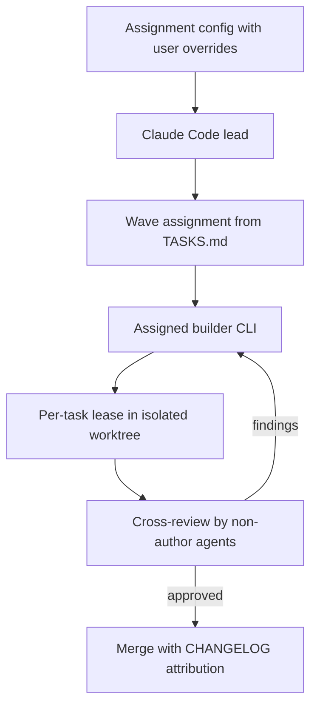
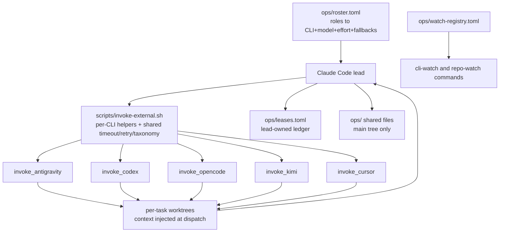
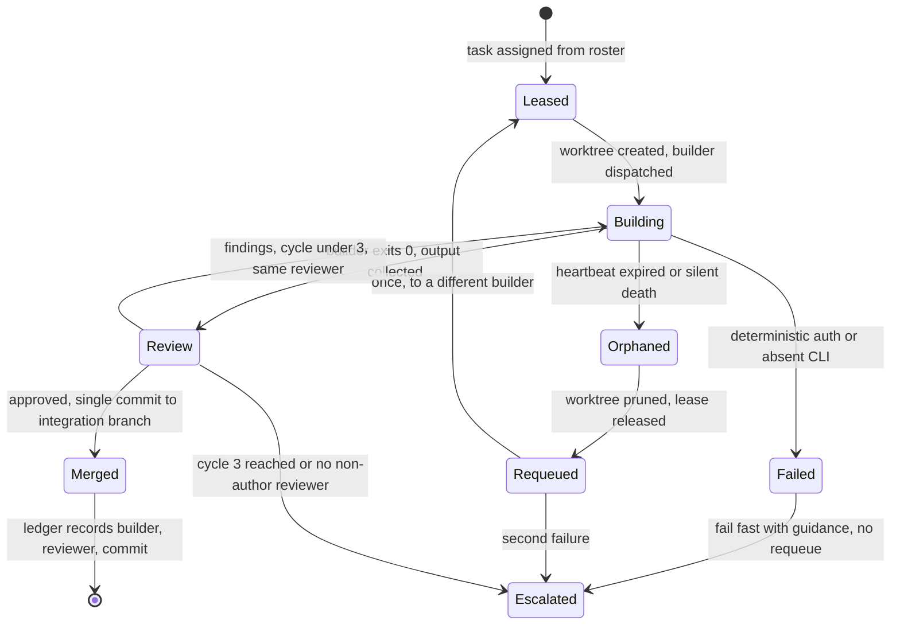
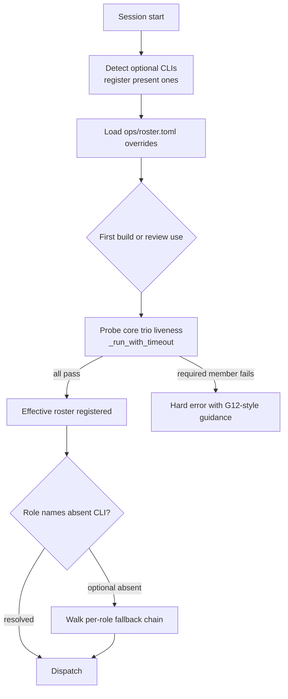
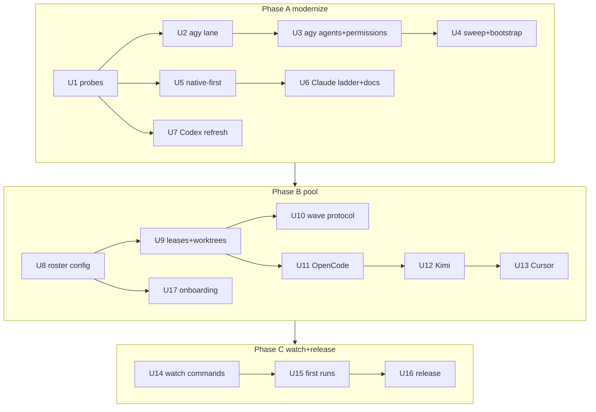

# CLI Modernization and Builder Pool - Plan

## Goal Capsule

- **Objective:** Modernize Agent Triforge to the July 2026 CLI landscape — migrate the Gemini lane to Antigravity (`agy`), absorb verified Claude Code and Codex updates native-first, convert the execution core from single-writer to a configurable six-CLI builder pool, integrate OpenCode / Kimi Code / Cursor as optional members, and make external tracking repeatable via a watch-command family.
- **Authority:** The Product Contract governs WHAT ships; the Planning Contract and Implementation Units govern HOW; the user overrides both. Session-settled decisions carry `session-settled:` labels and are not re-litigated during execution.
- **Execution profile:** Three sequential phases (A modernize incumbents → B builder pool + optional CLIs → C watch family, first runs, release). Units parallelize inside a phase only where their Dependencies allow.
- **Stop conditions:** A U1 probe failing with no documented fallback; evidence that a session-settled decision cannot work; more than 3 review cycles on any unit; any change that would break the core trio's basic invocation paths without a migration note.
- **Tail ownership:** `ce-work` (or the executing agent) owns branch/commit/PR mechanics. Phase C's first-run artifacts land in `ops/research/` and `ops/decisions/` as part of the work itself.
- **Open blockers:** None. Remaining unknowns are execution-time probes owned by U1 (see Outstanding Questions).

---

## Product Contract

### Summary

Replace the deprecated Gemini CLI integration with Antigravity, refresh Claude Code and Codex integrations to their current primitives and models, and rebuild the execution model as a builder pool: all six CLIs can implement code under worktree isolation and cross-review, with a user-editable assignment configuration deciding which CLI and model handles each role. OpenCode, Kimi Code, and Cursor join as optional auto-detected members; two new watch commands (`/cli-watch` and a repo-watch with an extensible repo registry) turn this audit cycle into a repeatable, schedulable product feature.

### Problem Frame

The framework's integration layer decays on external clocks it does not control. On 2026-06-18 Google cut Gemini CLI's hosted service for consumer tiers with no grace period — the framework's Gemini lane (42 files reference it outside `ops/`) now targets a deprecated product whose successor changed the permission model, the skills paths, and the default model. Codex has shipped 19 releases since the last audit; its flagship model moved two generations past the pinned `gpt-5.4`, and the hook limitation that the May ADR deferred on (D-004) appears to have been fixed upstream. Claude Code now natively provides goal gating, workflow orchestration, worktree isolation, and background monitors — mechanisms Triforge maintains as hand-rolled bash. Each drift was caught by a manual audit that exists only as two hand-written `ops/` documents; nothing in the framework makes the next cycle cheaper than the last. Meanwhile the single-writer rule caps implementation throughput at one agent while five capable coding CLIs sit in evaluation-only roles.

### Key Decisions

- **Builder pool replaces single-writer.** All six CLIs — including Antigravity and Codex — are eligible to implement code, with Claude Code as lead. Safety moves from write-restriction to per-task leases, worktree isolation, and cross-review. (session-settled: user-directed — chosen over reviewers-only and specialist-seats: full utilization of capable coding agents; throughput over gatekeeping.)
- **User-configurable assignment layer.** The builder pool is the default; a configuration surface lets each project override which CLI, model, and effort handles which role. (session-settled: user-directed — chosen over fixed role assignment: users decide what models are used and how.)
- **Core trio floor.** Claude Code + Antigravity + Codex are required; OpenCode, Kimi Code, and Cursor are optional, auto-detected at session start, with graceful degradation when absent. (session-settled: user-directed — chosen over Claude-only and all-six-required: preserves the Triforge identity and bounds degradation logic.)
- **Native-first posture toward Claude Code primitives.** Where Claude Code now provides a stable primitive duplicating a Triforge mechanism (`/goal`, dynamic workflows, worktree isolation, monitors), the mechanism is replaced and a minimum Claude Code version is declared. Agent teams stay behind their experimental flag. (session-settled: user-approved — chosen over portable dual paths and conservative refresh: the mechanisms only ever run inside Claude Code, so duplication buys maintenance, not portability.)
- **Clean break on Gemini.** `agy` replaces the Gemini lane outright — no dual gemini/agy invocation lane. Users who must stay on legacy API-key Gemini pin an older plugin release. (session-settled: user-approved — chosen over a transition fallback: the service cutoff already happened; a dual lane doubles the surface this effort exists to shrink.)
- **Repo mining is analyze-recommend-defer.** The four external repos get in-depth analysis and a prioritized adopt/defer report; implementations land in a follow-up sprint after user approval. (session-settled: user-approved — chosen over folding quick wins or implementing everything: keeps this effort's build scope bounded.)
- **Watch family ships in this effort.** `/cli-watch` and the repo-watch command are in scope, and this cycle's own audit and repo analysis are their first runs. (session-settled: user-approved for `/cli-watch`, user-directed for repo-watch — chosen over deferring to backlog: the pattern has now been executed manually three times.)
- **OpenCode runs on OpenRouter.** Its default provider configuration is OpenRouter rather than direct vendor keys. (session-settled: user-directed.)
- **Unverified vendor features are probe-first.** Antigravity `/teamwork-preview` and `/goal`, Antigravity hook parity under `agy -p`, Kimi custom agent definitions, Cursor headless hooks, and gpt-5.6 `max`/`ultra` effort mechanics are verified by direct probe before anything depends on them; each probe has a fallback path. (session-settled: user-approved; the `/teamwork-preview` command name is user-supplied.)
- **Model standards carry forward.** Standing user rules, reaffirmed this session: Antigravity agents pin the latest Gemini Pro explicitly in every definition and invocation — `agy` defaults to 3.5 Flash and removed automatic Pro routing, so omission now silently violates the never-Flash rule; Codex agents move to the latest flagship (`gpt-5.6-sol` at `model_reasoning_effort = "xhigh"`); Claude agents refresh to the current lineup (Fable 5 available for selection, Opus 4.8, Sonnet 5) with a rebuilt effort ladder. Quality over token cost throughout.
- **Delivery order.** Modernize the incumbent three first, then integrate the three new CLIs, then run the repo-mining analysis. (Directive from the invoking brief; unchallenged by research.)

### Actors

| ID | Actor | Role under this plan |
|---|---|---|
| A1 | Claude Code | Lead agent and orchestrator; required; also a builder |
| A2 | Antigravity CLI (`agy`) | Required member; builder + analyst/documentation roles by default |
| A3 | Codex CLI | Required member; builder + tester/logic-reviewer roles by default |
| A4 | OpenCode CLI | Optional member via OpenRouter; builder + reviewer when present |
| A5 | Kimi Code CLI | Optional member; builder + reviewer when present |
| A6 | Cursor CLI | Optional member; builder + reviewer when present |
| A7 | Plugin user | Owns the assignment configuration; approves watch-report adoptions |

### Requirements

**Antigravity migration**

- R1. The Gemini invocation lane (`invoke_gemini` and everything that shells out to `gemini`) is replaced by an Antigravity lane targeting `agy` headless mode, preserving output-capture behavior and making timeout enforcement fail-closed — a missing timeout mechanism fails preflight with setup guidance instead of silently disabling enforcement.
- R2. All Gemini agent definitions migrate to Antigravity's format with the latest Pro model pinned explicitly in every definition and invocation.
- R3. The `policies.toml` denylist protections are re-expressed in Antigravity's `action(target)` allow/deny/ask permission system with no loss of existing denials.
- R4. Session bootstrap, templates, `ops/` file names (`REVIEW_GEMINI.md`, `RESEARCH_GEMINI.md`), commands, and docs are swept for the 42-file Gemini footprint and updated to the Antigravity lane.
- R5. The legacy `gemini` path is removed rather than kept as a fallback; release notes tell legacy-dependent users which plugin version to pin.

**Claude Code native-first adoption**

- R6. Sprint completion gating moves from the ship-loop promise-gate hook to native `/goal`, with the completion condition expressing the current verification checklist.
- R7. Multi-task parallel builds (5+ interdependent tasks) orchestrate through native dynamic workflows; the wave-orchestration skill is updated to delegate to them rather than reimplement scheduling.
- R8. Parallel builder isolation uses native worktree isolation as the default lease mechanism.
- R9. The context-monitor and tool-failure watcher hooks migrate to the monitors plugin component where its stable capabilities cover them.
- R10. Claude-side agent definitions refresh to the current model lineup and effort semantics, including a rebuilt downgrade ladder; the exact ladder is a planning decision.
- R11. Agent-frontmatter documentation is corrected to the verified field set (plugin-shipped agents do not get `permissionMode`, `hooks`, or `mcpServers`; `initialPrompt` exists), and the plugin manifest adopts current conventions with a strict-validation check.
- R12. The plugin declares a minimum Claude Code version alongside the existing per-CLI floors.

**Codex refresh**

- R13. Codex agents move to `gpt-5.6-sol` with `model_reasoning_effort = "xhigh"`; `max`/`ultra` remain opt-in overrides pending the effort-mechanics probe.
- R14. Runtime capability detection uses `codex features list` rather than version-string parsing.
- R15. The hooks-under-exec question is re-probed with the May methodology; if hooks fire, Codex-side `ops/` conventions (changelog attribution, review-file presence) are hook-enforced and D-004 is flipped in a new ADR.
- R16. Codex review output adopts `--output-schema` so review verdicts arrive structured instead of scraped from free text.
- R17. Compatibility floors and tested-against versions are re-baselined to the current Codex release line.

**Builder pool and assignment layer**

- R18. Any roster member can be assigned implementation tasks; the default assignment is the builder pool with Claude Code as lead.
- R19. A user-editable assignment configuration maps roles to CLI + model + effort with an ordered fallback chain per role, validated to terminate at a core-trio member; every field — including effort — is individually overridable per role, shipped defaults apply only where a field is left unset, and projects override without editing plugin files.
- R20. Every non-lead build runs under a per-task lease in an isolated worktree, and every implementation task — lead-authored included — merges only after cross-review by at least one agent that did not produce it.
- R21. The roster resolves at session start: optional members register when detected, and core-trio liveness is probed at first build/review use — hard error with guidance when a required member is missing, graceful degradation for the optional three.
- R22. OpenCode's shipped provider configuration is OpenRouter.
- R35. Every builder invocation is confined at dispatch: filesystem writes restricted to its lease worktree, no access to host credential stores or unrelated secrets, network egress limited to the invoked CLI's provider — with escape-focused negative tests per CLI.
- R36. Release documentation states which providers receive code and task context — the terminal labs behind the defaults (Zhipu/Z.ai for GLM via OpenRouter, Moonshot for Kimi, xAI for Grok via Cursor) as well as OpenRouter as the OpenCode intermediary — and the roster configuration lets a project restrict which providers are eligible.



**New CLI integrations (optional tier)**

- R23. OpenCode, Kimi Code, and Cursor get invocation adapters using their official headless modes with structured output capture and the flags clean automation requires (e.g. Cursor's trust bypass).
- R24. Each new CLI gets native agent definitions where the CLI supports them, and reuses the existing `AGENTS.md` and `.agents/skills/` interop so Triforge's portable skills are discovered without per-prompt injection; Kimi's custom-agent support is probe-first.
- R25. Each new CLI's permission surface is hardened to match the framework's defense-in-depth pattern (per-tool permission maps, sandbox and read-only modes where offered), and shipped configuration disables Kimi telemetry by default.
- R26. READY probes and version capture cover all six CLIs, recording resolved versions even where no semver is published, and pinning guidance addresses Cursor auto-update and Kimi's near-daily release cadence.
- R37. When an optional member is detected with no roster entry, the lead runs a one-time enrollment ask — use this CLI or not, and with which model (shipped default recommended, the CLI's own model list as options) — persisting both answers to the roster; headless runs enroll with the shipped default silently, and the lease ledger records the resolved model either way.
- R38. Every optional member carries an `enabled` flag in the roster: disabling treats the member as absent everywhere (detection, dispatch, review lanes — fallback chains route its roles), re-enabling is the flag flip alone, and the core trio cannot be disabled.
- R39. A re-runnable guided `/setup` command walks every roster member: binary detection; for anything missing, the official install command printed for the user to run — never auto-executed — from a pinned, dated official-domain matrix, with optional members a declinable choice and the core trio required; auth checked with the exact fix named, enrollment run, roster written, and a per-member status table closing the run.

**Watch family**

- R27. A `/cli-watch` command runs the deprecation-watch cycle across all six CLIs, producing the established report + ADR + verification-probe structure.
- R28. A repo-watch command analyzes an extensible, user-editable registry of external repos for adoptable patterns, seeded with the four current repos; adding a repo requires only a registry entry.
- R29. Both watches run manually on demand and are schedulable monthly via Claude Code cloud Routines; headless runs deliver their reports as a committed branch + PR, falling back to the Routine's output artifact with instructions only when the U1 probe shows the scheduled environment lacks a pushable checkout.
- R30. This effort's CLI audit and repo analysis execute as the first runs of the two commands.

**Repo mining (this cycle)**

- R31. The four seeded repos (addyosmani/agent-skills, EveryInc/compound-engineering-plugin, obra/superpowers, open-gsd/gsd-core) receive in-depth analysis producing a prioritized adopt/defer recommendations report in `ops/`; no adoption is implemented in this effort.
- R32. Watch and mining research works from official docs and primary sources, using the available research tooling (web research, Firecrawl, context7, browser automation) rather than memory.

**Release**

- R33. The work ships as a major version with migration notes covering the builder-pool default, the Antigravity migration, and the raised floors.
- R34. `CLAUDE.md`, `README.md`, `docs/agent-triforge.md`, and all templates are refreshed to describe the new architecture; stale claims found in research (fast-mode model references, frontmatter fields) are corrected.

### Key Flows

- F1. Builder-pool wave
  - **Trigger:** Build phase starts with tasks in `TASKS.md`.
  - **Steps:** Lead resolves the assignment config against the detected roster; each task gets a builder, a lease, and a worktree; builders implement in parallel; cross-review runs per task; approved work merges with attribution; findings loop back to the builder.
  - **Outcome:** Parallel multi-CLI implementation with no shared-file write conflicts and no self-approved merges.
  - **Covers:** R18, R19, R20, R21.
- F2. Watch cycle
  - **Trigger:** User runs a watch command, or the monthly Routine fires.
  - **Steps:** Research the window from primary sources; build the gap table against the current framework; write the adopt/defer ADR with revisit triggers; run verification probes; file the report in `ops/`.
  - **Outcome:** A decision-ready audit identical in shape to the May cycle, at near-zero marginal effort.
  - **Covers:** R27, R28, R29, R32.
- F3. Session-start roster resolution
  - **Trigger:** Session begins in a Triforge project.
  - **Steps:** Register detected optional CLIs; load user assignment overrides; on first build/review use, probe core-trio liveness (fail with guidance if missing); register the effective roster for the session.
  - **Outcome:** Every downstream phase knows exactly which agents exist and what they are allowed to do.
  - **Covers:** R21, R19, R26.

### Acceptance Examples

- AE1. **Covers R21.** Given Cursor is not installed, when a session starts and a build phase runs, the roster registers five members, Cursor-assigned roles fall back per the assignment config, and no phase errors.
- AE2. **Covers R2.** Given any Antigravity invocation in any shipped command or agent, when the effective model is inspected, it is the pinned latest Pro — never the Flash default.
- AE3. **Covers R20.** Given a builder produced a change in its worktree, when the builder itself is the only available reviewer for that change, the merge blocks until a different agent (or the lead) reviews it.
- AE4. **Covers R19.** Given a project config assigning the tester role to OpenCode with a specific OpenRouter model, when the test phase runs, OpenCode executes it with that model and Codex does not.
- AE5. **Covers R15.** Given the hooks-under-exec probe fails on the current Codex version, when the build completes, `ops/` conventions remain prompt-enforced, the ADR records the negative probe with its date, and no hook config ships enabled.
- AE6. **Covers R37.** Given Cursor is detected with no roster entry, when its first dispatch would happen in an interactive session, the user is asked once (participate + model), both answers land in `ops/roster.toml`, and no later session re-asks; the same state in a headless run enrolls Cursor with Grok 4.5 and records it in the lease ledger.
- AE7. **Covers R38.** Given OpenCode is installed but its roster entry sets enabled to false, when a build phase runs, OpenCode receives no dispatches and no review lane and its roles resolve through fallback chains without errors; flipping the flag re-includes it at the next roster resolution with no other change.
- AE8. **Covers R39.** Given Kimi Code is not installed, when `/setup` runs interactively, Kimi is offered as an optional install with its official command; declining leaves it unenrolled with no errors and the status table shows it as skipped — while a missing core-trio member keeps setup unresolved until installed.

### Success Criteria

- READY probes pass for all six CLIs on the maintainer machine, and the compatibility matrix records resolved versions and floors for each.
- The end-to-end review and test commands produce their expected `ops/` artifacts with the new roster, including at least one build task implemented by a non-Claude CLI and merged through cross-review.
- A negative test confirms a read-only-configured agent cannot write, per CLI.
- Both watch commands produce reports matching the established template on their first (this cycle's) runs.
- The repo-mining report exists with prioritized recommendations and explicit adopt/defer verdicts.
- Docs describe the shipped architecture with zero references to removed mechanisms, and the release carries migration notes.

### Scope Boundaries

**Deferred for later**

- Implementing repo-mining adoptions (follow-up sprint after user approval of the report).
- Migrating to Codex's native multi-agent v2 / `spawn_agent` orchestration (still experimental upstream with open bugs; D-006/D-007 stay deferred with watch triggers).
- Promoting Claude Code agent teams beyond the experimental flag.
- MCP-server integration surfaces (driving Codex as an MCP server, exposing `ops/` as MCP resources).
- Adopting Mythos 5 (invitation-only; Fable 5 is the ceiling this plan considers).
- Automated post-merge rollback tooling for builder-pool merges (per-task single-commit merges keep manual revert cheap; automation is follow-up work).

**Outside this product's identity**

- Becoming a roles-free CLI aggregator: the assignment layer ships opinionated defaults; "any CLI, any job, no opinion" is not the product.
- Replacing the `ops/` shared-file protocol as the coordination source of truth.

### Dependencies / Assumptions

- The maintainer has working auth for all six CLIs (Antigravity login, Codex, OpenRouter key for OpenCode, Kimi API key, Cursor login), enabling dogfood verification.
- The user project is a git repository — worktree leases require one; in a non-git directory the builder pool degrades to lead-only in-place execution with a warning.
- Claude Code is current enough for `/goal`, workflows, and monitors; the declared floor is v2.1.212 (see KTD-13).
- Gemini 3.5 Pro's GA status is checked at implementation time; the never-Flash rule binds regardless of which Pro is latest.
- Existing plugin users accept a major-version migration; nobody requires the legacy Gemini lane inside the new release.
- Cursor's unpublished versioning and Kimi's near-daily releases are acceptable risks for optional-tier members under READY-probe gating.

### Outstanding Questions

**Blocking** — none.

**Deferred to implementation (owned by U1 probes; each has a documented fallback in its consuming unit)**

- Antigravity: does `/teamwork-preview` or `/goal` exist in the CLI, do hooks fire under `agy -p`, and do explicit deny rules survive auto-approval? (Consumed by U3/U5.)
- Codex: do hooks fire under `codex exec` on 0.144.x, and are `max`/`ultra` same-field effort values on gpt-5.6? (Consumed by U7.)
- Kimi Code: does the current product support custom agent definitions? (Consumed by U12.)
- Cursor: which hook events fire headless, and what does version capture return? (Consumed by U13.)
- Routines: do scheduled cloud runs get a pushable repo checkout? Determines whether headless watch delivery is commit+PR (default) or artifact upload. (Consumed by U14.)

### Sources / Research

- Prior art this plan extends: `ops/research/cli-updates-2026-05.md` (gap-analysis template), `ops/decisions/2026-05-12-cli-deprecation-watch.md` (adopt/defer ADR with probes; D-004/D-006/D-007 revisit triggers fire in this cycle).
- Antigravity: github.com/google-gemini/gemini-cli discussion #28017 (service cutoff), developers.google.com Gemini Code Assist deprecation page, antigravity.google docs and gcli-migration guide, google-antigravity/antigravity-cli repo.
- Claude Code: code.claude.com/docs (goal, workflows, agent-teams, sub-agents, plugins-reference, model-config, fast-mode), platform.claude.com model and effort docs, anthropics/claude-code CHANGELOG v2.1.139–2.1.212.
- Codex: github.com/openai/codex releases to 0.144.5, learn.chatgpt.com docs (hooks, config-reference, models, subagents), direct CLI inspection of 0.144.4 (`codex features list`).
- New CLIs: opencode.ai/docs (org anomalyco; note open-code.ai is an unaffiliated decoy domain), github.com/MoonshotAI/kimi-code and kimi.com/code docs (supersedes legacy kimi-cli), cursor.com/docs/cli.
- Repo verification this session: 15 doc claims checked against the codebase; the `invoke_gemini`/`invoke_codex` asymmetry (Codex has no native subagent-selection flag) is confirmed and matters for adapter design.
- Invocation-layer ground truth: `scripts/invoke-external.sh:26-98` (Gemini three-mode helper), `:111-188` (Codex two-path helper), `:198-212` (timeout wrapper that silently disables without coreutils), `:83-95` (retry-once pattern); `hooks/handlers/session-start.sh:30-94` (per-CLI bootstrap, G12 guard at `:54-67`); `commands/review.md:26-58` (parallel fan-out with per-PID RC capture).

---

## Planning Contract

**Product Contract preservation:** changed R21 and F3 (core-trio liveness probing moved from session-start-blocking to first build/review use — a real-invocation probe in the SessionStart hook could hang or block sessions that never build; product intent unchanged), R20 (cross-review extended to lead-authored tasks, closing a self-review loophole that contradicted F1's "no self-approved merges" promise), R19 (fallback chains made an explicit, validated part of the assignment schema; per-field overrides including effort made explicit), R29 (headless delivery clause added at enrichment, with a probe-gated artifact fallback), R1 (timeout enforcement made fail-closed), new R35/R36 (builder confinement; provider disclosure — review-driven hardening), new R37/AE6 (first-detection enrollment for optional members with named shipped defaults — user-directed; OpenCode GLM 5.2, Kimi K3, and Cursor Grok 4.5 chosen by the user over proposed alternatives), new R38/AE7 (per-member enable/exclude flag — user-directed), new R39/AE8 (guided `/setup` onboarding with optional-member install offers — user-directed; hardened print-only in the second review round), R19/R36 tightened in the second review round (core-trio fallback terminus; terminal-lab enumeration), and Outstanding Questions (the deferred-to-planning list is resolved in place by the KTDs below; remaining entries are execution-time probes). All other Product Contract text and IDs are unchanged.

### Key Technical Decisions

- KTD-1. **Extend the per-CLI helper pattern; no generic adapter registry.** New CLIs get `invoke_antigravity` / `invoke_opencode` / `invoke_kimi` / `invoke_cursor` functions in `scripts/invoke-external.sh`, sharing `_run_with_timeout`, retry, and failure-taxonomy helpers. The verified helper asymmetry (Gemini three-mode vs Codex two-path) shows per-CLI quirks resist a generic abstraction; per-CLI functions keep each quirk local and debuggable. (session-settled: user-approved — chosen over a generic adapter-registry rewrite: proven pattern, BSD-portable, lower migration risk.)
- KTD-2. **Assignment surface is `ops/roster.toml`, readable by every adapter.** Roles are the task types themselves — builder (implementation/execution), reviewer, tester, analyst, documenter — so choosing model and effort per task type is the config's native grain. Each role maps to CLI + model + effort with a per-role fallback chain, and each optional member carries an `enabled` flag (R38); any field left unset inherits the shipped default; shipped default is the builder pool; template lives in `templates/ops/roster.toml`. TOML parsed via the same python3 `tomllib` pattern as `codex-agents/agents.toml` — not a `.claude/`-scoped file, so non-Claude adapters can read their own role (context parity). (session-settled: user-approved — chosen over JSON or Claude-settings storage: matches the established parsing convention and stays CLI-neutral.)
- KTD-3. **`ops/` stays main-tree-only under worktree isolation.** Builders never read or write canonical `ops/` from inside a worktree: task context (TASKS.md rows, relevant CONTRACTS.md slice, roster entry) is injected into the builder's prompt at dispatch, and all shared-file mutations (TASKS.md status, CHANGELOG.md attribution, MEMORY.md reflections) are applied by the lead at collect/merge time. This preserves the single-source model and avoids guaranteed merge collisions on coordination files. (session-settled: user-approved — flagged before confirmation; chosen over sharing `ops/` into worktrees: `ops/` is untracked in user projects, so worktrees would see nothing or stale snapshots.)
- KTD-4. **Lead-owned lease ledger at `ops/leases.toml`.** One writer (the lead) records per task: builder CLI + model, worktree path, lease state (`leased/building/review/merged/failed/orphaned`), heartbeat timestamp, reviewer identity, merge commit. Runtime state, not committed (like `TASKS.md`). Backs cross-review enforcement, CHANGELOG attribution, orphan reclamation, and post-compaction resume. Builders never write it — status flows back through captured exits and output files, keeping the ledger single-writer.
- KTD-5. **Merges land on a sprint integration branch; promotion is gated.** Cross-review approval merges a task's worktree as one commit (revertible unit) onto the sprint branch; the lead promotes to the main branch at wave end. A roster-config knob can require user approval before promotion; default off, matching the framework's trusted-pipeline posture (`approval_policy = "never"` precedent). A protected-path set — permission configs, deny rules, `ops/roster.toml` (including `[promotion]`), and the shipped agent configs — overrides the knob: any diff touching it forces the promotion gate on and requires the lead or the user as the cross-reviewer, never an external-CLI-only review. At wave end, the existing integration-verifier gate (wave-orchestration's between-waves check) runs against the integration branch — combined verification across the wave's merged tasks — before the lead promotes.
- KTD-6. **All vendor-unverified capabilities probe in U1 before anything depends on them.** One opening unit runs every probe (Antigravity `/teamwork-preview`, `/goal`, hooks under `-p`, deny-under-auto semantics; Codex hooks-under-exec, `max`/`ultra`; Kimi agent files; Cursor headless hooks; Routine checkout behavior) and records outcomes in `ops/research/`. Consuming units branch on the record via documented fallbacks — no re-planning on a failed probe. (session-settled: user-approved via scope confirmation.)
- KTD-7. **Native-first replacements with a declared Claude Code floor.** `/goal` replaces the ship-loop promise gate; native dynamic workflows take 5+-task orchestration; native worktree isolation is the lease substrate; monitors take the watcher hooks where their stable capabilities cover them (fallback: keep the affected hook handler if the probe shows monitors still experimental-gated for a needed capability). Instantiates the Product Contract's native-first decision (session-settled: user-approved) and inherits its label.
- KTD-8. **Model matrix.** Antigravity agents pin the latest Pro (3.1-pro line until 3.5 Pro GA is confirmed at implementation time); Codex agents set `gpt-5.6-sol` + `xhigh` with `max`/`ultra` as commented opt-ins pending the U1 probe; Claude ladder becomes `fable`+`max` (lead and never-downgrade agents) → `opus` (4.8)+`xhigh` → `opus`+`high` → `sonnet` (5)+`high`, replacing the ladder in `agents/team-lead.md`, `skills/wave-orchestration/SKILL.md`, and `CLAUDE.md`. Never-downgrade set unchanged: security-sentinel, plan-checker, findings-synthesizer. Model-availability fallback: when Fable 5 is unavailable on the host, every `fable` tier resolves to the latest Opus at `max` effort — the model steps down, the effort does not — with availability recorded by the U1 probe so the ladder resolves deterministically. Mechanism: shipped frontmatter floors at `opus` — no file names a model a host may lack — and when the U1 record shows Fable available, dispatch applies a spawn-time `fable` model override for the lead and never-downgrade tier. (session-settled: user-directed — chosen over stepping down the effort alongside the model: quality over cost holds even on the fallback.) Optional-tier defaults: OpenCode ships `openrouter` with the latest GLM line as its default model (GLM 5.2 as of this plan; a concrete best-known id ships as the headless-usable default, and enrollment — silent or interactive — validates it against the CLI's live model list, substituting the current latest and recording the substitution in the lease ledger when the pinned id is gone); Kimi Code defaults to K3 (the K2.7 Code line stays the selectable coding-tuned alternative); Cursor defaults to Grok 4.5, explicitly pinned — never the Auto router, whose hidden model identity would break lease-ledger attribution and re-open the silent-routing problem the `agy` Pro pin closes — with Composer 2.5 as the leading election alternative. (session-settled: user-directed — OpenCode GLM 5.2, Kimi K3, and Cursor Grok 4.5 chosen over the proposed K3-via-OpenRouter, K2.7 Code, and Composer 2.5 defaults; three distinct lab voices across the optional tier.) Where a CLI exposes no effort control (Cursor), the roster's effort field is inert for that adapter; elsewhere the per-adapter effort mapping applies. Instantiates the model-standards decision (session-settled) and inherits its label.
- KTD-9. **Invocation failure taxonomy replaces undifferentiated retry.** Helpers classify failures before retrying: deterministic auth/absent-CLI failures fail fast with a G12-style guidance message — for a required member this escalates immediately (R21's hard error), and an absent optional member resolves by roster fallback before any lease is created; timeout/hang (lease heartbeat expiry) releases the lease and requeues once to a different builder, then escalates; nonzero-with-output keeps the existing retry-once-with-simplified-prompt. Only the timeout/hang/silent-death class ever enters the requeue path. Heartbeat expiry detection is separate from the 3×-same-error kill rule, which only fingerprints repeated messages and misses silent deaths.
- KTD-10. **Reviewer identity pins per task across fix cycles.** The reviewer assigned at first cross-review stays that task's reviewer for all ≤3 cycles, preventing rubric flip-flop when the roster shifts mid-sprint. Self-review is never allowed; if no non-author agent is live, the merge blocks and escalates to the user.
- KTD-11. **Watch subsystem is read-only and single-writer; two sibling commands share one registry.** `/cli-watch` and `/repo-watch` are separate commands (matching the repo's one-command-one-purpose convention) sharing `ops/watch-registry.toml` (seeded with the six CLIs and four repos) and the May-cycle report/ADR template. Watch runs never use leases or worktrees. Registry targets must be public HTTPS URLs — loopback, private, and link-local addresses are rejected before and after redirects; fetched content is treated strictly as untrusted evidence, never as instructions; research workers run without repository-write or secret access, and only the lead renders and publishes the sanitized report. Headless Routine runs preflight non-interactive credential availability and deliver by committing to a branch and opening a PR (fallback if probes show no pushable checkout: emit the report as the Routine's output artifact with instructions; when vendor auth is unavailable in the scheduled environment, deliver a draft PR with authenticated probes marked pending local completion).
- KTD-12. **No test framework; verification is probe/smoke/end-to-end.** Proof artifacts are the U1 probe record, e2e command runs producing expected `ops/` files, negative permission tests, and `claude plugin validate --strict`. (session-settled: user-approved — chosen over introducing bats/shellspec: matches the repo's no-test-suite reality and its verification-record convention.)
- KTD-13. **Version floors re-baselined.** Claude Code ≥ 2.1.212 (newest feature actually depended on: session caps/monitors line); Codex tested-against 0.144.5 with floor ≥ 0.144.0 (`--output-schema`, `features list` — exact earliest version verified in U1); Antigravity ≥ 1.1.3 (tested); OpenCode ≥ 1.18, Kimi Code ≥ 0.27, Cursor recorded by `agent --version` capture (no published semver). Gemini floor removed with migration note.
- KTD-14. **Credential contract.** Each `invoke_*` helper passes only the invoked CLI's own credential via a per-adapter environment allowlist; captured output is scrubbed for known key/token patterns before landing in any committed `ops/` file or PR; credentials live in OS or vendor credential stores rather than plaintext config; Routine credentials are separate and scoped to the report branch; rotation and revocation are documented in the release docs.

### High-Level Technical Design

Roster, invocation, and coordination topology:



Lease lifecycle (fills the failure paths flow analysis surfaced):



Roster resolution and fallback:



Phase and unit dependencies:



### Risks & Dependencies

| Risk | Mitigation |
|---|---|
| Optional-CLI version drift — Cursor auto-updates with no published semver; Kimi ships near-daily | READY probe + version capture at roster registration (R26); monthly `/cli-watch`; optional-tier failures degrade per fallback chain, never block the core trio |
| Antigravity is closed-source and young (CLI repo created 2026-05, no license file) | Probe-gated adoption (U1); regressions surface at first-use liveness probe with guidance; `/cli-watch` monitors its releases |
| Gemini 3.5 Pro GA has slipped — "latest Pro" may change mid-implementation | Model pin resolved once in the adapter (U2), so a Pro-line swap is a one-line change; never-Flash rule holds regardless |
| Findings-synthesizer load grows to up to six review lanes | Synthesizer already dedups with confidence tiering; optional lanes join only when present; token cost accepted per the standing quality-over-cost rule |
| Bad autonomous merge from a non-Claude builder | Single-commit-per-task merges (cheap revert), integration branch + configurable promotion gate (KTD-5), pinned cross-review (KTD-10), 3-cycle escalation; rollback automation is explicit deferred scope |
| External auth dependencies (OpenRouter key, Kimi API key, Cursor login, agy login) | KTD-9 taxonomy fails fast with G12-style guidance instead of burning timeout windows; optional tier degrades silently; KTD-14 credential contract scopes each key to its own adapter and scrubs captured output |
| Native-primitive coupling — Claude Code floor 2.1.212; monitors component still experimental | Floor declared in prerequisites (KTD-13); monitors adoption probe-gated with keep-the-hook fallback (KTD-7) |
| Existing plugin users hit behavior changes (builder pool default, retired mechanisms) | v3.0.0 major with migration notes (R33); roster config can restore reviewer-only posture; legacy users pin the prior release |

### Output Structure

New files and directories this plan creates (existing dirs unmarked; per-unit Files lists stay authoritative):

```text
antigravity-agents/            # renamed from gemini-agents/
  codebase-analyst.md
  architecture-reviewer.md
  targeted-researcher.md
  documentation-writer.md
  permissions.json             # replaces policies.toml semantics
opencode-agents/               # OpenCode builder/reviewer definitions
kimi-agents/                   # Kimi definitions (shape per U1 probe)
cursor-agents/                 # Cursor definitions
commands/
  setup.md
  cli-watch.md
  repo-watch.md
scripts/
  probe-capabilities.sh        # U1 harness, rerunnable by /cli-watch
templates/
  ops/roster.toml
  ops/watch-registry.toml
  .antigravity/                # replaces templates/.gemini/
  .opencode/  .kimi-code/  .cursor/
ops/                           # runtime, not committed in user projects
  roster.toml  leases.toml  watch-registry.toml
```

---

## Implementation Units

| U-ID | Title | Key files | Depends on |
|---|---|---|---|
| U1 | Capability probe harness | scripts/probe-capabilities.sh, ops/research/ | — |
| U2 | Antigravity invocation lane | scripts/invoke-external.sh | U1 |
| U3 | Antigravity agents + permissions | antigravity-agents/, templates/.antigravity/ | U2 |
| U4 | Gemini sweep + bootstrap | hooks/handlers/session-start.sh, commands/, docs | U3 |
| U5 | Native-first adoptions | commands/ship.md, hooks/handlers/, skills/wave-orchestration/ | U1 |
| U6 | Claude ladder + doc corrections | agents/, CLAUDE.md, .claude-plugin/plugin.json | U5 |
| U7 | Codex refresh | codex-agents/agents.toml, scripts/invoke-external.sh | U1 |
| U8 | Roster config + resolution | templates/ops/roster.toml, hooks/handlers/session-start.sh | U2, U7 |
| U9 | Lease ledger + worktree lifecycle | scripts/invoke-external.sh, hooks/handlers/pre-compact.sh | U8 |
| U10 | Builder-pool wave protocol | skills/wave-orchestration/, agents/team-lead.md, commands/build.md | U9 |
| U11 | OpenCode integration | scripts/invoke-external.sh, opencode-agents/ | U8, U9 |
| U12 | Kimi Code integration | scripts/invoke-external.sh, kimi-agents/ | U8, U11 |
| U13 | Cursor integration | scripts/invoke-external.sh, cursor-agents/ | U8, U12 |
| U14 | Watch command family | commands/cli-watch.md, commands/repo-watch.md | U1 |
| U15 | First runs + ADRs | ops/research/, ops/decisions/ | U14 |
| U16 | Release v3.0.0 | .claude-plugin/plugin.json, README.md, CLAUDE.md, docs/ | all |
| U17 | Onboarding + enrollment | commands/setup.md, hooks/handlers/session-start.sh | U8 |

### U1. Capability probe harness

- **Goal:** Turn every vendor-unverified capability into a recorded fact before design-dependent units run.
- **Requirements:** Instantiates KTD-6; feeds R1, R6, R7, R9, R15, R24, R26, R27, R29; covers the Outstanding Questions probe list.
- **Dependencies:** None.
- **Files:** `scripts/probe-capabilities.sh` (new), `ops/research/2026-07-probe-record.md` (output).
- **Approach:** One rerunnable script probing per CLI: Antigravity (`agy --version`, `/teamwork-preview` and `/goal` presence, hooks marker-file test under `agy -p`, deny-rule survival under auto-approval, model list for Pro pinning, and the thinking-level effort control so the roster's effort field maps onto it); Codex (`codex features list` capture, hooks-under-exec marker probe per the May methodology, `--output-schema` acceptance, `max`/`ultra` acceptance on gpt-5.6-sol); Kimi (agent-definition support, telemetry env var honored); Cursor (`agent --version` capture, headless hook events, `--sandbox`/`--trust` behavior); OpenCode (`opencode run --format json`, deny-under-`--auto`); Claude Code capability-grade probes, not availability checks — `/goal` must hard-gate a multi-condition verification checklist, dynamic workflows must express an external-CLI dispatch step with mid-run requeue and a pinned reviewer, and monitors must reproduce both watcher hooks' alert behaviors; a Fable 5 model-availability check for the KTD-8 ladder's top tier; and a scheduled-Routine probe recording checkout presence, push and PR capability, required CLI binaries, non-interactive auth, research-tool access, and the resulting delivery mode. All permission and auto-approval probes run in a disposable no-remote fixture repository with no inherited git or provider credentials and sentinel files outside the allowed boundary — the harness fails if a probe escapes. Each probe emits PASS/FAIL/UNAVAILABLE with evidence into the record.
- **Execution note:** Smoke-probe verification only — this unit produces evidence, not features. Marker-file hook probes reuse the exact 2026-05-12 method.
- **Patterns to follow:** Verification-record table in `ops/decisions/2026-05-12-cli-deprecation-watch.md`; BSD-portable shell (no `grep -oP`); `_run_with_timeout` for every external call.
- **Test scenarios:** Probe script exits nonzero only on harness errors, never on FAIL results; a CLI absent entirely records UNAVAILABLE without aborting remaining probes; rerun overwrites the record idempotently; a failed deny probe cannot touch a real remote or credentialed surface (fixture isolation verified).
- **Verification:** `ops/research/2026-07-probe-record.md` exists with one row per probe and no UNKNOWN rows for core-trio capabilities.

### U2. Antigravity invocation lane

- **Goal:** `invoke_antigravity` replaces `invoke_gemini`; the legacy lane is gone.
- **Requirements:** R1, R5; AE2. Instantiates KTD-1, KTD-8.
- **Dependencies:** U1 (deny-semantics and model-list probes).
- **Files:** `scripts/invoke-external.sh`.
- **Approach:** Mirror the existing helper shape: agent-file lookup (native agent/plugin format per U3, injection fallback, raw), `agy -p "$PROMPT" --cwd` invocation with the Pro model pinned via explicit flag on every call, `_run_with_timeout` + failure taxonomy (KTD-9) replacing the bare retry-once. Remove `invoke_gemini`, `_list_gemini_agents`, and the `.gemini/` policy resolution; keep the no-auto-approval principle unless the U1 deny-survival probe passed.
- **Test scenarios:** Invocation with agent definition present uses it; absent definition warns and lists available agents (existing helper convention); model flag present in every constructed command (AE2 negative grep: no invocation path can produce a Flash default); auth-failure probe path returns the G12-style guidance without consuming a timeout window.
- **Verification:** A live `invoke_antigravity "codebase-analyst" "Respond READY"` round-trip captures output; `grep -r "invoke_gemini" scripts/ commands/` returns nothing.

### U3. Antigravity agents and permissions

- **Goal:** The four analyst/reviewer/researcher/writer agents run natively on `agy` with equivalent-or-stronger guardrails.
- **Requirements:** R2, R3. Instantiates KTD-8.
- **Dependencies:** U2.
- **Files:** `antigravity-agents/*.md` (renamed from `gemini-agents/`), `antigravity-agents/permissions.json` (replaces `policies.toml`), `templates/.antigravity/`.
- **Approach:** Migrate frontmatter to Antigravity's agent format (probe-informed; `agy plugin import gemini` output is the reference for field mapping), pin the latest Pro in each. Re-express every `policies.toml` deny (rm -rf, git push, sudo at max priority; per-agent shell denial for architecture-reviewer and documentation-writer) as `action(target)` deny rules in the new permission system; document the mapping inline. Fallback if the U1 hook/permission probes show gaps: keep the restriction at the agent `tools` allowlist level, which survives regardless.
- **Test scenarios:** Each agent responds to a READY probe through its definition; a denied command (e.g. `git push`) attempted by an agent is rejected (negative test per CLI-side rules); architecture-reviewer cannot run shell at all.
- **Verification:** Four live agent round-trips plus the negative test logged in the probe record.

### U4. Gemini sweep and bootstrap

- **Goal:** No live reference to the Gemini lane remains outside history and migration notes.
- **Requirements:** R4, R5.
- **Dependencies:** U3.
- **Files:** `hooks/handlers/session-start.sh`, the six commands with live `invoke_gemini` calls (`commands/coordinate.md`, `build.md`, `plan.md`, `deep-research.md`, `ship.md`, `review.md`), `README.md`, `CLAUDE.md`, `docs/agent-triforge.md`, `templates/`, `.claude-plugin/plugin.json` keywords, `agents/findings-synthesizer.md` and any agent referencing `REVIEW_GEMINI.md`.
- **Approach:** Sweep the verified 42-file footprint: session bootstrap copies `antigravity-agents/` and `templates/.antigravity/`, keeps the `.agents/skills/` interop (now Antigravity-native), retires the G12 guard in favor of the new taxonomy; `ops/` conventions rename to `REVIEW_ANTIGRAVITY.md` / `RESEARCH_ANTIGRAVITY.md` everywhere they are read or written.
- **Test scenarios:** Fresh-project session start bootstraps the Antigravity tree; `commands/review.md` fan-out writes `ops/REVIEW_ANTIGRAVITY.md`; case-insensitive repo grep for gemini outside `ops/`, migration notes, and git history returns zero live references.
- **Verification:** The grep gate plus one end-to-end `/review` run on a sample change.

### U5. Native-first adoptions

- **Goal:** Retire hand-rolled mechanisms that Claude Code now provides natively.
- **Requirements:** R6, R7, R9, R12. Instantiates KTD-7.
- **Dependencies:** U1 (monitors/goal availability probes).
- **Files:** `commands/ship.md`, `commands/coordinate.md`, `scripts/coordinate.sh`, `hooks/handlers/ship-loop.sh` (removed after its capability probe passes), `hooks/handlers/context-monitor.sh`, `hooks/handlers/tool-failure-monitor.sh`, `hooks/hooks.json`, `skills/wave-orchestration/SKILL.md`, `.claude-plugin/plugin.json` (monitors component if adopted).
- **Approach:** `/ship` and `/coordinate` set the completion condition via `/goal` (the verification checklist becomes the goal's condition; the `<promise>DONE</promise>` convention and ship-loop.sh retire only after the U1 capability probe confirms `/goal` hard-gates that checklist — until each replacement's capability probe passes, the mechanism it replaces stays in place, the same keep-the-hook fallback the monitors path uses); `scripts/coordinate.sh`'s completion detection moves from the promise grep to a headless-observable completion sentinel; wave-orchestration delegates 5+-task waves to native dynamic workflows once probed capable of mid-run requeue and pinned review, keeping its dependency-grouping guidance as the workflow-authoring method; watcher hooks move to monitors only after each hook's behavioral-parity test passes, else stay as hooks with a probe-record note. Declare the Claude Code floor (KTD-13) in `CLAUDE.md` and `README.md` prerequisites.
- **Execution note:** Verify each replacement by driving it (a goal that completes, a workflow that fans out) before deleting the mechanism it replaces.
- **Test scenarios:** A `/ship` run reaches its goal condition and ends without the Stop-hook loop; a 5+-task build produces a workflow run visible in `/workflows`; hooks.json no longer registers removed handlers; a session on an older Claude Code (below floor) gets a clear prerequisite error from session-start; triggering the context-monitor and tool-failure conditions through monitors produces equivalent notifications before either hook is removed; `coordinate.sh` detects completion via the new sentinel with the promise marker gone.
- **Verification:** One dogfooded `/ship` on a small goal end-to-end.

### U6. Claude ladder and doc corrections

- **Goal:** Claude-side agents and docs match the July 2026 model reality.
- **Requirements:** R10, R11. Instantiates KTD-8.
- **Dependencies:** U5.
- **Files:** all 19 `agents/*.md`, `agents/team-lead.md`, `skills/wave-orchestration/SKILL.md`, `CLAUDE.md`, `templates/CLAUDE.md`, `.claude-plugin/plugin.json`.
- **Approach:** Apply the KTD-8 ladder: shipped frontmatter carries `model: opus` + `effort: max` for team-lead and the never-downgrade trio (the safe floor), with dispatch applying a spawn-time `fable` override when the U1 record shows Fable 5 available (KTD-8 mechanism); `model: opus`, `effort: xhigh` default elsewhere with the documented step-down path. Correct the frontmatter field list (remove `permissionMode`/`hooks`/`mcpServers` claims for plugin agents, add `initialPrompt`), remove Opus 4.7 fast-mode references, add `displayName` to the manifest, and add a `claude plugin validate --strict` step to the release checklist.
- **Test scenarios:** Every agent file parses with a valid model/effort pair (fable/opus/sonnet/haiku only; `max` only where model supports it); ladder text identical across its three locations; `claude plugin validate --strict` passes.
- **Verification:** Validation run recorded; spot-check one downgraded and one never-downgrade agent by invocation.

### U7. Codex refresh

- **Goal:** The Codex lane runs current models, current detection, structured review output, and (if probed live) enforced hooks.
- **Requirements:** R13, R14, R15, R16, R17; AE5. Instantiates KTD-8, KTD-13.
- **Dependencies:** U1 (hooks and effort probes).
- **Files:** `codex-agents/agents.toml`, `scripts/invoke-external.sh`, `templates/.codex/config.toml`, `templates/.codex/hooks.json` (new, conditional), `codex-agents/review-verdict.schema.json` (new), `ops/decisions/` (D-004 flip ADR if probe positive).
- **Approach:** Set `gpt-5.6-sol` + `xhigh` on all three agents (comment `max`/`ultra` opt-ins with the probe outcome); replace version-string feature detection with a `codex features list` capture at session start; wire `--output-schema codex-agents/review-verdict.schema.json` into `invoke_codex` for logic_reviewer so `ops/REVIEW_CODEX.md` carries structured verdicts (findings: severity, file, line, summary, confidence — matching the findings-synthesizer's confidence-tiering vocabulary); ship hooks.json enforcing CHANGELOG attribution only if the U1 probe shows exec-mode hooks firing (AE5's fallback otherwise); re-baseline floors and tested-against lines.
- **Test scenarios:** `codex exec -m gpt-5.6-sol` READY probe passes; a logic_reviewer run emits schema-valid JSON (validated with python3, no new deps); on probe-negative, no hooks config ships enabled and the ADR records the negative result with date (AE5); read-only sandbox still rejects a write from logic_reviewer (existing negative test, re-run).
- **Verification:** One end-to-end `/review` with structured Codex output consumed by findings-synthesizer.

### U8. Roster config and resolution

- **Goal:** One config file decides who does what, for every adapter, with graceful degradation.
- **Requirements:** R18, R19, R21, R26, R38; AE1, AE4, AE7. Instantiates KTD-2.
- **Dependencies:** U2, U7.
- **Files:** `templates/ops/roster.toml`, `hooks/handlers/session-start.sh`, `scripts/invoke-external.sh` (roster resolution helper), `CLAUDE.md`.
- **Approach:** Schema: per-role tables (`builder`, `reviewer`, `tester`, `analyst`, `documenter`) with `cli`, `model`, `effort`, and an ordered `fallbacks` list; a `[members.<cli>]` table per optional member carrying `enabled`, `model`, and enrollment state; a `[promotion]` knob for the KTD-5 user gate. `templates/ops/roster.toml` seeds role tables and core-trio entries only — optional members appear as comments, so first-detection enrollment (U17) reliably fires and a declined member persists as `enabled = false` instead of being re-asked. Session start detects optional CLIs (presence + version capture), registers them, and surfaces the interactive-vs-headless signal (tty / non-interactive detection) the enrollment branch keys off; core-trio liveness probes run lazily at first build/review use through `_run_with_timeout` with the KTD-9 taxonomy (R21). Resolution walks the fallback chain when a named CLI is absent — for optional members silently (AE1), for required roles ending at the core-trio member conventionally responsible today — and load-time validation requires every chain to terminate at a core-trio member: a chain resolving entirely to optional members is rejected, not only a missing one. A member with `enabled = false` is treated as absent everywhere and re-included by flipping the flag alone (R38, AE7); the core trio cannot be disabled. Bootstrap copies `ops/roster.toml` and `ops/watch-registry.toml` under per-file existence guards, independent of the ops/-directory guard, so upgraded v2.x projects receive them; when `ops/roster.toml` is absent at resolution time, the built-in builder-pool default applies.
- **Test scenarios:** AE1 (Cursor absent → five-member roster, fallback applied, no error); AE4 (tester role overridden to OpenCode + specific OpenRouter model → OpenCode invoked, Codex not); config naming an absent CLI for a required role falls back with a logged warning; malformed roster.toml fails with a parse error naming the line, not silent defaults; a `/status`-only session never triggers liveness probes; an upgraded project with an existing ops/ directory still receives the new config files; a config omitting a required fallback chain is rejected at load; an absent roster file resolves to the built-in default; a roster overriding only a role's effort keeps that role's default CLI and model while applying the chosen effort; a freshly bootstrapped roster contains no optional-member entries (the enrollment trigger stays live); a chain resolving entirely to optional members is rejected at load; a member disabled in the roster receives no dispatches, its roles fall back cleanly, and re-enabling requires only the flag flip (AE7).
- **Verification:** Dogfood run flipping one role override and observing the dispatch change.

### U17. Onboarding and enrollment

- **Goal:** New users get from plugin install to a working, user-chosen roster through one guided path.
- **Requirements:** R37, R39; AE6, AE8. Consumes KTD-2's member schema and KTD-8's shipped defaults.
- **Dependencies:** U8.
- **Files:** `commands/setup.md` (new), `hooks/handlers/session-start.sh` (enrollment trigger), `scripts/invoke-external.sh` (shared enrollment helper).
- **Approach:** One enrollment routine serves both surfaces: R37's first-detection ask (fires when a detected optional member has no `[members.<cli>]` entry; interactive per the U8 signal, silent shipped-default enrollment when headless) and `/setup`'s guided walk — per member: binary detection; for anything missing, the official install command printed for the user to run themselves, never auto-executed, drawn from a pinned install matrix of official HTTPS domains with per-entry last-verified dates (the matrix joins `/cli-watch`'s checked surface so stale strings are caught by the monthly cycle); READY-probe auth check with the exact login step named on failure; the enrollment ask (participate + model, shipped default recommended, live model list as options); roster write; closing six-row status table. Declining an optional install records the member as not enrolled and nothing errors (AE8).
- **Execution note:** Verify by driving it — a live `/setup` run on a machine missing one optional CLI, plus an enrollment persist-and-reread across two sessions.
- **Test scenarios:** AE6 (first Cursor detection asks once interactively, persists both answers, never re-asks; headless enrolls Grok 4.5 silently and the ledger records it); AE8 (missing Kimi offered as a declinable install; decline → skipped in the status table, no errors; a missing core member keeps setup unresolved); install commands are printed, never executed by the command itself; every matrix entry carries an official domain and a last-verified date; `/setup` re-runs idempotently.
- **Verification:** A recorded live `/setup` transcript covering install-offer, decline, auth-fix, and enrollment paths, plus the enrollment persist-and-reread check.

### U9. Lease ledger and worktree lifecycle

- **Goal:** Parallel builders get leases, isolation, context, heartbeats, and recovery — the pool's spine.
- **Requirements:** R8, R20, R35; AE3. Instantiates KTD-3, KTD-4, KTD-9, KTD-14.
- **Dependencies:** U8.
- **Files:** `scripts/invoke-external.sh` (dispatch/collect helpers), `hooks/handlers/pre-compact.sh`, `hooks/handlers/session-start.sh` (orphan reclaim on resume), `scripts/coordinate.sh`, `skills/session-continuity/SKILL.md`, `ops/STATE.md` template.
- **Approach:** Lead creates lease row → worktree → dispatches builder with injected context (task rows, CONTRACTS.md slice, roster entry — never a raw `ops/` dependency inside the worktree, per KTD-3); heartbeat = builder process liveness + output-file mtime, expiry per the lease's `job_max_runtime` analog; collect applies shared-file mutations on the main tree; orphan reclamation prunes worktrees and requeues once to a different builder (KTD-9). `pre-compact.sh` snapshots lease state into `ops/STATE.md`; `coordinate.sh` resume reconstructs live/orphaned/merged leases from `ops/leases.toml` instead of restarting the wave. Dispatch provisions `.agents/skills/` into each worktree alongside the injected context so portable-skill discovery survives isolation, and confines the builder per R35 (worktree-scoped writes, per-adapter env allowlist, provider-only egress). Before any destructive cleanup, the stored worktree path is canonicalized, required to sit beneath the sprint worktree root, rejected on symlinks or traversal, and matched against `git worktree list --porcelain`; a mismatched lease identity blocks the prune.
- **Execution note:** Build the lifecycle against two dummy tasks and a deliberately killed builder before wiring real waves.
- **Test scenarios:** Two parallel builders never touch each other's worktrees or main-tree `ops/`; SIGKILL a builder mid-lease → heartbeat expiry marks orphaned, worktree pruned, task requeued to a different builder, escalation on second failure; context-exhaustion resume reconstructs the ledger without re-doing merged work; ledger stays parseable after every transition (tomllib round-trip); a builder attempting an outside-worktree write, a credential-store read, or a non-provider network call fails the confinement negative test; a tampered lease path is refused at prune time; a worktree-side assertion confirms `.agents/skills/` is present at dispatch.
- **Verification:** The kill-and-recover scenario recorded in the probe record with ledger snapshots.

### U10. Builder-pool wave protocol

- **Goal:** Waves assign, review, merge, and attribute across the full roster — single-writer rule retired.
- **Requirements:** R18, R20; AE3. Instantiates KTD-5, KTD-10.
- **Dependencies:** U9.
- **Files:** `skills/wave-orchestration/SKILL.md`, `agents/team-lead.md`, `agents/continuous-reviewer.md`, `commands/build.md`, `commands/ship.md`, `CLAUDE.md`, `templates/ops/AGENTS.md`, `docs/agent-triforge.md`.
- **Approach:** Wave assignment reads the roster; every implementation task — lead-authored included — merges only after cross-review by a pinned non-author reviewer (KTD-10), approved merges land as one commit per task on the sprint integration branch, the integration-verifier gate runs against the branch at wave end, and the lead promotes honoring the `[promotion]` gate (KTD-5); CHANGELOG rows carry builder + reviewer + commit from the ledger. Replace every single-writer statement ("Neither Gemini nor Codex may modify source code") across docs and templates with the lease/cross-review contract; findings loops keep the 3-cycle escalation.
- **Test scenarios:** AE3 (builder is only available reviewer → merge blocks, lead reviews or escalates); a wave with one Claude and one non-Claude builder lands both tasks with correct attribution; promotion gate on → wave pauses for user approval before main; reviewer stays pinned across two fix cycles despite a roster change between them.
- **Verification:** One dogfooded two-task wave with a non-Claude builder, ledger and CHANGELOG inspected.

### U11. OpenCode integration

- **Goal:** OpenCode joins the optional tier as builder + reviewer on OpenRouter.
- **Requirements:** R22, R23, R24, R25, R26. Instantiates KTD-1.
- **Dependencies:** U8, U9 — serialized with U12/U13 because all three units edit `scripts/invoke-external.sh` (the repo's own wave rule forbids same-wave edits to one file).
- **Files:** `scripts/invoke-external.sh` (`invoke_opencode`), `opencode-agents/*.md`, `templates/.opencode/opencode.json`, `hooks/handlers/session-start.sh`.
- **Approach:** Adapter uses `opencode run --format json` with the model passed as `openrouter/<model>` (shipped default: a concrete pinned GLM id — the GLM 5.2 line as of this plan — via OpenRouter, validated against the live model list at enrollment with substitutions recorded; R37 applies); agent definitions in OpenCode's markdown format (builder full-permission, reviewer with per-tool read-only permission map); shipped `opencode.json` carries explicit deny rules that survive `--auto` (verified by the U1 probe); reviewer output lands in `ops/REVIEW_OPENCODE.md` and joins findings-synthesizer's inputs when present; `.agents/skills/` interop verified (OpenCode reads it natively).
- **Test scenarios:** READY probe via OpenRouter; reviewer agent cannot edit (permission map negative test); review lane file appears only when OpenCode is present and findings-synthesizer tolerates its absence; deny rule blocks `git push` under `--auto`.
- **Verification:** One review fan-out including the OpenCode lane.

### U12. Kimi Code integration

- **Goal:** Kimi Code joins the optional tier with its documentation gaps resolved by probe.
- **Requirements:** R23, R24, R25, R26. Instantiates KTD-1.
- **Dependencies:** U8, U11 (serialized on the shared helper file); the U1 agent-support probe is re-run at unit start.
- **Files:** `scripts/invoke-external.sh` (`invoke_kimi`), `kimi-agents/` (shape per probe), `templates/.kimi-code/`, `hooks/handlers/session-start.sh`.
- **Approach:** Unit start re-runs the Kimi capability probes against the then-current release — the Phase-A record is provisional for a near-daily-release CLI — and the design branch below follows the fresh result. Adapter uses `kimi -p --output-format stream-json` (stdout carries assistant text only — capture accordingly); shipped config sets `KIMI_DISABLE_TELEMETRY` and static deny rules; if the U1 probe confirms custom agent definitions in kimi-code, ship them, else encode roles via project `AGENTS.md` sections plus per-invocation prompts (fallback documented in the probe record); README notes API-key-only auth and the near-daily release cadence with the READY-probe gate as mitigation. Default model: K3 (exact id captured by the U1 model-list probe and validated at enrollment against the live list), with the K2.7 Code line the selectable coding-tuned alternative (R37 enrollment applies).
- **Test scenarios:** READY probe; stream-json output parses and separates thinking from result; telemetry env var present in every shipped config path; absent-Kimi session degrades silently (optional tier).
- **Verification:** One review or build task routed to Kimi via roster override.

### U13. Cursor integration

- **Goal:** Cursor joins the optional tier with automation-safe flags and version capture.
- **Requirements:** R23, R24, R25, R26. Instantiates KTD-1.
- **Dependencies:** U8, U12 (serialized on the shared helper file); the U1 hooks/version probes are re-run at unit start.
- **Files:** `scripts/invoke-external.sh` (`invoke_cursor`), `cursor-agents/*.md`, `templates/.cursor/`, `hooks/handlers/session-start.sh`.
- **Approach:** Unit start re-probes Cursor headless-hook coverage and version capture against the current auto-updated build before any hook-dependent choice. Adapter uses `cursor-agent -p --output-format stream-json --trust`, `--force` only for builder-role dispatches (within the R35 confinement profile), `--sandbox enabled` + `readonly: true` agent definitions for reviewer roles; version capture via `agent --version` recorded into the roster registration (no published semver); default model Grok 4.5, explicitly pinned — never the Auto router (ledger attribution requires a named model), with Composer 2.5 the leading alternative and `--list-models` output both feeding the R37 enrollment options and validating the pinned default at enrollment; headless hook events are not depended on (U1 probe decides whether the `afterFileEdit` attribution hook ships — fallback per the community-reported gap is lead-side attribution from the ledger, which U9 provides anyway).
- **Test scenarios:** READY probe with `--trust` from a non-TTY shell; reviewer-role invocation cannot write (readonly definition); builder-role invocation edits only inside its worktree; version capture records a value on a CLI with no semver.
- **Verification:** One review fan-out including the Cursor lane.

### U14. Watch command family

- **Goal:** The audit cycle becomes two commands and a registry instead of hand-run research.
- **Requirements:** R27, R28, R29. Instantiates KTD-11.
- **Dependencies:** U1 (Routine checkout probe).
- **Files:** `commands/cli-watch.md`, `commands/repo-watch.md`, `templates/ops/watch-registry.toml`, `skills/` (watch-report methodology skill if the two commands share enough body), `README.md` (scheduling section).
- **Approach:** Both commands follow the deep-research command's swarm shape but target the May-cycle template: research window from primary sources → per-target changelog → gap table vs current Triforge → adopt/defer ADR with revisit triggers → verification probes (reusing `scripts/probe-capabilities.sh`). Registry seeds: six CLIs (cli-watch section) and the four repos (repo-watch section); a dead registry entry (deleted/renamed repo) records continue-and-flag, never silent-empty. Registry entries must be public HTTPS URLs (private, loopback, and link-local addresses rejected before and after redirects); fetched content is handled as untrusted evidence, and research workers run without repository-write or secret access — only the lead publishes. Headless Routine runs preflight non-interactive credentials, then commit the report to a branch and open a PR (KTD-11 fallbacks per probe: output artifact when no pushable checkout; draft PR with authenticated probes marked pending when vendor auth is absent). A Routine missing any runtime prerequisite (binary, auth, research tooling) fails by emitting a diagnostic artifact naming the gap — never a silent success. The registry bootstraps under a per-file existence guard. Document `/schedule` setup for monthly cadence.
- **Test scenarios:** Manual `/repo-watch` with a registry containing one dead entry produces a report flagging it and covering the rest; report structure matches the May template's section shape; adding a registry entry requires no command edits; Routine-mode dry run produces a branch + PR (or the probed fallback).
- **Verification:** Covered by U15's live first runs.

### U15. First runs and ADRs

- **Goal:** This cycle's audit and mining land as the watch family's inaugural artifacts.
- **Requirements:** R30, R31, R32.
- **Dependencies:** U14. Sequenced after Phase B per the delivery-order decision, but content-wise these runs need only the watch commands and probe data — a Phase B stall does not block them.
- **Files:** `ops/research/` (new cycle report + four-repo mining report), `ops/decisions/` (2026-07 deprecation-watch ADR including the D-004 verdict from the U1 probe; mining recommendations ADR).
- **Approach:** Run `/cli-watch` for the 2026-05-12 → now window (much of the research is already gathered in this plan's Sources — the run verifies, extends, and formats it); run `/repo-watch` against the four seeded repos producing prioritized adopt/defer recommendations with Why / Concrete change / Verification per candidate (May template), implementations deferred per the Product Contract.
- **Execution note:** These runs are the watch commands' acceptance test — friction found here fixes U14 before release.
- **Test scenarios:** Both reports pass the template-shape check; the mining report's every recommendation carries an explicit adopt/defer verdict and no code changes accompany it (R31 negative check).
- **Verification:** Artifacts exist in `ops/` and are referenced from the release notes.

### U16. Release v3.0.0

- **Goal:** The modernized framework ships as a coherent major release.
- **Requirements:** R33, R34, R36.
- **Dependencies:** All prior units.
- **Files:** `.claude-plugin/plugin.json`, `README.md`, `CLAUDE.md`, `templates/CLAUDE.md`, `docs/agent-triforge.md`, `docs/index.html`, migration notes (README "What's new" + a migration section).
- **Approach:** Version bump to 3.0.0; migration notes cover: builder-pool default (and how to restore reviewer-only behavior via roster config), Gemini→Antigravity (pin guidance for legacy users), raised floors (KTD-13 matrix), retired mechanisms (ship-loop promise, single-writer rule); full doc refresh describes the roster/lease/watch architecture; compatibility section re-baselined with the probe-record versions; `claude plugin validate --strict` green. Migration notes also cover Antigravity auth onboarding for former Gemini-API-key users, the release docs carry the provider data-egress statement (R36) plus the KTD-14 credential guidance, and the prerequisites sections point at `/setup` as the guided install/auth path.
- **Test scenarios:** Doc-consistency greps (no `<promise>DONE</promise>` references outside history, no single-writer statements, no gemini outside migration notes, ladder identical in its three locations) — each retirement grep conditioned on its capability probe having passed, so a probe-negative keeps the mechanism and skips its grep; prerequisites section lists all six CLIs with required/optional tiers and READY probes.
- **Verification:** The Verification Contract's full gate run, then the version-prefixed release commit convention.

---

## Verification Contract

| Gate | Command / check | Proves |
|---|---|---|
| Probe record | `bash scripts/probe-capabilities.sh` | U1 evidence base; rerunnable by `/cli-watch` |
| READY probes | per-CLI one-liners recorded in README prerequisites (all six) | R26; roster detection ground truth |
| Plugin validity | `claude plugin validate --strict` | R11; manifest and component correctness |
| E2E review | `/review` on a sample change → `ops/REVIEW_ANTIGRAVITY.md`, `ops/REVIEW_CODEX.md` (schema-valid), optional lanes when present | R1-R4, R16, R23; AE2 |
| E2E build | two-task wave with ≥1 non-Claude builder → ledger + CHANGELOG attribution, integration-branch merge | R18, R20; AE3, AE4 |
| Kill-and-recover | SIGKILL a builder mid-lease → orphan reclaim, requeue, escalation on repeat | KTD-9; U9 |
| Negative permissions | read-only/reviewer agents attempt writes per CLI → rejected; builder confinement escapes (outside-worktree write, credential-store read, non-provider egress) → rejected | R3, R25, R35 |
| Capability parity | `/goal` gating, workflow requeue + pinned review, and per-hook monitor parity probes pass before each replaced mechanism is deleted | R6, R7, R9; KTD-7 |
| Degradation | session without optional CLIs; `/status`-only session | R21; AE1 |
| Guided setup | `/setup` on a machine missing an optional CLI → install offered, decline recorded cleanly, status table accurate; missing core member stays unresolved with its install command | R39; AE8 |
| Watch first runs | `/cli-watch` + `/repo-watch` produce template-shaped reports | R27-R31; AE5 |
| Doc consistency | greps: no live gemini refs, no ship-loop promise refs, no single-writer statements, ladder ×3 identical | R4, R34 |

No test framework is introduced (KTD-12): evidence is the probe record, these gates' captured outputs, and the release checklist.

---

## Definition of Done

- All 16 units verified per their Verification lines; every Verification Contract gate green and its evidence captured in `ops/research/2026-07-probe-record.md` or the release notes.
- The two first-run artifacts (cycle ADR, mining report) exist in `ops/` with explicit adopt/defer verdicts and zero accompanying adoption code (R31).
- `plugin.json` at 3.0.0 with migration notes published; compatibility matrix lists all six CLIs with floors and tested-against versions.
- No abandoned-attempt code remains: retired mechanisms (`invoke_gemini`, ship-loop.sh, old policies.toml semantics) are removed, not commented out, and probe-driven fallback branches that were not taken carry no dead scaffolding.
- Deferred items (Scope Boundaries) are recorded in the mining/cycle ADRs as follow-ups, not silently dropped.

---

## Deferred / Open Questions

### From 2026-07-17 review

- Release cadence (P1, cross-model product-lens): ship Phase A's Antigravity migration + incumbent refresh as its own major release before the builder-pool/watch release, instead of one v3.0.0 at Phase C. Rationale: the Gemini lane is already cut off for consumer tiers while user relief waits for the full program. Adopting this amends R33 and the Goal Capsule's execution profile.
