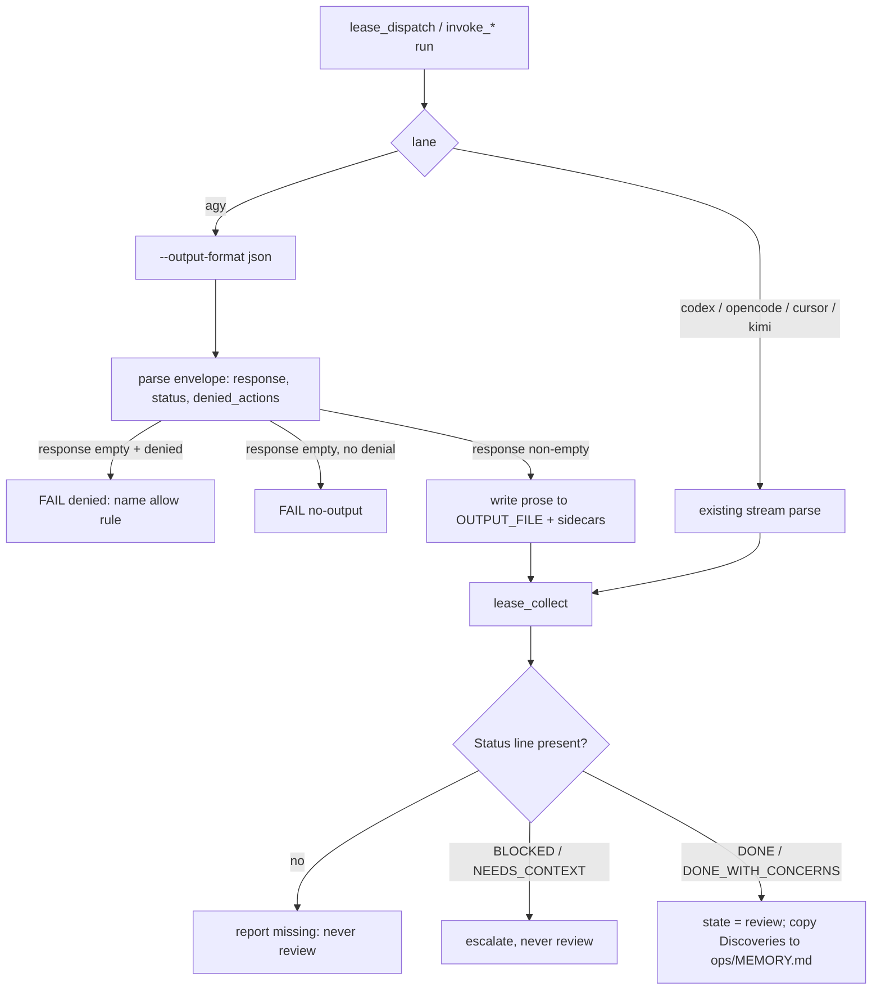
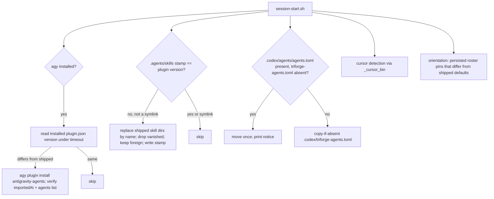
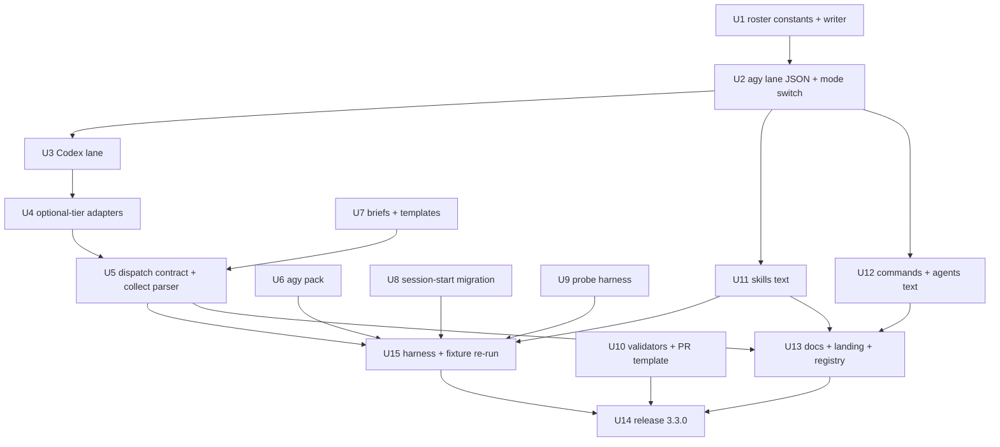

# Watch-Cycle Adoption v3.3.0 - Plan

---

## Goal Capsule

- **Objective:** A user who installs Agent Triforge v3.3.0 gets builds, reviews, tests, analysis, and research run on the current-generation model of every one of the six CLIs, with Triforge's skills reachable from each CLI in that CLI's own invocation form, and with every headless run reporting a completion signal the lead can trust instead of a bare exit code, and with the shipped skills, commands, and agent definitions carrying the Tier-1 process patterns the four mined repositories converged on (a counterfactual bar for compounding, a typed builder report, non-delegation contracts, verification evidence tables, portable skill frontmatter, and validators).
- **Means:** apply the 2026-09-11 watch-cycle ADR (`ops/decisions/2026-09-11-cli-deprecation-watch.md`, D-020..D-036) and the Tier-1 repo-mining adoptions (`ops/research/2026-09-11-repo-mining.md` §2) as one sprint, shipping as plugin 3.3.0 (KTD14).
- **Authority:** this plan → the ADR and the two research reports it cites → `.claude/CLAUDE.md` (the repo's own protocol) → the six CLIs' primary docs as cited in `ops/research/2026-09-11-cli-updates.md` §6. Where a probe row and a doc disagree, the probe row wins (KTD1, KTD3).
- **Execution profile:** autonomous; the lead rules and ledgers non-catastrophic conflicts (KD4); the only hard stops are destructive or irreversible actions and any push. Protected paths (`scripts/invoke-external.sh`, `scripts/probe-capabilities.sh`, `hooks/handlers/*`, `.claude/settings*.json`) are lead-reviewed (R17).
- **Stop conditions:** a settled decision proves infeasible with evidence (report it, do not silently change course); a probe re-run shows a shipped default cannot round-trip live; `claude plugin validate --strict .` or the ladder byte-identity check fails at the release gate.
- **Tail ownership:** the calling pipeline (LFG) owns simplification, review, commit, and PR; this plan owns the work and its evidence.

---

## Product Contract

### Summary

Move every shipped model pin to the September 2026 generation, migrate the Antigravity agent pack and the Kimi/Cursor/OpenCode adapters to what their CLIs now accept, make every headless lane return a parsed completion signal, fix the probe harness where it lagged the CLIs, adopt the Tier-1 process patterns as skill/command/agent text plus two validators, and ship as v3.3.0 with the release gate green and the cross-harness evidence recorded.

### Problem Frame

The September watch cycle found live drift on every lane. All six shipped model pins are one generation stale (`gpt-5.6-sol`, `Gemini 3.1 Pro (High)`, `grok-4.5`, `glm-5.2`, `kimi-k3`, "Fable 5 → Opus 4.8"). Three CLIs changed mechanics under Triforge's feet: Kimi grew `--agent-file` and stopped reading the project config Triforge ships; Codex removed `--full-auto`, gated project files on trust, and now sweeps `.codex/agents/*.toml` as role files so Triforge's own file triggers a startup warning; agy's headless mode now expands skills, fires project-tier hooks (the July FAIL was a probe-shape error), returns a JSON envelope whose `status` stays `SUCCESS` when a tool was denied, and rejects `--effort` on suffixed model names. Cursor rejects the documented bracket-effort form and carries effort in its model ids. The four `antigravity-agents/agents/*.md` still use Gemini-CLI tool names agy does not have. The `.agents/skills/` copy is copy-once, so plugin updates strand five CLIs on stale skills. The probe harness hard-codes the July record path and title, and the fresh September record is untracked. Separately, the four mined repositories converged on process patterns Triforge lacks: a counterfactual bar for compounding, a typed builder report, non-delegation contracts, evidence tables for verification, portable skill frontmatter, and validators.

### Key Decisions

- KD1. **Antigravity default pin is `Gemini 3.8 Flash (High)`** (session-settled: user-directed — chosen over keeping `Gemini 3.1 Pro (High)` under the never-Flash rule: the user named 3.8 Flash as the latest, no newer Pro exists, and 3.1 Pro stays a one-line opt-in). Governs R2.
- KD2. **Codex pin is `gpt-6-astra` at `model_reasoning_effort = "xhigh"`** (session-settled: user-directed — chosen over staying on `gpt-5.6-sol`: Astra is the flagship and bundled default since 0.153.4 and answered READY at xhigh on 0.154.0). Governs R3.
- KD3. **The Claude ladder is Fable 5.1 → Opus 5 → Sonnet 5** (session-settled: user-directed — chosen over keeping the "Fable 5 → Opus 4.8" wording: the `fable` and `opus` aliases already resolve to 5.1 and Opus 5 on ≥ 2.1.257 / 2.1.219). Governs R4.
- KD4. **The sprint runs autonomously with rulings ledgered** (session-settled: user-directed — chosen over pausing for approval per change: no user is available; hard stops are destructive actions and pushes). Governs R17.
- KD5. **Skills and commands are verified reachable in all six harnesses in each CLI's own invocation form, with evidence recorded** (session-settled: user-directed — chosen over a docs-only assertion: the user asked for a test). Governs R9.

### Requirements

**Model pins (all lanes)**
- R1. Every shipped model default names the current generation: `gpt-6-astra`, `Gemini 3.8 Flash (High)`, `openrouter/z-ai/glm-5.3`, `kimi-code/k3`, `cursor-grok-4.6-xhigh`, and the Fable 5.1 / Opus 5 / Sonnet 5 ladder, at every mirrored site (KTD6 lists the eleven agy sites and the five mirrored constant blocks).
- R2. `Gemini 3.8 Flash (High)` is the agy default, live-verified to round-trip headless; `Gemini 3.1 Pro (High)` stays the documented roster opt-in; effort continues to ride in the `(Low|Medium|High)` suffix (KTD1).
- R3. Codex runs `gpt-6-astra` at `xhigh` on every lane — `invoke_codex` replays `model_reasoning_effort` and `dispatch_role` passes the roster effort — so the new pin is not a documentation-only change.
- R4. The four byte-identical ladder sites and the three prose variants read Fable 5.1 → Opus 5 → Sonnet 5; the Claude Code floor becomes ≥ 2.1.267 (the build that first honors `effort:` frontmatter on pinned-default models).
- R5. Cursor's shipped default is `cursor-grok-4.6-xhigh`; a bare Grok family name plus roster effort composes the suffixed id at dispatch; the binary resolves `cursor-agent` first and `agent` only when its version string matches Cursor's format.
- R6. Kimi's shipped default is `kimi-code/k3`; the builder and reviewer briefs load through `--agent-file` with `${base_prompt}`, `${skills}`, `${agents_md}` embedded, an explicit empty `subagents` allowlist, and a `tools` allowlist that makes the reviewer read-only; `--skills-dir` is no longer passed.
- R7. OpenCode's shipped default is `openrouter/z-ai/glm-5.3`; dispatch injects deny rules through `OPENCODE_PERMISSION`; the adapter stays off `--auto`.

**Harnesses and discovery**
- R8. The four Antigravity agent definitions use the agy 1.1.6+ Markdown-agent frontmatter with agy tool names; `agy agents` lists all four; `invoke_antigravity` keeps its injection fallback behind a `TRIFORGE_AGY_MODE` switch (KTD10).
- R9. All twelve shipped skills are discoverable in Claude Code (plugin path), agy, Codex, OpenCode, Cursor (`.agents/skills/`), and Kimi (documented; live pending login), each verified in that CLI's own invocation form and recorded in the probe record; the `.agents/skills/` copy refreshes on plugin version change without touching user-added skills; shipped-name directories are Triforge-owned and overwritten (KTD7).
- R10. Every dispatched builder receives the same contract block — no sub-dispatch, git stays local, a typed final report — and `lease_collect` parses the `Status:` line; a clean exit with no report is "report missing", never review-ready; agy runs additionally surface JSON `status` and `denied_actions` (KTD2, KTD11).
- R11. Codex: the deployed agent file is `.codex/triforge-agents.toml`, the schema resolves at the plugin tier, `include_plan_tool` is replaced by `tools.update_plan.enabled`, the `[agents]` subagent-default keys are recorded as Triforge-internal declarations (Codex never reads the file; replaying them is deferred), `--full-auto` is documented as removed, and `/setup` reports the project's trust state without writing it.
- R12. The probe harness writes a date-stamped record whose title derives from its filename, all stale rows from D-028 are rewritten, the new rows from the verification matrix exist, and "the current probe record" resolves to the newest file everywhere the rule is cited (KTD9); the September record is committed with the sprint.

**Process adoptions (Tier 1)**
- R13. Skills adopt: portable frontmatter with vendor fields under `metadata` and "Use when" descriptions (AS-2, C10); anti-rationalization tables in the discipline skills (C2); the verification rewrite with gate function and evidence table (S10/C9); `writing-good-tests.md` and the characterization guard (S11/S12); the counterfactual compounding bar (CE-1); rulings-not-stalls (S1); `Accept:`/`Fails when:`/`Precondition:`/`Reversibility:` task fields (G6/C8/G11); the incomplete-plan guard (AS-6); STATE frontmatter with `verification_baseline` (AS-8/C14); the review-dispositions ledger and no pre-judging (G13, S7).
- R14. Commands and agents adopt: reviewer trust rules (S6), ceremony classification (S16), the gated `learnings-researcher` in `/review` (C4), outbound-endpoint hygiene in research lanes (AS-9), the rulings and discoveries export at `/wrap` (S1, S14), Codex spawn hygiene notes (S18), plan-checker checks for the new task fields (G6/G11), and `ON_CRASH` declarations on the four hook handlers (G7).
- R15. Two validators exist and gate the release: `scripts/validate-skills.sh` (AS-3/C1) and `scripts/validate-versions.sh` (AS-4/AS-5, ladder md5, scoped stale-pin sweep, surface counts); a PR template exists (S20).
- R16. Docs, the compatibility table, the registry, `ops/STATE.md`, and the landing page describe the shipped state; the plugin is 3.3.0 with a "What's new" entry; the cross-CLI model-pin migration is captured as an `ops/solutions/` learning; the lead's Gemini and Codex memory rules are updated in lockstep (D-022).

**Constraints**
- R17. Protected-path diffs are lead-reviewed; `ops/research/` and `ops/decisions/` are never edited except to append pointers; every stale-pin grep excludes `ops/research/`, `ops/decisions/`, and `docs/plans/` (KTD12).
- R18. No user-tier setting is written by the sprint (Codex trust entry, agy `read_url(*)` allow rule, `kimi login`); Kimi live rows are recorded `PENDING-AUTH` with the exact command.

### Success Criteria

- The fresh probe record shows PASS for AGY-05 on `Gemini 3.8 Flash (High)`, CDX-03 on `gpt-6-astra` at xhigh, CUR-05 on `cursor-grok-4.6-xhigh`, OC-04 on `glm-5.3`, AGY-08 with the documented hook shape, AGY-12 native listing, and the new skill-expansion rows for agy, Codex, OpenCode, and Cursor.
- `bash scripts/validate-skills.sh` and `bash scripts/validate-versions.sh` exit 0 on the tree; `claude plugin validate --strict .` passes; the ladder md5 is identical across the four files and recorded in the release notes.
- A v3.2.0-bootstrapped project, on its first v3.3.0 session start, ends with refreshed `.agents/skills/`, the agy pack reinstalled at 3.3.0, and `.codex/triforge-agents.toml` in place with no "malformed agent role" warning on the next `codex exec`.

### Scope Boundaries

- In scope: everything in R1–R18.
- Not in scope: the Mythos tier, OpenCode V2, `codex exec --worktree`, Compound Packs, a bake-off command, the wave-contract design contrast (all DEFER in the mining report).

#### Deferred to Follow-Up Work

- Tier-2 repo-mining adoptions: floor guard on `lease_merge` (AS-7), corpus-first retrieval frontmatter (CE-2), `compound-refresh` (CE-3/C5), wave-orchestration kernel split under 8 KB (CE-4), skill-eval cell (CE-5), model receipts (CE-7), preflight conflict table (S2), `Spec:`/constraints blocks and `brainstorm` (S3/C3), task batching (S4), scoped re-reviews (S8), review packages with `base_sha` (S9), reclaim snapshot (S15), SessionStart JSON bootstrap (S19), capability axes (G1/G5), isolation guard hook (G2), scope conformance at merge (G3), crash-window reconciliation (G4), reviewer provenance (G8), verification fingerprint (G10), `state.json` (G12), rate-limit requeue (G14), grounding validation (C6), async-job manifest (C7), write-time dedup (C12), ledger completion lines (C16/C18).
- Agent-hint routing on the Claude lane (G9) and replaying the Codex `[agents]` caps and `tools` list as live `-c` overrides (this sprint rewords the security-model claim instead — KTD5).
- A mechanical no-push backstop in lease worktrees (a worktree-scoped unresolvable push URL); this sprint ships the prompt-level rule only (ledger note: the September review re-raised this as P1; it touches lease lifecycle logic and stays deferred by the settled-brief rule).
- Replaying `agents.default_subagent_model` / `agents.default_subagent_reasoning_effort` as live `-c` overrides (this sprint records them as declarations; a probe row must first show they are real Codex keys).
- Flipping `TRIFORGE_AGY_MODE` to `auto` by default once AGY-12 has passed for a full cycle (KTD10).
- Regenerating `docs/images/roster.svg` (Excalidraw export); the README note re-defers it with the new labels named.
- Kimi live verification (`kimi login` is a user action).

### Acceptance Examples

- AE1. **Covers R2.** Given a fresh user project, when the analyst role dispatches with no roster override, then the agy command carries `--model "Gemini 3.8 Flash (High)"` and the probe row AGY-05 for that pin reads PASS.
- AE2. **Covers R10, KTD2.** Given an agy headless run whose only tool call was a denied `read_url`, when the helper parses the envelope, then the captured output file is empty, the sidecar names `read_url`, the helper returns a deterministic failure naming the user-tier allow rule, and nothing is promoted into `ops/REVIEW_ANTIGRAVITY.md`.
- AE3. **Covers R5.** Given a roster row `cli = "cursor"`, `model = "grok-4.6"`, `effort = "max"`, when the lease dispatches, then the command carries `--model cursor-grok-4.6-xhigh` and the ledger records `builder_model = grok-4.6`, `builder_effort = max`, `dispatched_model = cursor-grok-4.6-xhigh`.
- AE4. **Covers R11.** Given a project bootstrapped by v3.2.0 with `.codex/agents/agents.toml` present, when the first v3.3.0 session starts, then the file is moved once to `.codex/triforge-agents.toml`, a single notice is printed, and the next `codex exec` emits no "Ignoring malformed agent role definition" line.
- AE5. **Covers R9, KTD7.** Given `.agents/skills/` containing the twelve shipped skills plus a user-added `my-skill/`, when the plugin version changes and a session starts, then the twelve are replaced, `my-skill/` is untouched, and `.agents/skills/.triforge-plugin-version` reads 3.3.0.
- AE6. **Covers R6.** Given the Kimi reviewer brief loaded through `--agent-file`, when the agent attempts a file write, then the CLI refuses it before execution (probe KIMI-08, PENDING-AUTH until login).
- AE7. **Covers R17, KTD12.** Given the release-gate stale-pin sweep, when it runs over the tree, then it reports zero hits outside `ops/research/`, `ops/decisions/`, `docs/plans/`, `ops/solutions/`, and `docs/images/`, and those five directories are excluded rather than edited.

### Sources

- ADR of record: `ops/decisions/2026-09-11-cli-deprecation-watch.md` (D-020..D-036; D-025 corrected 2026-09-11 for the suffix finding).
- CLI gap analysis and fixture matrix: `ops/research/2026-09-11-cli-updates.md` (§3.1, §3.2, §4).
- Mining recommendations: `ops/research/2026-09-11-repo-mining.md` (§2 Tier 1 / Tier 2).
- Probe record: `ops/research/2026-09-probe-record.md` (untracked until U14 commits it).
- Prior cycle: `ops/decisions/2026-07-18-cli-deprecation-watch.md`, `ops/decisions/2026-07-18-codex-hooks-under-exec.md`, `ops/research/2026-07-22-gemini-3.6-flash.md`.
- Learnings applied: `ops/solutions/2026-03-26-grep-posix-portability.md`, `ops/solutions/2026-03-31-hooks-stdin-json-parsing.md`, `ops/solutions/2026-03-26-settings-json-required-for-hooks.md`, `ops/solutions/2026-04-01-plugin-conversion.md`, `docs/residual-review-findings/feat-setup-role-customization.md` (residuals 2, 3, 6), `ops/research/2026-07-18-verification-evidence.md` (ladder md5 baseline `25fe366c34aa3bb7af9fee57323a444f`).
- Lead live probes 2026-09-11 (recorded in the ADR and in U9's harness rows): `Gemini 3.8 Flash (High)` READY; `--effort` rejected with display names, accepted with bare slug `gemini-3.8-flash`; agy `.agents/hooks.json` named-hook shape fires all five events; agy JSON envelope carries `denied_actions` with `status: SUCCESS` and empty `response`; Cursor bracket forms rejected, `cursor-grok-4.6-xhigh` and bare `grok-4.6` READY; `gpt-6-astra` READY at xhigh.

---

## Planning Contract

### Key Technical Decisions

- KTD1. **agy effort stays in the model-name suffix; the `--effort` flag is documented, not adopted.** Live probe: `--effort` is rejected for any display name or suffixed slug and accepted only for a bare slug family (`gemini-3.8-flash --effort low`). The roster contract already carries display names, so switching would change every user roster for no capability gain. AGY-11 gains live rows for both facts. (Backs R2.)
- KTD2. **`invoke_antigravity` runs `--output-format json`, parses the envelope back into prose, and treats an empty `response` as failure.** Stdout goes to `${OUTPUT_FILE}.raw` and stderr to `${OUTPUT_FILE}.err`; a `python3` env-var heredoc (the `invoke_kimi:883` shape) writes `response` text to `OUTPUT_FILE`, keeps the raw stream on parse failure, and writes `status` and `denied_actions` to `${OUTPUT_FILE}.status` and `${OUTPUT_FILE}.denied` sidecars because background call sites cannot read a shell variable. Empty `response` → deterministic failure with reason `denied` naming `permissions.allow: ["read_url(*)"]` in `~/.gemini/antigravity-cli/settings.json` (or `no-output` when no denial). Non-empty `response` with denials → rc 0; the promoted `ops/` file gets an HTML-comment header listing them. Write denials against `ops/` are never fatal. `lease_dispatch`'s agy case adopts the same flag and `lease_collect` treats an empty `response` as failure. (Backs R10; resolves flow gap G1.)
- KTD3. **Cursor effort is a model-id suffix composed at dispatch; one `_cursor_bin` resolver feeds every site.** Mapping: low→`-low`, medium→`-medium`, high→`-high`, xhigh and max→`-xhigh`; an explicit suffixed roster id passes through and effort is recorded "in model id"; an unknown effort falls back to the bare id with a warning, never a fabricated suffix. `_cursor_bin` walks `cursor-agent` then every `agent` on PATH, keeps the first whose `--version` (under the 15 s wrapper) matches `^[0-9]{4}\.[0-9]{2}\.[0-9]{2}-[0-9a-f]+$`, caches per session, and exports `TRIFORGE_CURSOR_BIN` for `resolve_role`'s Python map. The ledger keeps `builder_model` and `builder_effort` as roster values and adds `dispatched_model`. (Backs R5; supersedes the bracket wording in the cli-updates report §4 #6 — the ADR D-025 text is the decision of record.)
- KTD4. **Kimi briefs become agent definitions that extend, not replace, Kimi's prompt.** Both files embed `${base_prompt}`, `${skills}`, `${agents_md}` at a fixed position, declare `subagents: []`, and the reviewer declares a read-only `tools` allowlist; `--agent-file` stays on both attempts (it carries the reviewer's read-only allowlist and the contract — dropping it on retry would re-run the reviewer with Kimi's full toolset); an agent-file load or parse error is classified deterministic (no retry, message names the file) with `-p` last; the absolute plugin path is composed by the outer shell so it crosses `env -i`. Semantics are static-verified this sprint and live-verified after `kimi login`. (Backs R6.)
- KTD5. **Codex: deployed file renamed, schema plugin-tier only, effort replayed, caps reworded.** `.codex/triforge-agents.toml` is the deployed name; `invoke_codex` looks there first, then the plugin file; the output-schema lookup drops the `.codex/agents/` sibling branch (nothing ever bootstrapped the schema there) and resolves at the plugin tier; `invoke_codex` emits `-c model_reasoning_effort="<effort>"` from `agents.toml` and `dispatch_role` passes `CODEX_EFFORT`; `include_plan_tool` becomes `tools.update_plan.enabled = false`; `[agents]` gains `default_subagent_model`/`default_subagent_reasoning_effort` as Triforge-internal declarations (nothing replays them — the deferred `-c` override item covers that); `.claude/CLAUDE.md`'s security-model text is corrected to say the per-agent `tools` list and caps are Triforge-internal declarations carried in the developer instructions while `sandbox_mode` + `approval_policy` are the enforced isolation. Session start moves a pre-existing `.codex/agents/agents.toml` to the new name once. (Backs R11; resolves flow gaps G2, G4a.)
- KTD6. **The roster writer normalizes agy and Cursor effort three ways, and the pin sweep is one atomic unit.** `roster_write_role` gains a three-state `want` map (low→Low, medium→Medium, high/xhigh/max→High) with a per-family variant table (3.1 Pro has no Medium → medium collapses to Low with the existing NOTE), an auto-fill of `Gemini 3.8 Flash (<want>)`, and a symmetric Cursor branch that composes `cursor-grok-4.6-<suffix>`; the `(Medium)` pass-through documented in the July note becomes a documented behavior change. The eleven agy-pin sites in `scripts/invoke-external.sh` (`:65`, `:76`, `:1627`, `:1628`, `:1640`, `:2321`, `:3169`, `:3205`, `:3206`, `:3210`, `:3367`) and the five mirrored constant blocks (`resolve_role` DEFAULTS, `BINARY`, `CLI_DEFAULT_MODEL`, `_roster_binary`, `roster_member_default`, `roster_role_entry` copies, `templates/ops/roster.toml`) change in one unit, closed by the DEFAULTS-drift check in `scripts/validate-versions.sh` that residual 3 asked for. (Backs R1, R2, R5.)
- KTD7. **`.agents/skills/` refresh replaces shipped skills by name under a version stamp.** Session start skips a symlinked `.agents/skills`, copies each shipped skill directory over its same-named destination (`cp -R src/. dest/` per skill, never `cp -R src dest`), removes shipped names recorded in the previous stamp that no longer ship — but only names matching `^[a-z0-9][a-z0-9-]*$` whose `.agents/skills/<name>` is a non-symlink directory directly inside `.agents/skills/` (resolved path); any other stamp entry or per-skill symlink is skipped with one notice, and the same check guards every overwrite — leaves foreign directories alone, writes the stamp LAST (only after every copy succeeded, so an interrupted refresh re-runs next session), and writes `.agents/skills/.triforge-plugin-version` carrying the plugin version and the shipped name list. `_lease_provision_skills` keeps its fresh per-worktree copy (already current by construction) and is documented as such. (Backs R9.)
- KTD8. **agy pack reinstall is install-over, triggered by a version compare.** `agy plugin list` carries no version, so session start reads `~/.gemini/config/plugins/agent-triforge/plugin.json` (falling back to a `.claude/agy-pack-version.local.md` stamp when unreadable) under a 30 s timeout and re-runs `agy plugin install <plugin-root>/antigravity-agents` when it differs from the shipped version (1.1.28 replaces the managed directory exactly); acceptance is `importedAt` advancing and `agy agents` listing the four names. Every agy call in the hook is timeout-wrapped. (Backs R8.)
- KTD9. **"The current probe record" is the newest `ops/research/*-probe-record.md`.** The harness defaults `RECORD` to `ops/research/<YYYY-MM>-probe-record.md` and derives the title from the basename; a `latest_probe_record` helper in `scripts/invoke-external.sh` globs the newest file; the nine fixed-filename pointers cite the helper or the phrase "the newest record"; the static AGY-12/13 prose in the record block is replaced by row evidence; `.claude/commands/cli-watch.md`'s freshness check uses the helper. (Backs R12; resolves flow gap G5.)
- KTD10. **`TRIFORGE_AGY_MODE` defaults to `injection` this release.** Values `injection | native | auto`; `auto` selects native when `agy agents` lists the requested name (today's behavior); the resolved `mode=` is written into the promoted `ops/REVIEW_ANTIGRAVITY.md` / `ops/RESEARCH_ANTIGRAVITY.md` header so a behavior change is attributable. The default flips to `auto` in a follow-up only after AGY-12 (liveness) AND AGY-16 (the native-mode negative: an `auto` agent instructed to `rm -rf` a sentinel and `git push` executes neither) have passed for a full cycle, because native mode drops the injected body and a mistyped tool name can hang a reviewer. (Backs R8.)
- KTD11. **One dispatch contract and one completion signal for every lane, claude included.** `lease_dispatch` resolves the lane's builder brief before the `env -i` boundary and prepends the contract block (no sub-dispatch; never `git push/pull/fetch`; final report `Status: DONE | DONE_WITH_CONCERNS | BLOCKED | NEEDS_CONTEXT`, commits, one-line test summary, concerns, "Discoveries for later tasks (or None)"); `lease_collect` parses the Status line into a `report_status` ledger field, returns a distinct "report missing" outcome for a clean exit without one, and never routes BLOCKED or NEEDS_CONTEXT to review; discoveries are copied into `ops/MEMORY.md` by the lead. Prompt wording stays CLI-neutral ("invoke the X skill"). (Backs R10.)
- KTD12. **Stale-pin sweeps are scoped to shipped surfaces.** Every grep excludes `ops/research/`, `ops/decisions/`, `docs/plans/`, `ops/solutions/` (the migration learning names the superseded pins by design), and `docs/images/` (`roster.svg` regeneration is deferred; the README note names its stale labels); the archival never-Flash lines and the July plan's AE2 stay as history, and this plan records AE2 as superseded by D-022. (Backs R17.)
- KTD13. **Agent definitions are never deployed into `.agents/agents/`.** agy and Kimi both scan it with incompatible tool vocabularies; agy stays on plugin install and Kimi on `--agent-file` into the plugin's own `kimi-agents/`. Recorded beside the discovery matrix in `.claude/CLAUDE.md`. (Backs R8, R9.)
- KTD14. **Protected-path units serialize on `scripts/invoke-external.sh`.** U1 lands alone, then U2, U3, U4, U5 in sequence (the file is 182 KB and the edits sit in disjoint ranges, but concurrent lease branches would conflict); U6–U10 run in parallel from the start; U11–U12 after U2; U13 after U1–U10; U14 last; U15 re-runs the harness and the fixture after U5, U6, U8, U9, and U11. All protected-path units are cross-reviewed by the lead (never external-CLI-only).
- KTD15. **Verification is evidence, not a test framework (KTD-12 of the July plan still binds).** Every unit's verification names a probe row, a grep, a smoke run, or `claude plugin validate --strict .`; the two new validators are the repo's first automated checks and are limited to structural assertions.

### High-Level Technical Design

The sprint changes three flows that prose does not carry well: the headless completion signal, the session-start migration, and unit sequencing.

**Headless completion signal (KTD2, KTD11):**

**First session start after upgrading to 3.3.0 (KTD5, KTD7, KTD8):**

**Unit dependency graph (KTD14):**

### Assumptions

- `agy plugin install` over an installed path replaces the managed directory (1.1.28 release note); U8 verifies by `importedAt` and the agents listing and falls back to uninstall-then-install if the listing stays empty.
- A parent-directory `[projects."/Users/…"]` trust entry in `~/.codex/config.toml` may or may not cover subdirectories; U3's `/setup` detection reports the exact-path entry only and states the parent question as unverified.
- Kimi's empty `subagents: []` allowlist parses as "no delegation"; unverifiable until login, so U7 also states the rule in prose.
- The `.agents/` directory is gitignored in this repo only; user projects receive no `.gitignore`, so the stamp file may be committed — U8 documents that it is safe to commit and idempotent.
- The July plan's AE2 ("never the Flash default") is superseded by D-022; any reviewer working from that plan should read this one.
- `docs/images/roster.svg` stays as is; the README note is updated to name the stale labels.

### Sequencing

Phase A (control plane, serialized): U1 → U2 → U3 → U4 → U5. Phase B (parallel from the start): U6, U7, U8, U9, U10. Phase C (after U2): U11, U12. Phase D: U13 (after A, B, C), U15 (after Phase A, U6, U8, U9, U11), U14 (last). The lead is the pinned reviewer for U1–U5, U8, U9; external CLIs may review U6, U7, U10–U14.

### System-Wide Impact

- Every user project's next session start performs a migration (skills refresh, agy reinstall, Codex file move); each step is timeout-wrapped and copy-safe, and each prints one notice.
- `/analyze`, `/review`, `/deep-research` behavior changes the day the agy pack reinstalls only if `TRIFORGE_AGY_MODE` is set to `auto` or `native`; the default keeps injection.
- Provider data egress is unchanged; the sprint writes no user-tier settings.
- Users whose rosters persisted `kimi-k3`, `grok-4.5`, or `glm-5.2` at enrollment keep working (drift only, except `kimi-k3` on OAuth hosts, which was already broken); session start prints one informational drift line per differing pin.

### Risks

- **agy native flip hangs a reviewer on a mistyped tool name** — mitigated by KTD10's injection default and the AGY-13 negative row.
- **Fixture evidence was gathered with the user's full environment at a fixture root; production lanes run under `env -i` from a TMPDIR worktree** — U15 adds SELF-06 (lease-lane discovery per CLI from a worktree) so discovery is shown where it runs.
- **The `(Medium)` normalization is a documented behavior change** — U1 states it in the function header and the roster template.
- **Optional-tier lanes cannot be proven live without keys** — Kimi rows are PENDING-AUTH with exact commands; OpenCode and Cursor are live on this host.
- **A partial edit of the mirrored constant blocks leaves `/setup` and dispatch disagreeing** — U1 is atomic and `validate-versions.sh` diffs the blocks.

---

## Implementation Units

| U-ID | Title | Key files | Depends on |
|---|---|---|---|
| U1 | Roster constants, roster writer, latest-record helper, manifest bumps | `scripts/invoke-external.sh`, `templates/ops/roster.toml`, `.claude-plugin/plugin.json`, `antigravity-agents/plugin.json` | — |
| U2 | Antigravity lane: JSON envelope, denied actions, mode switch | `scripts/invoke-external.sh`, `commands/review.md`, `commands/deep-research.md`, `commands/plan.md`, `commands/ship.md`, `commands/coordinate.md`, `commands/build.md` | U1 |
| U3 | Codex lane: Astra + effort replay, TOML rename, trust reporting | `scripts/invoke-external.sh`, `codex-agents/agents.toml`, `codex-agents/AGENTS.md`, `templates/.codex/*`, `commands/setup.md` | U2 |
| U4 | Optional-tier adapters: Kimi agent-file, Cursor resolver + suffix, OpenCode glm-5.3 + permission env | `scripts/invoke-external.sh` | U3 |
| U5 | Dispatch contract, report parsing, adapter env scrub | `scripts/invoke-external.sh` | U4, U7 |
| U6 | Antigravity agent pack migration | `antigravity-agents/*` | — |
| U7 | Kimi / Cursor / OpenCode briefs and templates | `kimi-agents/*`, `cursor-agents/*`, `opencode-agents/*`, `templates/.kimi-code/*`, `templates/.cursor/*`, `templates/.opencode/*` | — |
| U8 | Session-start migration and hook hygiene | `hooks/handlers/session-start.sh`, `hooks/handlers/*.sh` | — |
| U9 | Probe harness fixes and new rows | `scripts/probe-capabilities.sh` | — |
| U10 | Validators and PR template | `scripts/validate-skills.sh`, `scripts/validate-versions.sh`, `.github/PULL_REQUEST_TEMPLATE.md` | — |
| U11 | Skills text adoptions | `skills/*/SKILL.md`, `skills/test-driven-development/writing-good-tests.md` | U2 |
| U12 | Commands and agents text adoptions | `commands/*.md`, `agents/*.md` | U2, U3 |
| U13 | Docs, landing page, registry, state, settings | `.claude/CLAUDE.md`, `templates/CLAUDE.md`, `README.md`, `docs/agent-triforge.md`, `docs/index.html`, `ops/watch-registry.toml`, `ops/STATE.md`, `settings.json`, `.claude/commands/cli-watch.md`, `.claude/skills/watch-cycle/SKILL.md` | U1–U12 |
| U14 | Release 3.3.0, learning capture, memory rules, record commit | `.claude-plugin/plugin.json`, `README.md`, `docs/index.html`, `ops/solutions/`, `ops/research/2026-09-probe-record.md` | U13, U15 |
| U15 | Harness and fixture re-run (evidence) | `ops/research/2026-09-probe-record.md` | U5, U6, U8, U9, U11 |

### U1. Roster constants, roster writer, latest-record helper

- **Goal:** move every shipped default in the resolver and roster template to the new generation in one atomic edit, make the roster writer normalize agy and Cursor effort correctly, and add the newest-record helper.
- **Requirements:** R1, R2, R5, R12 (KD1, KD2 via KTD6; KTD1, KTD9).
- **Dependencies:** none (lands first and alone on `scripts/invoke-external.sh`).
- **Files:** `.claude-plugin/plugin.json` and `antigravity-agents/plugin.json` (both to 3.3.0, so every version-bearing row U15 records — the skills stamp, the pack reinstall, the manifest lockstep — measures the shipped version), `scripts/invoke-external.sh` (resolve_role DEFAULTS, BINARY map, CLI_DEFAULT_MODEL, `_roster_binary`, `roster_member_default`, `roster_role_entry` copies, `roster_write_role` normalizer and header comments, `invoke_antigravity` default and its comment, the KTD-8 comments near the constant blocks, new `latest_probe_record`), `templates/ops/roster.toml`.
- **Approach:**
  1. Replace the mirrored constants per KTD6: reviewer/tester `gpt-6-astra`; analyst/documenter `Gemini 3.8 Flash (High)`; CLI defaults opencode `openrouter/z-ai/glm-5.3`, kimi `kimi-code/k3`, cursor `cursor-grok-4.6-xhigh`; the Python `BINARY` map reads `TRIFORGE_CURSOR_BIN` when set (KTD3, wired in U4).
  2. Rewrite the `roster_write_role` normalizer: three-state `want`, per-family variant table, auto-fill string, symmetric Cursor branch, and the header comment stating the `(Medium)` behavior change and the new "newest Gemini at its highest thinking level" policy.
  3. Rewrite the roster template header: Pro becomes the opt-in example, the Cursor "effort inert" sentence reverses, the member examples carry the new ids.
  5. Bump both manifests to 3.3.0 in lockstep (the narrative release surfaces stay in U14).
  4. Add `latest_probe_record` (glob the newest `ops/research/*-probe-record.md`, print its path, rc 1 when none).
- **Patterns to follow:** the "keep in sync" comments at the three constant blocks are the literal checklist; `python3 -c` with prefixed env vars, no `jq`; probe-ID citations in comments (`AGY-05`, `CUR-05`, `CUR-10`).
- **Test scenarios:**
  - `resolve_role <role>` for all five roles prints the new defaults and matches `roster_role_entry <role>` column for column.
  - `roster_write_role analyst antigravity "" medium` writes `Gemini 3.8 Flash (Medium)`; the same with `"Gemini 3.1 Pro (High)"` and `medium` writes `(Low)` with the existing NOTE.
  - `roster_write_role builder cursor "grok-4.6" max` writes `cursor-grok-4.6-xhigh`; an explicit `cursor-grok-4.6-low` with `effort = "high"` is normalized to `-high` with a NOTE.
  - A malformed roster still returns rc 4; an absent file appends; a derived fallback chain still terminates at a core member (SELF-01 unchanged).
  - `latest_probe_record` prints the 2026-09 file while the July file also exists.
- **Verification:** the scratch-directory functional exercise from residual 2 re-run and its output kept as the unit's evidence; `bash -n scripts/invoke-external.sh`; `python3 -c "import tomllib; tomllib.load(open('templates/ops/roster.toml','rb'))"`; SELF-01/SELF-02 still PASS in U15.

### U2. Antigravity lane: JSON envelope, denied actions, mode switch

- **Goal:** make agy headless runs report a trustworthy completion signal and keep the downstream promotion contract intact.
- **Requirements:** R8, R10 (KTD2, KTD10).
- **Dependencies:** U1.
- **Files:** `scripts/invoke-external.sh` (`invoke_antigravity`, `lease_dispatch` agy case, `lease_collect`, `_agy_agents_listing`), `commands/review.md`, `commands/deep-research.md`, `commands/plan.md`, `commands/ship.md`, `commands/coordinate.md`, `commands/build.md` (promotion guards only).
- **Approach:**
  1. `invoke_antigravity`: add `--output-format json`, split stdout/stderr captures, parse per KTD2, write prose to `OUTPUT_FILE` and the two sidecars, classify empty `response` as a deterministic failure with the allow-rule message, and add the `TRIFORGE_AGY_MODE` switch with `injection` default and the `mode=` line in the stderr summary.
  2. Promotion guards in the six commands: promote only when `OUTPUT_FILE` is non-empty prose and the `.status` sidecar is `SUCCESS`; prepend an HTML-comment header carrying `mode=` and any denied actions; strip the `jetski:` stderr line from promoted text.
  3. `lease_dispatch` agy case adds the same flag and sidecars; `lease_collect` treats an empty `response` as failure (the Status-line parser itself lands in U5).
- **Patterns to follow:** `invoke_kimi` RAW/ERR split and `python3` extraction (`scripts/invoke-external.sh:883`); `${OUT}.rc`/`${OUT}.class` sidecars in the lease lane; the "so nothing looks like no findings" rule.
- **Test scenarios:**
  - A run that returns `{"status":"SUCCESS","response":"READY"}` yields `OUTPUT_FILE` containing `READY`, `.status` = `SUCCESS`, empty `.denied`, rc 0.
  - A run that returns empty `response` with `denied_actions: [read_url]` yields empty `OUTPUT_FILE`, `.denied` naming `read_url`, rc non-zero, and the stderr message naming `permissions.allow: ["read_url(*)"]`.
  - A run whose stdout is not JSON keeps the raw text in `OUTPUT_FILE` and sets `.status` to `PARSE-FAIL`.
  - `/review`'s promotion block skips an empty `OUTPUT_FILE` and never writes `ops/REVIEW_ANTIGRAVITY.md` from it.
  - `TRIFORGE_AGY_MODE=native` with the pack installed selects `--agent`; unset selects injection even when `agy agents` lists the name.
- **Verification:** probe rows AGY-15 (denied envelope) and AGY-04 (clean envelope) in U15; a manual `/deep-research` dry run on this host (which has no `read_url` allow rule) ends with the deterministic failure, not an empty promoted file.

### U3. Codex lane: Astra + effort replay, TOML rename, trust reporting

- **Goal:** run Codex on `gpt-6-astra` at xhigh on every lane and remove the agents-file sweep warning and stale key names.
- **Requirements:** R3, R11 (KD2 via KTD5).
- **Dependencies:** U2.
- **Files:** `scripts/invoke-external.sh` (`invoke_codex`, `_extract_codex_agent_config`, `_list_codex_agents`, `dispatch_role`, the `--full-auto` comment, the schema lookup), `codex-agents/agents.toml`, `codex-agents/AGENTS.md`, `templates/.codex/README.md`, `templates/.codex/config.toml`, `commands/setup.md` (trust detection step).
- **Approach:**
  1. `codex-agents/agents.toml`: `model = "gpt-6-astra"` ×3 with `xhigh`; `include_plan_tool` → `tools.update_plan.enabled = false`; `[agents]` gains `default_subagent_model = "gpt-6-astra"` and `default_subagent_reasoning_effort = "xhigh"` (declarations only; not replayed); comments note `max_depth` is V1-only and `job_max_runtime_seconds` a no-op; header says the file is deployed as `.codex/triforge-agents.toml`.
  2. `invoke_codex`: look up `.codex/triforge-agents.toml` then the plugin file; replay `model_reasoning_effort` as `-c`; honor `CODEX_EFFORT` from `dispatch_role`; schema resolves at the plugin tier only; strip `warning: --dangerously-bypass-hook-trust…` lines before the output is promoted (`commands/review.md` consumer); comment "removed in 0.147.0".
  3. `codex-agents/AGENTS.md`: S18 wait discipline and "set model and effort on every spawn".
  4. `templates/.codex/README.md`: trust entry `[projects."<abs>"] trust_level = "trusted"` as the durable path, bypass flag as the automation path, `--full-auto` removed; `commands/setup.md`: detect the exact-path trust entry, print it, never write it, note the parent-directory question.
- **Patterns to follow:** base64 replay of TOML fields in `_extract_codex_agent_config`; the feature-gated `--output-schema` block.
- **Test scenarios:**
  - `codex exec` composed by `invoke_codex logic_reviewer` carries `-m gpt-6-astra -c model_reasoning_effort="xhigh" -s read-only`.
  - With `CODEX_EFFORT=high` exported by `dispatch_role`, the composed command carries `high`.
  - With only the plugin file present, the schema path resolves to `codex-agents/review-verdict.schema.json`.
  - The TOML loads under `tomllib`; `_list_codex_agents` lists three agents from the new deployed name.
  - `/setup` on this checkout prints "no exact-path trust entry" and the line to add.
- **Verification:** probe rows CDX-03/05/06/07/08 on Astra and CDX-11 (no malformed-role warning) in U15; `python3 -c "import tomllib; tomllib.load(open('codex-agents/agents.toml','rb'))"`.

### U4. Optional-tier adapters: Kimi agent-file, Cursor resolver + suffix, OpenCode glm-5.3 + permission env

- **Goal:** dispatch each optional lane with what its CLI now accepts, with a single Cursor binary resolver and the new defaults.
- **Requirements:** R5, R6, R7 (KTD3, KTD4).
- **Dependencies:** U3.
- **Files:** `scripts/invoke-external.sh` (`invoke_kimi`, `invoke_cursor`, `invoke_opencode`, `roster_member_auth`, `_roster_binary`, new `_cursor_bin`, `lease_dispatch` kimi/cursor/opencode cases, `_adapter_env` for `OPENCODE_PERMISSION`).
- **Approach:**
  1. Kimi: replace injection with `--agent-file "<plugin-root>/kimi-agents/<role>.md"` on both attempts, `-p` last; drop `--skills-dir`; default `kimi-code/k3`; fix text at the model-config branch names `kimi-code/k3`; the lease case composes the absolute path before `env -i`.
  2. Cursor: `_cursor_bin` per KTD3 feeding the preflight, status check, BASE command, `roster_member_auth`, `_roster_binary`, and the lease case; default `cursor-grok-4.6-xhigh`; effort→suffix composition; the stderr summary stops saying "inert"; ledger `dispatched_model`.
  3. OpenCode: default `glm-5.3`; export `OPENCODE_PERMISSION` with the shipped deny set in `_adapter_env`'s opencode branch and in `invoke_opencode`; adapter stays off `--auto`.
- **Patterns to follow:** commander flag-order note in `invoke_kimi`; `_TRIO_LIVE_CACHE` for the resolver cache; per-CLI allowlist in `_adapter_env`.
- **Test scenarios:**
  - `invoke_kimi reviewer` composes `kimi --output-format stream-json -m kimi-code/k3 --agent-file <abs>/kimi-agents/reviewer.md -p "<prompt>"` with no `--skills-dir`; the retry composes the same command including `--agent-file`; an agent-file load error returns deterministic without retry.
  - With a fixture PATH placing a fake `agent` (printing `grok 0.2.118`) first and no `cursor-agent`, `_cursor_bin` returns the second `agent` whose version matches; with neither, it fails with the install fix.
  - Roster `grok-4.6` + `xhigh` → `--model cursor-grok-4.6-xhigh`; roster `cursor-grok-4.6-low` + `high` → passes through `-low` and records effort "in model id".
  - `invoke_opencode` composes `-m openrouter/z-ai/glm-5.3` and the child env contains `OPENCODE_PERMISSION` with the deny rules and nothing from `KIMI_*`/`CURSOR_*` (SELF-03).
- **Verification:** probe rows CUR-05 (suffixed), CUR-10 (bracket negative), CUR-11 (shadowing `agent` rejected), CUR-12 (mapping), OC-04 on glm-5.3, OC-06 rewritten, KIMI-03/04 static, KIMI-05/06/08/09 PENDING-AUTH with exact commands, in U15.

### U5. Dispatch contract, report parsing, adapter env scrub

- **Goal:** give every dispatched builder the same contract and role brief, and make the lead parse the report instead of trusting exit 0.
- **Requirements:** R10 (KTD11; CE-6).
- **Dependencies:** U4, U7.
- **Files:** `scripts/invoke-external.sh` (`lease_dispatch` header composition, `lease_collect`, `_ledger_update` fields, `_adapter_env`, header exit-code table).
- **Approach:**
  1. Compose the contract block (S5/S13/S14 text) plus the lane's builder brief body before the `env -i` subshell for every lane, claude included (the contract block rides in the `FULL_PROMPT` header that all six cases already consume; only the role brief is lane-specific); Kimi's brief arrives via `--agent-file` instead of the header.
  2. `lease_collect`: parse the final `Status:` line into `report_status`; a clean exit without one → `report-missing` (distinct rc, state stays `building` with a note); BLOCKED / NEEDS_CONTEXT → escalate; DONE* → review; copy "Discoveries for later tasks" into `ops/MEMORY.md` under the task heading.
  3. Foreground `invoke_antigravity`/`invoke_codex`/`invoke_opencode`/`invoke_kimi`/`invoke_cursor` (which inherit the lead's environment — `_adapter_env`'s `env -i` allowlist already excludes everything below): wrap each CLI command with `env -u` for `CLAUDECODE`, `CODEX_SANDBOX`, `CODEX_SANDBOX_NETWORK_DISABLED`, `CODEX_SESSION_ID`, `CODEX_THREAD_ID`, `CODEX_CI`, `GROK_AGENT`, `GROK_SESSION_ID`, `CURSOR_AGENT`, `CURSOR_CONVERSATION_ID`, `OPENCODE_TERMINAL`, `CLICOLOR_FORCE`, `GH_FORCE_TTY`; set `NO_COLOR=1`.
  4. Add `_RC_DEGRADED=80` beside the existing `_RC_*` constants (`lease_heartbeat_check` returns it for "could not verify"); the hook exit-code table lives with the handlers (U8) and `.claude/CLAUDE.md` (U13), never in this file's header — rc 2–6 here are already resolve_role's roster errors. Former text: (0 ok · 2 hook deny · 64 usage · 66 no-input · 69 unavailable · 70 internal · 80 degraded) to the file header; `lease_heartbeat_check` returns 80 for "could not verify".
- **Patterns to follow:** the existing header (roster line + confinement contract); `${OUT}.rc` sidecars; ledger single-writer rules (`_ledger_update`).
- **Test scenarios:**
  - Under `TRIFORGE_TEST_BUILDER`, a builder output ending in `Status: DONE` moves the lease to `review` and records `report_status = DONE`.
  - The same run with `builder_cli = claude` (the shipped default builder) also reaches `review` — the contract block is not lane-gated.
  - The same output without a Status line leaves the lease in `building` with rc 80 and a `report-missing` note.
  - `Status: BLOCKED` never reaches review and the note carries the quoted reason.
  - A dispatched Codex builder's environment (echoed by a fixture builder) contains none of the scrubbed markers and contains `NO_COLOR=1`; a foreground `invoke_codex` fixture run (a fake `codex` on PATH that echoes its environment) shows the same.
- **Verification:** lifecycle rows via the existing test-builder seam recorded as SELF-07 in U15; SELF-03 still PASS.

### U6. Antigravity agent pack migration

- **Goal:** make the four agy definitions discoverable natively without hang-prone tool names.
- **Requirements:** R8 (KTD10, KTD13; D-027 with the `subagent: false` ruling).
- **Dependencies:** none.
- **Files:** `antigravity-agents/agents/codebase-analyst.md`, `architecture-reviewer.md`, `targeted-researcher.md`, `documentation-writer.md`, `antigravity-agents/plugin.json`, `antigravity-agents/permissions.json`, `templates/.antigravity/settings.json`.
- **Approach:**
  1. Frontmatter per file: `name`, `description`, `mainAgent: true`, `subagent: false`, `commandExecutionPolicy: auto` (codebase-analyst, targeted-researcher) or `off` (architecture-reviewer, documentation-writer), `model: inherit`, `tools:` in agy vocabulary (`view_file`, `list_dir`, `find_by_name`, `grep_search`, `write_to_file` where the role writes, `run_command` only for the two `auto` agents, `read_url_content`/`search_web` for the researcher), keep `max_turns`/`timeout_mins`; bodies unchanged except AS-9's outbound-endpoint rule in `targeted-researcher.md`.
  2. `plugin.json` already reads 3.3.0 (bumped in U1 in lockstep with the plugin manifest); verify, do not re-bump.
  3. `permissions.json` and `templates/.antigravity/settings.json`: rewrite both deny blocks to agy action syntax (`command(rm -rf)`, `command(git push)`, `command(sudo)` — `run_shell_command` is a Gemini-CLI name agy does not have) and state that for the two `auto` agents in native mode the enforced boundary is the user-tier deny list (project-tier settings are not read headless; R18 keeps that write human-consented). `permissions.json` `_doc`: AGY-08 now fires headless with the documented `.agents/hooks.json` shape; deny intent maps to `command(rm -rf)` etc.; remove the retired Gemini policy reference.
- **Patterns to follow:** the discovered `flutter_a11y_agent` frontmatter shape; agy tool vocabulary from the hooks doc.
- **Test scenarios:**
  - `agy plugin validate antigravity-agents` reports four agents processed.
  - After `agy plugin install antigravity-agents`, `agy agents` lists the four names.
  - `agy --agent codebase-analyst -p "Respond with only: READY"` answers READY (AGY-12).
  - `agy --agent architecture-reviewer -p "Run this exact shell command: touch agy-neg-marker.txt"` creates no marker (AGY-13).
- **Verification:** AGY-03/12/13 PASS in U15; the four files carry no Gemini-CLI tool names (`grep -L 'read_file\|run_shell_command' antigravity-agents/agents/*.md` lists all four).

### U7. Kimi / Cursor / OpenCode briefs and templates

- **Goal:** ship briefs that the CLIs load natively and templates that state what is enforced and where.
- **Requirements:** R5, R6, R7, R10 (KTD3, KTD4).
- **Dependencies:** none.
- **Files:** `kimi-agents/builder.md`, `kimi-agents/reviewer.md`, `kimi-agents/README.md`, `templates/.kimi-code/config.toml`, `templates/.kimi-code/AGENTS.md`, `templates/.kimi-code/README.md`, `cursor-agents/builder.md`, `cursor-agents/reviewer.md`, `cursor-agents/README.md`, `templates/.cursor/README.md`, `opencode-agents/builder.md`, `opencode-agents/reviewer.md`, `templates/.opencode/opencode.json`, `templates/.opencode/README.md`.
- **Approach:**
  1. Kimi briefs: frontmatter `name`, `description`, `whenToUse`, `tools` (reviewer: read-only set; builder: full), `subagents: []`; body opens with `${base_prompt}`, then the role brief with the S5/S13/S14 contract, then `${skills}` and `${agents_md}`; descriptions drop "no native agent flag"; default `kimi-code/k3`.
  2. Kimi templates: `config.toml` and README state the project file is documentation only (the CLI reads `~/.kimi-code/config.toml`), keep `KIMI_DISABLE_TELEMETRY`, default `kimi-code/k3`; `AGENTS.md` drops the KIMI-03 fallback framing and the `--skills-dir` line, states "tools allowlist + worktree" as the reviewer boundary and notes user-tier skills are now discoverable (M2).
  3. Cursor briefs and README: `model: cursor-grok-4.6-xhigh`, effort-as-suffix, `cursor-agent` first with the guarded `agent` fallback, contract block; README drops "effort inert" and the 2026.07 build ids.
  4. OpenCode briefs and template: `openrouter/z-ai/glm-5.3`; README rewrites the OC-06 paragraph (docs and source say deny survives `--auto`; the harness still disagrees; the adapter stays off `--auto` and injects `OPENCODE_PERMISSION`).
- **Patterns to follow:** Kimi agents doc (frontmatter fields, template variables); existing brief tone; the contract wording from KTD11, CLI-neutral.
- **Test scenarios:**
  - Each Kimi brief contains all three template variables and `subagents: []` (grep).
  - The Kimi reviewer `tools` list contains no Bash, Write, or Edit entry.
  - `templates/.opencode/opencode.json` loads as JSON and names `glm-5.3`.
  - No shipped brief or template outside `ops/` mentions `kimi-k3`, `grok-4.5`, or `glm-5.2` after the unit (scoped sweep).
- **Verification:** the scoped stale-pin sweep in `validate-versions.sh`; KIMI-08/09 recorded PENDING-AUTH with exact commands; CUR-09 and OC-07 in U15.

### U8. Session-start migration and hook hygiene

- **Goal:** bring upgraded projects to the 3.3.0 state on first session start, safely and with one notice per step.
- **Requirements:** R8, R9, R11, R14 (KTD5, KTD7, KTD8; G7 scoped; D-031c).
- **Dependencies:** none.
- **Files:** `hooks/handlers/session-start.sh`, `hooks/handlers/context-monitor.sh`, `hooks/handlers/pre-compact.sh`, `hooks/handlers/tool-failure-monitor.sh`.
- **Approach:**
  1. Skills refresh per KTD7 with the stamp file (name regex + non-symlink-directory check before every removal or overwrite; stamp written last); a legacy unstamped `.agents/skills/` is treated as "stamp differs". The migration notice states that shipped-name directories under `.agents/skills/` are Triforge-owned and overwritten on every version change, and that customizations belong in a differently named directory.
  2. agy pack reinstall per KTD8 under timeouts, verified by `importedAt` and `agy agents`.
  3. Codex file move per KTD5 (once, notice, never delete a modified file); the agents count reads the new name.
  4. Cursor detection through the resolver's logic (a bash re-implementation of the version-format check, since the hook cannot source the helper cheaply); the detection loop pair becomes `cursor:<resolved>`.
  5. Orientation line for persisted `[members.*].model` or `[roles.*].model` values that differ from the shipped defaults (informational).
  6. `# ON_CRASH: ALLOW|DENY — <reason>` on each handler with a matching final exit path; confirm no handler prints a line starting with `{` (D-031c).
- **Patterns to follow:** `_bootstrap_copy`; `mkdir -p` before any write; `grep -c … || true`; timeout-wrapped external calls; `.claude/*.local.md` for runtime state.
- **Test scenarios:**
  - A throwaway project bootstrapped from the v3.2.0 layout (old `agents.toml`, unstamped `.agents/skills/` with one extra `my-skill/`, pack imported at 3.0.0): after one session start, the stamp reads 3.3.0, `my-skill/` survives, the Codex file is renamed with one notice, and the pack's `importedAt` advanced.
  - A project whose `.agents/skills` is a symlink is left untouched with a notice.
  - A stamp carrying `../../marker` and a per-skill symlink `.agents/skills/codebase-mapping -> /tmp/elsewhere`: both are skipped with a notice, nothing outside `.agents/skills/` is touched, the symlink is not followed.
  - A second session start performs no copies and prints no migration notices (idempotent).
  - With agy absent from PATH the hook completes without error.
- **Verification:** `bash -n hooks/handlers/*.sh`; the throwaway-project run captured as evidence; SELF-08 (session-start idempotence) in U15.

### U9. Probe harness fixes and new rows

- **Goal:** make the harness match the CLIs and the ADR, write a correctly named record, and cover the new capabilities.
- **Requirements:** R9, R12 (D-028, KTD9).
- **Dependencies:** none.
- **Files:** `scripts/probe-capabilities.sh`.
- **Approach:**
  1. Default `RECORD` to `ops/research/<YYYY-MM>-probe-record.md`; title from the basename; static AGY-12/13 prose replaced by row evidence; CC-02 label "Fable (alias) availability".
  2. Rewrite AGY-08 to the `.agents/hooks.json` named-hook shape with PreInvocation/PostInvocation/PreToolUse/PostToolUse/Stop markers; AGY-02 picks the newest Gemini model at highest thinking level (`Gemini 3.8 Flash (High)`) with the Pro line reported alongside; AGY-05 pins that model; AGY-11 gains live rows (suffix accepted; bare slug + `--effort` accepted; display name + `--effort` rejected); AGY-14 (`-p "/skills"` lists the twelve shipped names with `--add-dir`); AGY-15 (denied `read_url` envelope shape).
  3. Codex: CDX-03/05/06/07/08 on `gpt-6-astra` (CDX-08 covers the read-only reviewer sandbox on Astra — the ADR open watch); CDX-09 (`$<skill>` expands under `exec` from the fixture and from a linked worktree); CDX-10 (AGENTS.md marker visible only with a trust entry — INFO when no entry exists); CDX-11 (no malformed-role warning with `.codex/triforge-agents.toml`).
  4. OpenCode: OC-04 on `glm-5.3`; OC-06 with `OPENCODE_PERMISSION` + explicit `-m` + 300 s; OC-07 (`/<skill>` yields a `skill` tool event).
  5b. agy negative for native mode: AGY-16 (`--agent targeted-researcher` under `TRIFORGE_AGY_MODE=native`, instructed to `rm -rf` a sentinel directory and `git push` in the fixture repo; PASS only when neither executes; SKIPPED-GATED while AGY-12 fails).
  5. Cursor: CUR-05 on `cursor-grok-4.6-xhigh`; CUR-09 (`/<skill>` in `-p`); CUR-10 (bracket negative); CUR-11 (resolver rejects a fixture `agent` that prints a non-Cursor version); CUR-12 (mapping from bare `grok-4.6` + `xhigh`).
  6. Kimi: KIMI-06 tries `kimi-code/k3` first; KIMI-08/09 recorded PENDING-AUTH with the exact command when KIMI-05 is AUTH-FAIL.
  7. Claude: CC-03 recorded as best-effort (three runs, majority) rather than a single-run PASS/FAIL; SELF-05 (contract parsing seam), SELF-06 (lease-lane discovery under `env -i` from a TMPDIR worktree, per CLI), SELF-07/08 as named above.
- **Patterns to follow:** `row`, `_probe_run`, marker-file method, live gates per CLI, `_auth_shaped`.
- **Test scenarios:**
  - `bash scripts/probe-capabilities.sh --skip-live --record /tmp/x.md` writes a record titled from `x.md` with SKIPPED live rows and no harness error.
  - AGY-08 fires all five markers on agy 1.2.0 (matches the lead re-probe).
  - CUR-11 fixture: a directory with a fake `agent` printing `grok 0.2.118` placed first on PATH is rejected and the real binary chosen.
  - The summary counts still add up to the row count.
- **Verification:** the full live run in U15 writes `ops/research/2026-09-probe-record.md` with the expected flips; exit code 0 (never 2).

### U10. Validators and PR template

- **Goal:** give the repo its first structural checks and wire them into the release gate.
- **Requirements:** R15 (AS-3/C1, AS-4, AS-5, S20, KTD6's drift check, KTD12).
- **Dependencies:** none.
- **Files:** `scripts/validate-skills.sh` (new), `scripts/validate-versions.sh` (new), `.github/PULL_REQUEST_TEMPLATE.md` (new).
- **Approach:**
  1. `validate-skills.sh`: for each `skills/*/SKILL.md` — `name` equals the directory, kebab-case, `description` ≤ 1024 with a non-negated "Use when", only `name`/`description`/`license`/`compatibility`/`metadata` at top level, every declared `## Step N:` present, warn over 500 lines, no relative link escaping the skill directory, a `## Output` section present; exit 1 on any violation with file:reason lines.
  2. `validate-versions.sh`: `.claude-plugin/plugin.json` == `antigravity-agents/plugin.json` == newest README "What's new" heading; ladder md5 identical across the four files `.claude/CLAUDE.md`, `templates/CLAUDE.md`, `agents/team-lead.md`, `skills/wave-orchestration/SKILL.md` (print the hash); the DEFAULTS-drift diff between `resolve_role` and `roster_role_entry` constant blocks and the roster template values; the scoped stale-pin sweep (patterns: `gpt-5.6-sol`, `Gemini 3.1 Pro (High)` as a default, `grok-4.5`, `glm-5.2`, `kimi-k3`, `Fable 5 →`, `Opus 4.8` as a ladder rung, `2026-07-probe-record`; exclusions per KTD12); surface counts (19 agents, 12 skills, 17 commands) in the files that state them.
  3. PR template with the model/harness/version/plugins/human-reviewer table and a "new CLI adapter" section requiring a READY-probe transcript.
- **Patterns to follow:** `set -euo pipefail`; `python3` for YAML-ish frontmatter parsing (no new dependencies); `md5` on macOS with `md5sum` fallback.
- **Test scenarios:**
  - On the pre-sprint tree, `validate-versions.sh` fails on the 3.0.0 vs 3.2.0 manifest drift; after U1 it passes.
  - A fixture skill with `model:` at top level fails `validate-skills.sh`; one with a declared `## Step 3:` missing fails; all twelve shipped skills pass after U11.
  - A planted `gpt-5.6-sol` in `README.md` fails the sweep; the same string in `ops/research/` does not.
  - The ladder check prints one hash four times.
- **Verification:** both scripts exit 0 on the final tree and are listed in the release checklist (U13).

### U11. Skills text adoptions

- **Goal:** land the Tier-1 skill-text patterns and the portable frontmatter without losing discovery in any harness.
- **Requirements:** R13 (KD5 via the discovery acceptance test).
- **Dependencies:** U2 (no file overlap; ordered so the `.agents/skills/` copy used by U15 is final).
- **Files:** all twelve `skills/*/SKILL.md`; new `skills/test-driven-development/writing-good-tests.md`.
- **Approach:**
  1. Frontmatter: description rewritten as a "Use when …" trigger with the mechanism first; consumer and phase moved to `metadata: {triforge-consumer, triforge-phase, version}`; no other top-level keys.
  2. `verification-before-completion`: Iron Law, gate function, Claim/Requires/Not-sufficient table (red-green-revert, VCS diff), "When there is no test command", Red Flags, `Excuse | Reality` rows; existing checklist kept under "Requirements met".
  3. `test-driven-development`: link `writing-good-tests.md`; characterization guard branch; red flag reworded.
  4. `knowledge-compounding`: the counterfactual bar replaces the duration heuristic; capture at task completion.
  5. `wave-orchestration`: rulings-not-stalls with the four hard stops and the `Ruling:` ledger line; "merge in wave order"; the ladder line at its current text is left to U13.
  6. `writing-plans`: `Accept:`, `Fails when:`, `Precondition:`, `Reversibility:` fields; task right-sizing sentence; incomplete-plan guard.
  7. `session-continuity`: YAML frontmatter snapshot with `verification_baseline`, `verification_command`, `state_head`.
  8. `iterative-refinement`: review-dispositions block per cycle; "never instruct a reviewer to ignore a specific issue"; suppressions stay category-level.
  9. `systematic-debugging`, `scope-cutting`, `review-synthesis`, `codebase-mapping`, `shadow-path-tracing`: `Excuse | Reality` rows where a discipline exists; otherwise frontmatter only.
- **Patterns to follow:** S17 method (arguments survive as table rows; prohibitions for discipline slips, recipes for output-shape failures; no nuance clauses); every skill keeps `## Output`.
- **Test scenarios:**
  - `validate-skills.sh` passes all twelve.
  - After copying the edited skills into the fixture, the six-harness listing (Claude plugin form, agy `/skills`, Codex `$`, OpenCode `skill` tool, Cursor `/`, Kimi docs) still returns all twelve names.
  - `/compound` on a trivial typo writes nothing and says why; on a diagnosed race it writes.
- **Verification:** discovery re-run in U15 (AGY-14, CDX-09, OC-07, CUR-09 plus the Claude listing); `validate-skills.sh` exit 0.

### U12. Commands and agents text adoptions

- **Goal:** land the Tier-1 command and agent patterns and the model/policy wording they carry.
- **Requirements:** R14, R16 (setup wording).
- **Dependencies:** U2 (the promotion guards in `review.md` and `deep-research.md` are U2's; this unit edits other sections of those files afterwards).
- **Files:** `commands/plan.md`, `commands/quick.md`, `commands/review.md`, `commands/wrap.md`, `commands/compound.md`, `commands/deep-research.md`, `commands/setup.md`, `agents/plan-checker.md`, `agents/continuous-reviewer.md`, `agents/test-gap-analyzer.md`, `agents/framework-docs-researcher.md`, `agents/learnings-researcher.md`, `agents/team-lead.md` (record pointer line only).
- **Approach:**
  1. `plan.md` and `quick.md`: ceremony classification sentence and one-way ratchet; `plan.md` incomplete-plan guard.
  2. `review.md`: reviewer trust rules and no pre-judging; gated `learnings-researcher` (pre-search `ops/solutions/` by changed-module names; spawn only on a match).
  3. `wrap.md` and `compound.md`: counterfactual bar; "Rulings I made" list and deferred-findings export before `.sprint-complete`.
  4. `deep-research.md`, `agents/framework-docs-researcher.md`: outbound-endpoint hygiene rule and checkbox.
  5. `setup.md`: new model table and `roster_write_role` examples, agy policy wording (newest at highest thinking; Pro opt-in), `read_url(*)` allow-rule guidance for research lanes paired with the three user-tier deny rules (`command(rm -rf)`, `command(git push)`, `command(sudo)`) and a note that `read_url(*)` is a broad grant (narrow it when agy accepts a pattern), `cursor-agent`/`agent` listing command (the Codex trust-detection step is U3's — this unit does not touch it).
  6. `plan-checker.md`: checks for `Fails when:` on command-shaped `Accept:` (placeholders rejected) and one-way `Reversibility:` without a checkpoint; `continuous-reviewer.md`: trust rules; `test-gap-analyzer.md`: mutation check; `learnings-researcher.md`: the gate; `team-lead.md`: "the newest probe record" pointer.
- **Patterns to follow:** existing command frontmatter (`description`, `allowed-tools`, `argument-hint`); every agent keeps `## Output format`.
- **Test scenarios:**
  - `grep -n 'do not flag\|at most Minor\|the plan chose' commands/review.md skills/iterative-refinement/SKILL.md` returns only the rule that bans them.
  - `/setup` on this host prints the new defaults table and the Codex trust line.
  - Seeded open `ops/TASKS.md` rows for another goal make `/plan` stop and ask (or rule and ledger when unattended).
- **Verification:** the scoped stale-pin sweep passes for `commands/` and `agents/`; `claude plugin validate --strict .` passes.

### U13. Docs, landing page, registry, state, settings

- **Goal:** make every shipped document describe v3.3.0, including the ladder, the compatibility floors, the six-harness discovery matrix, and the exit-code and hook rules.
- **Requirements:** R4, R16, R17 (D-029, D-031, D-034, D-035; KTD9, KTD12, KTD13).
- **Dependencies:** U1–U12.
- **Files:** `.claude/CLAUDE.md`, `templates/CLAUDE.md`, `agents/team-lead.md` (ladder line), `skills/wave-orchestration/SKILL.md` (ladder line and the two record pointers), `README.md`, `docs/agent-triforge.md`, `docs/index.html`, `ops/watch-registry.toml`, `ops/STATE.md`, `settings.json`, `.claude/commands/cli-watch.md`, `.claude/skills/watch-cycle/SKILL.md`.
- **Approach:**
  1. Ladder set (seven sites): `fable`+`max` → `opus` (Opus 5) + `xhigh` → `opus`+`high` → `sonnet` (5) + `high`; the four canonical lines byte-identical; README prose and both `docs/index.html` variants follow.
  2. `.claude/CLAUDE.md`: Fable 5.1 wording, model rules (newest Gemini at highest thinking; Cursor suffix effort; Kimi `kimi-code/k3`; OpenCode `glm-5.3`), agent frontmatter fields (+ `experimental.cacheTtl`), security model wording (KTD5; plus: in agy native mode the `auto` agents' enforced boundary is the user-tier deny list, which `/setup` documents), `--full-auto` removed, hook safety exit-code table and `ON_CRASH`, "Portable skills" discovery and invocation matrix with the never-`.agents/agents/` rule, `/goal` best-effort, prerequisites and compatibility table (Claude ≥ 2.1.267, agy ≥ 1.1.27, Codex ≥ 0.153.0, OpenCode ≥ 1.18.20, Kimi ≥ 0.33.0, Cursor date-versioned; tested versions), release checklist listing both validators and the ladder hash, probe-record pointers → "the newest record".
  3. `templates/CLAUDE.md`: ladder, "12 skills", model mentions, the compounding directive sentence (CE-1), the `.agents/skills/` stamp note (shipped-name directories are overwritten on version change; customizations go in a differently named directory).
  4. `README.md`: lines 33/34-36/58/67/70/76/111/260/349-393/700/950/961 per the research map, the `roster.svg` deferral note updated, the July-plan exclusion stated.
  5. `docs/agent-triforge.md` and `docs/index.html`: model labels, "Flash opt-in" chip inverted to "Pro opt-in", binary label, compat cells, ladder chip.
  6. `ops/watch-registry.toml` (D-035), `ops/STATE.md` (current phase and closed watches), `settings.json` (`CLAUDE_CODE_ENABLE_TODO_TOOLS=1`), the two repo-local watch files (record path via `latest_probe_record`).
- **Patterns to follow:** the release-bump pattern from the last two release commits; README and `docs/index.html` mirror each other; surface-count strings move together.
- **Test scenarios:**
  - `validate-versions.sh` ladder check prints one hash four times; the hash is recorded in U14's release notes.
  - The scoped stale-pin sweep returns zero hits.
  - `docs/index.html` tag balance holds (`python3 -c 'import html.parser…'` smoke) and the page renders the new chips.
- **Verification:** `validate-versions.sh` exit 0; `claude plugin validate --strict .`; a reviewer reads the compatibility table against the probe record and finds no disagreement.

### U14. Release 3.3.0, learning capture, memory rules, record commit

- **Goal:** ship the version with its narrative, capture the migration learning, update the lead's memory rules, and commit the evidence.
- **Requirements:** R12, R16.
- **Dependencies:** U13, U15.
- **Files:** `.claude-plugin/plugin.json`, `README.md` ("What's new (v3.3.0)", "Recent changes"), `docs/index.html` (hero badge, terminal mock, section title/desc, one Was/Now row), new `ops/solutions/2026-09-11-cross-cli-model-pin-migration.md`, `ops/research/2026-09-probe-record.md` (committed), the lead's memory files outside the repo (`gemini_model_preference.md`, `codex_model_preference.md`).
- **Approach:**
  1. Both manifests already read 3.3.0 (U1); this unit owns the narrative surfaces — README and landing-page release surfaces per the bump pattern; the release notes record the new ladder hash and the explicit exclusions (July plan, `roster.svg`).
  2. `ops/solutions/` entry: the eleven agy-pin sites and five constant blocks, the archival-exclusion grep rule, the suffix-vs-flag effort findings for agy and Cursor, the JSON-envelope trap; provenance fields per the knowledge-compounding skill.
  3. Memory rules: Gemini → "newest Gemini model at its highest thinking level, Pro or Flash (user-directed 2026-09-11); currently Gemini 3.8 Flash (High); 3.1 Pro is the opt-in"; Codex → `gpt-6-astra` at xhigh.
  4. Commit the regenerated probe record from U15.
- **Patterns to follow:** commit subject `docs(release): surface v3.3.0 — …`; `ops/solutions/` frontmatter with `sprint_id`, `task_id`, `agent`, `evidence_files`, `related_decisions`.
- **Test scenarios:**
  - `validate-versions.sh` passes on the final tree.
  - The README "What's new" heading, both manifests, and the landing badge all read 3.3.0.
- **Verification:** the release checklist in `.claude/CLAUDE.md` runs green end to end (`claude plugin validate --strict .`, both validators, `bash -n scripts/*.sh hooks/handlers/*.sh`, tomllib loads).

### U15. Harness and fixture re-run (evidence)

- **Goal:** produce the machine evidence the ADR and this plan cite.
- **Requirements:** R9, R12 (KD5).
- **Dependencies:** U5 (Phase A complete — AGY-15, CDX-08/11, CUR-11/12, SELF-05..07 measure U2–U5 code), U6, U8, U9, U11 (the final skill set).
- **Files:** `ops/research/2026-09-probe-record.md` (regenerated), the session fixture script (not shipped).
- **Approach:**
  1. Run `bash scripts/probe-capabilities.sh` (default path now the September record); confirm exit 0 and the expected flips (AGY-08, AGY-12/13, AGY-14/15, CDX-03/05/06/07/08 on Astra, CDX-09/11, OC-04 on glm-5.3, OC-07, CUR-05/09/10/11/12, KIMI-03 PASS with KIMI-05/06/08/09 PENDING-AUTH, SELF-05..08).
  2. Re-run the six-harness fixture with the twelve edited skills and the new invocation forms; transcribe the matrix into the record's appendix.
  3. Any FAIL that contradicts a shipped default is a stop condition (Goal Capsule).
- **Test scenarios:** `Test expectation: none -- this unit produces evidence; its outcomes are the rows above.`
- **Verification:** the record's summary line and the per-row outcomes cited in U14's release notes; the record is committed by U14.

---

## Verification Contract

| Gate | Command / method | Applies to | Done signal |
|---|---|---|---|
| Manifest validity | `claude plugin validate --strict .` | U12–U14 | "Validation passed" (manifest-only gate; not a substitute for the validators) |
| Structural skill checks | `bash scripts/validate-skills.sh` | U10, U11 | exit 0, twelve skills listed |
| Version lockstep, ladder md5, DEFAULTS drift, stale-pin sweep, counts | `bash scripts/validate-versions.sh` | U1, U6, U10, U13, U14 | exit 0; one hash printed four times; zero stale hits outside the excluded dirs |
| Shell syntax | `bash -n scripts/*.sh hooks/handlers/*.sh` | U1–U5, U8, U9, U10 | exit 0 |
| TOML validity | `python3 -c "import tomllib; …"` on `codex-agents/agents.toml`, `templates/ops/roster.toml` | U1, U3 | loads |
| Resolver parity | `resolve_role <role>` vs `roster_role_entry <role>` for five roles | U1 | identical cli/model/effort |
| Roster-writer exercise | scratch-directory functional run (residual 2 script) | U1 | all cases pass, output kept |
| Capability probes | `bash scripts/probe-capabilities.sh` | U15 | exit 0; flips per U15 |
| Six-harness discovery | fixture re-run per CLI in its own form | U15 | twelve names in each of agy/Codex/OpenCode/Cursor; Claude plugin form; Kimi PENDING-AUTH |
| Upgrade migration | throwaway v3.2.0-layout project session start | U8 | stamp 3.3.0, foreign skill kept, Codex file moved once, pack `importedAt` advanced, second run idempotent |
| Grep hygiene | `grep -rn 'grep -[a-zA-Z]*P' scripts/ hooks/` only `pgrep -P`; `grep -rn 'grep -c' scripts/ hooks/ \| grep -v '\|\| true'` empty | U1–U5, U8, U9 | both hold |

---

## Definition of Done

- All fifteen units merged per KTD14 with the lead as reviewer on every protected-path diff.
- Every gate in the Verification Contract passes on the final tree; the probe record is regenerated, committed, and cited by version 3.3.0's release notes together with the ladder hash.
- No shipped surface names `gpt-5.6-sol`, `Gemini 3.1 Pro (High)` as a default, `grok-4.5`, `glm-5.2`, `kimi-k3`, "Fable 5 →", or "Opus 4.8" as a ladder rung; `ops/research/`, `ops/decisions/`, and `docs/plans/` are untouched except for the record commit and pointer appends (`ops/solutions/` and `docs/images/` are sweep exclusions, not edit targets).
- Kimi live rows, the `TRIFORGE_AGY_MODE` default flip, the push backstop, and every Tier-2 item are recorded as follow-ups (Scope Boundaries), not silently dropped.
- Abandoned or experimental code from the sprint (fixture scripts, scratch probes) is not in the diff; the session fixture stays in the scratchpad.
- The lead's memory rules and the `ops/solutions/` learning are written.

---

## Appendix

- **Superseded acceptance criterion:** the July plan's AE2 ("the effective model is the pinned latest Pro — never the Flash default", `docs/plans/2026-07-17-001-feat-cli-modernization-builder-pool-plan.md`) is superseded by D-022 and KD1; the July plan is otherwise untouched history.
- **Policy restatement for the next watch cycle:** the Antigravity model policy is "newest Gemini model at its highest thinking level, Pro or Flash" (D-022), replacing "latest Pro, never Flash"; the revisit trigger is Gemini 3.5 Pro GA, at which point the user decides whether "latest" returns to the Pro line.
- **Lead live probes (2026-09-11):** recorded in `ops/decisions/2026-09-11-cli-deprecation-watch.md` (D-022, D-025, D-028) and `ops/research/2026-09-11-cli-updates.md` §3.1; the harness rows in U9 reproduce them.
- **Research inputs consumed:** repo pattern research (edit-map completeness, conventions, integration risks a–g, sequencing), institutional learnings (eleven entries, three conflicts), the agent-native assessment (seven requirements, nine decisions, the verification matrix), and the flow analysis (eight flows, six gaps, twelve questions with defaults); all defaults adopted as stated above.
