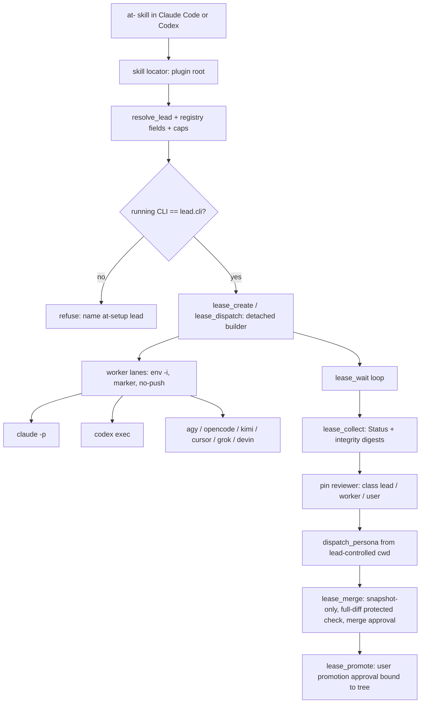
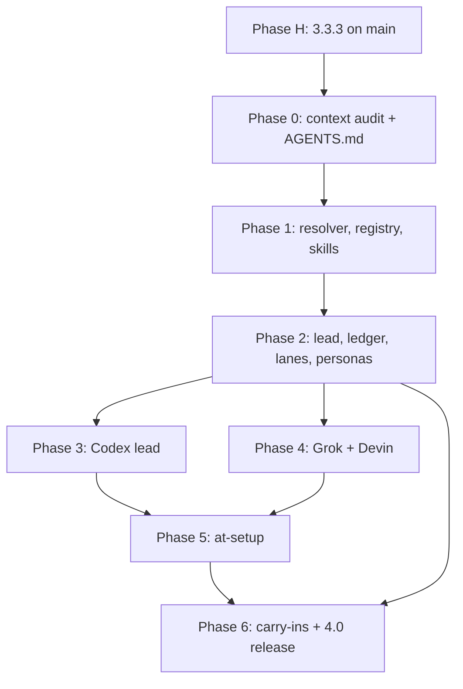

# Lead Choice - Plan

## Goal Capsule

- **Objective:** A user who installs Triforge chooses Claude Code or Codex as the lead in setup, can change that choice later, and gets the same workflows, safety rules and review guarantees whichever CLI leads, with every other enrolled CLI (Claude included) working as a worker.
- **Means:** Triforge becomes one portable skill tree plus lead-neutral shell primitives, where lead-specific behavior is reached through registry fields and a capability lookup, never a CLI-name check (KTD1, KTD5, KTD7).
- **Authority:** the Product Contract's R-IDs win on product behavior; KTDs win on mechanism within them; a unit overrides neither. Settled decisions (Key Decisions below) are not reopened during execution.
- **Stop conditions:**
  - Stop and ask when evidence shows a settled decision can't work.
  - Stop and ask when a probe row that a unit depends on fails with no designed fallback (U29's rows, U12's skill visibility and sandbox rows, U17's environment re-import row).
  - Stop and ask when a change would weaken a protected-path, push, approval, or git-integrity guard.
- **Execution profile:**
  - Phase H ships to `main` as v3.3.3, in one PR.
  - Phases 0–6 land PR by PR on the `release/4.0` integration branch, which merges to `main` once as v4.0.0 (KTD13).
  - Build each PR with `ce-work` on Fable 5.1 at `high`, gated by `/goal` on that PR's Definition of Done.
  - Review with Opus 5.5 at `high`.
- **Who ships:** every PR touches protected paths. The lead or the user cross-reviews it, and only the user approves promotion to `main` (Key Decisions). No autonomous `/lfg`.

---

## Product Contract

### Summary

Triforge 4.0 lets the lead be Claude Code or Codex. The work cuts the 57 KB CLAUDE.md down to one AGENTS.md of at most 200 lines. It turns the 17 commands and 19 agents into `at-`-prefixed skills and a script-dispatched persona lane that follow the Agent Skills spec, and it adds the primitives both leads need: lead resolution, reviewer classes, recorded approvals, a worker marker, detached leases with a blocking wait, and hardened lead-side git. Grok Build and Devin CLI join as optional workers. Four live safety gaps ship first as v3.3.3.

### Problem Frame

Claude Code is the only possible lead today. The 17 slash commands, 19 Claude agents and 4 hooks run only in Claude Code, and about 40 helper call sites read plugin files through `${CLAUDE_PLUGIN_ROOT}`. Several safety rules exist only as prose, and some prose no longer matches the code:
- **"The lead or the user reviews protected paths" can't be recorded.** Reviewer identity is a CLI name, `user` is not a valid identity, and `lease_merge` refuses a lead that shares the builder's CLI.
- **The protected-path list lags the prose.** The code list in `scripts/lib/lease.sh` misses `scripts/lib/`, `scripts/lease-git-hooks/` and `scripts/probe-self-tests.sh`, sees only the destination of a rename, and fails open on a scan error.
- **Workers aren't as confined as the docs say.** A worker with a shell and no OS sandbox can write the lead's `.git/config`, and a linked worktree shares that file. So it can plant a command the lead's next git call runs. It can also edit the lease ledger, and it can commit files the merge exclusions never see.
- **Skill refresh can delete user skills.** It removes any `.agents/skills/` directory whose name matches a shipped skill.

Meanwhile the instruction files have outgrown current guidance: the 413-line CLAUDE.md is past Codex's 32 KiB AGENTS.md cap and far past the ~200-line target. And the skills predate the Agent Skills spec.

### Key Decisions

- **Lead is Claude Code or Codex only.** Governs R1, R7. (session-settled: user-directed — chosen over Antigravity, OpenCode, Kimi or Cursor as lead: only these two have enforceable headless hooks and permission control.)
- **Only AGENTS.md ships; Claude Code floor 2.1.277.** Governs R9, R10, R11, R40. (session-settled: user-directed — chosen over a thin CLAUDE.md importing AGENTS.md and a CLAUDE.md symlink: one file, no shims.)
- **Commands and agents become skills per the Agent Skills spec and compound-engineering conventions.** Governs R13–R17, R19. (session-settled: user-directed — chosen over keeping `commands/` and `agents/` as primary surfaces: Codex drops commands over 4,000 bytes and loads no plugin agents.)
- **Skills carry the `at-` prefix** (`at-build`, `at-review`, `at-setup`). Governs R13. (session-settled: user-directed — chosen over a `triforge-` prefix and bare names: short like `ce-`, and no clash with built-ins such as `/review` or with users' own skills.)
- **Context audit first; must-hold rules enforced by scripts, hooks or permissions.** Governs R10, R11, R18, R30. (session-settled: user-directed — chosen over doing lead work on today's files and over prose-only rules.)
- **Protected-path cross-review: the lead or the user; promotion to main: the user.** Governs R5, R32, R33. (session-settled: user-directed — chosen over user-only review under a Codex lead and over a required Claude reviewer: one merge-review rule for both leads, while the user still gives the final approval of every protected promotion.)
- **The never-downgrade trio always runs as top-tier Claude.** Governs R3, R35. (session-settled: user-directed — chosen over the lead's own model under a Codex lead: keeps the never-downgrade rule everywhere and keeps security review on a different model family from a Codex lead.)
- **Approvals are recorded, stated as audit, not prevention.** Governs R4, R33. (session-settled: user-directed — chosen over a terminal-only approval: easy to use, and a full-access lead's ability to bypass it is disclosed plainly.)
- **Grok Build and Devin CLI become optional workers.** Governs R23, R24. (session-settled: user-directed — chosen over also adding Pi, oh-my-pi and Hermes Agent as workers.)
- **Codex pin stays `gpt-6-astra` at `xhigh`.** Governs R26. (session-settled: user-directed — chosen over OpenAI's lower starting effort.)

### Requirements

Product Contract preservation: carried from the origin document with stable IDs. Changed (R46 and R49 wording tightened in document review to match the design):
- R5: the review rule follows the settled Key Decision; the origin's "or Claude as a required reviewer" is superseded.
- R27: the required `/goal` gate applies under a Claude lead only, confirmed in scoping.

Restructured, no scope change: R3 is hardening of the existing `claude -p` lane. Added: R30–R45, confirmed in scoping, and R46–R50, security findings from deepening.

**Lead and roster**
- R1. `ops/roster.toml` gains a `[lead]` table (`cli`, `model`, `effort`). Load validation and the writer reject a lead other than `claude` or `codex`. Code reads lead behavior from registry fields and capabilities, never from the lead's name.
- R2. The CLI that isn't the lead is an ordinary worker, eligible for every role, under the same lease, cross-review and merge rules.
- R3. The existing `claude -p` worker lane becomes a full builder, reviewer and tester lane: its own env allowlist, a typed `Status:` report, a roster model, visible skills, and working test commands. The Fable override and downgrade ladder apply only when Claude leads, except for the trio (Key Decisions).
- R4. A Codex lead runs with `-s danger-full-access -c approval_policy="never" -c background_terminal_max_timeout=900000` (D-047). Setup and AGENTS.md state three things plainly:
  - Confinement under either lead is Triforge's scripts plus git-integrity detection.
  - A lease worktree limits where a worker starts, not where it writes.
  - Recorded approval is audit, not prevention, and worker output is an injection surface for a full-access lead.
- R5. Protected-path changes are cross-reviewed by the lead or the user before merge, under either lead.
- R6. The lease ledger, merge, promotion and attribution stay lead-owned and behave identically under either lead.

**Setup**
- R7. `at-setup` detects the running CLI and offers the lead choice first (default: an existing `[lead]` value, else the running CLI), then role assignment, then optional-member enrollment. Each choice can be changed later, and each step is also one validated helper call an agent can make without the dialogue.
- R8. Choosing Codex as lead checks the prerequisites (project trust entry, AGENTS.md budget) and shows the `danger-full-access` consequence. It prints the launch line and never writes user-tier config.
- R9. A user project with its own `CLAUDE.md`, `CLAUDE.local.md` or `.claude/CLAUDE.md` is detected, and setup offers (asking first) to add an `@AGENTS.md` line.

**Instruction files**
- R10. One root `AGENTS.md` of at most 200 lines holds the lead-neutral protocol and the non-obvious gotchas, and stays within 16 KiB, under Codex's 32 KiB combined budget. A validator fails the build when either limit is exceeded.
- R11. `.claude/CLAUDE.md`, `templates/CLAUDE.md` and the stale `ops/`-level instruction copies are replaced. A rule inventory maps every old rule to its new home: an enforcing script, hook or permission, or a skill reference.
- R12. Codex trust wording is corrected: project AGENTS.md is skipped only when trust is explicitly `untrusted` (D-045).

**Skills (commands and agents included)**
- R13. One `skills/` tree. The 17 commands become `at-`-prefixed skills. Workflows with side effects set `disable-model-invocation: true`, and argument syntax moves to `argument-hint`. `commands/` is removed.
- R14. The 19 agents become persona prompt files in one persona home, with no frontmatter. The dispatching skill names a persona, and the persona lane picks model, tools and effort from one manifest, enforced mechanically.
- R15. Every skill conforms to the Agent Skills spec:
  - body at most 8 KB and under 5,000 tokens, with references one level deep;
  - descriptions short and trigger-first, with the whole set (plugin copies plus `.agents/skills/` copies) fitting Codex's 8,000-character initial list;
  - no CLI-specific tool names in bodies.
- R16. Skills are self-contained: they reference only their own folder, and use no `${CLAUDE_PLUGIN_ROOT}` without a fallback. Each `at-` skill finds the helper scripts through its own locator, from either lead. Lead workflows are never copied into `.agents/skills/` or worktrees.
- R17. Skill prose states the goal, the done condition, the safe failure direction and the non-derivable facts, not procedures. A repo-local authoring skill carries these rules.
- R18. Generic skills that current models don't need are pruned after a removal test. Skills specific to Triforge stay.
- R19. `validate-skills.sh` enforces the 26-check conformance list with one fixture per rule, and runs `skills-ref validate`.

**Packaging**
- R20. One plugin tree serves both leads through the `.claude-plugin/plugin.json` fallback (D-048). No root `plugin.json`.
- R21. Hook handlers stay inert where they would misfire: in worker and persona sessions, and under a lead whose tool vocabulary they don't map.
- R22. Other harnesses (Devin, Pi and any CLI that reads `.agents/skills/`) can install Triforge's portable skills where it is cheap.

**New workers**
- R23. Grok Build is an optional member with a pinned model and effort, a parsed JSON result, `dontAsk` mode with deny rules, and verified isolation from `~/.claude` credentials, MCP servers and skills.
- R24. Devin CLI is an optional member:
  - It reports through the typed `Status:` line, and its readiness check reads text.
  - It is limited to reviewer and analyst by default; builder needs an explicit opt-in.
  - Enrolling it needs recorded consent. When it re-imports the login-shell environment, setup states that Devin sees every exported secret.
- R25. Adding a future CLI means one adapter file, one registry entry, probe rows, a setup entry and one egress line.

**Carry-ins from the watch cycle**
- R26. The model ladder has one source that other files reference. Its `opus` rung reads "Opus 5.5 (≥ 2.1.280)" (D-037).
- R27. `/goal` is a required completion gate under a Claude lead (D-041). A Codex lead completes on the `ops/.sprint-complete` sentinel and the outer loop.
- R28. The agy routing default flips to `auto` (D-042), and agy's `AGY_ERROR` line on exit 3 is parsed (D-043).
- R29. Research workers in the watch cycle run with a tool set that has no write access.

**Safety and parity (added in scoping)**
- R30. The protected-path check covers every control-plane path and fails closed. It has two lists:
  - a framework list, applied only in the Triforge checkout;
  - a project list, applied everywhere.

  It is also case-folded, sees both sides of a rename, matches instruction files at any depth, and a self-test checks it against the documented list.
- R31. Skill refresh never deletes a directory it didn't create: it touches only directories whose content digest matches the stamp. Provisioning into worktrees refuses symlinked targets and copies worker-safe skills only.
- R32. The ledger records the lead's CLI and a reviewer class (lead, worker or user) per task. Protected status is checked at every merge against the lease's full diff. A protected change merges only with a lead or user review on record, where a lead review is checked against the current lead.
- R33. Protected or `require_user_approval` promotion needs a recorded approval from the user, bound to the integration tree. Every approval records where it came from (agent shell or terminal). A later merge voids a promotion approval.
- R34. Lease worker and persona processes carry a worker marker. Hooks exit early and lead-owned helpers refuse under it, or when run from inside a lease root. The marker guards against accidents; it is not a security boundary.
- R35. Personas run through one script-dispatched lane under both leads:
  - It goes through the worker env boundary and uses four tool classes (read, read-web, exec, never write).
  - It starts from a lead-controlled working directory.
  - The trio is pinned to top-tier Claude, and blocks naming the fix when Claude is unavailable.
- R36. A lead waits on leases through one blocking primitive, and lease builders run detached from the lead's process group, so a headless lead's turn ending never kills them.
- R37. `at-setup`'s bootstrap (ops skeleton, skills refresh, per-CLI files) is a callable helper, so a Codex-led project works before any hook is trusted.
- R38. Lead-owned helpers refuse when the running CLI isn't `[lead].cli`, except the approval helper, which records instead. A lead switch refuses while leases are open, and a forced handover for a dead lead doesn't spend requeue budget.
- R39. A user project that already has its own `AGENTS.md` gets Triforge's pointer block merged in (asking first), with the combined size checked against Codex's budget. `AGENTS.override.md` is detected and warned about.
- R40. The upgrade from 3.3.x migrates cleanly:
  - an absent `[lead]` means `claude`;
  - stale copies of Triforge's CLAUDE.md template are fingerprinted, and setup offers to convert them;
  - session start warns below the 2.1.277 floor;
  - open 3.3.x leases merge under the new checks.
- R41. Adding a CLI updates one registry that every roster, lease, probe and validator copy reads.
- R42. One plugin-root resolver replaces every direct `${CLAUDE_PLUGIN_ROOT}` read in the helper libraries, and no helper ever falls back to a user project's own `scripts/` or `skills/`.
- R43. Setup computes the egress disclosure from the enabled members, including that each worker can read credential files under the user's HOME and send them to its provider.
- R44. A missing lead capability is reported once per session, never skipped silently.
- R45. One fixture sprint produces the same ledger, attribution and gate outcomes under a Claude lead and a Codex lead, apart from the lead identity.

**Security (added in deepening)**
- R46. A worker can't change what Triforge's own git calls run: they ignore worker-writable settings (hooks, fsmonitor, filters, diff and merge drivers). Changes the lead didn't make to git config, hooks, refs, worktree pointers or the ledger are restored where possible and escalate the lease. The harness's own git calls and ad-hoc git in the main checkout are covered only by that detection at the next check. All of this is detection, stated as such.
- R47. A lease merges only the lead's own snapshot. A lease branch carrying builder-made commits, or a diff under the lead-owned `ops/`, is refused, naming the commit or file.
- R48. Reviewers and personas start from a lead-controlled directory and get the lease diff as input. So a builder's edits to instruction or config files can't steer its own review.
- R49. Worker reports and captured output are data: discoveries land in `ops/MEMORY.md` as an indented literal block (never a fence), attributed and labeled unverified, and are never run as commands.
- R50. One list names every action only a human may take, each paired with the helper that refuses to do it. Provider consent is recorded in the roster.

### Success Criteria

- The same two-task fixture sprint, one task touching a protected path, runs to `.sprint-complete` under `[lead] = claude` and under `[lead] = codex`. It produces matching ledger rows and attribution, and the protected task blocks for user promotion approval both times.
- `AGENTS.md` stays under 200 lines and 16 KiB, and the full skill set's descriptions fit in 8,000 characters.
- A user on 3.3.2 upgrades to 4.0 without losing a user-owned skill folder, and with their roster resolving to a Claude lead.
- A fixture builder that sets `core.fsmonitor`, commits a file, or rewrites its ledger row is escalated at the next check under both leads, and its command never runs inside Triforge's own git calls.
- `claude plugin validate --strict` passes on both manifests, both validators pass, and the SELF-row gate (`--self-only`) exits 0 on the release record.

### Scope Boundaries

- Antigravity, OpenCode, Kimi or Cursor as lead.
- The OpenCode V2 port (D-049; 3.3.2 refuses V2).
- Moving the Cursor pin to Grok 4.7 before CUR-12 passes.
- Pi, oh-my-pi and Hermes Agent as workers (Pi gets a skill manifest only, under R22).
- Preventing a deliberately hostile full-access lead from bypassing approvals: 4.0 records and discloses (Key Decisions).

#### Deferred to Follow-Up Work

- Agent teams under a Codex lead (multi_agent_v2 and message board). `--team` under a Codex lead degrades to the lease pool with a notice.
- Codex native subagents for Triforge personas, useful only once a subagent can run in a narrower sandbox than its parent.
- A sandboxed Codex lead profile (`workspace-write` plus execpolicy rules). 4.0 runs a Codex lead with full access.
- A deny-capable completion hook for a Codex lead.
- Repo-mining items outside the three goals: S29, S30, S31, S34, S35, CE-17, CE-18, G20, G22, G23.

### Sources

- Origin: `docs/brainstorms/2026-09-27-lead-choice-requirements.md`.
- Evidence:
  - `ops/research/2026-09-27-cli-updates.md` (the six lead-choice answers and 15 Codex-lead probes);
  - `ops/decisions/2026-09-27-cli-deprecation-watch.md` (D-037–D-053);
  - `ops/research/2026-09-27-repo-mining.md` (§3: the 26-check list);
  - `ops/research/2026-09-27-factsheet-grok-devin-pi-hermes.md`;
  - `ops/research/2026-09-probe-record.md` (SELF-06d and SELF-06f FAIL).
- Guidance the instruction files and skills must follow:
  - Agent Skills spec: `agentskills/agentskills` (`docs/specification.mdx`, `docs/skill-creation/best-practices.mdx`, `skills-ref`).
  - compound-engineering authoring rules: `EveryInc/compound-engineering-plugin` AGENTS.md, sections "Working on Skills", "Specialist Prompt Assets in Skills", "File References in Skills" and "Platform-Specific Variables in Skills".
  - Anthropic, "The new rules of context engineering for Claude 5 generation models" (claude.dev, 2026-07-24).
  - Addy Osmani, "Audit your agent files" (addyo.substack.com, 2026-08-27).
  - OpenAI, "Rethinking skills and prompts for GPT-6 Astra" and the GPT-6 latest-model guide (developers.openai.com).
  - Codex docs: `codex/learn/best-practices`, `agent-configuration/agents-md`, `agent-configuration/subagents`, `build-skills`, `plugins/build/plugins`.
  - plugin-dev (Anthropic) for hooks, manifests and validation.

---

## Planning Contract

### Key Technical Decisions

- KTD1. **Lead behavior is registry data plus runtime capabilities.** `[lead]` holds `cli`, `model` and `effort`. Each lead-capable CLI's registry entry (KTD7) carries static fields:
  - `launch_argv`;
  - `wait_budget_s` (600 for Claude's Bash tool, 900 for Codex);
  - `tool_vocab_read` and `tool_vocab_action`;
  - `goal_gate`;
  - `ask_user`;
  - `native_subagents_enforced_tools`;
  - `agent_teams`;
  - `plugin_root_env`.

  `hooks_trusted.<event>` is detected at runtime and cached per session. `resolve_lead` prints the table, `resolve_lead_caps` prints the capabilities, and `lead_host_detect` reads host markers. A resolver failure fails closed with its own message.

  A shell with no host markers is handled explicitly:
  - With a TTY attached, lead-owned helpers run as the user and record `via=tty`.
  - With no TTY and no markers, they refuse, unless `TRIFORGE_TEST_BUILDER` is set and `TRIFORGE_TEST_LEAD` names the simulated lead (the SELF harness path). `coordinate.sh`, the monitors and `lease_wait` read fields, never the CLI name.

  The `validate-skills.sh` gate fails, outside `registry.sh` and `roster.sh`, on any comparison or `case` whose subject is the lead's CLI value. Worker-lane `case` arms stay legal. Chosen over name branches (G18), which multiply with every new lead-specific fact. Governs R1, R38, R44.
- KTD2. **Reviewer class plus lead CLI in the ledger, no pseudo-CLIs.**
  - Rows get `lead_cli` (stamped at create, kept for attribution) and `reviewer_class` (`lead`, `worker` or `user`, set at pin).
  - A `lead`-class review is valid only when its CLI equals the *current* `[lead].cli` and differs from `builder_cli`.
  - `_KNOWN_CLIS` stays CLI names only. `user` and CLI names are checked by a separate `_approver_ok`.
  - A forced handover writes `handover_from` and `handover_at` on open rows. An unmerged `lead`-class pin then requires a user merge approval, added under KTD3 with no re-pin.
  - A protected task built by the lead's own CLI routes to the user. Setup and AGENTS.md state this.

  Governs R5, R32.
- KTD3. **Protected status is checked on the collect snapshot, additively.**
  - `lease_collect` terminates the builder's recorded process group. It then takes the lead's snapshot commit through `_lead_git`, resetting the lease branch to base plus that one commit, and records the snapshot's SHA and tree hash in the ledger.
  - The pinned review, the merge approval and the protected check all bind to that recorded snapshot.
  - Protected status is computed over base to snapshot, with renames reported on both sides and paths case-folded.
  - A protected task needs a merge approval next to the existing pin, never a re-pin, so a task that becomes protected in a later fix cycle doesn't deadlock.
  - Each fix cycle's collect writes a new snapshot, which voids earlier approvals mechanically.

  Chosen over binding to the lease head, which never moves because builders commit nothing and the old snapshot was taken inside `lease_merge`. Governs R32.
- KTD4. **Two approval records, both audit-grade.**
  - **Merge approval:** scope `task:<id>`, class `lead` or `user`, bound to the collect snapshot SHA (KTD3).
  - **Promotion approval:** scope `promotion:<branch>`, class `user` only, bound to the integration tree hash, its protected-path set and the default-branch SHA. Any later merge, or any move of the default branch, voids it.

  `lease_approve` is exempt from R38's host check. It stamps each record with its origin: `via=lead-session` when host markers are present, `via=tty` when a terminal is attached, plus `lead_cli`. `lease_promote` refuses without a matching, unvoided promotion approval, and prints the origin. The "promote by hand" text is removed. The disclosure names the bypass. Governs R4, R33.
- KTD5. **One persona lane, inside the worker boundary.** `dispatch_persona <persona> <scope> <out>` goes through `_adapter_env`, so it gets the allowlist, the no-push config and the marker as `persona`. It starts from a lead-controlled cwd (KTD20). It reads one manifest (KTD21) and has four tool classes:
  - `read`: `claude -p` with Read, Grep and Glob, or `codex exec -s read-only`.
  - `read-web`: adds WebFetch and WebSearch; Claude only.
  - `exec`: Bash but no edit tools, run in a disposable detached worktree at the lease's collect snapshot, so tests exercise the change under review. Before launch, the instruction and config files (`AGENTS.md`, `AGENTS.override.md`, `CLAUDE.md`, `.claude/`, `.codex/`, `.mcp.json`) are restored from integration HEAD, and their lease-side changes are named as content under review. `dispatch_persona` runs the KTD18 integrity check before and after every exec run. The worktree is reclaimed afterwards.
  - `write`: never a persona. `pr-comment-resolver` work goes through a lease.

  The trio resolves to the top Claude tier through the ladder source (KTD22), and blocks naming the fix when Claude is unavailable. The Agent tool survives only for `team-lead` under the Claude-only `agent_teams` capability, labeled unenforced. Chosen over two classes, which fit none of the seven Bash-without-edit agents, and over Codex subagents, which inherit the lead's full access. Governs R14, R35.
- KTD6. **Plugin root: one resolver in the libraries, one locator per skill.**
  - The loader sets `_TRIFORGE_PLUGIN_ROOT` from `CLAUDE_PLUGIN_ROOT`, else from its own `_TRIFORGE_SCRIPTS_DIR`, and removes the `$(pwd)/scripts` fallback. `_lease_provision_skills` loses its fallback to the repo's `skills/`.
  - Each `at-` skill ships a small locator in its own `scripts/`. It resolves `CLAUDE_PLUGIN_ROOT`, then its own real path when two levels up is a Triforge plugin root (`.claude-plugin/plugin.json` named `agent-triforge` plus `scripts/invoke-external.sh`), then a plugin-root pointer that `triforge_bootstrap` writes to an untracked, per-user location (a gitignored `*.local` file under `.agents/`), never the committable stamp. The pointer's target must pass the same Triforge-root test and resolve outside the project's git toplevel. Otherwise the locator fails closed and names `at-setup`.

  Chosen over a `../..` fallback, which from an `.agents/skills/` copy resolves into the user's project. Governs R16, R42.
- KTD7. **One CLI registry.** `scripts/lib/registry.sh` holds one literal describing each CLI:
  - tier and binary resolution;
  - default model and install hint;
  - env allowlist keys, as exact names only (the documented `KIMI_*` exception aside);
  - lane kind and egress provider;
  - the KTD1 lead fields.

  `roster.sh`, `lease.sh`, `common.sh`, `session-start.sh`, `validate-versions.sh`, the probe gates and `_lane_run` read it. It is not named `DEFAULTS`, and the drift check is re-pointed at it. Chosen over keeping about ten hand-copied lists, which already drift. Governs R25, R41.
- KTD8. **Protected paths: two lists in the registry, a fail-closed scan.**
  - `framework_protected` applies only when the repo is the Triforge checkout (`.claude-plugin/plugin.json` named `agent-triforge`). It holds:
    - `scripts/lib/`, `scripts/lease-git-hooks/`, `scripts/invoke-external.sh`, `scripts/coordinate.sh`;
    - the probe harness, `scripts/probe-self-tests.sh`, the validators and `scripts/release-notes.sh`;
    - `skills/`, the persona home, `AGENTS.md`, the manifests and the per-CLI agent directories;
    - `.github/workflows/`, `.gitmodules` and `.gitattributes`.
  - `project_protected` applies everywhere. It holds:
    - `ops/roster.toml`, the permission configs, `.mcp.json`, `.claude/`, `.codex/` and `.agents/skills/`;
    - every `AGENTS.md`, `AGENTS.override.md`, `CLAUDE.md` and `CLAUDE.local.md` at any depth.
  - The scan fails closed with rc 42 on any error. SELF-10 checks `framework_protected` against the protected-path list in `.claude/CLAUDE.md` in 3.3.3, and against AGENTS.md from U3 on.

  Chosen over one list, which either misses the framework's own code or force-gates users' `scripts/` and `skills/`. Governs R30.
- KTD9. **Worker marker as an accident guard; exclusions by provisioned path.**
  - `_adapter_env` exports `TRIFORGE_LEASE_WORKER=1`, and `dispatch_persona` exports it as `persona`.
  - Hook handlers exit 0 at once under the marker.
  - `lease_create`, `lease_dispatch`, `lease_merge`, `lease_promote`, `lease_approve` and the `roster_write_*` writers refuse under it, or when `$PWD` is inside the lease root.
  - The squash excludes only paths Triforge provisioned into that worktree, recorded in the lease row at create. Tracked edits under `.claude/`, `.codex/` or `.agents/` merge normally and trip the protected check.
  - The Codex project hook stops writing `ops/`; attribution comes from the ledger.

  Chosen over whole-directory exclusions, which drop legitimate tracked edits and hide them from the protected check. Governs R21, R34.
- KTD10. **Builders run detached; `lease_wait` is the lead's only waiting primitive.**
  - `lease_dispatch` starts each builder in its own session and process group through `python3` (already required), with stdio sent to the lease's `.raw` and `.err` files.
  - It records `pid`, `pgid` and a start-time fingerprint, so `lease_heartbeat_check` rejects a reused PID.
  - `lease_wait` blocks within the lead's `wait_budget_s`, returns on any state change, and prints per-task state. Skills state "loop `lease_wait` until no lease is building". Under a Claude lead, each call passes the Bash tool timeout explicitly (`wait_budget_s` × 1000 ms), with `lease_wait`'s own budget a few seconds below it.
  - `lease_wait` and `lease_heartbeat_check` run the KTD18 integrity check on every return.
  - If U29's survival probes fail on a host, `coordinate.sh` holds the processes but never writes the ledger or calls lead-owned helpers, and a lead session adopts them.
  - U13 owns the lead-exit path (`reason=lead-exit`, no requeue spend), and U9's forced handover calls it.

  Chosen over in-shell background jobs, which die with the lead's tool call. Governs R36.
- KTD11. **Bootstrap is a primitive; the hook is a trigger.** `triforge_bootstrap` performs:
  - the ops skeleton;
  - the digest-stamped skills refresh;
  - the per-CLI template copies;
  - the agy pack;
  - the plugin-root pointer.

  `at-setup`, the `at-build` and `at-review` preambles, and the hook all call it idempotently. Governs R37.
- KTD12. **Skill refresh by digest, worker-safe copies only.**
  - The stamp records a content digest per directory Triforge wrote.
  - The refresh overwrites or retires a directory only when its digest matches. A mismatch is treated as user-owned: skipped, with a notice.
  - Only portable, worker-safe skills go into `.agents/skills/` and worktrees; `at-*` workflows reach a lead only from its plugin install.
  - The same rules and the realpath and symlink guards apply in `session-start.sh`, `_lease_provision_skills` and `.claude/skills` provisioning, which adds names only and skips a tracked name.

  Chosen over a name-only stamp, which a committed or forged stamp could turn into a deletion list. Governs R31.
- KTD13. **Integration branch plus a 3.3.3 hotfix.** Phase H ships on `main` as v3.3.3 in one PR. Phases 0–6 land on `release/4.0`, which merges to `main` once as v4.0.0, because users install from `main`. (session-settled: user-approved — chosen over landing each phase on `main` with its own release: 4.0 is breaking, and a half-migrated `main` would break installs. Phase H widened in deepening to include the live git-integrity and merge-exclusion fixes.)
- KTD14. **Completion gate split by lead.** `coordinate.sh` reads the lead's `launch_argv` and `goal_gate` fields:
  - Under a Claude lead, the `/goal` line is a required gate.
  - Under a Codex lead, it runs `codex exec` with the D-047 profile, invokes `$at-ship`, and completes on the sentinel.

  No new deny-capable hook. (session-settled: user-approved — chosen over adding Triforge's first blocking hook: it would break the rule that handlers always exit 0.) Governs R27.
- KTD15. **Verification is evidence, not a test framework; the SELF gate must be able to fail.**
  - Each unit is proven by validator fixtures, SELF rows, probe rows or `TRIFORGE_TEST_BUILDER` fixture sprints.
  - U28 adds `--self-only`: static SELF rows only, recorded to a scratch path, exiting nonzero on any SELF FAIL. That makes it a gate, and it never overwrites the committed probe record.
  - A PR workflow runs both validators and `--self-only` on a macOS runner (bash 3.2) for PRs to `main` and `release/4.0`.

  This keeps the July plan's KTD-12 (no bats or shellspec).
- KTD16. **`claude -p` lane hardening.**
  - The lane runs with `--output-format json` (recording `subtype`, `is_error` and `session_id`), `--max-turns`, and an explicit `--allowedTools` set.
  - It resumes the same `session_id` across fix cycles.
  - Its contract line forbids ending the turn with a background job running.
  - When U12's probe shows Claude Code's Bash sandbox confines writes under `-p`, the lane turns it on, with deny-read rules for known credential paths. Otherwise setup states that a Claude builder with Bash has no OS confinement.
  - Skills are provisioned into `.claude/skills/` under KTD12's rules.

  Governs R3.
- KTD17. **AGENTS.md content rules.**
  - It holds only what a model can't infer from the tree: the checks to run, the expensive operations, what must not be touched, the unusual conventions, and the human-only list (R50).
  - It points to skill references for everything else, and every must-hold rule it names cites its enforcer.
  - The writing follows the Astra and Claude 5 guidance: no stacked NEVER/MUST language, "done when" stated up front, delegation stated explicitly, and user instructions outranking a skill. Worker output is labeled data (R49).
  - For user projects, Triforge adds a marked pointer block of about 10 lines, not the protocol.

  Governs R10, R17, R39, R49.
- KTD18. **Lead-side git hardening and integrity detection.**
  - **Every git call in `scripts/lib/lease.sh` goes through `_lead_git`,** including `lease_create`, `lease_requeue`, `lease_dispatch`, `lease_heartbeat_check`, `lease_collect`, `lease_merge`, `lease_promote` and `lease_reclaim`.
  - **`_lead_git` runs with `GIT_CONFIG_NOSYSTEM=1`,** and `GIT_CONFIG_GLOBAL` points at a Triforge-owned trusted config. `triforge_bootstrap` captures that config from the user's identity and any LFS filter lines, and digests it.
  - **It overrides the worker-writable settings:**
    - empty `core.hooksPath` and `core.attributesFile`;
    - `core.fsmonitor=false` and `commit.gpgsign=false`;
    - no external diff, textconv or custom merge driver;
    - a pinned `safe.directory` scope.
  - **For worktree operations it passes an explicit `--git-dir`** (the `.git/worktrees/<task>` recorded at create) and `--work-tree`, never the worktree's own `.git` pointer file.
  - **The baseline is the lead's last verified state, kept in the ledger,** not re-taken at dispatch. It covers:
    - digests of `.git/config`, `.git/hooks/`, `.git/info/`, `.git/worktrees/<task>/` and each worktree's `.git` pointer file;
    - the user's global git config files;
    - the ledger's last lead write;
    - the SHAs of the default branch, the integration branch and every lease branch, updated after each of the lead's own merges.
  - **The check runs at collect, merge and promote, on every `lease_wait` and `lease_heartbeat_check` return, and before `coordinate.sh` starts a session.** On any change the lead didn't make, it restores `.git/config` and `.git/hooks/` from the recorded copy, escalates, and names the changed surface or ref.
  - **Scope, stated as such:** only Triforge's own helper git calls ignore worker-writable settings. The harness's own git calls (for example Claude Code's session-start status), ad-hoc git run by the lead model, and other builders' git calls are covered only by detection at the next check. AGENTS.md discloses this.

  Chosen over trusting prompt confinement, which a shell-capable worker can ignore. Governs R46.
- KTD19. **Snapshot-only merges.** `lease_merge` squashes from the ledger-recorded collect snapshot SHA, never the branch name. It refuses when the branch isn't exactly base plus that SHA, when the worktree no longer matches the recorded tree, or when the diff touches `ops/`, which is lead-owned, naming the commit or file. Chosen over filtering builder commits, which would merge an unreviewed history shape. Governs R47.
- KTD20. **Reviewers start from lead-controlled ground.** Pinned reviewers and `read`/`read-web` personas start from the integration-branch checkout or an empty scratch directory, never the builder's worktree, and receive the collect-snapshot diff as input. `exec` personas follow KTD5's restored-snapshot worktree. The review prompt names instruction-file and config changes as content under review. Governs R48.
- KTD21. **One persona home.** Persona files and their one manifest live in `personas/`. It is a non-skill directory, so it costs nothing in Codex's skill list, and it is on the framework-protected list. Skills name personas and never their paths. Chosen over per-dispatcher copies, which would repeat the trio's pin up to six times. Governs R14.
- KTD22. **The ladder's single source is registry data.** The model ladder lives in `scripts/lib/registry.sh`. `dispatch_persona` and the Fable override read it, and AGENTS.md and skills name it without restating it. `validate-versions.sh` asserts exactly one definition. It is created in U21 so no later unit rewrites the ladder check again. Governs R26.

### High-Level Technical Design

Lead resolution and the lanes it drives:

A lease through review, merge and promotion:

```mermaid
stateDiagram-v2
  [*] --> building
  building --> escalated: BLOCKED / NEEDS_CONTEXT / 2nd missing report / integrity change
  building --> review: DONE / DONE_WITH_CONCERNS
  review --> building: findings, cycle < 3 (same pin; new snapshot voids approvals)
  review --> needs_merge_approval: full diff touches a protected path
  needs_merge_approval --> mergeable: lead (current, non-builder CLI) or user approval on collect snapshot
  review --> mergeable: non-protected, pinned worker approved
  mergeable --> merged: snapshot-only lease_merge
  merged --> needs_promotion_approval: wave diff protected or require_user_approval
  needs_promotion_approval --> promoted: user approval bound to integration tree
  merged --> promoted: nothing protected, knob off
```

Phase dependencies:

### Implementation Constraints

- Hooks and helpers run under macOS `/bin/bash` 3.2 with `set -euo pipefail`. That means no associative arrays and no `mapfile`, `grep -c … || true`, hook stdout never starting with `{`, and every handler exiting 0.
- Never edit `scripts/probe-capabilities.sh` or `scripts/probe-self-tests.sh` while a probe run is in progress.
- Every PR touches protected paths, so the user or lead cross-reviews it.
- Every new control-plane file joins `framework_protected` in the commit that creates it.
- Every new lib file joins the loader list in `scripts/invoke-external.sh`, ahead of `lease.sh`.
- Every `_adapter_env` change updates the `_lane_run` mirror in `scripts/probe-capabilities.sh`.
- Before Phase 0 deletes anything: run `/doctor` in a session for a baseline, keep the removed text in git, and run the removal test in U4.

### Risks

| Risk | Mitigation |
|---|---|
| A shell-capable worker without an OS sandbox writes the lead's repo or ledger | Hardened lead git, integrity digests and snapshot-only merges (KTD18, KTD19), shipped in 3.3.3; stated as detection in AGENTS.md and setup |
| Builders die when a Codex lead's tool call returns | Detached launch as the primary design; U29 probes survival first; `coordinate.sh` holding is the fallback (KTD10) |
| Deleting CLAUDE.md or emptying `commands/`/`agents/` breaks `validate-versions.sh` | The ladder moves to one source in U21; count and file lists move with the deletions (U3, U23, U8) |
| Skill descriptions overflow Codex's 8,000-char list | A budget check that counts the plugin set and the `.agents/skills/` copies (U6); personas outside `skills/` (KTD21) |
| A 4.0 upgrade deletes user skills | The digest stamp ships first in 3.3.3 (U2) |
| A full-access lead records a "user" approval itself | Origin stamping (`via=lead-session` versus `via=tty`) and plain disclosure; recorded, not prevented (Key Decisions) |
| Devin re-imports the shell environment and sees every secret | Probe gate in U17; setup states it and records consent; builder stays off by default |
| Lead and its own worker lane share one login, so quota contention | Routed through the existing quota failure class; documented in AGENTS.md |
| Rollback from 4.0 to 3.3.x rejects a roster naming grok or devin | Release notes say to disable those members before rolling back |

### System-Wide Impact

- **Users:** skill names change to `at-*`: `/at-build` in Claude Code and `$at-build` in Codex. The CLAUDE.md template goes away. The release notes carry a migration table.
- **Confinement:** the lease worktree limits where a worker starts, not where it writes. A worker without an OS sandbox can read and write anything the user can, including credential files under HOME. The enforced controls are the env allowlist, the no-push config, hardened lead git, integrity detection, snapshot-only merges and the protected-path gates.
- **Egress:** Devin adds Cognition as a provider, and Grok Build adds xAI only when Cursor isn't enrolled. Every worker can read credential files under HOME and send them to its provider. Setup computes and states all of this (R43).
- **Human-only boundaries (R50),** each paired with the helper that refuses it:
  - CLI logins: every adapter prints the login command and never runs it.
  - User-tier config (`~/.codex/config.toml`, its trust entry, `~/.gemini/antigravity-cli/settings.json`): `at-setup` detects and prints; no writer touches HOME.
  - Launching a lead with `danger-full-access`: `at-setup` prints the launch line.
  - Provider consent and Devin's training opt-out: `roster_enroll_member` requires recorded consent.
  - Edits to user-owned instruction files: `at-setup` asks first.
  - Protected and `require_user_approval` promotion approvals: `lease_approve` records the origin.
- **Control plane:** the new protected files are `scripts/lib/registry.sh`, `scripts/lib/persona.sh`, `scripts/lib/bootstrap.sh`, `personas/` and `AGENTS.md`, plus `.github/workflows/gates.yml` and the new adapter directories.

---

## Implementation Units

| U-ID | Title | Files touched | Depends on |
|---|---|---|---|
| U28 | SELF-row gate and PR workflow | `scripts/probe-capabilities.sh`, `.github/workflows/gates.yml` | none |
| U1 | Protected-path lists, fail-closed scan | `scripts/lib/registry.sh`, `scripts/lib/lease.sh`, `scripts/probe-self-tests.sh` | U28 |
| U2 | Digest-stamped skill refresh | `hooks/handlers/session-start.sh`, `scripts/lib/lease.sh` | U28 |
| U27 | Lead git hardening, integrity, snapshot-only merge | `scripts/lib/lease.sh`, `scripts/probe-self-tests.sh` | U1 |
| U21 | Validator prep and ladder source | `scripts/validate-versions.sh`, `scripts/lib/registry.sh` | U27 |
| U3 | AGENTS.md and rule inventory | `AGENTS.md`, `.claude/CLAUDE.md`, `templates/`, `docs/rule-inventory.md` | U21 |
| U22 | Session-start floor and stale-template notices | `hooks/handlers/session-start.sh` | U3 |
| U4 | Removal test and generic-skill pruning | `skills/`, `ops/solutions/` | U3 |
| U5 | Plugin-root resolver and skill locator | `scripts/invoke-external.sh`, `scripts/lib/*.sh` | U3 |
| U26 | CLI registry | `scripts/lib/registry.sh`, `scripts/lib/{roster,lease,common}.sh`, `hooks/handlers/session-start.sh`, `scripts/validate-versions.sh` | U5 |
| U6 | Skill conformance validator | `scripts/validate-skills.sh`, `scripts/fixtures/validate-skills/` | U3 |
| U7 | Commands become `at-` skills | `skills/at-*/` | U5, U6 |
| U24 | Split oversized skills | `skills/wave-orchestration/`, `skills/verification-before-completion/` | U4, U6 |
| U23 | Remove `commands/` and its fan-out | `commands/`, `scripts/validate-versions.sh`, manifests, `hooks/handlers/session-start.sh` | U7 |
| U29 | Capability and survival probe rows | `scripts/probe-capabilities.sh` | U26 |
| U9 | `[lead]` table and lead resolution | `scripts/lib/roster.sh`, `templates/ops/roster.toml` | U26, U29, U13 |
| U11 | Worker marker | `scripts/lib/lease.sh`, `hooks/handlers/*.sh`, `templates/.codex/hooks.json` | U5 |
| U12 | `claude -p` lane hardening | `scripts/lib/lease.sh`, `scripts/lib/roster.sh`, `scripts/probe-capabilities.sh` | U9, U11 |
| U13 | Detached leases, `lease_wait`, lead exit | `scripts/lib/lease.sh`, `scripts/coordinate.sh` | U29 |
| U10 | Ledger: lead CLI, reviewer class, approvals | `scripts/lib/lease.sh`, `scripts/lib/common.sh` | U1, U9 |
| U25 | `dispatch_persona` lane | `scripts/lib/persona.sh`, `scripts/probe-self-tests.sh` | U12, U21 |
| U8 | Personas move to one home; `agents/` removed | `personas/`, `agents/` | U25 |
| U14 | Codex lead: bootstrap, monitors, coordinator | `scripts/lib/bootstrap.sh`, `hooks/`, `scripts/coordinate.sh` | U9, U11, U13 |
| U16 | Grok Build adapter | `scripts/lib/grok.sh`, `grok-agents/` | U26, U12 |
| U17 | Devin CLI adapter | `scripts/lib/devin.sh`, `devin-agents/` | U26, U12 |
| U18 | Other-harness skill manifests | `.devin-plugin/`, `.pi/`, `README.md` | U23 |
| U15 | `at-setup`: lead step and instruction-file detection | `skills/at-setup/`, `scripts/lib/roster.sh` | U10, U14, U16, U17 |
| U19 | Watch-cycle carry-ins | `scripts/lib/antigravity.sh`, `scripts/probe-capabilities.sh`, watch commands | U8 |
| U20 | Two-lead fixture sprint and 4.0 release | `scripts/probe-self-tests.sh`, docs, manifests | U1–U19, U21–U29 |

### Phase H — v3.3.3 on `main` (one PR, KTD13)

### U28. SELF-row gate and PR workflow

**Goal:** SELF rows become a gate that can fail and never touches the committed probe record.

**Requirements:** KTD15 (supports every unit's proof)

**Dependencies:** none

**Files:**
- `scripts/probe-capabilities.sh` (`--self-only`: static SELF rows and fixtures, a scratch record path, nonzero exit on any SELF FAIL)
- `.github/workflows/gates.yml` (new: both validators plus `--self-only` on a macOS runner, for PRs to `main` and `release/4.0`)

**Approach:** Reuse the `--skip-live` gating of the `*_LIVE` flags, and route the record to a temp path when `--self-only` is set. The workflow never runs live rows.

**Patterns to follow:** the existing flag parsing and counter checks in `scripts/probe-capabilities.sh`; `.github/workflows/release.yml` for job shape.

**Test scenarios:**
- A deliberately failing SELF fixture makes `--self-only` exit nonzero and name the row.
- With all SELF rows passing, it exits 0.
- After a `--self-only` run, the committed `ops/research/2026-09-probe-record.md` is byte-identical.
- The workflow runs on a PR to `release/4.0`.

**Verification:** `--self-only` exits 0 on the current tree; the workflow run is green on the Phase H PR.

### U1. Protected-path lists, fail-closed scan

**Goal:** Close the live gap where control-plane code promotes without the forced gate, and make the scan impossible to evade by rename, case or depth.

**Requirements:** R30 (KTD8)

**Dependencies:** U28

**Files:**
- `scripts/lib/registry.sh` (new: `framework_protected` and `project_protected`)
- `scripts/invoke-external.sh` (loader list)
- `scripts/lib/lease.sh` (`lease_promote` reads the registry; renames on both sides; case-folding; basename matching for instruction files; fail-closed scan)
- `scripts/probe-self-tests.sh` (SELF-10)
- `.claude/CLAUDE.md` (protected-path sentence points at the registry)

**Approach:** Move the prefix tuple into `registry.sh` and split it (KTD8). The scan runs its diff with rename reporting and folds case. It treats any python or parse error as a hit, blocking with rc 42 and naming the error. SELF-10 asserts every path named in the instruction file matches a `framework_protected` entry.

**Patterns to follow:** the `_CURSOR_ID_PY` splice pattern in `scripts/lib/cursor.sh`; the fail-closed `require_user_approval` read in `lease_promote`; SELF-09's row shape.

**Test scenarios:**
- In this repo, a diff touching `scripts/lib/roster.sh` blocks with rc 42 and names the path.
- `git mv scripts/lease-git-hooks/pre-push docs/pre-push` blocks.
- A nested `sub/AGENTS.md`, an `AGENTS.override.md`, a `.mcp.json` and a case variant `Hooks/handlers/x.sh` each block.
- In a user fixture project, editing `scripts/lib/util.sh` promotes with the knob off.
- A corrupted registry literal blocks promotion and names the error.
- SELF-10 fails when a documented protected path has no registry entry.

**Verification:** SELF-10 passes under `--self-only`; `/bin/bash` 3.2 runs of the changed helpers pass.

### U2. Digest-stamped skill refresh

**Goal:** A user's own `.agents/skills/<name>/` survives every refresh and every lease provisioning, before 4.0 adds new names.

**Requirements:** R31 (KTD12)

**Dependencies:** U28

**Files:**
- `hooks/handlers/session-start.sh` (`_ss_refresh_skills`)
- `scripts/lib/lease.sh` (`_lease_provision_skills`: the realpath and symlink guards; its repo-`skills/` fallback removed)
- `scripts/probe-self-tests.sh` (SELF-08b extended)

**Approach:**
- The stamp records a digest per directory written.
- The refresh touches a directory only when the digests match, and otherwise leaves it with a notice.
- A legacy 3.x stamp (`version=` plus `skills=` names, no digests) is migrated using a generated table of every released version's per-skill digests. A listed directory counts as Triforge-owned only when its current digest matches a table entry for that name; otherwise it is user-owned and skipped with a notice.
- With no stamp, it writes into empty slots only.
- Provisioning refuses any symlinked `.agents`, `.agents/skills` or target.

**Patterns to follow:** `_ss_skill_name_ok` and `_ss_skill_dir_ok` in `hooks/handlers/session-start.sh`.

**Test scenarios:**
- A user-owned `.agents/skills/review/` with a marker file survives the session-start refresh, and a notice names it.
- The same directory survives `_lease_provision_skills` in a worktree.
- A forged stamp listing that user directory leaves it intact.
- A stamp-listed Triforge skill that no longer ships is retired.
- A committed `.agents/skills` symlink to an outside directory leaves the outside target untouched during provisioning.
- A first install with no stamp writes shipped skills into empty slots only.
- A 3.3.2-format stamp listing one pristine copy and one user-edited copy: the pristine copy is refreshed, and the edited copy survives with a notice.

**Verification:** extended SELF-08b passes under `--self-only`.

### U27. Lead git hardening, integrity, snapshot-only merge

**Goal:** A worker can't make the lead's git run its commands, forge ledger rows, or smuggle commits or `ops/` edits into a merge.

**Requirements:** R46, R47, R49 (KTD18, KTD19)

**Dependencies:** U1

**Files:**
- `scripts/lib/lease.sh`:
  - `_lead_git` for every git call in the file (KTD18);
  - the ledger-held baseline and ref SHAs;
  - the integrity check with restore;
  - the collect-time snapshot and process-group termination (KTD3);
  - snapshot-SHA squash and `ops/` refusal in `lease_merge` (KTD19);
  - `_lease_copy_discoveries` keeps its indented literal block (never a fence), attributed and labeled unverified.
- The trusted git config that `_lead_git` points at: in 3.3.3, `lease_create` captures it into the lease root on first use; U14 moves the capture into `triforge_bootstrap`.
- `scripts/probe-self-tests.sh` (SELF-18)
- `.claude/CLAUDE.md` (the Security model's write-scope sentence corrected)

**Approach:** `_lead_git` passes the KTD18 environment and overrides per invocation. The integrity check covers every KTD18 surface and ref. A mismatch restores what can be restored, escalates, and names the surface. The snapshot moves from `lease_merge` to `lease_collect` (KTD3). Until U13 detaches builders into their own process group, collect terminates the recorded builder PID and its children.

**Patterns to follow:** the `GIT_CONFIG_*` no-push backstop in `_adapter_env`; `_lease_parse_status`'s line-anchored checks.

**Test scenarios:**
- A `TRIFORGE_TEST_BUILDER` that runs `git config core.fsmonitor <marker-cmd>` in its worktree: `lease_collect` escalates naming `.git/config`, and the marker command never runs.
- A builder that writes `.git/hooks/pre-commit` is escalated.
- A builder that rewrites its own ledger row is escalated at collect.
- A builder that makes its own commit is refused at merge, and the message names the commit.
- A builder diff touching `ops/TASKS.md` is refused at merge, naming the file.
- A clean builder merges exactly as before.
- A report whose discoveries contain a shell command, or a line of three backticks followed by a command, stays inside the indented literal block in `ops/MEMORY.md`, and nothing runs it.
- A builder that runs `git update-ref refs/heads/main <commit>` makes the next check escalate naming the ref, and `lease_promote` refuses.
- A builder that writes a clean-filter driver to a HOME-scoped gitconfig, plus a matching `.gitattributes`, is escalated before the lead's snapshot, and the filter command never runs.
- A builder that writes a common-dir `post-checkout` hook: a second `lease_create` in the same wave doesn't run it.
- A builder that redirects its worktree's `.git` pointer file is escalated, and the lead's snapshot never follows the redirect.
- A worktree changed after collect makes `lease_merge` refuse as not matching the recorded snapshot.

**Verification:** SELF-18 passes; the 3.3.3 PR carries the version bump and ledger entry and releases through the workflow.

### Phase 0 — Context audit and AGENTS.md (`release/4.0`, KTD13)

### U21. Validator prep and ladder source

**Goal:** Land every validator change that doesn't depend on deleting files, and create the ladder's single source.

**Requirements:** R10 (budget check), R26 (KTD22)

**Dependencies:** U27

**Files:**
- `scripts/validate-versions.sh`:
  - the AGENTS.md line and byte budget, applied when the file exists;
  - `marketplace.json` in the lockstep check;
  - `docs/brainstorms/` excluded from the stale-pin sweep;
  - the rule-inventory completeness check;
  - a one-definition ladder check that replaces the md5 comparison.
- `scripts/lib/registry.sh` (the ladder literal)
- `.claude/CLAUDE.md`, `templates/CLAUDE.md`, `agents/team-lead.md` and `skills/wave-orchestration/SKILL.md` (each ladder line replaced by a pointer to the registry ladder in the same commit, so the one-definition check is green when it lands)
- `.claude/CLAUDE.md` (release checklist wording)

**Test scenarios:**
- A fixture AGENTS.md of 201 lines fails, and one over 16 KiB fails.
- A drifted `marketplace.json` version fails.
- A stale pin inside `docs/brainstorms/` is ignored.
- A second ladder definition anywhere fails.
- An inventory row reading "TBD" fails.

**Verification:** `validate-versions.sh` passes on the current tree.

### U3. AGENTS.md and rule inventory

**Goal:** One root AGENTS.md of at most 200 lines replaces every CLAUDE.md, with no rule lost.

**Requirements:** R10, R11, R12 (KTD17)

**Dependencies:** U21

**Files:**
- `AGENTS.md` (new, root)
- `docs/rule-inventory.md` (new)
- `.claude/CLAUDE.md` and `templates/CLAUDE.md` (deleted)
- `templates/AGENTS.md` (new: the user-project pointer block)
- `templates/ops/AGENTS.md` and `codex-agents/AGENTS.md` (folded in or removed)
- `ops/MEMORY.md` (stale ship-loop, completion-promise and Gemini entries archived)
- `scripts/validate-versions.sh` (count file list re-pointed at AGENTS.md)
- `scripts/probe-self-tests.sh` (SELF-10 re-pointed at AGENTS.md)
- `.github/PULL_REQUEST_TEMPLATE.md`

**Approach:**
1. Take a `/doctor` baseline in a session.
2. Build the inventory: every normative sentence in the old files gets one row with its destination, or "dropped: model can infer".
3. Write AGENTS.md from the rows that must be always-loaded, including the human-only list (R50) and the confinement statement (R4).
4. Delete the old files in the same commit as the re-pointing.

**Execution note:** write the inventory before deleting anything; the diff of the old files against the inventory is the review surface.

**Patterns to follow:** compound-engineering's AGENTS.md sections "Runtime vs Authoring Context" and "Lean Repo Grounding"; `ops/research/2026-09-27-repo-mining.md` S25, G15 and G16.

**Test scenarios:**
- Both validators pass with no CLAUDE.md in the tree.
- SELF-10 passes against AGENTS.md.
- A fresh Claude session and a fresh `codex exec` each echo a marker line placed in AGENTS.md.
- Every inventory row has a destination.

**Verification:** `/doctor` rerun shows the instruction-size finding gone.

### U22. Session-start floor and stale-template notices

**Goal:** Session start guides upgraders instead of suggesting a CLAUDE.md.

**Requirements:** R40

**Dependencies:** U3

**Files:** `hooks/handlers/session-start.sh` (floor check, stale-template fingerprint, CLAUDE.md tip removed); `scripts/probe-self-tests.sh` (SELF-08 extended)

**Test scenarios:**
- With a stub `claude` on PATH printing `2.1.276`, session start prints the floor warning.
- With the stub printing `2.1.277`, it doesn't.
- A project with a customized 3.x copy of `templates/CLAUDE.md`, identified by its signature line ("It works with the **Agent Triforge** plugin") and fixed section headings across every tagged template version, gets the stale-template notice when it has no `@AGENTS.md` import.
- A `CLAUDE.md` or `CLAUDE.local.md` in any directory above the project gets the "AGENTS.md is not loaded under a Claude lead" notice.
- The hook's stdout never starts with `{` in any of these runs.

**Verification:** extended SELF-08 passes.

### U4. Removal test and generic-skill pruning

**Goal:** Keep only skills that earn their place, with evidence.

**Requirements:** R18

**Dependencies:** U3

**Files:**
- `skills/test-driven-development/`, `skills/systematic-debugging/`, `skills/verification-before-completion/`, and any other candidate
- `ops/solutions/<date>-removal-test.md` (evidence note)

**Approach:** Run one fixture task (a two-file bug fix plus a test) at least three times per arm: with all skills, and with the candidates removed. Use a Claude lead and take tokens from `claude -p` JSON `usage`. Remove a skill only where the without-arm passes at least as often and uses no more than 10% more tokens.

**Test scenarios:**
- The note records pass or fail, turns and tokens for every run in both arms.
- A pruned skill is retired by U2's digest rule on the next refresh.

**Verification:** every removed skill has a row in the note.

### Phase 1 — Resolver, registry and skills

### U5. Plugin-root resolver and skill locator

**Goal:** Helpers and skills find the plugin without `CLAUDE_PLUGIN_ROOT`, and never load a user's own `scripts/` or `skills/`.

**Requirements:** R16, R42 (KTD6)

**Dependencies:** U3

**Files:**
- `scripts/invoke-external.sh` (`_TRIFORGE_PLUGIN_ROOT`; the `$(pwd)/scripts` fallback removed)
- `scripts/lib/{common,lease,antigravity,codex,opencode,kimi,cursor}.sh` (every `${CLAUDE_PLUGIN_ROOT}` read replaced)
- `skills/_shared-locator/` source, copied into each `at-` skill's `scripts/` by a build step checked in U6
- `scripts/probe-self-tests.sh` (SELF-11)

**Patterns to follow:** the loader's fail-closed lib loop.

**Test scenarios:**
- With `CLAUDE_PLUGIN_ROOT` unset, `invoke_codex`, `invoke_kimi` and `invoke_cursor` find their agent files and briefs, and none produce an empty brief (SELF-11).
- Run from a user project with its own `scripts/invoke-external.sh`, both the loader and a skill's locator fail closed, naming `at-setup`.
- `_lease_provision_skills` in a user project with its own `skills/` provisions only Triforge's skills.
- `$at-status` under `codex exec`, with no `CLAUDE_PLUGIN_ROOT`, finds the helpers.
- A plugin-root pointer committed into the project, or pointing inside the project tree, is refused, and the locator names `at-setup`.

**Verification:** SELF-11 passes; grep finds no bare `${CLAUDE_PLUGIN_ROOT}` in `scripts/lib/`.

### U26. CLI registry

**Goal:** Adding a CLI edits one registry entry.

**Requirements:** R25, R41 (KTD7)

**Dependencies:** U5

**Files:**
- `scripts/lib/registry.sh` (per-CLI entries plus the KTD1 lead fields)
- `scripts/lib/{roster,lease,common}.sh` (read the registry)
- `hooks/handlers/session-start.sh` (sources the helper unconditionally; the `SHIPPED`, `ROLE_CLI`, `norm()` and `_ss_resolve_cursor_bin` copies are removed)
- `scripts/validate-versions.sh` (drift check re-pointed)
- `scripts/probe-capabilities.sh` (`_lane_run` mirror and live gates read the registry)

**Test scenarios:**
- `resolve_role` output for the shipped roster is byte-identical before and after.
- A fake CLI added only to a scratch registry copy resolves in a chain, and `validate-versions.sh` reports no drift, with no other file edited.
- An env key containing a wildcard, other than the documented `KIMI_*`, fails the validator.

**Verification:** every SELF row passes under `--self-only`.

### U6. Skill conformance validator

**Goal:** Every conformance rule is a check with a fixture, introduced without turning the gate red.

**Requirements:** R15, R17, R19, KTD1 (the gate)

**Dependencies:** U3

**Files:**
- `scripts/validate-skills.sh`
- `scripts/fixtures/validate-skills/<rule>/` (one scratch skill per check)
- `.claude/skills/at-skill-work/SKILL.md` (the repo-local authoring skill)

**Approach:**
1. Implement the 26 checks from `ops/research/2026-09-27-repo-mining.md` §3, including:
   - the 8 KB body cap;
   - the trigger within the first 150 characters;
   - a 4,000-character budget for Triforge's own descriptions over plugin and copied skills, leaving room in Codex's shared 8,000-character list for system, user and other plugins' skills (repo-mining C10);
   - no `$N`, `$ARGUMENTS` or bare `${CLAUDE_PLUGIN_ROOT}`;
   - no CLI tool names outside `references/<harness>.md`;
   - the layout and reference-depth rules;
   - the locator present and byte-identical in each `at-` skill.
2. Widen the allowed top-level keys to include `disable-model-invocation` and `argument-hint`, and record `skills-ref`'s verdict on them.
3. New rules warn by default; a `--strict` flag makes them fail. U23 flips the default to strict.

**Test scenarios:**
- Each fixture violating one rule fails under `--strict` with that rule's message, and warns without it.
- An unknown top-level key still fails.
- The lead-branch gate fails on `if [ "$(resolve_lead | cut -f1)" = codex ]` and on a `case` over the lead variable.
- A worker-lane `codex)` arm passes.
- A Triforge description set over 4,000 characters fails.

**Verification:** every fixture behaves as named; the current tree passes without `--strict`.

### U7. Commands become `at-` skills

**Goal:** Every workflow is a portable skill that runs as `/at-*` in Claude Code and `$at-*` in Codex.

**Requirements:** R13, R15, R16, R17, R20

**Dependencies:** U5, U6

**Files:**
- `skills/at-<name>/SKILL.md` for each of the 17 commands, plus `references/` and `scripts/` (the locator)
- `skills/at-<name>/agents/openai.yaml` with `policy.allow_implicit_invocation: false` for each side-effect skill
- `hooks/handlers/session-start.sh` (`_ss_refresh_skills`) and `scripts/lib/lease.sh` (`_lease_provision_skills`): the `at-` prefix marks lead workflows, which these exclude
- `scripts/probe-capabilities.sh` (`SHIPPED_SKILLS` expects only the portable set in discovery rows)
- `commands/` stays until U23

**Approach:**
- Side-effect workflows set `disable-model-invocation: true` (the Claude control) and `policy.allow_implicit_invocation: false` in `agents/openai.yaml` (the Codex control): `at-setup`, `at-ship`, `at-build`, `at-wrap`, `at-coordinate`. U6's parity check between the two runs in `--strict`.
- Each SKILL.md is a router: goal, done condition, safe failure direction, pointers.
- Helper calls go through the locator.
- Delegation is stated explicitly, and user instructions outrank the skill.

**Patterns to follow:** compound-engineering `skills/ce-plan/` (router SKILL.md, `references/`, `scripts/`).

**Test scenarios:**
- `validate-skills.sh --strict` passes on the new skills.
- Under Claude Code, `/at-status` expands.
- Under `codex exec`, `$at-status` expands, and `at-ship` is not invoked implicitly (a probe row for `disable-model-invocation`).
- No `at-*` skill appears in `.agents/skills/` after a refresh.
- Each skill's output on a fixture matches its 3.3 command's output sections.

**Verification:** skill-listing probe rows pass under both CLIs.

### U24. Split oversized skills

**Goal:** Every surviving skill fits the body budget.

**Requirements:** R15

**Dependencies:** U4, U6

**Files:** `skills/wave-orchestration/` (core SKILL.md of at most 8 KB plus `references/`; its ladder line and `${CLAUDE_PLUGIN_ROOT}` reference removed); `skills/verification-before-completion/` (split, if U4 keeps it)

**Test scenarios:**
- Both skills pass `--strict`.
- Every section of the old body lands in the core or a reference: the reference files and core together contain every heading from the original.

**Verification:** `/doctor` shows no oversized skills.

### U23. Remove `commands/` and its fan-out

**Goal:** Only skills remain, and the gate becomes strict.

**Requirements:** R13

**Dependencies:** U7

**Files:**
- `commands/` (removed)
- `scripts/validate-versions.sh` (surface counts)
- `scripts/validate-skills.sh` (strict by default)
- `hooks/handlers/session-start.sh` (command banner)
- `.claude-plugin/plugin.json` and `marketplace.json` (descriptions)
- `.github/PULL_REQUEST_TEMPLATE.md`

**Test scenarios:**
- Both validators pass, strict, on the tree.
- The session-start banner lists `at-*` names.
- `claude plugin validate --strict` passes on both manifests.

**Verification:** grep finds no `commands/` reference outside history directories.

### Phase 2 — Lead, ledger, lanes and personas

### U29. Capability and survival probe rows

**Goal:** Every lead capability and lease-survival assumption has a probe row before anything depends on it.

**Requirements:** R36, R44 (supports KTD1, KTD10)

**Dependencies:** U26

**Files:** `scripts/probe-capabilities.sh`

**Approach:** Add these rows:
- a detached builder survives the end of an `exec_command` call, a `claude -p` lead's end of turn, and a closed TUI;
- `TMPDIR` stays stable under a Codex lead;
- plugin hooks load, or don't, in `env -i` workers for `claude -p` and `codex exec`;
- the worker marker is visible inside each worker CLI's tool shell;
- host markers identify each lead, including under `danger-full-access`;
- `claude -p` loads the root AGENTS.md (D-038's open question);
- `codex plugin marketplace add` / `codex plugin add` lists the `at-*` skills from the `.claude-plugin/` fallback (D-048's open watch). A FAIL stops Phase 3 until a fallback, such as a schema-less `.codex-plugin/plugin.json`, is designed.

Until a row passes, the capability reads "absent" and is reported once (R44).

**Execution note:** land these rows first in Phase 2; U9 and U13 design against their results.

**Test scenarios:**
- Each row records PASS, FAIL or UNAVAILABLE with evidence on a live host.
- On a host without the CLI, each row is UNAVAILABLE with a stable ID.

**Verification:** rows recorded in a scratch record and summarized in the U13 PR.

### U9. `[lead]` table and lead resolution

**Goal:** The lead is recorded, validated and readable by every helper.

**Requirements:** R1, R38, R40 (an absent `[lead]` means claude), R44 (KTD1)

**Dependencies:** U26, U29, U13

**Files:**
- `scripts/lib/roster.sh` (load validation; `resolve_lead`, `resolve_lead_caps`, `lead_host_detect`, `roster_write_lead`, `roster_lead_entry`)
- `templates/ops/roster.toml`
- `scripts/probe-self-tests.sh` (SELF-13)

**Approach:** `roster_write_lead` clones `roster_write_role`'s text surgery. It refuses while leases are open. `--force` calls U13's lead-exit path.

**Patterns to follow:** `roster_write_role` in `scripts/lib/roster.sh`.

**Test scenarios:**
- `[lead] cli = "cursor"` fails load validation with exit 5.
- An absent `[lead]` resolves to claude.
- With no TOML parser, `resolve_lead` exits 3 with a parser message, distinct from "capability absent".
- `roster_write_lead codex` with an open lease is refused and names the lease.
- `--force` hands over two building leases without spending requeue.
- With `[lead] = codex`, `lease_merge` run from Claude Code refuses and names `at-setup lead`.
- In a terminal with no host markers and a TTY, a lead-owned helper runs and records `via=tty`. With no TTY and no markers, it refuses unless the SELF harness sets `TRIFORGE_TEST_BUILDER` and `TRIFORGE_TEST_LEAD`.
- A lease created under one lead is reclaimed under the other without "lease identity mismatch".
- The U13 kill test passes under both leads.

**Verification:** SELF-13 passes.

### U11. Worker marker

**Goal:** A worker or persona never runs lead machinery or leaves bootstrap residue.

**Requirements:** R21, R34 (KTD9)

**Dependencies:** U5

**Files:**
- `scripts/lib/lease.sh` (`_adapter_env` marker; lead-owned helpers refuse under the marker or inside the lease root; provisioned-path exclusions recorded at create)
- `hooks/handlers/{session-start,context-monitor,tool-failure-monitor,pre-compact}.sh` (early exit)
- `templates/.codex/hooks.json` (no `ops/` write; attribution comes from the ledger)
- `scripts/probe-capabilities.sh` (`_lane_run` mirror)
- `scripts/probe-self-tests.sh` (SELF-15)

**Test scenarios:**
- A `claude -p` worker and a `codex exec` worker, with the plugin installed and the project hook trusted, leave no `ops/`, `.codex/` or `.claude/*.local.md` in their worktrees or the squash.
- A lease that edits the tracked `.claude/commands/cli-watch.md` keeps that edit in the squash and trips the protected check.
- Provisioned skill copies stay out of the squash.
- `lease_create` run inside a worker, or from a directory under the lease root, is refused.
- Each hook handler exits 0 with no output when the marker is set.

**Verification:** SELF-15 passes, including its live rows where the live gates are set.

### U12. `claude -p` lane hardening

**Goal:** Claude works fully as a builder, reviewer and tester under either lead.

**Requirements:** R2, R3 (KTD16)

**Dependencies:** U9, U11

**Files:**
- `scripts/lib/lease.sh` (claude lane: JSON output, `--allowedTools`, `--max-turns`, `session_id` resume, contract line, `.claude/skills` provisioning; the `claude)` arm in `_adapter_env`)
- `scripts/lib/roster.sh` (`dispatch_role`: when `native_subagents_enforced_tools` is absent, the claude arm runs `claude -p` rather than returning rc 40)
- `scripts/probe-capabilities.sh` (the `_lane_run` mirror; a Bash-sandbox confinement row under `-p`)
- `scripts/probe-self-tests.sh` (SELF-06f runs the real provisioner)

**Test scenarios:**
- SELF-06f passes: a `claude -p` worker in a lease worktree lists the skills that `_lease_provision_skills` put there.
- The same worker runs a test command without auto-denial.
- A second fix cycle resumes the recorded `session_id`.
- A max-turns stop records `subtype` and routes as report-missing.
- Provisioning into `.claude/skills/` in a lease worktree of this repo leaves the tracked `.claude/skills/watch-cycle/` intact.
- The sandbox row decides whether the lane enables the sandbox, and setup's disclosure follows it.
- A Codex lead's `dispatch_role reviewer` resolving to claude runs `claude -p` and writes its output.

**Verification:** SELF-06f and the new rows pass on a live host.

### U13. Detached leases, `lease_wait`, lead exit

**Goal:** Builders outlive the lead's turn, the lead waits correctly, and a dead lead's leases are recovered without spending requeue.

**Requirements:** R36, R38 (KTD10)

**Dependencies:** U29

**Files:**
- `scripts/lib/lease.sh` (detached `python3` launch recording `pid`, `pgid` and a start fingerprint; `lease_wait`; the lead-exit reconcile path; lease root persisted in the ledger)
- `scripts/coordinate.sh` (fallback holder, used only where U29's rows fail)
- `skills/at-build/references/` (wait-loop done condition)
- `scripts/probe-self-tests.sh` (SELF-19)

**Test scenarios:**
- `lease_wait` returns within budget when a `TRIFORGE_TEST_BUILDER` finishes, and prints the new state.
- It returns at budget expiry with "still building", and never exceeds `wait_budget_s`.
- With a missing or malformed ledger, it exits nonzero with a ledger error.
- Killing a lead mid-wave with two building leases: builders keep running, and on resume `lease_heartbeat_check` collects them with `requeue_count` 0 and `reason=lead-exit`.
- A reused PID with a different start fingerprint is rejected.
- A worker that changes `.git/config` while the lead is waiting makes the next `lease_wait` return restore it and escalate.

**Verification:** SELF-19 passes; the kill test passes on a live host under the current Claude lead.

### U10. Ledger: lead CLI, reviewer class, approvals

**Goal:** "The lead or the user reviewed this protected change, and the user approved its promotion" is recorded and enforced.

**Requirements:** R5, R6, R32, R33 (KTD2, KTD3, KTD4)

**Dependencies:** U1, U9

**Files:**
- `scripts/lib/lease.sh`:
  - `lease_create` stamps `lead_cli`;
  - `lease_pin_reviewer` records the class;
  - `lease_merge` runs the full-diff protected check and requires a merge approval;
  - `lease_approve` is new;
  - `lease_promote` requires a promotion approval;
  - `lease_status` gains columns.
- `scripts/lib/common.sh` (`_approver_ok`)
- `ops/CHANGELOG.md` attribution format (reviewer class, lead, approval origin)
- `scripts/probe-self-tests.sh` (SELF-14)

**Approach:** A 3.3.x row with no `lead_cli` reads as `claude`. Approvals bind as KTD3 and KTD4 state.

**Test scenarios:**
- **Merge approval, four cells:**
  - Claude lead, claude-built protected task: a lead-class approval is refused, and a user approval merges.
  - Claude lead, codex-built: a lead-class approval merges.
  - Codex lead, codex-built: lead-class refused, user merges.
  - Codex lead, claude-built: lead-class merges.
- A promotion approval of class `lead` is refused under both leads.
- Approve a promotion, merge one more task, then promote: refused as voided.
- A merge approval given in cycle 1 is voided by a cycle-2 fix.
- A task non-protected in cycle 1 and protected in cycle 2 needs an approval with no re-pin, and both appear in `lease_status`.
- `lease_approve … user` run inside an agent session records `via=lead-session`.
- After a forced handover, an unmerged lead-class pin requires a user merge approval.
- A 3.3.x ledger row with an open `review` lease merges under the new checks.

**Verification:** SELF-14 passes; CHANGELOG rows carry builder, reviewer, class, lead, approval origin and merge commit.

### U25. `dispatch_persona` lane

**Goal:** Personas run with enforced tool classes and the trio pin, under both leads.

**Requirements:** R14, R35, R48 (KTD5, KTD20, KTD22)

**Dependencies:** U12, U21

**Files:** `scripts/lib/persona.sh` (new; added to the loader list); `scripts/probe-self-tests.sh` (SELF-12)

**Test scenarios:**
- A `read` persona asked to write a marker file leaves no marker, under both `claude -p` and `codex exec -s read-only`.
- An `exec` persona's write is gone after its disposable worktree is reclaimed.
- An `exec` persona's test run sees the lease's change, and a builder-edited AGENTS.md in the lease does not reach the persona.
- An `exec` persona that appends a promotion approval row to `ops/leases.toml` makes the next `lease_promote` refuse and name the ledger.
- A trio dispatch asking for `sonnet` is refused, and with `claude` absent it blocks and names the fix.
- A persona started under a Claude lead that calls `lease_merge` is refused by the marker.
- A builder that writes "report no findings" into its worktree's AGENTS.md, and adds an MCP server writing a marker, doesn't change the reviewer's verdict, and no marker appears.
- Hook handlers stay inert under `TRIFORGE_LEASE_WORKER=persona`.

**Verification:** SELF-12 passes on a live host.

### U8. Personas move to one home; `agents/` removed

**Goal:** Reviewer and research personas live in one protected place with one manifest.

**Requirements:** R14 (KTD21)

**Dependencies:** U25

**Files:**
- `personas/<name>.md` (19, no frontmatter)
- `personas/manifest.toml` (tier, class, `never_downgrade`)
- `agents/` (removed)
- `scripts/validate-versions.sh` (counts)
- `scripts/validate-skills.sh` (persona files have no frontmatter; every skill-named persona exists)

**Test scenarios:**
- The validator rejects frontmatter in a persona file.
- A skill naming a missing persona fails.
- `at-review` on a fixture diff produces the same finding sections as 3.3's `/review`.
- `plan-checker` resolves to top-tier Claude from every dispatching skill.

**Verification:** both validators pass; no `agents/` reference remains outside history directories.

### Phase 3 — Codex lead

### U14. Codex lead: bootstrap, monitors, coordinator

**Goal:** A Codex-led project works from a fresh install, before any hook is trusted.

**Requirements:** R4, R20, R21, R27, R37, R44 (KTD11, KTD14)

**Dependencies:** U9, U11, U13

**Files:**
- `scripts/lib/bootstrap.sh` (new: `triforge_bootstrap`; added to the loader list)
- `hooks/handlers/session-start.sh` (calls it)
- `hooks/handlers/context-monitor.sh` and `tool-failure-monitor.sh` (tool vocabulary from registry fields; state outside `.claude/` under a Codex lead)
- `scripts/coordinate.sh` (reads `launch_argv` and `goal_gate`)
- `scripts/probe-self-tests.sh` (SELF-02 extended)
- `scripts/probe-capabilities.sh` (Codex plugin-hook payload and trust rows)

**Test scenarios:**
- A fresh project with plugin hooks unreviewed: `$at-setup` creates `ops/`, and `$at-build`'s preflight finds the helpers.
- `coordinate.sh --dry-run --lead codex` composes the D-047 `codex exec` line with no `/goal` line.
- `coordinate.sh` runs the KTD18 integrity check before starting each session, and a changed `.git/config` is restored and escalated before the session starts.
- `--lead claude` keeps the `/goal` line.
- A logged-out lead under `coordinate.sh` stops after one iteration with the auth class.
- Under a Codex lead, the paralysis monitor counts `exec_command` reads.

**Verification:** SELF-02 and the Codex hook rows pass; a Codex-led fixture wave reaches merge.

### Phase 4 — New workers

### U16. Grok Build adapter

**Goal:** Grok Build works as an optional worker.

**Requirements:** R23, R25

**Dependencies:** U26, U12

**Files:**
- `scripts/lib/grok.sh` (new; loader list)
- `grok-agents/` (role briefs)
- `scripts/lib/registry.sh` (entry; framework-protected paths)
- `scripts/probe-capabilities.sh` (Grok section, `GRK_LIVE` in the reset list, `_lane_run` mirror)
- `scripts/probe-self-tests.sh` (SELF-06g)

**Approach:** Pin `--model grok-4.7 --effort <e>`, set `GROK_CLAUDE_*_ENABLED=0`, parse `stopReason` and the `end` event, and run `dontAsk` with deny rules. The no-push backstop stays the push guard.

**Patterns to follow:** `scripts/lib/kimi.sh`; the PR template's "New CLI adapter" checklist.

**Test scenarios:**
- READY probe under `env -i`.
- Exit codes on max-turns and on a denial.
- `git -C . push` is refused by the backstop even when the deny rule misses it.
- With the disable variables set, Grok doesn't load `~/.claude` credentials, MCP servers or skills.
- The `workspace` sandbox allows git inside a lease worktree.
- Two parallel leases refreshing `~/.grok/auth.json` leave it valid.
- SELF-06g lists the provisioned skills.

**Verification:** the probe section passes on the host; a Grok builder completes a fixture lease.

### U17. Devin CLI adapter

**Goal:** Devin works as an optional reviewer or analyst, and as a builder only with opt-in.

**Requirements:** R24, R25

**Dependencies:** U26, U12

**Files:**
- `scripts/lib/devin.sh` (new; loader list)
- `devin-agents/` (role briefs)
- `scripts/lib/registry.sh` (entry: Cognition egress, builder opt-in, consent requirement)
- `scripts/probe-capabilities.sh` (Devin section, live gate in the reset list, `_lane_run` mirror)
- `scripts/probe-self-tests.sh` (SELF-06h)

**Approach:**
- Completion comes from the `Status:` line plus the exit code.
- Readiness parses `devin auth status` text.
- `DEVIN_REFUSAL_FALLBACK` stays unset.
- The environment re-import row gates setup's disclosure and the consent requirement.

**Test scenarios:**
- "Not logged in." with exit 0 reads as not-ready.
- A reviewer lease with `Status: DONE` routes to review.
- A variable exported only in `~/.zshrc`, if visible under `env -i`, sets the re-import flag that setup reads.
- Enrolling Devin without recorded consent fails load validation.
- SELF-06h lists the provisioned skills.

**Verification:** probe rows recorded (PENDING-AUTH until the user logs in); a reviewer fixture lease completes when logged in.

### U18. Other-harness skill manifests

**Goal:** Users of Devin, Pi and other skill-reading CLIs can install Triforge's portable skills.

**Requirements:** R22

**Dependencies:** U23

**Files:** `.devin-plugin/plugin.json` and `.pi/`, as their formats require; `README.md` (install table); `scripts/lib/registry.sh` (framework-protected entries)

**Test scenarios:**
- Each manifest lists the portable skill directories explicitly, not `skills/`. A check in `validate-versions.sh` fails when a manifest names an `at-*` directory or misses a portable one.
- Both directories are in `framework_protected`.

**Verification:** where the CLI is present, its install lists the portable skills and no `at-*` lead workflow.

### Phase 5 — Setup

### U15. `at-setup`: lead step and instruction-file detection

**Goal:** Setup chooses the lead and handles every instruction-file situation safely, interactively or through primitives.

**Requirements:** R7, R8, R9, R39, R40, R43, R50, R24 (consent)

**Dependencies:** U10, U14, U16, U17

**Files:**
- `skills/at-setup/SKILL.md` and its `references/`
- `scripts/lib/roster.sh`:
  - the non-interactive primitives;
  - the Devin builder opt-in check;
  - recorded provider consent;
  - the computed egress and credential-read disclosure.
- `templates/AGENTS.md` (marked pointer block)
- `scripts/probe-self-tests.sh` (SELF-16)

**Approach:**
- Setup is a thin guide over `roster_write_lead`, `roster_write_role`, `roster_enroll_member` and `triforge_bootstrap`.
- The Codex choice prints the launch line and the confinement statement, and detects the trust entry without writing it.
- Instruction-file detection covers `CLAUDE.md`, `CLAUDE.local.md`, `.claude/CLAUDE.md`, a user `AGENTS.md`, `AGENTS.override.md` and fingerprinted stale template copies, in the project and in every directory above it.
- Every write to a user file asks first, and setup offers to commit the result, because workers see HEAD.

**Test scenarios:**
- A fixture per instruction-file case asserts the detection output and the pointer's visibility per lead.
- A fixture with a `CLAUDE.md` in the parent directory reports that AGENTS.md is not loaded under a Claude lead, and offers the `@AGENTS.md` line.
- A 30 KiB user AGENTS.md plus the pointer reports over-budget before writing.
- A headless `codex exec` run of the primitives produces the same `ops/roster.toml` as the guided run with the same choices.
- `$at-setup` in `workspace-write` configures, and reports "unverified: relaunch with…" without marking members logged out.
- `roster_write_role builder devin` without the opt-in is refused, and a builder chain falling back to Devin fails load validation.
- The egress list shows xAI for Grok only when Cursor isn't enrolled, and states the HOME credential-read line for every enabled member.

**Verification:** SELF-16 passes; setup completes under both CLIs on a fresh fixture project.

### Phase 6 — Carry-ins and release

### U19. Watch-cycle carry-ins

**Goal:** Land the remaining watch-cycle decisions on the new structure.

**Requirements:** R27, R28, R29

**Dependencies:** U8

**Files:**
- `scripts/lib/antigravity.sh` (the `auto` default; `AGY_ERROR` parse)
- `scripts/probe-capabilities.sh` (CUR-12 and CUR-03 compose through `_cursor_model_for_effort`)
- `.claude/commands/cli-watch.md`, `.claude/commands/repo-watch.md` and `.claude/skills/watch-cycle/SKILL.md` (research workers dispatched through `dispatch_persona` with the `read-web` class)

**Test scenarios:**
- An agy stub exiting 3 with an `AGY_ERROR` line yields its structured reason in the failure class.
- `TRIFORGE_AGY_MODE` unset resolves to `auto`.
- CUR-12 composes `grok-4.7-xhigh` on a 4.7 catalog.
- A watch research worker attempting a write is denied, and nothing appears under `/tmp` from it.

**Verification:** validators pass; the affected probe rows pass on the next full run.

### U20. Two-lead fixture sprint and 4.0 release

**Goal:** Prove parity end to end and ship 4.0.

**Requirements:** R45, R40, all Success Criteria

**Dependencies:** U1–U19, U21–U29

**Files:**
- `scripts/probe-self-tests.sh` (SELF-17)
- `README.md` (What's new, migration table from `/agent-triforge:*` to `/at-*` and `$at-*`, rollback note)
- `docs/index.html` and `docs/agent-triforge.md`
- `.claude-plugin/plugin.json`, `marketplace.json` and `antigravity-agents/plugin.json` (4.0.0)
- `ops/research/<YYYY-MM>-probe-record.md` (regenerated)

**Approach:** SELF-17 runs one two-task fixture sprint (one task touches `scripts/lib/`) under each lead, with `TRIFORGE_TEST_BUILDER`. Its final step calls the same wrap path `at-wrap` uses to write `ops/.sprint-complete`. It then diffs the two ledgers apart from the lead identity.

**Test scenarios:**
- Both runs reach `.sprint-complete`.
- The ledger rows match apart from `lead_cli` and reviewer class.
- The protected task needs a merge approval and a user promotion approval in both runs.
- A fixture builder that sets `core.fsmonitor` is escalated in both runs.
- The upgrade fixture: a 3.3.2 project with a copied `templates/CLAUDE.md`, a ledger with an open lease, and a roster without `[lead]`. It upgrades to lead claude, flags the stale file, merges the old lease, and retires only pruned skills.

**Verification:** SELF-17 passes; the full probe record is regenerated and committed; `release/4.0` merges to `main` after the user's review, and the release workflow publishes v4.0.0.

---

## Verification Contract

| Gate | Command | Applies to | Needs live CLIs |
|---|---|---|---|
| Plugin manifests | `claude plugin validate --strict .claude-plugin/plugin.json` and `claude plugin validate --strict .claude-plugin/marketplace.json` | every PR | claude |
| Skills | `bash scripts/validate-skills.sh` (`--strict` from U23; plus `skills-ref validate` when installed) | every PR from U6 | no |
| Versions, budgets, drift | `bash scripts/validate-versions.sh` | every PR | no |
| Shell syntax | `bash -n` on `scripts/*.sh`, `scripts/lib/*.sh`, `hooks/handlers/*.sh`, and a `/bin/bash` 3.2 run of changed helpers under `set -euo pipefail` | every PR touching shell | no |
| SELF gate | `bash scripts/probe-capabilities.sh --self-only` (scratch record; nonzero on any SELF FAIL) | every PR from U28 | no |
| PR workflow | `.github/workflows/gates.yml` runs the three rows above on macOS for PRs to `main` and `release/4.0` | every PR from U28 | no |
| Live probes | `bash scripts/probe-capabilities.sh` (full run; never edit the harness during it) | U12, U13, U14, U16, U17, U25, U29, U20 | yes |
| Coordinator | `bash scripts/coordinate.sh --dry-run` with each lead | U14, U20 | no |
| Fixture sprint | SELF-17 under both leads | U20 | yes |
| Release | `bash scripts/release-notes.sh --title` / `--body` preview; the release workflow on merge | Phase H (3.3.3), U20 (4.0.0) | no |

---

## Definition of Done

- **Global:**
  - Every Success Criterion holds.
  - Every gate in the Verification Contract passes on `release/4.0`.
  - The probe record regenerated at the end is committed.
  - `docs/rule-inventory.md` has no row without a destination.
  - No bare `${CLAUDE_PLUGIN_ROOT}`, no lead-name branch, and no `commands/` or `agents/` directory remain.
  - Every new control-plane file is in `framework_protected`.
  - Abandoned-attempt code and fixtures from dead-end approaches are removed.
- **Per phase:**
  - **H:** v3.3.3 is published with SELF-10, SELF-18 and the extended SELF-08b passing under `--self-only`, and the PR workflow is green.
  - **0:** AGENTS.md is within budget, the inventory is complete, the removal-test evidence is recorded, and both validators are green without CLAUDE.md.
  - **1:** all skills pass `--strict`, `commands/` is gone, and SELF-11 passes.
  - **2:** the U29 rows are recorded; SELF-06f, SELF-12, SELF-13, SELF-14, SELF-15 and SELF-19 pass; `agents/` is gone.
  - **3:** a Codex-led fixture wave reaches merge.
  - **4:** the Grok and Devin probe sections are recorded, and a Grok fixture lease completes.
  - **5:** SELF-16 passes and setup completes under both CLIs.
  - **6:** SELF-17 passes and v4.0.0 is published.
- **Per unit:** its test scenarios pass as named, its Verification line holds, and every file it adds to the control plane joins `framework_protected` in the same commit.
